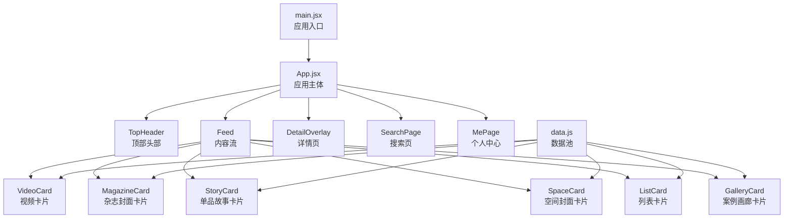
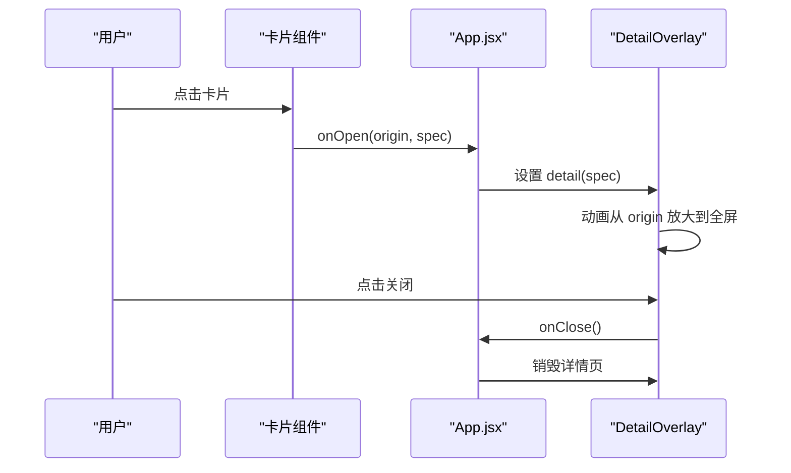
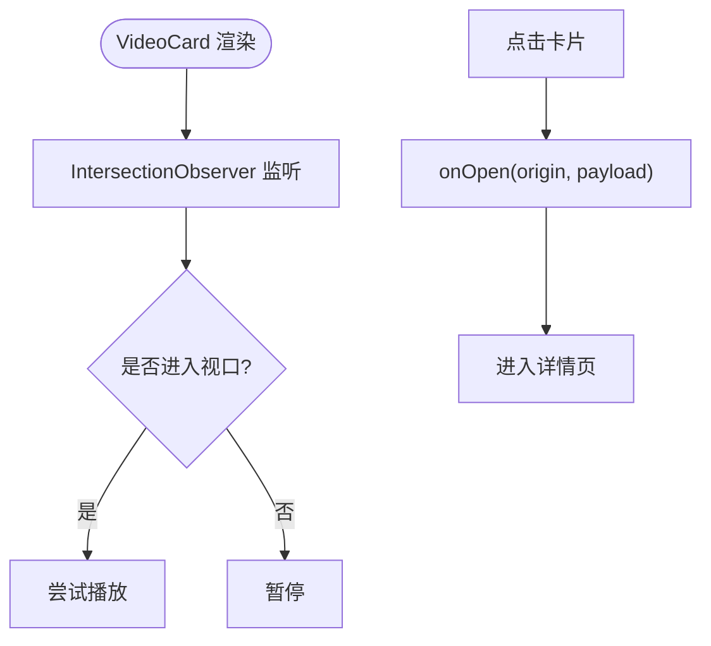
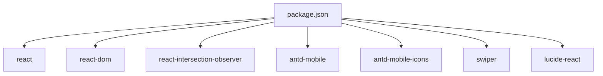

# 内容卡片系统

<cite>
**本文引用的文件**
- [App.jsx](file://src/App.jsx)
- [data.js](file://src/data.js)
- [main.jsx](file://src/main.jsx)
- [index.css](file://src/index.css)
- [package.json](file://package.json)
</cite>

## 目录
1. [简介](#简介)
2. [项目结构](#项目结构)
3. [核心组件](#核心组件)
4. [架构总览](#架构总览)
5. [详细组件分析](#详细组件分析)
6. [依赖分析](#依赖分析)
7. [性能考虑](#性能考虑)
8. [故障排查指南](#故障排查指南)
9. [结论](#结论)
10. [附录](#附录)

## 简介
NewSquare 是一个以内容卡片为核心的移动端信息流应用，围绕“内容卡片系统”构建了六大可复用卡片组件：视频卡片、杂志封面卡片、单品故事卡片、空间封面卡片、列表卡片和案例画廊卡片。系统通过统一的数据池与样式体系，为每类卡片提供一致的视觉语言与交互体验，并支持点击卡片进入详情页的全屏展开动画。本文档将深入解析各卡片的设计理念、数据结构、样式定制与交互行为，并提供完整的 API 文档与扩展指南。

## 项目结构
项目采用 React + Vite 技术栈，核心入口为 main.jsx，应用主体在 App.jsx 中实现，样式集中在 index.css，数据定义在 data.js。主要目录与文件如下：
- src/main.jsx：应用入口，渲染根组件
- src/App.jsx：应用主体，包含头部、内容流、详情页与各卡片组件
- src/data.js：内容数据池，包含视频、封面、故事、案例、空间、榜单等数据
- src/index.css：全局样式与卡片样式规范
- package.json：依赖与脚本配置

图表来源
- [main.jsx:1-12](file://src/main.jsx#L1-L12)
- [App.jsx:929-1059](file://src/App.jsx#L929-L1059)
- [data.js:1-175](file://src/data.js#L1-L175)

章节来源
- [main.jsx:1-12](file://src/main.jsx#L1-L12)
- [App.jsx:929-1059](file://src/App.jsx#L929-L1059)
- [data.js:1-175](file://src/data.js#L1-L175)

## 核心组件
NewSquare 的内容卡片系统围绕以下六大卡片组件构建，每个组件均接收统一的 props 并通过 onOpen 回调进入详情页。卡片类型与职责如下：
- 视频卡片：内嵌自动播放的视频，支持静音切换与占位图
- 杂志封面卡片：静态封面图，带徽标与品牌条
- 单品故事卡片：封面 + 横向滚动商品列表，支持故事详情
- 空间封面卡片：静态空间封面，支持顶部/底部文字布局
- 列表卡片：榜单/设计师列表，支持产品与设计师两类
- 案例画廊卡片：横向滚动案例集合，支持点击进入详情

章节来源
- [App.jsx:287-579](file://src/App.jsx#L287-L579)
- [data.js:33-174](file://src/data.js#L33-L174)

## 架构总览
应用采用“卡片调度器 + 统一详情页”的架构模式：
- 卡片调度器：ORDER 定义卡片混合顺序，BUILDERS 映射类型到组件，makeBatch 基于种子偏移生成批次
- 详情页：DetailOverlay 通过从卡片传递的 origin 进行缩放动画，支持 variant 与 payload 的差异化渲染
- 数据池：data.js 提供 VIDEO_CONTENT、MAGAZINE_CONTENT、STORY_CONTENT、SPACE_CONTENT、LIST_CONTENT、GALLERY_CONTENT

图表来源
- [App.jsx:942-944](file://src/App.jsx#L942-L944)
- [App.jsx:1054-1056](file://src/App.jsx#L1054-L1056)
- [App.jsx:590-736](file://src/App.jsx#L590-L736)

章节来源
- [App.jsx:738-926](file://src/App.jsx#L738-L926)
- [App.jsx:929-1059](file://src/App.jsx#L929-L1059)

## 详细组件分析

### 视频卡片（VideoCard）
设计理念
- 以视频为核心内容，强调动态视觉与沉浸式体验
- 通过 IntersectionObserver 控制自动播放与暂停，优化性能
- 提供静音切换按钮，尊重移动端用户体验

数据结构
- VIDEO_URLS：包含视频地址与海报图
- VIDEO_CONTENT：卡片元数据（小标、标题、副标题、品牌、描述、CTA、图标与背景）

Props
- idx：索引，用于从数据池循环取值
- onOpen：点击回调，参数为 origin 与 payload

交互行为
- 首次进入视口尝试播放，离开视口暂停
- 点击卡片进入详情页，携带 variant: 'single' 与 payload

样式定制
- 支持 video-poster 占位图与 video-overlay 文字层
- 底部品牌条与 CTA 按钮样式统一

图表来源
- [App.jsx:287-367](file://src/App.jsx#L287-L367)
- [data.js:3-20](file://src/data.js#L3-L20)
- [data.js:33-46](file://src/data.js#L33-L46)

章节来源
- [App.jsx:287-367](file://src/App.jsx#L287-L367)
- [data.js:3-20](file://src/data.js#L3-L20)
- [data.js:33-46](file://src/data.js#L33-L46)

### 杂志封面卡片（MagazineCard）
设计理念
- 强调封面质感与品牌标识，通过徽标与品牌条强化品牌认知
- 顶部遮罩渐变提升文字可读性

数据结构
- MAGAZINE_CONTENT：包含徽标、小标、标题、副标题、品牌、描述、CTA、图标背景

Props
- idx：索引
- onOpen：点击回调，variant: 'single'

交互行为
- 点击封面进入详情页，payload 包含徽标与品牌信息

样式定制
- .tcard-magazine 容器与 .overlay 文字层
- .badge 徽标定位与样式

章节来源
- [App.jsx:369-403](file://src/App.jsx#L369-L403)
- [data.js:48-61](file://src/data.js#L48-L61)

### 单品故事卡片（StoryCard）
设计理念
- 封面 + 商品列表的组合，突出“故事化内容 + 商品导流”
- 商品列表使用 Swiper 实现自动滚动与自由模式

数据结构
- STORY_CONTENT：包含封面、列表标题、商品项数组（名称、价格、图片）

Props
- idx：索引
- onOpen：点击封面进入详情页，payload 包含 heroImg、listTitle、items、featured

交互行为
- 点击封面进入详情页
- 商品列表横向滚动，支持 hover/pause（由 Swiper 控制）

样式定制
- .hero 文字层与遮罩渐变
- .product-strip 标题与“查看全部”链接
- .product-item 商品项样式

章节来源
- [App.jsx:405-463](file://src/App.jsx#L405-L463)
- [data.js:63-99](file://src/data.js#L63-L99)

### 空间封面卡片（SpaceCard）
设计理念
- 静态空间封面，强调空间氛围与文案层次
- 支持文字位于顶部或底部两种布局

数据结构
- SPACE_CONTENT：包含小标、标题、副标题、封面图、textBottom 标志

Props
- idx：索引
- onOpen：点击进入详情页，variant: 'single'

交互行为
- 点击封面进入详情页
- textBottom 决定文字层位置与渐变方向

样式定制
- .tcard-space 容器与 .gradient-top 渐变
- .text-block 文字层与 .t-sub-space 限制宽度

章节来源
- [App.jsx:465-489](file://src/App.jsx#L465-L489)
- [data.js:133-146](file://src/data.js#L133-L146)

### 列表卡片（ListCard）
设计理念
- 以榜单/设计师为主的信息密度卡片，强调清晰的层级与可读性
- 支持产品与设计师两类，图片圆角与头像圆角区分

数据结构
- LIST_CONTENT：包含小标、标题、副标题、类型（product/designer）、CTA、商品/设计师项数组

Props
- idx：索引

交互行为
- 列表项点击通常用于查看详情或关注，但该组件本身不处理导航

样式定制
- .list-header 与 .list-item 布局
- .li-rank 排名、.li-img 圆角与头像圆角
- .pill-action 按钮样式

章节来源
- [App.jsx:491-525](file://src/App.jsx#L491-L525)
- [data.js:148-174](file://src/data.js#L148-L174)

### 案例画廊卡片（GalleryCard）
设计理念
- 横向滚动的案例集合，适合展示多个案例的快速浏览
- 每个案例卡片包含封面、文字层与品牌条

数据结构
- GALLERY_CONTENT：包含 sectionTitle 与 cards 数组，cards 包含案例元数据

Props
- idx：索引
- onOpen：点击案例卡片进入详情页，variant: 'single'

交互行为
- 案例卡片点击进入详情页
- 画廊使用 Swiper 实现 cssMode 与 grabCursor

样式定制
- .gallery-section 与 .gallery-header
- .gcard 容器、.gcard-cover 与 .gcard-text
- .gcard-bar 品牌条样式

章节来源
- [App.jsx:527-579](file://src/App.jsx#L527-L579)
- [data.js:101-131](file://src/data.js#L101-L131)

## 依赖分析
- React 生态：React、react-dom、react-intersection-observer
- UI 组件：antd-mobile、antd-mobile-icons
- 图片轮播：swiper（用于故事卡片、案例画廊、个人中心最近浏览）
- 字体与图标：lucide-react

图表来源
- [package.json:11-24](file://package.json#L11-L24)

章节来源
- [package.json:11-24](file://package.json#L11-L24)

## 性能考虑
- 视频卡片：使用 IntersectionObserver 控制自动播放与暂停，减少不必要的资源消耗
- 详情页：基于 origin 的缩放动画，使用 transform 与 border-radius 动画，避免重排
- 无限滚动：InfiniteScroll 结合节流与分批加载，控制渲染数量
- Swiper：仅在需要的卡片中启用模块，避免不必要的初始化

## 故障排查指南
常见问题与建议
- 视频无法自动播放：检查浏览器策略与移动端自动播放限制，确保首次交互后播放
- 详情页动画异常：确认 origin 坐标计算与窗口尺寸，避免 transform-origin 导致的错位
- 列表卡片点击无效：确认点击区域与 cursor 样式，避免误触或点击穿透
- 搜索页与个人中心样式冲突：检查 z-index 与 backdrop-filter 的兼容性

章节来源
- [App.jsx:590-736](file://src/App.jsx#L590-L736)
- [index.css:1339-1600](file://src/index.css#L1339-L1600)

## 结论
NewSquare 的内容卡片系统通过统一的数据结构、样式规范与交互流程，实现了高复用性与强一致性。六大卡片组件覆盖了从动态视频到静态封面、从商品导流到空间展示的多种场景。通过详情页的统一入口与动画，系统在移动端提供了流畅的沉浸式体验。未来可在保持现有 API 稳定的前提下，扩展更多卡片类型与交互能力。

## 附录

### API 接口文档

- 卡片通用 Props
  - idx: number
  - onOpen?: (origin: DOMRect, spec: { variant: string; payload: any }) => void

- VideoCard
  - props: { idx, onOpen }
  - payload 示例字段：eyebrow, title, sub, heroImg, brand, desc, icon, iconBg, cta

- MagazineCard
  - props: { idx, onOpen }
  - payload 示例字段：eyebrow, title, sub, heroImg, brand, desc, icon, iconBg, cta, badge

- StoryCard
  - props: { idx, onOpen }
  - payload 示例字段：eyebrow, title, sub, heroImg, listTitle, items[], featured

- SpaceCard
  - props: { idx, onOpen }
  - payload 示例字段：eyebrow, title, sub, heroImg

- ListCard
  - props: { idx }
  - payload 示例字段：eyebrow, title, sub, type, cta, items[]

- GalleryCard
  - props: { idx, onOpen }
  - payload 示例字段：sectionTitle, cards[]（每项包含 eyebrow, title, sub, img, brand, desc, icon, iconBg, cta）

- DetailOverlay
  - props: { detail, onClose }
  - detail: { origin, variant, payload }
  - onClose: () => void

- 数据池字段说明（示例）
  - VIDEO_URLS: [{ url, poster }]
  - VIDEO_CONTENT: [{ eyebrow, title, sub, brand, desc, cta, icon, iconBg }]
  - MAGAZINE_CONTENT: [{ badge, eyebrow, title, sub, brand, desc, cta, iconBg }]
  - STORY_CONTENT: [{ cover, listTitle, items[] }]
  - SPACE_CONTENT: [{ eyebrow, title, sub, img, textBottom }]
  - LIST_CONTENT: [{ eyebrow, title, sub, type, cta, items[] }]
  - GALLERY_CONTENT: [{ sectionTitle, cards[] }]

章节来源
- [App.jsx:287-579](file://src/App.jsx#L287-L579)
- [data.js:3-174](file://src/data.js#L3-L174)

### 创建新的卡片类型步骤
- 定义数据结构：在 data.js 中新增数据池与示例数据
- 编写组件：在 App.jsx 中新增组件，接收 idx 与 onOpen
- 注册调度：在 ORDER 与 BUILDERS 中注册新卡片类型
- 样式适配：在 index.css 中补充新卡片的样式与动画
- 测试集成：在 Feed 中验证渲染与交互

章节来源
- [App.jsx:738-741](file://src/App.jsx#L738-L741)
- [data.js:101-131](file://src/data.js#L101-L131)
- [index.css:812-880](file://src/index.css#L812-L880)