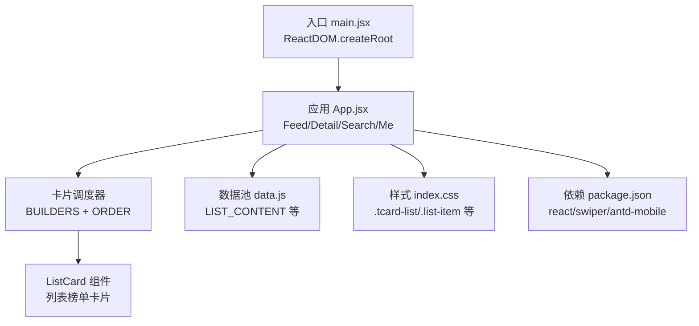
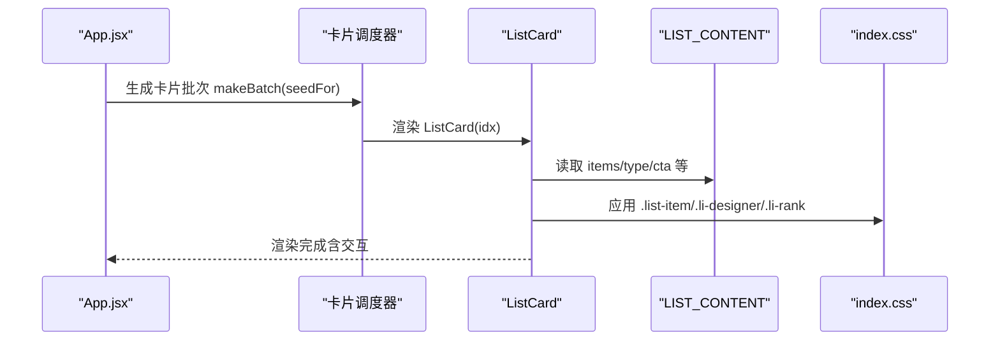
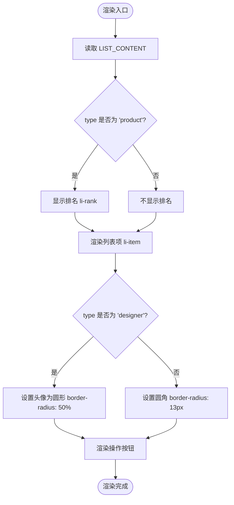
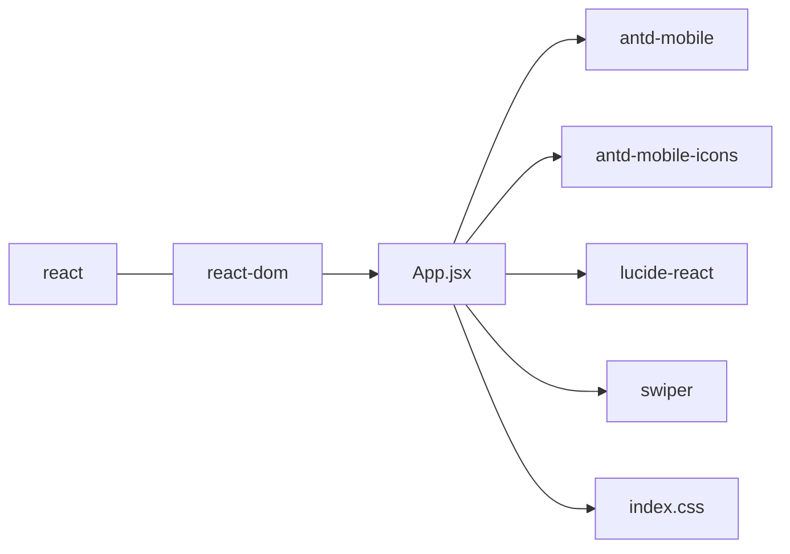

# 列表榜单卡片

<cite>
**本文引用的文件**
- [src/App.jsx](file://src/App.jsx)
- [src/data.js](file://src/data.js)
- [src/main.jsx](file://src/main.jsx)
- [src/index.css](file://src/index.css)
- [package.json](file://package.json)
- [index.html](file://index.html)
- [vite.config.js](file://vite.config.js)
</cite>

## 目录
1. [简介](#简介)
2. [项目结构](#项目结构)
3. [核心组件](#核心组件)
4. [架构总览](#架构总览)
5. [详细组件分析](#详细组件分析)
6. [依赖分析](#依赖分析)
7. [性能考量](#性能考量)
8. [故障排查指南](#故障排查指南)
9. [结论](#结论)
10. [附录](#附录)

## 简介
本文件面向“列表榜单卡片”组件，系统性阐述其设计模式、数据绑定机制、用户交互逻辑与差异化实现。文档覆盖产品类榜单与设计师榜单两类列表的排名系统、头像圆形显示、API 接口定义、样式定制与事件处理，并提供完整的使用指南、动态生成策略、图片加载优化与响应式设计实现建议。

## 项目结构
该项目基于 Vite + React 构建，入口为 main.jsx，应用主体在 App.jsx 中实现，样式集中在 index.css，数据池在 data.js 中集中管理。Swiper 用于轮播与无限滚动，Ant Design Mobile 提供基础 UI 组件。

图表来源
- [src/main.jsx:7-11](file://src/main.jsx#L7-L11)
- [src/App.jsx:975-1111](file://src/App.jsx#L975-L1111)
- [src/data.js:148-175](file://src/data.js#L148-L175)
- [src/index.css:785-811](file://src/index.css#L785-L811)
- [package.json:11-18](file://package.json#L11-L18)

章节来源
- [src/main.jsx:1-12](file://src/main.jsx#L1-L12)
- [src/App.jsx:975-1111](file://src/App.jsx#L975-L1111)
- [src/data.js:148-175](file://src/data.js#L148-L175)
- [src/index.css:785-811](file://src/index.css#L785-L811)
- [package.json:11-18](file://package.json#L11-L18)

## 核心组件
- 列表榜单卡片组件：负责渲染“产品榜单”和“设计师榜单”，支持动态生成、头像圆形显示、排名系统与操作按钮。
- 数据池：LIST_CONTENT 提供榜单数据，包含类型标识、标题、副标题、行动按钮文案与列表项数组。
- 样式体系：通过 .tcard-list、.list-header、.list-item、.li-rank、.li-designer 等类名实现统一视觉与交互。

章节来源
- [src/App.jsx:491-525](file://src/App.jsx#L491-L525)
- [src/data.js:148-175](file://src/data.js#L148-L175)
- [src/index.css:785-811](file://src/index.css#L785-L811)

## 架构总览
列表榜单卡片在应用中的位置如下：
- 应用顶层负责状态管理（期次、标签页、搜索态、详情态）与卡片调度。
- 卡片调度器根据类型索引选择具体卡片组件，ListCard 作为其中一种。
- ListCard 通过数据池 LIST_CONTENT 获取数据，渲染列表项并绑定交互事件。

图表来源
- [src/App.jsx:975-1111](file://src/App.jsx#L975-L1111)
- [src/App.jsx:962-973](file://src/App.jsx#L962-L973)
- [src/App.jsx:491-525](file://src/App.jsx#L491-L525)
- [src/data.js:148-175](file://src/data.js#L148-L175)
- [src/index.css:785-811](file://src/index.css#L785-L811)

## 详细组件分析

### 组件：列表榜单卡片 ListCard
- 设计模式
  - 函数式组件 + 无状态渲染，通过 props 传递数据与回调。
  - 使用 Ant Design Mobile 的 Image 组件进行图片渲染，支持裁剪与懒加载。
  - 通过条件类名实现“产品榜单”与“设计师榜单”的差异化样式。
- 数据绑定机制
  - 从 LIST_CONTENT 读取 items 数组，循环渲染每个列表项。
  - 通过 type 字段区分产品与设计师两类，决定是否显示排名与头像圆角。
- 用户交互逻辑
  - 列表项为静态展示，不直接绑定点击事件；整体卡片为不可点击（cursor: default）。
  - 详情页通过点击卡片进入全屏详情，但列表项本身不触发详情。
- 排名系统
  - 仅在 type 为 product 时显示排名，使用索引 + 1。
- 头像圆形显示
  - 当 type 为 designer 时，为列表项添加 li-designer 类，配合样式将头像设为圆形。

图表来源
- [src/App.jsx:491-525](file://src/App.jsx#L491-L525)
- [src/data.js:148-175](file://src/data.js#L148-L175)
- [src/index.css:785-811](file://src/index.css#L785-L811)

章节来源
- [src/App.jsx:491-525](file://src/App.jsx#L491-L525)
- [src/data.js:148-175](file://src/data.js#L148-L175)
- [src/index.css:785-811](file://src/index.css#L785-L811)

### 数据结构与 API 接口
- 列表数据结构（LIST_CONTENT）
  - 字段
    - eyebrow: 小标题
    - title: 主标题
    - sub: 副标题
    - type: 类型，'product' 或 'designer'
    - cta: 操作按钮文案
    - items: 列表项数组
  - 列表项字段
    - name: 名称
    - desc: 描述
    - img: 图片 ID（通过 IMG 工具函数转换为 URL）
- API 接口
  - 组件输入
    - idx: 卡片索引（用于数据池循环取值）
  - 组件输出
    - 无直接事件回调（列表项为静态展示）
  - 详情页联动
    - ListCard 不直接触发详情，但 App.jsx 中的卡片调度器会将点击事件映射到详情页（与 ListCard 无关）

章节来源
- [src/data.js:148-175](file://src/data.js#L148-L175)
- [src/App.jsx:975-1111](file://src/App.jsx#L975-L1111)

### 样式定制与响应式设计
- 样式要点
  - .tcard-list：卡片容器，内边距与圆角
  - .list-header：包含小标题、主标题、副标题
  - .list-item：列表项布局（头像 + 文本 + 按钮）
  - .li-rank：产品榜单排名
  - .li-designer：设计师榜单头像圆形
  - .li-name/.li-desc：名称与描述的排版与截断
- 响应式设计
  - 使用相对单位与媒体查询（在现有样式中体现）
  - 头像尺寸固定，文本区域自适应
  - 按钮采用胶囊样式，适配移动端点击

章节来源
- [src/index.css:785-811](file://src/index.css#L785-L811)
- [src/index.css:881-903](file://src/index.css#L881-L903)

### 动态生成与图片加载优化
- 动态生成
  - 通过 makeBatch(seedFor) 生成卡片批次，确保不同期次与标签页内容不同
  - ListCard 仅消费数据池，不参与动态生成逻辑
- 图片加载优化
  - 使用 Ant Design Mobile Image 组件，支持 fit="cover" 与尺寸参数
  - 图片 URL 通过 IMG 工具函数生成，便于统一尺寸与质量控制
  - 建议：在实际项目中可结合 IntersectionObserver 或懒加载策略进一步优化

章节来源
- [src/App.jsx:962-973](file://src/App.jsx#L962-L973)
- [src/App.jsx:491-525](file://src/App.jsx#L491-L525)
- [src/data.js:22-23](file://src/data.js#L22-L23)

### 使用指南
- 创建与配置
  - 在卡片调度器中选择 ListCard 类型（ORDER 中的索引）
  - 通过 idx 参数传递给 ListCard，组件内部从 LIST_CONTENT 读取数据
  - 如需自定义样式，可在 .list-item、.li-designer、.li-rank 等类名基础上扩展
- 事件处理
  - 列表项为静态展示，不直接绑定点击事件
  - 如需点击行为，请在上层容器或外部逻辑中处理（例如点击卡片进入详情页）

章节来源
- [src/App.jsx:975-1111](file://src/App.jsx#L975-L1111)
- [src/App.jsx:491-525](file://src/App.jsx#L491-L525)

## 依赖分析
- React 生态：React、React DOM
- UI 组件：Ant Design Mobile（Image、Button、InfiniteScroll、DotLoading）
- 轮播：Swiper（用于封面与案例卡片）
- 开发工具：Vite + @vitejs/plugin-react

图表来源
- [package.json:11-18](file://package.json#L11-L18)
- [src/App.jsx:1-9](file://src/App.jsx#L1-L9)
- [src/index.css:1-18](file://src/index.css#L1-L18)

章节来源
- [package.json:11-18](file://package.json#L11-L18)
- [src/App.jsx:1-9](file://src/App.jsx#L1-L9)

## 性能考量
- 渲染性能
  - ListCard 为纯展示组件，渲染成本低
  - 使用固定尺寸头像与胶囊按钮，减少重排
- 图片性能
  - 通过 IMG 工具函数统一尺寸，避免过大资源
  - 建议在生产环境启用图片懒加载与合适的格式（WebP/JPEG）
- 交互性能
  - 列表项为静态展示，无复杂事件绑定
  - 详情页使用 CSS 过渡动画，注意避免在低端设备上过度使用复杂滤镜

[本节为通用指导，不涉及具体文件分析]

## 故障排查指南
- 图片不显示
  - 检查 IMG 工具函数生成的 URL 是否有效
  - 确认网络环境与跨域设置
- 头像未圆形
  - 确认 type 为 'designer'，且 li-designer 类已正确应用
- 排名异常
  - 确认 type 为 'product'，且索引计算正确
- 样式错乱
  - 检查 .list-item、.li-designer、.li-rank 等类名是否被覆盖

章节来源
- [src/data.js:148-175](file://src/data.js#L148-L175)
- [src/index.css:785-811](file://src/index.css#L785-L811)

## 结论
列表榜单卡片组件以简洁的数据驱动方式实现了产品与设计师两类榜单的差异化展示，配合统一的样式体系与图片优化策略，能够在移动端提供良好的用户体验。通过合理的数据结构与样式定制，可快速扩展更多榜单类型与交互场景。

[本节为总结性内容，不涉及具体文件分析]

## 附录
- 浏览器兼容性
  - 基于 Vite + React，建议在主流移动端浏览器测试
- 主题与品牌
  - 样式中使用了品牌色与渐变，可根据品牌需求调整

章节来源
- [index.html:4-8](file://index.html#L4-L8)
- [src/index.css:785-811](file://src/index.css#L785-L811)