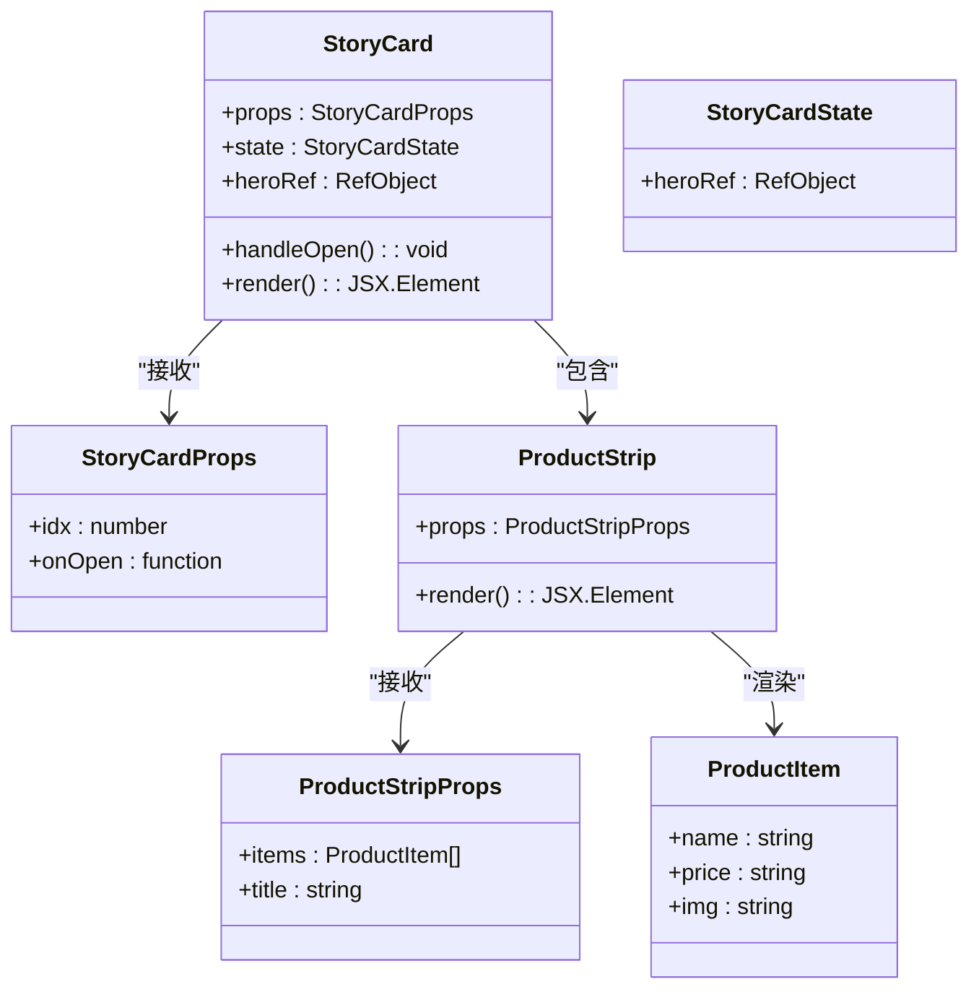
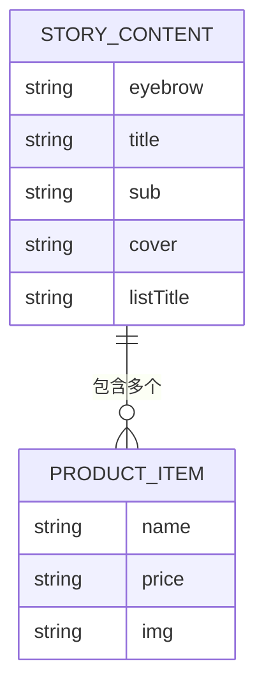
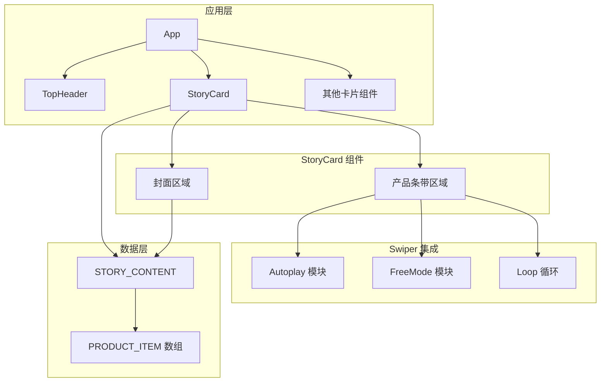
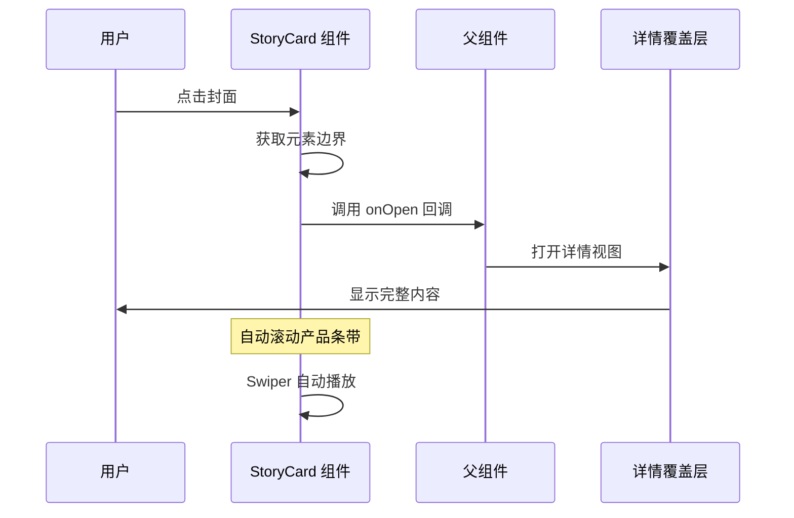
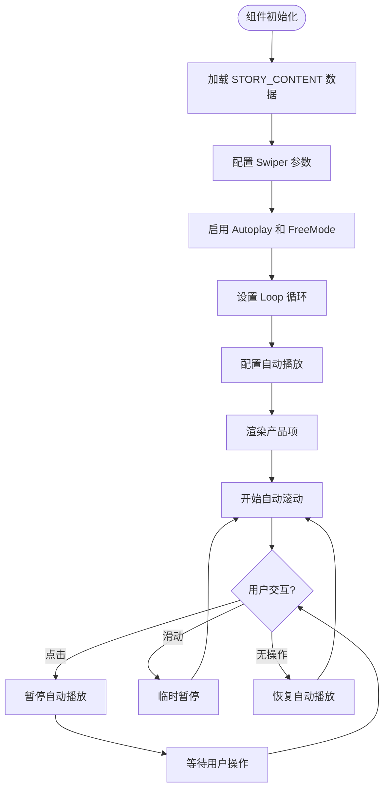
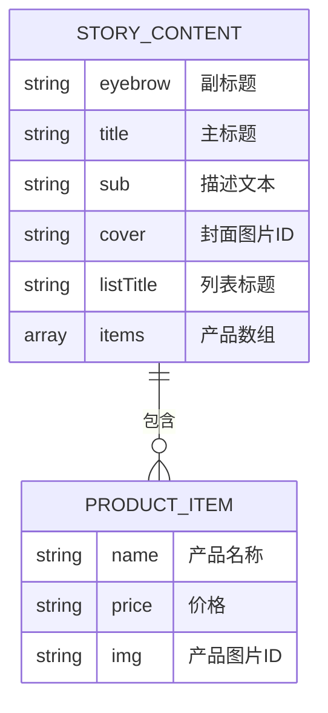
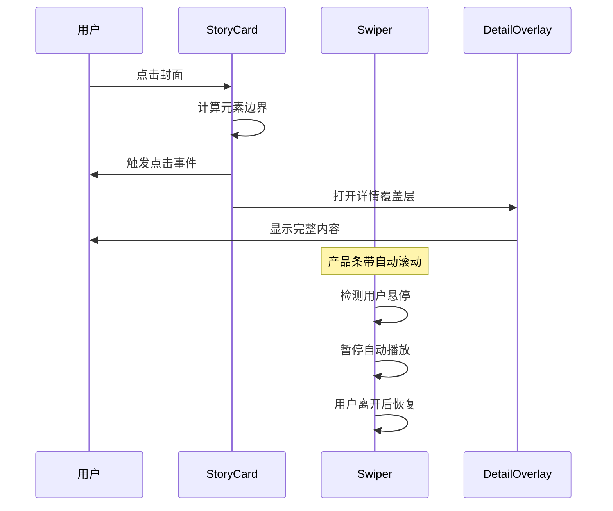
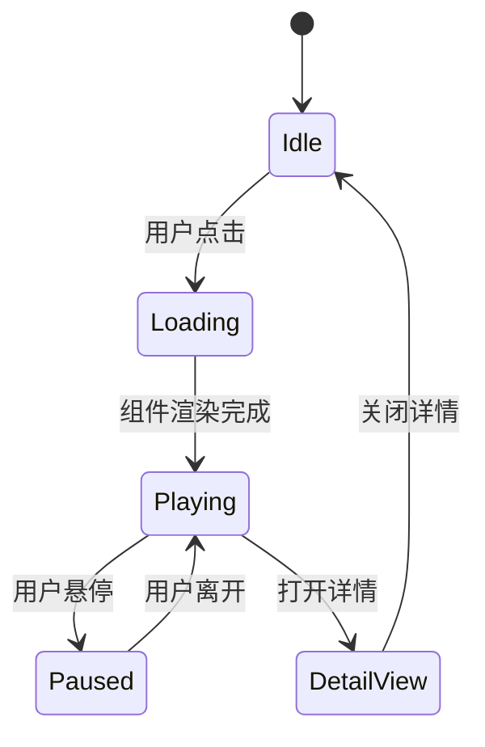
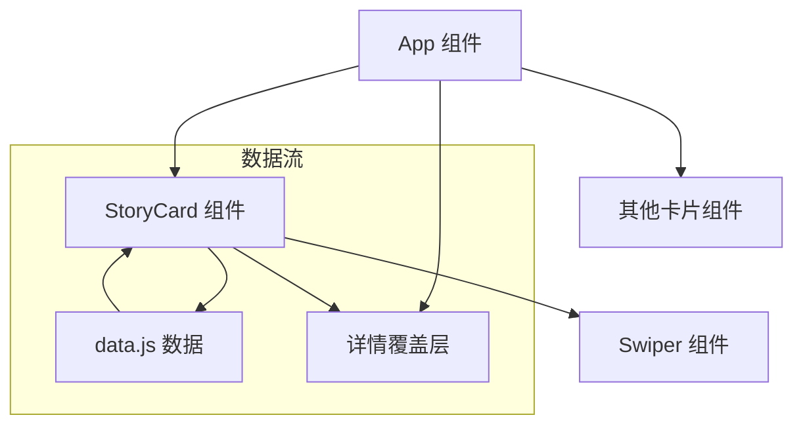
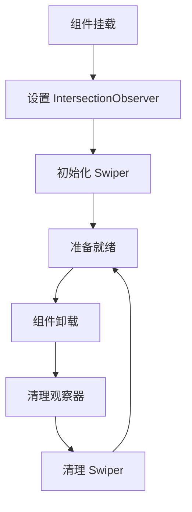

# 单品故事卡片

<cite>
**本文引用的文件**
- [src/App.jsx](file://src/App.jsx)
- [src/data.js](file://src/data.js)
- [package.json](file://package.json)
- [src/main.jsx](file://src/main.jsx)
</cite>

## 目录
1. [简介](#简介)
2. [项目结构](#项目结构)
3. [核心组件](#核心组件)
4. [架构概览](#架构概览)
5. [详细组件分析](#详细组件分析)
6. [依赖关系分析](#依赖关系分析)
7. [性能考虑](#性能考虑)
8. [故障排除指南](#故障排除指南)
9. [结论](#结论)
10. [附录](#附录)

## 简介

单品故事卡片是家装生活应用中的一个复合组件，它结合了封面展示区域和动态产品条带两个主要部分。该组件通过集成 Swiper 轮播组件实现了自动滚动机制，为用户提供流畅的产品浏览体验。组件采用响应式设计，支持触摸滑动和自动播放功能，能够有效展示精选的家居单品。

该组件的核心特色包括：
- **封面区域**：展示故事主题和视觉引导
- **动态产品条带**：使用 Swiper 实现无限循环滚动
- **自动播放机制**：无缝的产品展示体验
- **交互式导航**：支持点击查看详情和查看更多

## 项目结构

该项目采用 React + Vite 的现代化前端架构，主要文件组织如下：

```mermaid
graph TB
subgraph "项目根目录"
A[package.json] --> B[src/main.jsx]
C[index.html] --> D[vite.config.js]
E[public/] --> F[静态资源]
end
subgraph "源代码目录"
B --> G[src/App.jsx]
G --> H[src/data.js]
G --> I[src/index.css]
end
subgraph "依赖管理"
J[react@^18.3.1] --> K[React 核心库]
L[swiper@^11.1.14] --> M[Swiper 轮播库]
N[antd-mobile@^5.38.1] --> O[移动端组件库]
end
```

**图表来源**
- [package.json:1-25](file://package.json#L1-L25)
- [src/main.jsx:1-12](file://src/main.jsx#L1-L12)

**章节来源**
- [package.json:1-25](file://package.json#L1-L25)
- [src/main.jsx:1-12](file://src/main.jsx#L1-L12)

## 核心组件

### StoryCard 组件架构

StoryCard 是本次文档的核心组件，它实现了复合卡片的设计模式。组件包含两个主要区域：

1. **封面区域**：展示故事主题和视觉引导
2. **产品条带区域**：动态展示相关产品



**图表来源**
- [src/App.jsx:405-463](file://src/App.jsx#L405-L463)
- [src/data.js:63-99](file://src/data.js#L63-L99)

### 数据结构设计

组件使用精心设计的数据结构来支持动态内容展示：



**图表来源**
- [src/data.js:63-99](file://src/data.js#L63-L99)

**章节来源**
- [src/App.jsx:405-463](file://src/App.jsx#L405-L463)
- [src/data.js:63-99](file://src/data.js#L63-L99)

## 架构概览

### 整体架构设计

该应用采用模块化的组件架构，StoryCard 作为复合组件位于组件树的中间层，向上接收父组件传递的回调函数，向下渲染具体的子组件。



**图表来源**
- [src/App.jsx:405-463](file://src/App.jsx#L405-L463)
- [src/App.jsx:438-459](file://src/App.jsx#L438-L459)

### 组件通信流程



**图表来源**
- [src/App.jsx:409-423](file://src/App.jsx#L409-L423)
- [src/App.jsx:989-991](file://src/App.jsx#L989-L991)

## 详细组件分析

### StoryCard 组件实现

#### 核心功能实现

StoryCard 组件实现了以下核心功能：

1. **封面展示**：使用大图背景展示故事主题
2. **产品条带**：集成 Swiper 实现自动滚动
3. **交互处理**：支持点击查看详情
4. **数据绑定**：从 STORY_CONTENT 数据源获取内容

#### Swiper 集成实现



**图表来源**
- [src/App.jsx:438-459](file://src/App.jsx#L438-L459)

#### 产品条带配置详解

产品条带区域使用了精心配置的 Swiper 参数：

| 参数 | 值 | 作用 |
|------|-----|------|
| `slidesPerView` | `auto` | 自适应宽度显示 |
| `spaceBetween` | `12` | 产品项间距 |
| `freeMode` | `true` | 自由滚动模式 |
| `loop` | `true` | 无限循环 |
| `autoplay.delay` | `0` | 立即开始滚动 |
| `speed` | `3500` | 滚动速度 |

**章节来源**
- [src/App.jsx:438-459](file://src/App.jsx#L438-L459)

### 数据结构设计

#### STORY_CONTENT 数据模型



**图表来源**
- [src/data.js:63-99](file://src/data.js#L63-L99)

#### 数据加载和映射

组件通过循环函数从 STORY_CONTENT 数据池中获取内容：

```mermaid
flowchart LR
DataPool[STORY_CONTENT 数据池] --> Cycle[cycle 函数]
Cycle --> StoryCard[StoryCard 组件]
StoryCard --> Render[渲染封面和产品条带]
subgraph "数据映射过程"
A[idx] --> B[Math.abs(idx) % len]
B --> C[获取对应的故事内容]
C --> D[提取封面和产品数据]
end
```

**图表来源**
- [src/App.jsx:406-423](file://src/App.jsx#L406-L423)
- [src/data.js:63-99](file://src/data.js#L63-L99)

**章节来源**
- [src/data.js:63-99](file://src/data.js#L63-L99)
- [src/App.jsx:406-423](file://src/App.jsx#L406-L423)

### 交互流程分析

#### 用户交互序列



**图表来源**
- [src/App.jsx:409-423](file://src/App.jsx#L409-L423)
- [src/App.jsx:446-447](file://src/App.jsx#L446-L447)

#### 状态管理机制

组件采用 React 的状态管理模式：



**章节来源**
- [src/App.jsx:409-423](file://src/App.jsx#L409-L423)

## 依赖关系分析

### 外部依赖

项目的主要外部依赖包括：

```mermaid
graph TB
subgraph "React 生态系统"
A[react@^18.3.1] --> B[react-dom@^18.3.1]
C[react-intersection-observer@^9.13.1] --> D[IntersectionObserver API]
end
subgraph "UI 组件库"
E[antd-mobile@^5.38.1] --> F[Button, Image, Loading 组件]
G[antd-mobile-icons@^0.3.0] --> H[图标组件]
end
subgraph "轮播组件"
I[swiper@^11.1.14] --> J[Swiper, SwiperSlide]
I --> K[Autoplay, FreeMode 模块]
end
subgraph "图标库"
L[lucide-react@^1.14.0] --> M[各种图标组件]
end
```

**图表来源**
- [package.json:11-18](file://package.json#L11-L18)

### 内部组件依赖



**图表来源**
- [src/App.jsx:976-1111](file://src/App.jsx#L976-L1111)
- [src/App.jsx:405-463](file://src/App.jsx#L405-L463)

**章节来源**
- [package.json:11-18](file://package.json#L11-L18)
- [src/App.jsx:976-1111](file://src/App.jsx#L976-L1111)

## 性能考虑

### 渲染优化策略

1. **虚拟滚动**：使用 Swiper 的虚拟化特性减少 DOM 节点数量
2. **懒加载**：产品图片采用懒加载策略
3. **IntersectionObserver**：监听组件可见性以优化性能

### 内存管理

组件实现了适当的内存清理机制：



**图表来源**
- [src/App.jsx:409-423](file://src/App.jsx#L409-L423)

### 性能监控建议

- 监控组件渲染时间
- 跟踪 Swiper 的滚动性能
- 优化图片加载策略
- 实施防抖和节流机制

## 故障排除指南

### 常见问题及解决方案

#### Swiper 初始化问题

**问题症状**：Swiper 无法正常滚动
**可能原因**：
- 样式文件未正确引入
- 容器尺寸计算错误
- 模块导入不完整

**解决方案**：
1. 确保引入 Swiper CSS 文件
2. 检查容器的宽度和高度设置
3. 验证模块导入的完整性

#### 图片加载失败

**问题症状**：产品图片无法显示
**可能原因**：
- 图片 URL 无效
- 网络连接问题
- CORS 跨域限制

**解决方案**：
1. 验证图片 ID 是否存在于数据池中
2. 检查网络连接状态
3. 确认跨域设置

#### 性能问题

**问题症状**：滚动卡顿或延迟
**可能原因**：
- 过多的 DOM 节点
- 复杂的 CSS 样式
- JavaScript 执行阻塞

**解决方案**：
1. 实施虚拟滚动
2. 简化 CSS 样式
3. 优化 JavaScript 代码

**章节来源**
- [src/App.jsx:438-459](file://src/App.jsx#L438-L459)
- [src/data.js:22-23](file://src/data.js#L22-L23)

## 结论

单品故事卡片组件展现了现代前端开发的最佳实践，通过合理的架构设计和性能优化，为用户提供了流畅的交互体验。组件成功地将静态内容与动态交互相结合，创造了一个既美观又实用的功能模块。

该组件的主要优势包括：
- **模块化设计**：清晰的组件职责分离
- **性能优化**：合理的渲染策略和内存管理
- **用户体验**：直观的交互设计和流畅的动画效果
- **可扩展性**：灵活的配置选项和易于维护的代码结构

未来可以考虑的改进方向：
- 添加更多的自定义配置选项
- 实现更丰富的动画效果
- 优化移动端的触摸交互
- 增强无障碍访问支持

## 附录

### API 参考

#### StoryCard Props 接口

| 属性名 | 类型 | 必需 | 描述 |
|--------|------|------|------|
| idx | number | 是 | 数据索引，用于从数据池中获取内容 |
| onOpen | function | 否 | 点击时的回调函数，参数包含元素边界和详情数据 |

#### 事件回调

| 事件名 | 参数 | 描述 |
|--------|------|------|
| onOpen | { origin, variant, payload } | 当用户点击卡片时触发，用于打开详情覆盖层 |

#### 状态管理

组件内部状态包括：
- `heroRef`: 引用封面元素用于计算边界
- `detail`: 当前显示的详情数据

### 样式配置

组件支持的样式配置选项：
- 自定义封面图片
- 产品项的宽度和间距
- 自动播放速度
- 动画过渡效果

### 数据格式规范

产品数据应遵循以下格式：
```javascript
{
  name: string,      // 产品名称
  price: string,     // 价格字符串
  img: string        // 产品图片ID
}
```