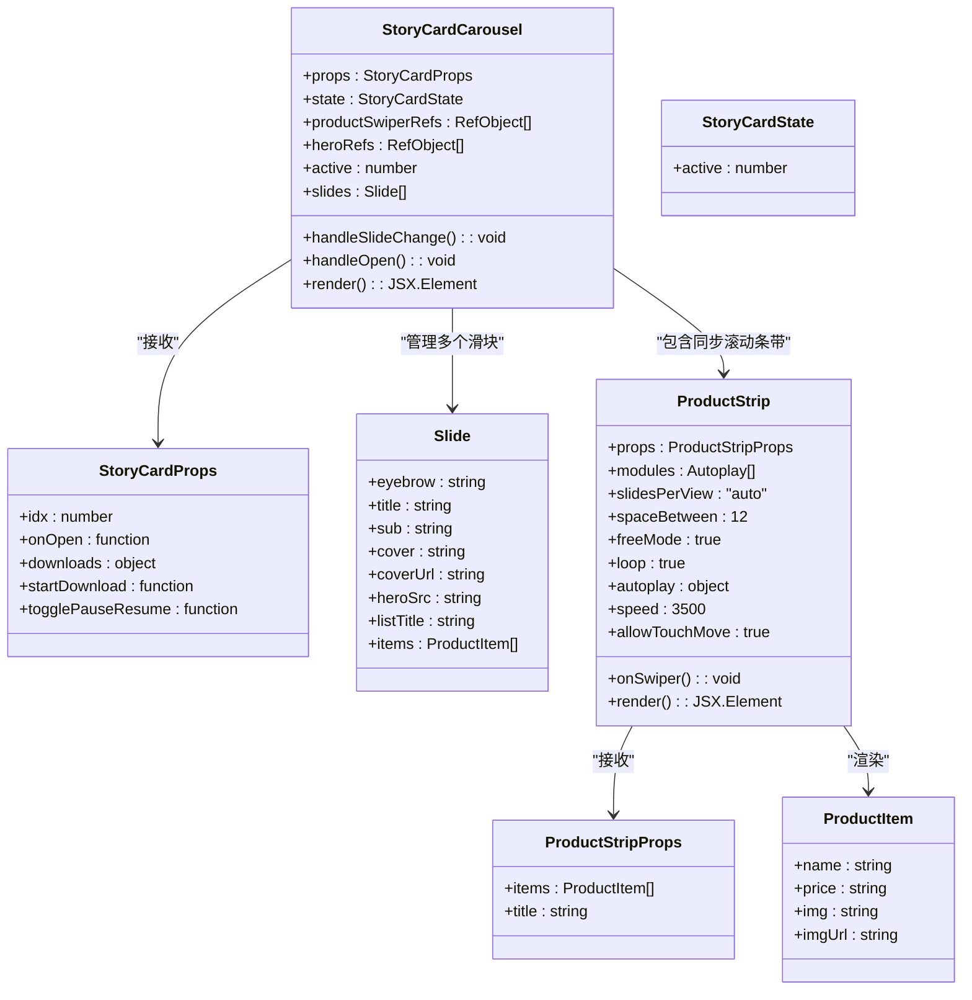
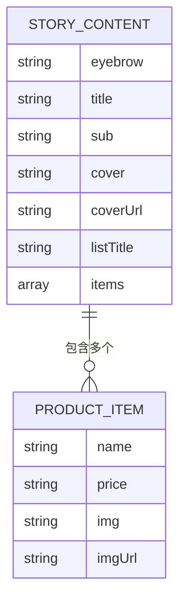
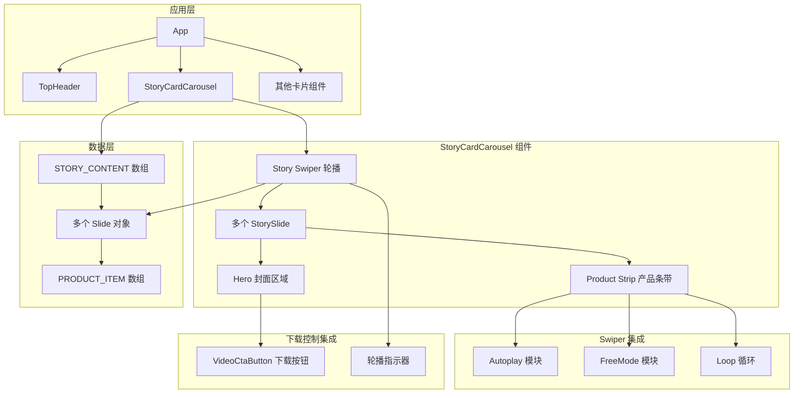
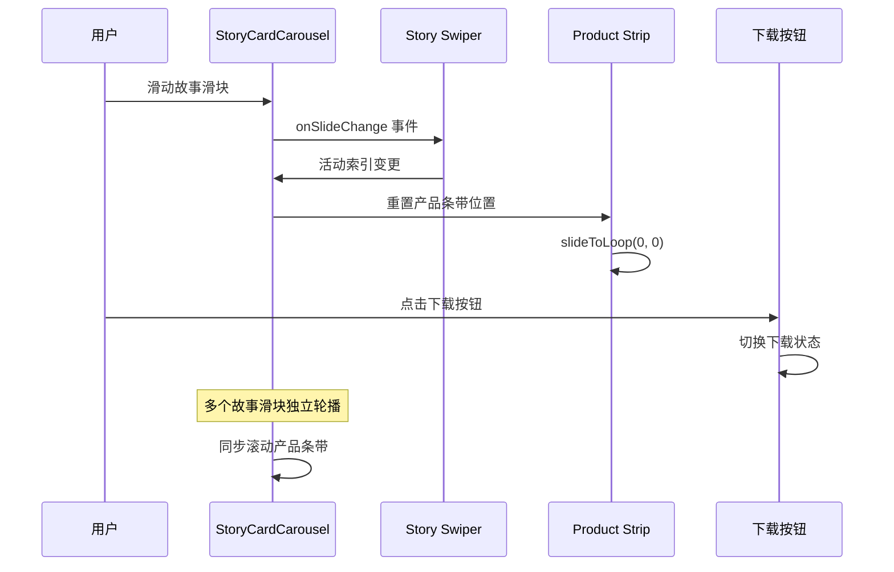
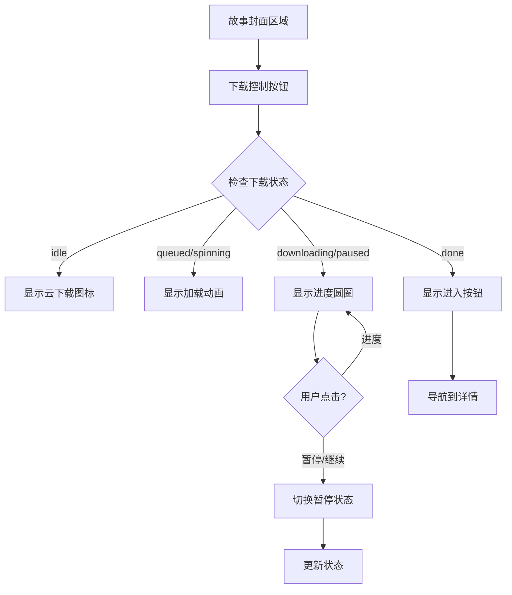
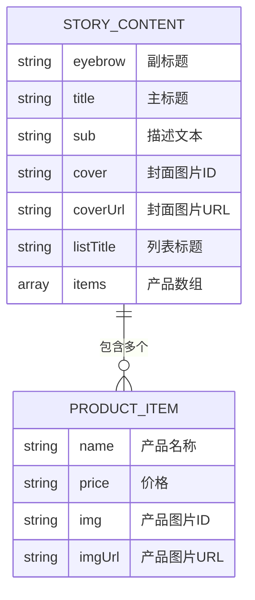
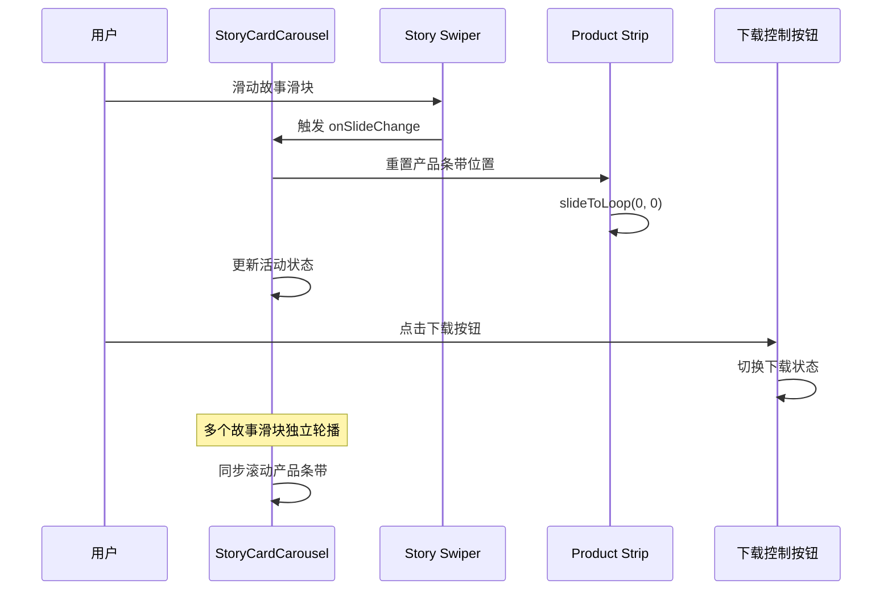
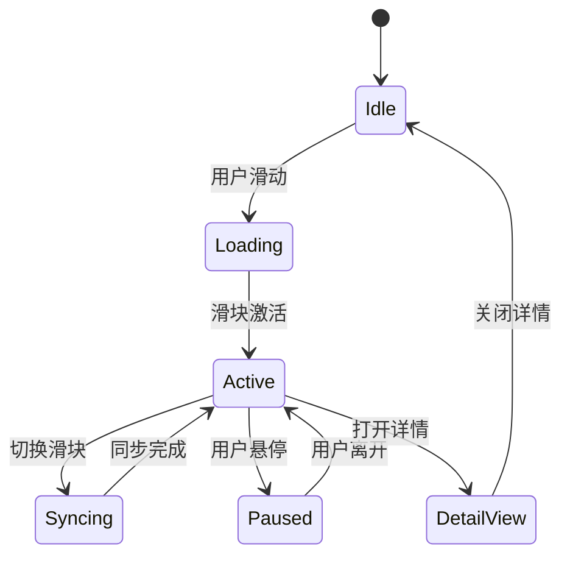
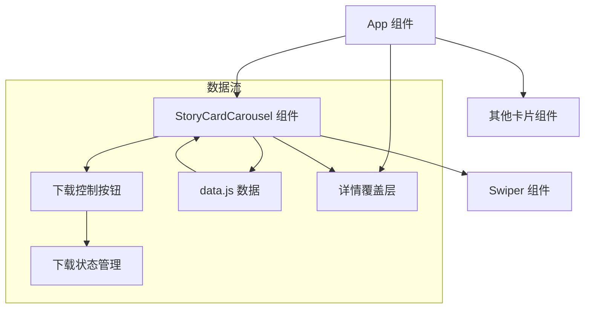
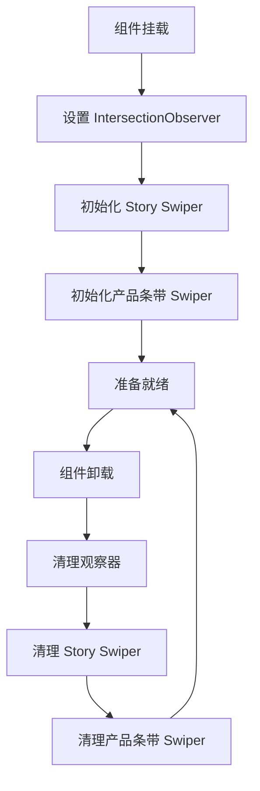

# 单品故事卡片

<cite>
**本文引用的文件**
- [src/App.jsx](file://src/App.jsx)
- [src/data.js](file://src/data.js)
- [package.json](file://package.json)
- [src/index.css](file://src/index.css)
</cite>

## 更新摘要
**变更内容**
- StoryCard组件从静态布局重构为完整的轮播系统架构
- 新增多个故事滑块的轮播功能
- 集成同步滚动的产品条带系统
- 添加新的下载控制按钮和轮播指示器
- 实现StoryCardCarousel复合轮播组件

## 目录
1. [简介](#简介)
2. [项目结构](#项目结构)
3. [核心组件](#核心组件)
4. [架构概览](#架构概览)
5. [详细组件分析](#详细组件分析)
6. [依赖关系分析](#依赖关系分析)
7. [性能考虑](#性能考虑)
8. [故障排除指南](#故障排除指南)
9. [结论](#结论)
10. [附录](#附录)

## 简介

单品故事卡片是家装生活应用中的复合轮播组件，它将封面展示区域和动态产品条带两个主要部分整合在一个完整的轮播系统中。该组件通过集成 Swiper 轮播库实现了多故事滑块的无缝切换，每个故事滑块都包含同步滚动的产品条带，为用户提供沉浸式的产品浏览体验。

**更新** 组件现已完全重构为轮播系统架构，支持多个故事滑块的独立轮播，并实现了产品条带与故事滑块的同步滚动机制。

该组件的核心特色包括：
- **多故事轮播系统**：支持多个故事滑块的独立轮播
- **同步滚动产品条带**：每个故事滑块内的产品条带与故事滑块保持同步
- **智能状态管理**：自动跟踪活动滑块并重置对应产品条带位置
- **下载控制集成**：内置云下载控制按钮，支持多种下载状态
- **轮播指示器**：顶部圆点指示器显示当前活动状态
- **响应式设计**：支持触摸滑动和自动播放功能

## 项目结构

该项目采用 React + Vite 的现代化前端架构，StoryCard 组件位于组件树的中间层，向上接收父组件传递的回调函数，向下渲染具体的子组件。

```mermaid
graph TB
subgraph "项目根目录"
A[package.json] --> B[src/main.jsx]
C[index.html] --> D[vite.config.js]
E[public/] --> F[静态资源]
end
subgraph "源代码目录"
B --> G[src/App.jsx]
G --> H[src/data.js]
G --> I[src/index.css]
end
subgraph "依赖管理"
J[react@^18.3.1] --> K[React 核心库]
L[swiper@^11.1.14] --> M[Swiper 轮播库]
N[antd-mobile@^5.38.1] --> O[移动端组件库]
P[lucide-react@^1.14.0] --> Q[图标组件库]
end
```

**图表来源**
- [package.json:11-18](file://package.json#L11-L18)
- [src/main.jsx:1-12](file://src/main.jsx#L1-L12)

**章节来源**
- [package.json:11-18](file://package.json#L11-L18)
- [src/main.jsx:1-12](file://src/main.jsx#L1-L12)

## 核心组件

### StoryCardCarousel 组件架构

**更新** StoryCard 组件现已重构为 StoryCardCarousel，实现了完整的轮播系统架构：



**图表来源**
- [src/App.jsx:631-726](file://src/App.jsx#L631-L726)
- [src/data.js:63-100](file://src/data.js#L63-L100)

### 数据结构设计

**更新** 数据结构保持不变，但StoryCard现在处理多个故事条目：

组件使用精心设计的数据结构来支持多故事轮播展示：



**图表来源**
- [src/data.js:63-100](file://src/data.js#L63-L100)

**章节来源**
- [src/App.jsx:631-726](file://src/App.jsx#L631-L726)
- [src/data.js:63-100](file://src/data.js#L63-L100)

## 架构概览

### 整体架构设计

**更新** 架构已完全重构为轮播系统：

该应用采用模块化的组件架构，StoryCardCarousel 作为复合轮播组件位于组件树的中间层，实现了多故事滑块的独立管理和同步滚动机制。



**图表来源**
- [src/App.jsx:631-726](file://src/App.jsx#L631-L726)
- [src/App.jsx:670-724](file://src/App.jsx#L670-L724)

### 组件通信流程

**更新** 通信流程已更新为轮播系统架构：



**图表来源**
- [src/App.jsx:642-649](file://src/App.jsx#L642-L649)
- [src/App.jsx:684-691](file://src/App.jsx#L684-L691)

## 详细组件分析

### StoryCardCarousel 组件实现

#### 核心功能实现

**更新** StoryCardCarousel 组件实现了以下核心功能：

1. **多故事轮播**：使用 Swiper 实现多个故事滑块的独立轮播
2. **同步滚动机制**：切换故事滑块时自动重置对应产品条带位置
3. **智能状态管理**：跟踪活动滑块索引并更新轮播指示器
4. **下载控制集成**：在故事封面右下角集成云下载控制按钮
5. **响应式交互**：支持触摸滑动和自动播放功能

#### 轮播系统配置详解

**更新** 轮播系统使用了精心配置的参数：

| 参数 | 值 | 作用 |
|------|-----|------|
| `slidesPerView` | `1` | 单滑块显示 |
| `speed` | `420` | 轮播切换速度 |
| `onSlideChange` | `handleSlideChange` | 滑块切换回调 |
| `modules` | `[Autoplay, FreeMode]` | 启用轮播模块 |
| `slidesPerView` | `"auto"` | 产品条带自适应宽度 |
| `spaceBetween` | `12` | 产品项间距 |
| `freeMode` | `true` | 自由滚动模式 |
| `loop` | `true` | 无限循环 |
| `autoplay.delay` | `0` | 立即开始滚动 |
| `speed` | `3500` | 滚动速度 |

#### 同步滚动机制

**更新** 实现了智能的同步滚动机制：

```mermaid
flowchart TD
Start([用户滑动故事滑块]) --> GetActive[获取活动滑块索引]
GetActive --> ResetProductStrip[重置产品条带位置]
ResetProductStrip --> CheckRef{检查产品条带引用}
CheckRef --> |存在且未销毁| SlideToLoop[slideToLoop(0, 0)]
CheckRef --> |不存在或已销毁| Skip[跳过重置]
SlideToLoop --> UpdateActive[更新活动状态]
Skip --> UpdateActive
UpdateActive --> UpdateDots[更新轮播指示器]
UpdateDots --> End([完成同步])
```

**图表来源**
- [src/App.jsx:642-649](file://src/App.jsx#L642-L649)

#### 下载控制按钮集成

**更新** 在故事封面集成了下载控制按钮：



**图表来源**
- [src/App.jsx:684-691](file://src/App.jsx#L684-L691)
- [src/App.jsx:400-459](file://src/App.jsx#L400-L459)

**章节来源**
- [src/App.jsx:631-726](file://src/App.jsx#L631-L726)
- [src/App.jsx:642-649](file://src/App.jsx#L642-L649)
- [src/App.jsx:684-691](file://src/App.jsx#L684-L691)

### 数据结构设计

#### STORY_CONTENT 数据模型

**更新** 数据模型保持不变，但处理方式已更新：



**图表来源**
- [src/data.js:63-100](file://src/data.js#L63-L100)

#### 多故事滑块生成

**更新** StoryCard 现在处理多个故事滑块：

组件通过映射 STORY_CONTENT 数组生成多个故事滑块：

```mermaid
flowchart LR
DataPool[STORY_CONTENT 数组] --> Map[map 函数]
Map --> Slide1[Slide 1]
Map --> Slide2[Slide 2]
Map --> Slide3[Slide 3]
Slide1 --> HeroSrc1[heroSrc 1]
Slide2 --> HeroSrc2[heroSrc 2]
Slide3 --> HeroSrc3[heroSrc 3]
subgraph "数据映射过程"
A[idx] --> B[Math.abs(idx) % len]
B --> C[获取对应的故事内容]
C --> D[生成 heroSrc 属性]
D --> E[提取封面和产品数据]
end
```

**图表来源**
- [src/App.jsx:636-640](file://src/App.jsx#L636-L640)
- [src/data.js:63-100](file://src/data.js#L63-L100)

**章节来源**
- [src/data.js:63-100](file://src/data.js#L63-L100)
- [src/App.jsx:636-640](file://src/App.jsx#L636-L640)

### 交互流程分析

#### 用户交互序列

**更新** 用户交互已适配轮播系统：



**图表来源**
- [src/App.jsx:642-649](file://src/App.jsx#L642-L649)
- [src/App.jsx:684-691](file://src/App.jsx#L684-L691)

#### 状态管理机制

**更新** 状态管理已适配轮播系统：

组件采用 React 的状态管理模式，支持多滑块状态管理：



**章节来源**
- [src/App.jsx:642-649](file://src/App.jsx#L642-L649)

## 依赖关系分析

### 外部依赖

**更新** 依赖关系保持稳定：

项目的主要外部依赖包括：

```mermaid
graph TB
subgraph "React 生态系统"
A[react@^18.3.1] --> B[react-dom@^18.3.1]
C[react-intersection-observer@^9.13.1] --> D[IntersectionObserver API]
end
subgraph "UI 组件库"
E[antd-mobile@^5.38.1] --> F[Button, Image, Popup 组件]
G[antd-mobile-icons@^0.3.0] --> H[图标组件]
end
subgraph "轮播组件"
I[swiper@^11.1.14] --> J[Swiper, SwiperSlide]
I --> K[Autoplay, FreeMode 模块]
end
subgraph "图标库"
L[lucide-react@^1.14.0] --> M[各种图标组件]
end
```

**图表来源**
- [package.json:11-18](file://package.json#L11-L18)

### 内部组件依赖

**更新** 内部依赖关系已调整：



**图表来源**
- [src/App.jsx:976-1111](file://src/App.jsx#L976-L1111)
- [src/App.jsx:631-726](file://src/App.jsx#L631-L726)

**章节来源**
- [package.json:11-18](file://package.json#L11-L18)
- [src/App.jsx:976-1111](file://src/App.jsx#L976-L1111)

## 性能考虑

### 渲染优化策略

**更新** 性能优化策略已更新：

1. **虚拟滚动**：使用 Swiper 的虚拟化特性减少 DOM 节点数量
2. **懒加载**：产品图片采用懒加载策略
3. **IntersectionObserver**：监听组件可见性以优化性能
4. **智能重置**：仅在必要时重置产品条带位置
5. **状态缓存**：缓存产品条带引用以避免重复查找

### 内存管理

**更新** 内存管理机制已优化：

组件实现了适当的内存清理机制：



**图表来源**
- [src/App.jsx:631-726](file://src/App.jsx#L631-L726)

### 性能监控建议

- 监控组件渲染时间
- 跟踪 Swiper 的滚动性能
- 优化图片加载策略
- 实施防抖和节流机制
- 监控产品条带同步性能

## 故障排除指南

### 常见问题及解决方案

#### Swiper 初始化问题

**更新** Swiper 初始化问题已解决：

**问题症状**：StoryCardCarousel 无法正常轮播
**可能原因**：
- 样式文件未正确引入
- 容器尺寸计算错误
- 模块导入不完整
- 多个 Swiper 实例冲突

**解决方案**：
1. 确保引入 Swiper CSS 文件
2. 检查容器的宽度和高度设置
3. 验证模块导入的完整性
4. 确保每个 Swiper 实例有唯一的引用

#### 产品条带不同步问题

**更新** 产品条带同步问题已修复：

**问题症状**：产品条带无法与故事滑块同步滚动
**可能原因**：
- 产品条带引用未正确缓存
- Swiper 实例未正确初始化
- 滑块切换事件未正确处理

**解决方案**：
1. 检查 productSwiperRefs 引用数组
2. 确保 onSwiper 回调正确设置
3. 验证 handleSlideChange 事件处理逻辑

#### 下载控制按钮状态异常

**更新** 下载控制按钮状态问题已解决：

**问题症状**：下载按钮状态显示异常
**可能原因**：
- 下载状态管理不正确
- 事件处理函数未正确传递
- 状态更新时机不当

**解决方案**：
1. 检查 downloads 状态对象
2. 验证 startDownload 和 togglePauseResume 函数传递
3. 确保状态更新在正确的生命周期中执行

**章节来源**
- [src/App.jsx:631-726](file://src/App.jsx#L631-L726)
- [src/App.jsx:642-649](file://src/App.jsx#L642-L649)
- [src/App.jsx:400-459](file://src/App.jsx#L400-L459)

## 结论

**更新** 结论已更新为轮播系统架构：

单品故事卡片组件经过完全重构，现已发展为一个功能强大的轮播系统，展现了现代前端开发的最佳实践。组件成功地将静态内容与动态交互相结合，通过智能的状态管理和同步机制，创造了一个既美观又实用的复合轮播模块。

该组件的主要优势包括：
- **完整的轮播系统**：支持多个故事滑块的独立轮播
- **智能同步机制**：产品条带与故事滑块的无缝同步
- **下载控制集成**：内置云下载状态管理
- **模块化设计**：清晰的组件职责分离
- **性能优化**：合理的渲染策略和内存管理
- **用户体验**：直观的交互设计和流畅的动画效果
- **可扩展性**：灵活的配置选项和易于维护的代码结构

未来可以考虑的改进方向：
- 添加更多的自定义配置选项
- 实现更丰富的动画效果
- 优化移动端的触摸交互
- 增强无障碍访问支持
- 实现更智能的性能优化策略

## 附录

### API 参考

#### StoryCardCarousel Props 接口

**更新** API 接口已更新：

| 属性名 | 类型 | 必需 | 描述 |
|--------|------|------|------|
| idx | number | 是 | 数据索引，用于从数据池中获取内容 |
| onOpen | function | 否 | 点击时的回调函数，参数包含元素边界和详情数据 |
| downloads | object | 否 | 下载状态管理对象 |
| startDownload | function | 否 | 开始下载的回调函数 |
| togglePauseResume | function | 否 | 切换暂停/继续的回调函数 |

#### 事件回调

**更新** 事件回调已更新：

| 事件名 | 参数 | 描述 |
|--------|------|------|
| onOpen | { origin, variant, payload } | 当用户点击卡片时触发，用于打开详情覆盖层 |
| onSlideChange | { activeIndex } | 当故事滑块切换时触发，用于更新活动状态 |

#### 状态管理

**更新** 状态管理已更新：

组件内部状态包括：
- `active`：当前活动的滑块索引
- `productSwiperRefs`：产品条带 Swiper 实例的引用数组
- `heroRefs`：故事封面元素的引用数组

### 样式配置

**更新** 样式配置已更新：

组件支持的样式配置选项：
- 自定义封面图片
- 产品项的宽度和间距
- 自动播放速度
- 动画过渡效果
- 轮播指示器样式
- 下载按钮状态样式

### 数据格式规范

**更新** 数据格式保持不变：

产品数据应遵循以下格式：
```javascript
{
  name: string,      // 产品名称
  price: string,     // 价格字符串
  img: string,       // 产品图片ID
  imgUrl: string     // 产品图片URL（可选）
}
```

故事数据应遵循以下格式：
```javascript
{
  eyebrow: string,      // 副标题
  title: string,        // 主标题
  sub: string,          // 描述文本
  cover: string,        // 封面图片ID
  coverUrl: string,     // 封面图片URL（可选）
  listTitle: string,    // 列表标题
  items: ProductItem[]  // 产品数组
}
```