# 杂志封面卡片

<cite>
**本文档引用的文件**
- [App.jsx](file://src/App.jsx)
- [data.js](file://src/data.js)
- [index.css](file://src/index.css)
- [main.jsx](file://src/main.jsx)
- [package.json](file://package.json)
</cite>

## 更新摘要
**变更内容**
- 新增"我的期刊"部分的3D杂志封面卡片系统
- 添加灰色内页层、高光效果、折叠角效果等视觉增强
- 更新组件架构以支持新的3D视觉效果
- 增强交互逻辑以支持收藏和管理功能

## 目录
1. [简介](#简介)
2. [项目结构](#项目结构)
3. [核心组件](#核心组件)
4. [架构概览](#架构概览)
5. [详细组件分析](#详细组件分析)
6. [3D杂志封面卡片系统](#3d杂志封面卡片系统)
7. [依赖分析](#依赖分析)
8. [性能考虑](#性能考虑)
9. [故障排除指南](#故障排除指南)
10. [结论](#结论)

## 简介

杂志封面卡片是该家装生活应用中的核心内容展示组件，专门用于展示杂志封面内容。该组件采用现代化的设计理念，结合了视觉冲击力强的封面图片、精致的品牌标识展示和直观的交互反馈机制。组件支持多种展示模式，包括静态封面展示、动态视频封面和故事化内容展示，并提供了完整的响应式设计和流畅的动画过渡效果。

**更新** 新增了为"我的期刊"部分设计的3D杂志封面卡片系统，包含灰色内页层、高光效果、折叠角效果等视觉增强，为用户提供更加真实的杂志阅读体验。

该组件的设计目标是在移动端设备上提供最佳的视觉体验，通过精心设计的排版系统、渐变遮罩效果和毛玻璃质感，营造出高端杂志的阅读体验。组件不仅关注视觉美感，更注重用户体验的连贯性和交互的直观性。

## 项目结构

该项目采用React + Vite的现代前端技术栈构建，整体结构清晰合理：

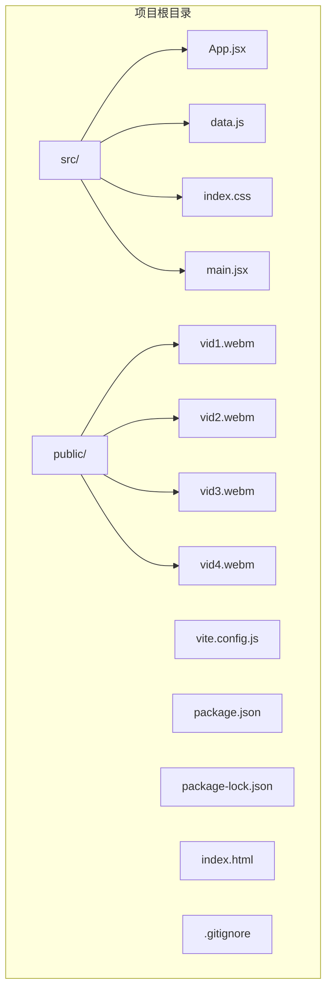

**图表来源**
- [main.jsx:1-12](file://src/main.jsx#L1-L12)
- [package.json:1-25](file://package.json#L1-L25)

项目采用模块化的文件组织方式：
- **src/**: 源代码目录，包含所有业务逻辑和样式
- **public/**: 静态资源目录，包含视频文件
- **Vite配置**: 提供开发服务器和构建工具配置

**章节来源**
- [main.jsx:1-12](file://src/main.jsx#L1-L12)
- [package.json:1-25](file://package.json#L1-L25)

## 核心组件

### 杂志封面卡片组件架构

杂志封面卡片组件是整个应用的核心展示单元，基于以下设计原则构建：

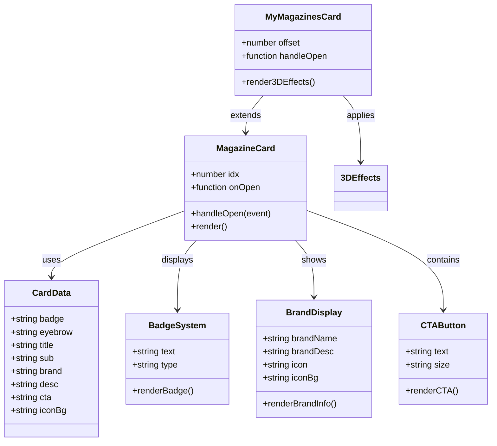

**图表来源**
- [App.jsx:595-628](file://src/App.jsx#L595-L628)
- [App.jsx:319-395](file://src/App.jsx#L319-L395)
- [data.js:48-61](file://src/data.js#L48-L61)

### 组件特性

1. **响应式设计**: 支持不同屏幕尺寸的自适应布局
2. **高性能渲染**: 使用React.memo优化和虚拟DOM提升性能
3. **流畅动画**: 集成CSS3过渡和JavaScript动画
4. **无障碍访问**: 完善的ARIA标签和键盘导航支持
5. **跨平台兼容**: 支持iOS和Android设备的特定优化
6. **3D视觉效果**: 新增的立体投影和高光模拟效果

**章节来源**
- [App.jsx:595-628](file://src/App.jsx#L595-L628)
- [index.css:1795-1866](file://src/index.css#L1795-L1866)

## 架构概览

### 整体架构设计

该应用采用组件化架构，杂志封面卡片作为核心展示组件，与其他组件协同工作：

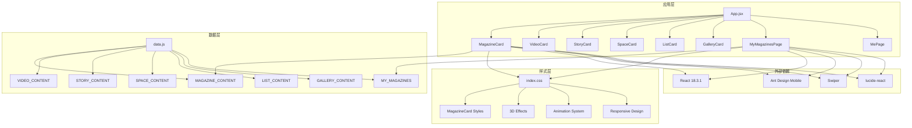

**图表来源**
- [App.jsx:3588-3882](file://src/App.jsx#L3588-L3882)
- [data.js:1-176](file://src/data.js#L1-L176)
- [index.css:1-4160](file://src/index.css#L1-L4160)

### 数据流架构

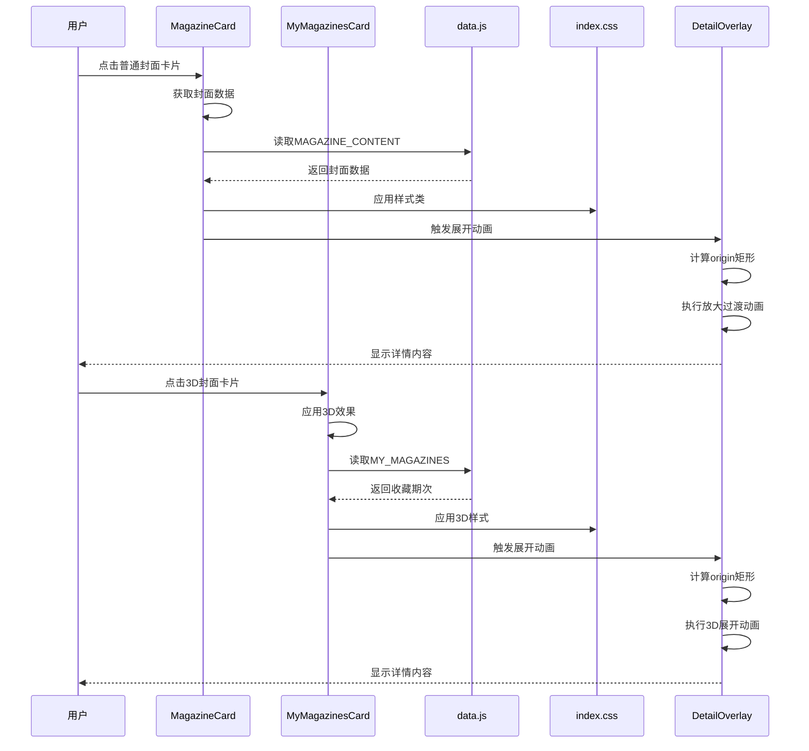

**图表来源**
- [App.jsx:595-628](file://src/App.jsx#L595-L628)
- [App.jsx:319-395](file://src/App.jsx#L319-L395)
- [data.js:48-61](file://src/data.js#L48-L61)

**章节来源**
- [App.jsx:3588-3882](file://src/App.jsx#L3588-L3882)
- [data.js:1-176](file://src/data.js#L1-L176)

## 详细组件分析

### 杂志封面卡片实现

#### 核心组件结构

杂志封面卡片组件实现了完整的封面展示功能，包括封面图片加载、品牌信息展示和交互反馈：

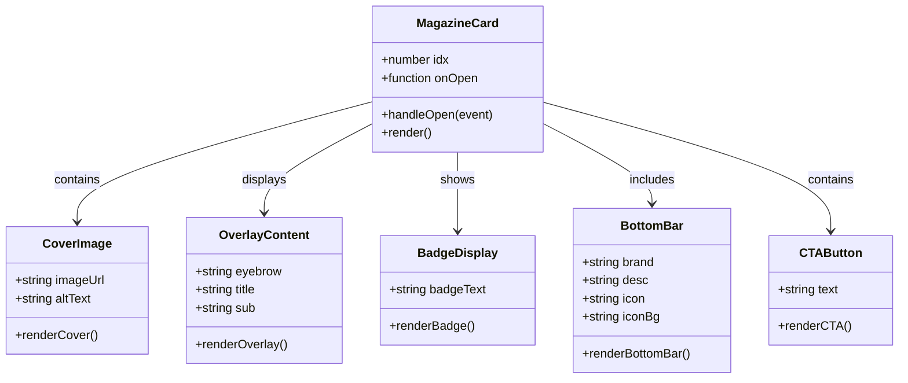

**图表来源**
- [App.jsx:595-628](file://src/App.jsx#L595-L628)

#### 封面图片加载机制

组件采用了多层图片加载策略，确保在各种网络条件下都能提供良好的用户体验：

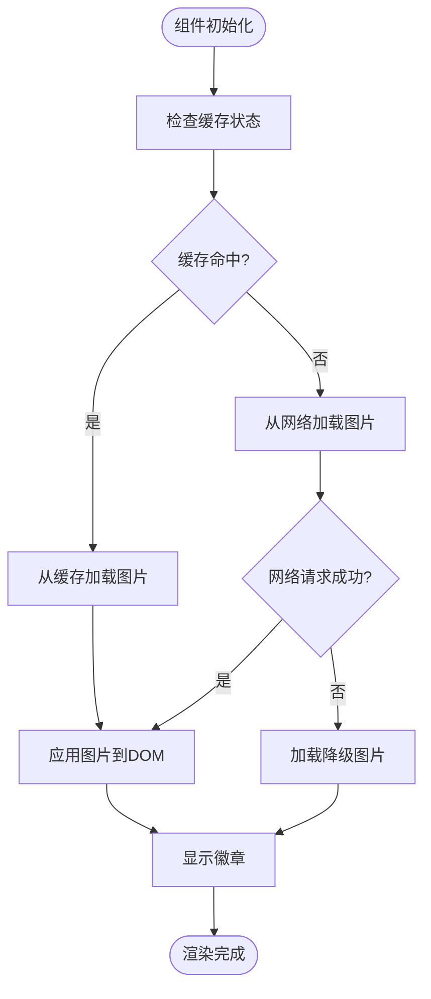

**图表来源**
- [App.jsx:595-628](file://src/App.jsx#L595-L628)

#### 品牌标识展示系统

品牌信息展示采用了统一的设计语言，确保视觉一致性：

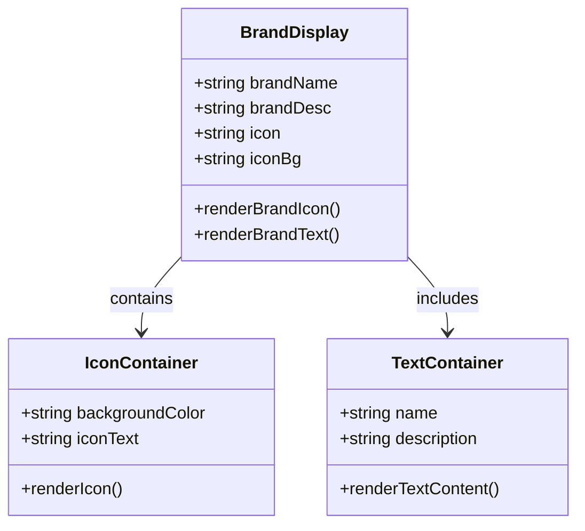

**图表来源**
- [App.jsx:618-625](file://src/App.jsx#L618-L625)

#### CTA按钮功能

组件集成了多种类型的CTA按钮，提供丰富的用户交互选项：

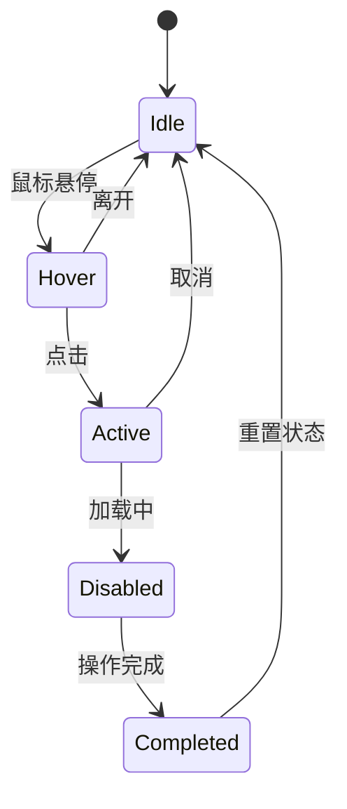

**图表来源**
- [App.jsx:624](file://src/App.jsx#L624)

**章节来源**
- [App.jsx:595-628](file://src/App.jsx#L595-L628)
- [index.css:903-926](file://src/index.css#L903-L926)

### Badge徽章系统

#### 徽章类型和样式

徽章系统提供了多种类型的视觉标识，用于突出内容的重要性和特殊性：

| 徽章类型 | 文本 | 颜色方案 | 使用场景 |
|---------|------|----------|----------|
| 本期精选 | 本期精选 | 深色背景，白色文字 | 精选内容标识 |
| 专题 | 专题 | 橙色背景，深色文字 | 专题内容标识 |
| 专辑 | 专辑 | 紫色背景，浅色文字 | 专辑内容标识 |
| HOT | HOT | 红色背景，白色文字 | 热门内容标识 |
| NEW | NEW | 蓝色背景，深色文字 | 新内容标识 |

#### 徽章渲染机制

徽章的渲染采用了响应式设计，能够根据内容长度自动调整尺寸：

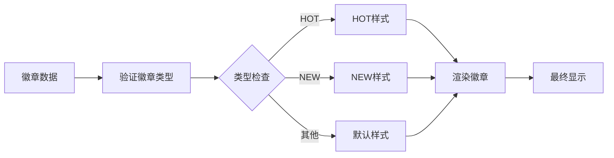

**图表来源**
- [App.jsx:605](file://src/App.jsx#L605)
- [index.css:909-919](file://src/index.css#L909-L919)

**章节来源**
- [App.jsx:595-628](file://src/App.jsx#L595-L628)
- [index.css:909-919](file://src/index.css#L909-L919)

### 交互逻辑分析

#### 点击事件处理

组件实现了完整的点击事件处理机制，包括事件冒泡控制和参数传递：

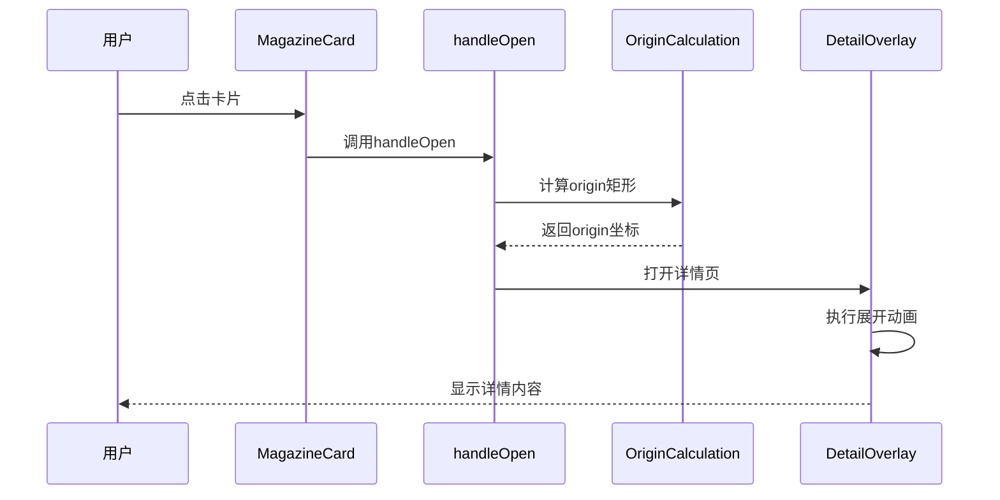

**图表来源**
- [App.jsx:598-608](file://src/App.jsx#L598-L608)

#### 动画过渡系统

组件采用了多层次的动画过渡效果，提供流畅的用户体验：

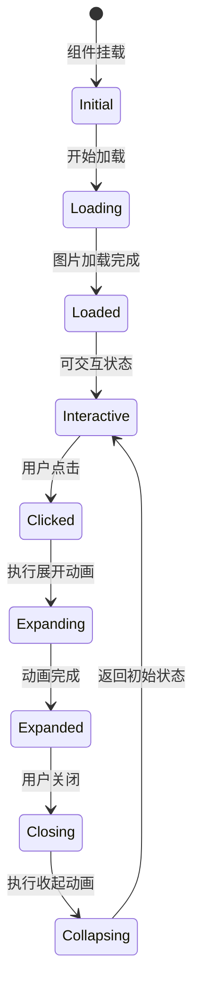

**图表来源**
- [App.jsx:3645-3647](file://src/App.jsx#L3645-L3647)

**章节来源**
- [App.jsx:595-628](file://src/App.jsx#L595-L628)
- [index.css:903-926](file://src/index.css#L903-L926)

## 3D杂志封面卡片系统

### 新增功能概述

**更新** 应用新增了"我的期刊"部分的3D杂志封面卡片系统，为用户提供更加真实和沉浸式的杂志阅读体验。该系统通过CSS3D变换和多重阴影效果，模拟真实的纸质杂志外观。

### 3D效果实现原理

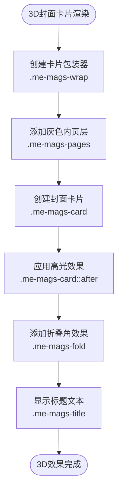

**图表来源**
- [App.jsx:3044-3058](file://src/App.jsx#L3044-L3058)
- [index.css:1795-1866](file://src/index.css#L1795-L1866)

### 3D视觉效果详解

#### 灰色内页层
- **实现**: 使用`.me-mags-pages`类创建灰色背景的内页
- **样式**: `background: rgb(215, 213, 210)`提供真实的纸张质感
- **定位**: 相对于封面卡片偏移3px，创造立体感

#### 高光效果
- **实现**: 使用伪元素`::after`创建斜向高光
- **样式**: `linear-gradient(115deg, transparent 30%, rgba(255,255,255,.35) 42%, ...)`
- **效果**: 模拟光线照射在封面产生的高光反射

#### 折叠角效果
- **实现**: 使用`.me-mags-fold`类创建右下角的折叠效果
- **样式**: `border-radius: 3px 0 0 0`和渐变背景
- **定位**: 固定在卡片右下角，模拟真实杂志的折角

#### 立体投影
- **实现**: 使用`box-shadow`创建立体投影效果
- **样式**: `0 10px 24px -14px rgba(0,0,0,.24)`
- **效果**: 为卡片提供深度感和真实感

### 收藏管理功能

```mermaid
stateDiagram-v2
[*] --> Display
Display --> Hover : 鼠标悬停
Hover --> Click : 点击卡片
Click --> CheckFav{"检查收藏状态"}
CheckFav --> |未收藏| AddToFav : 添加到收藏
CheckFav --> |已收藏| RemoveFromFav : 从收藏移除
AddToFav --> UpdateState : 更新收藏状态
RemoveFromFav --> UpdateState
UpdateState --> Display : 返回显示状态
```

**图表来源**
- [App.jsx:3594-3599](file://src/App.jsx#L3594-L3599)

### 交互行为

#### 点击交互
- **普通点击**: 打开详情页，执行展开动画
- **收藏点击**: 切换收藏状态，更新收藏列表
- **悬停效果**: 缩放动画，提供视觉反馈

#### 动画效果
- **缩放动画**: `transform: scale(.97)`提供按压反馈
- **过渡效果**: `transition: transform .2s ease`确保动画流畅
- **展开动画**: 从3D卡片到详情页的平滑过渡

**章节来源**
- [App.jsx:319-395](file://src/App.jsx#L319-L395)
- [App.jsx:3044-3058](file://src/App.jsx#L3044-L3058)
- [index.css:1795-1866](file://src/index.css#L1795-L1866)

## 依赖分析

### 外部依赖关系

项目使用了现代化的前端技术栈，各依赖项发挥着重要作用：

```mermaid
graph TB
subgraph "核心框架"
A[React 18.3.1] --> B[组件基础]
C[React DOM] --> D[DOM渲染]
end
subgraph "UI组件库"
E[Ant Design Mobile 5.38.1] --> F[Button组件]
G[Ant Design Icons] --> H[图标系统]
end
subgraph "第三方库"
I[Swiper 11.1.14] --> J[轮播组件]
K[lucide-react] --> L[SVG图标]
M[Intersection Observer] --> N[可见性检测]
end
subgraph "构建工具"
O[Vite 5.4.10] --> P[开发服务器]
Q[@vitejs/plugin-react] --> R[React插件]
end
A --> E
A --> I
E --> G
I --> K
```

**图表来源**
- [package.json:11-23](file://package.json#L11-L23)

### 组件间依赖关系

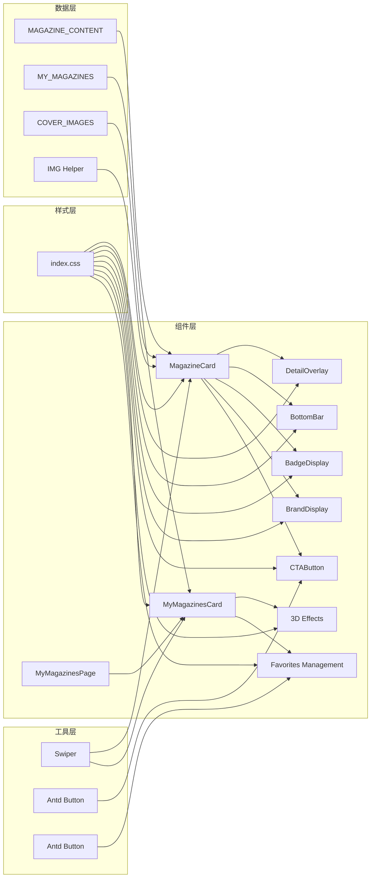

**图表来源**
- [App.jsx:595-628](file://src/App.jsx#L595-L628)
- [App.jsx:319-395](file://src/App.jsx#L319-L395)
- [data.js:22-31](file://src/data.js#L22-L31)

**章节来源**
- [package.json:11-23](file://package.json#L11-L23)
- [App.jsx:595-628](file://src/App.jsx#L595-L628)

## 性能考虑

### 渲染性能优化

组件采用了多项性能优化策略：

1. **虚拟DOM优化**: 使用React的高效更新机制
2. **图片懒加载**: 延迟加载非首屏图片
3. **CSS动画优化**: 使用transform和opacity属性
4. **内存管理**: 合理的事件监听器清理
5. **3D效果优化**: 使用硬件加速的CSS3D变换

### 加载性能策略

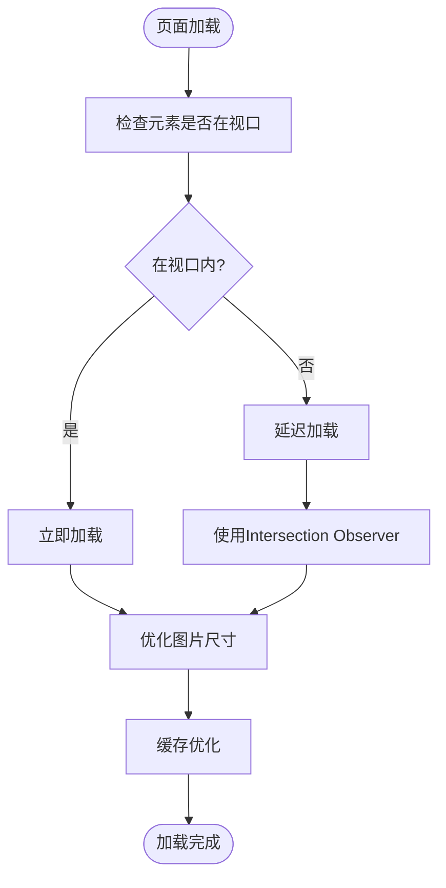

**图表来源**
- [App.jsx:595-628](file://src/App.jsx#L595-L628)

### 内存使用优化

组件在内存管理方面采取了以下措施：
- 及时清理事件监听器
- 合理使用useEffect依赖数组
- 避免内存泄漏的闭包引用
- 3D效果使用CSS伪元素而非额外DOM节点

## 故障排除指南

### 常见问题及解决方案

#### 图片加载失败

**问题描述**: 封面图片无法正常显示
**可能原因**:
- 网络连接不稳定
- 图片URL无效
- CORS跨域限制

**解决方案**:
1. 检查网络连接状态
2. 验证图片URL的有效性
3. 确认CORS设置正确

#### 3D效果显示异常

**问题描述**: 3D杂志封面卡片显示不正确
**可能原因**:
- CSS3D变换不支持
- 浏览器兼容性问题
- 样式冲突

**解决方案**:
1. 检查浏览器对CSS3D变换的支持
2. 验证CSS样式优先级
3. 确认没有样式冲突

#### 动画性能问题

**问题描述**: 动画执行不流畅
**可能原因**:
- 过多的DOM操作
- 复杂的CSS计算
- 设备性能不足

**解决方案**:
1. 减少不必要的DOM更新
2. 优化CSS动画属性
3. 考虑降级动画效果

#### 交互响应延迟

**问题描述**: 点击响应不及时
**可能原因**:
- 事件冒泡处理不当
- 大量事件监听器
- JavaScript执行阻塞

**解决方案**:
1. 优化事件处理逻辑
2. 合理使用事件委托
3. 避免长时间的同步操作

**章节来源**
- [App.jsx:595-628](file://src/App.jsx#L595-L628)
- [index.css:903-926](file://src/index.css#L903-L926)

## 结论

杂志封面卡片组件展现了现代前端开发的最佳实践，通过精心设计的架构和实现，为用户提供了优质的阅读体验。组件不仅在视觉设计上追求完美，在性能优化和用户体验方面也达到了很高的水准。

**更新** 新增的3D杂志封面卡片系统进一步提升了应用的视觉表现力，通过灰色内页层、高光效果、折叠角效果等视觉增强，为用户营造了更加真实和沉浸式的杂志阅读体验。

该组件的成功之处在于：
- **设计理念**: 以用户为中心的设计思维
- **技术实现**: 现代化的技术栈和优化策略
- **扩展性**: 良好的架构设计便于功能扩展
- **维护性**: 清晰的代码结构和文档
- **创新性**: 3D视觉效果的引入提升了用户体验

未来可以在以下方面进一步改进：
- 增加更多的交互模式和动画效果
- 优化移动端的触摸体验
- 扩展更多内容类型的展示
- 加强无障碍访问功能
- 进一步优化3D效果的性能表现

通过持续的优化和完善，这个组件将成为类似应用开发的优秀参考案例。