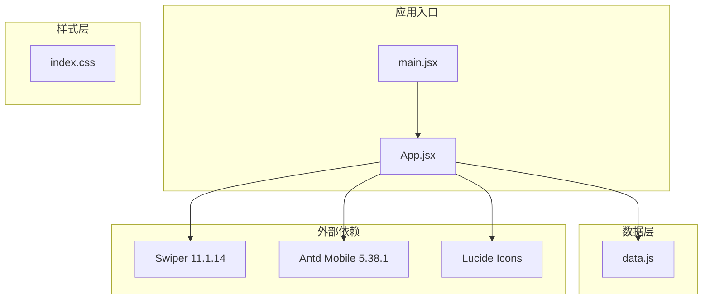
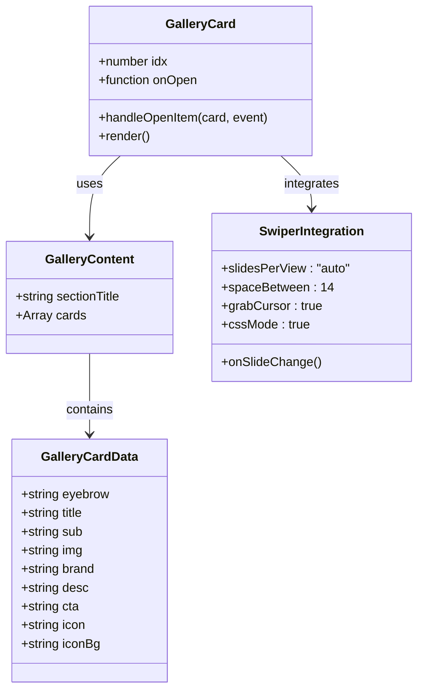
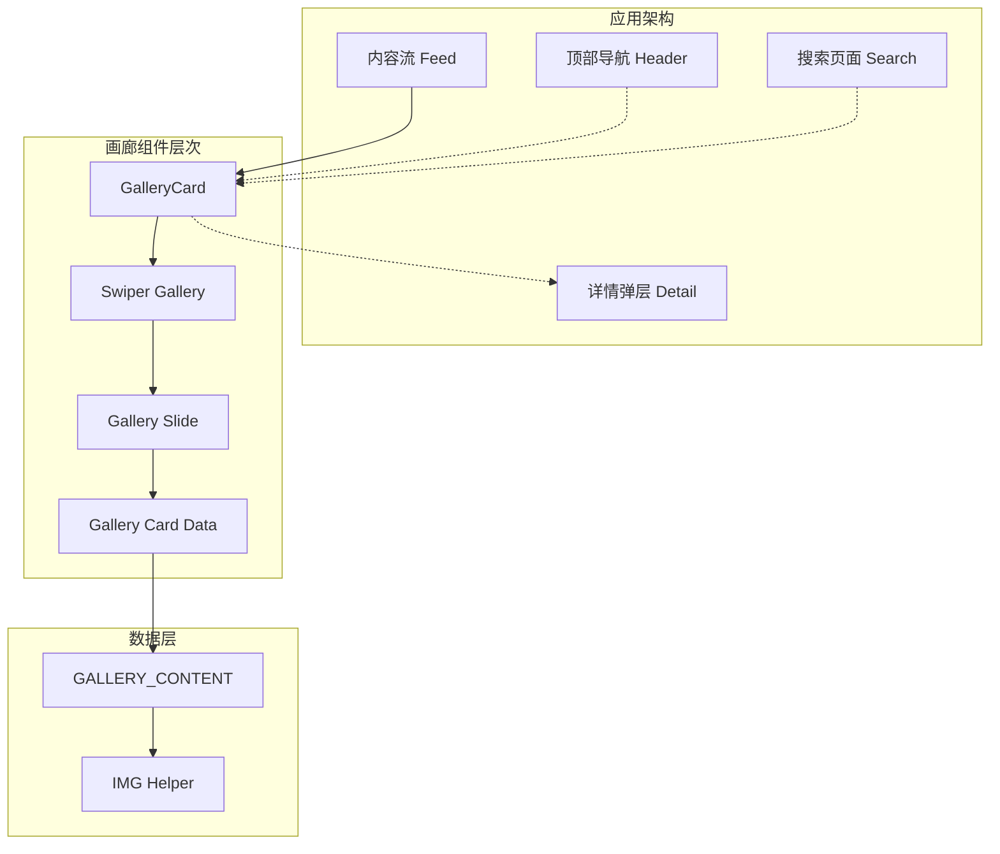
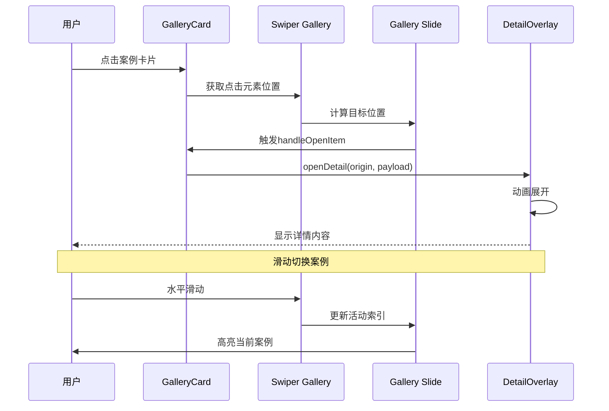
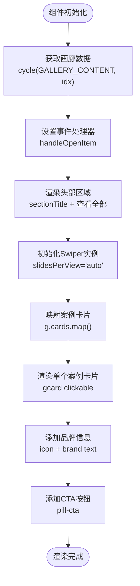
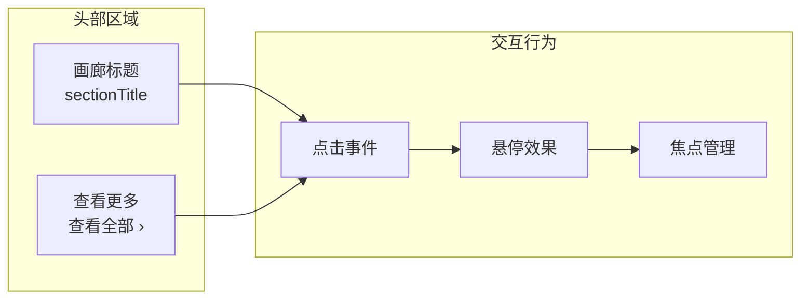

# 案例画廊卡片

<cite>
**本文引用的文件**
- [src/App.jsx](file://src/App.jsx)
- [src/data.js](file://src/data.js)
- [src/main.jsx](file://src/main.jsx)
- [package.json](file://package.json)
</cite>

## 目录
1. [简介](#简介)
2. [项目结构](#项目结构)
3. [核心组件](#核心组件)
4. [架构概览](#架构概览)
5. [详细组件分析](#详细组件分析)
6. [依赖关系分析](#依赖关系分析)
7. [性能考虑](#性能考虑)
8. [故障排除指南](#故障排除指南)
9. [结论](#结论)
10. [附录](#附录)

## 简介

案例画廊卡片组件是家装生活应用中的核心展示组件，专门用于展示室内设计案例的横向滚动画廊。该组件采用Swiper集成实现流畅的触摸滑动体验，结合响应式布局设计，为用户提供沉浸式的案例浏览体验。

该组件不仅展示了现代化的设计理念，还通过精心设计的交互模式，让用户能够轻松地在众多案例之间进行切换和探索。组件支持多种展示模式，包括案例封面、品牌信息展示和CTA按钮功能，为用户提供了丰富的视觉和交互体验。

## 项目结构

该项目采用React + Vite的现代化前端架构，主要包含以下核心文件：



**图表来源**
- [src/main.jsx:1-12](file://src/main.jsx#L1-L12)
- [src/App.jsx:1-10](file://src/App.jsx#L1-L10)
- [package.json:11-18](file://package.json#L11-L18)

**章节来源**
- [src/main.jsx:1-12](file://src/main.jsx#L1-L12)
- [package.json:1-25](file://package.json#L1-L25)

## 核心组件

案例画廊卡片组件位于App.jsx文件中，是一个专门用于展示室内设计案例的横向滚动组件。该组件具有以下核心特性：

### 组件架构



**图表来源**
- [src/App.jsx:527-579](file://src/App.jsx#L527-L579)
- [src/data.js:101-131](file://src/data.js#L101-L131)

### 数据结构设计

组件采用模块化的数据结构设计，每个案例卡片包含完整的信息单元：

- **标题信息**：eyebrow（副标题）、title（主标题）、sub（描述）
- **视觉元素**：img（案例图片）、icon（品牌图标）、iconBg（图标背景渐变）
- **品牌信息**：brand（品牌名称）、desc（品牌描述）
- **交互元素**：cta（行动号召按钮文本）

**章节来源**
- [src/App.jsx:527-579](file://src/App.jsx#L527-L579)
- [src/data.js:101-131](file://src/data.js#L101-L131)

## 架构概览

案例画廊卡片组件在整个应用架构中扮演着重要的角色，它与其他组件形成了紧密的协作关系：



**图表来源**
- [src/App.jsx:527-579](file://src/App.jsx#L527-L579)
- [src/data.js:101-131](file://src/data.js#L101-L131)

### 组件交互流程



**图表来源**
- [src/App.jsx:527-579](file://src/App.jsx#L527-L579)
- [src/App.jsx:989-991](file://src/App.jsx#L989-L991)

**章节来源**
- [src/App.jsx:527-579](file://src/App.jsx#L527-L579)
- [src/App.jsx:975-1112](file://src/App.jsx#L975-L1112)

## 详细组件分析

### GalleryCard 组件实现

GalleryCard组件是案例画廊的核心实现，采用了现代化的React Hooks模式和Swiper集成：

#### 核心实现逻辑



**图表来源**
- [src/App.jsx:527-579](file://src/App.jsx#L527-L579)

#### 滑动体验优化

组件在滑动体验方面进行了多项优化：

- **自适应宽度**：使用`width: '75vw', maxWidth: 340`确保在不同设备上的最佳显示效果
- **流畅动画**：通过`cssMode: true`启用CSS模式，提供更流畅的滑动体验
- **抓取光标**：`grabCursor: true`提供视觉反馈，表明内容可拖拽
- **间距控制**：`spaceBetween: 14`确保卡片间的适当间距

**章节来源**
- [src/App.jsx:547-576](file://src/App.jsx#L547-L576)

### 数据模型设计

案例画廊的数据模型采用了标准化的结构设计：

```mermaid
erDiagram
GALLERY_SECTION {
string sectionTitle
array cards
}
GALLERY_CARD {
string eyebrow
string title
string sub
string img
string brand
string desc
string cta
string icon
string iconBg
}
IMAGE_HELPER {
function IMG(id, w)
string baseUrl
}
GALLERY_SECTION ||--o{ GALLERY_CARD : contains
GALLERY_CARD ||--|| IMAGE_HELPER : uses
```

**图表来源**
- [src/data.js:101-131](file://src/data.js#L101-L131)
- [src/data.js:22-23](file://src/data.js#L22-L23)

#### 数据结构特点

- **模块化设计**：每个案例卡片都是独立的数据单元
- **品牌一致性**：统一的品牌信息展示格式
- **响应式支持**：通过IMG函数动态调整图片尺寸
- **扩展性**：易于添加新的案例卡片和属性

**章节来源**
- [src/data.js:101-131](file://src/data.js#L101-L131)

### 交互设计实现

组件实现了多层次的交互设计：

#### 头部交互设计



**图表来源**
- [src/App.jsx:542-546](file://src/App.jsx#L542-L546)

#### 案例卡片交互

每个案例卡片都实现了完整的交互功能：

- **点击展开**：点击卡片触发详情弹层
- **品牌信息**：显示品牌图标和描述
- **CTA按钮**：提供明确的行动指引
- **渐变覆盖**：增强视觉层次感

**章节来源**
- [src/App.jsx:554-576](file://src/App.jsx#L554-L576)

## 依赖关系分析

案例画廊卡片组件的依赖关系体现了现代化前端开发的最佳实践：

```mermaid
graph TB
subgraph "组件依赖"
GC[GalleryCard.jsx]
SWP[Swiper React]
AM[Antd Mobile]
ICON[Lucide Icons]
end
subgraph "数据依赖"
DATA[data.js]
IMG[IMG Helper]
end
subgraph "外部库"
SWIPER[swiper@11.1.14]
REACT[react@18.3.1]
DOM[react-dom@18.3.1]
end
GC --> SWP
GC --> AM
GC --> ICON
GC --> DATA
DATA --> IMG
SWP --> SWIPER
GC --> REACT
GC --> DOM
```

**图表来源**
- [src/App.jsx:5-8](file://src/App.jsx#L5-L8)
- [package.json:11-18](file://package.json#L11-L18)

### 核心依赖分析

#### Swiper集成

组件深度集成了Swiper库，实现了专业的滑动效果：

- **模块化导入**：仅导入必要的Swiper模块
- **配置优化**：针对移动端优化的配置参数
- **性能考虑**：使用cssMode提升滑动性能

#### Antd Mobile集成

通过Antd Mobile提供了现代化的UI组件：

- **Button组件**：统一的CTA按钮样式
- **全局样式**：完整的移动端UI规范
- **图标系统**：丰富的图标库支持

**章节来源**
- [src/App.jsx:5-8](file://src/App.jsx#L5-L8)
- [package.json:11-18](file://package.json#L11-L18)

## 性能考虑

案例画廊卡片组件在性能优化方面采用了多项策略：

### 渲染优化

- **虚拟滚动**：通过Swiper的滑动机制避免DOM节点过多
- **懒加载**：图片通过CSS背景图实现，减少HTTP请求
- **内存管理**：合理使用useRef和useEffect避免内存泄漏

### 滑动性能

- **硬件加速**：利用CSS3 transform实现硬件加速
- **节流处理**：通过requestAnimationFrame优化滚动性能
- **触摸优化**：针对移动设备优化触摸事件处理

### 响应式设计

- **视口单位**：使用vw单位确保在不同设备上的适配
- **最大宽度限制**：通过maxWidth确保大屏幕设备的显示效果
- **弹性布局**：配合Flexbox实现灵活的布局调整

## 故障排除指南

### 常见问题及解决方案

#### 滑动不流畅

**问题现象**：Swiper滑动时出现卡顿

**可能原因**：
- 图片加载过慢
- DOM节点过多
- CSS动画冲突

**解决方案**：
- 使用CSS背景图替代<img标签
- 减少不必要的DOM层级
- 检查CSS动画冲突

#### 样式显示异常

**问题现象**：案例卡片显示位置不正确

**可能原因**：
- 容器宽度计算错误
- CSS单位使用不当
- 响应式断点问题

**解决方案**：
- 检查父容器的width属性
- 确认vw单位的正确使用
- 添加媒体查询适配不同屏幕

#### 交互事件失效

**问题现象**：点击事件无法正常触发

**可能原因**：
- 事件冒泡阻止
- z-index层级问题
- touch-action冲突

**解决方案**：
- 检查event.stopPropagation()的使用
- 调整z-index层级
- 配置touch-action属性

**章节来源**
- [src/App.jsx:547-576](file://src/App.jsx#L547-L576)

## 结论

案例画廊卡片组件展现了现代前端开发的优秀实践，通过精心设计的架构和实现，为用户提供了流畅、直观的案例浏览体验。组件不仅在技术实现上达到了较高的水准，在用户体验设计上也体现了专业水准。

该组件的成功之处在于：

- **架构清晰**：模块化设计便于维护和扩展
- **性能优化**：多维度的性能优化策略
- **用户体验**：注重细节的交互设计
- **响应式适配**：全面的跨设备兼容性

未来可以在以下方面进一步改进：
- 添加更多的动画效果
- 增强无障碍访问支持
- 优化SEO友好性
- 扩展更多展示模式

## 附录

### 组件API参考

#### GalleryCard Props

| 参数名 | 类型 | 必需 | 默认值 | 描述 |
|--------|------|------|--------|------|
| idx | number | 是 | - | 数据索引，用于从数据池中获取案例数据 |
| onOpen | function | 否 | null | 点击卡片时的回调函数 |

#### GalleryCard 事件

| 事件名 | 参数 | 描述 |
|--------|------|------|
| onOpen | (origin, payload) => void | 当用户点击案例卡片时触发，传递动画起点和内容数据 |

#### 数据结构定义

```javascript
// 画廊数据结构
{
  sectionTitle: string,  // 画廊标题
  cards: Array<{
    eyebrow: string,     // 副标题
    title: string,       // 主标题
    sub: string,         // 描述
    img: string,         // 案例图片URL
    brand: string,       // 品牌名称
    desc: string,        // 品牌描述
    cta: string,         // CTA按钮文本
    icon: string,        // 品牌图标字符
    iconBg: string       // 图标背景渐变
  }>
}
```

### 实现示例

#### 基础使用

```javascript
// 在应用中使用GalleryCard组件
<GalleryCard 
  idx={currentIndex} 
  onOpen={(origin, payload) => {
    // 处理卡片点击事件
    openDetail(origin, payload);
  }}
/>
```

#### 自定义配置

```javascript
// 通过修改Swiper配置实现自定义效果
<Swiper
  slidesPerView="auto"
  spaceBetween={14}
  grabCursor={true}
  cssMode={true}
  onSlideChange={(swiper) => {
    // 处理滑动变化
    console.log('当前活动索引:', swiper.activeIndex);
  }}
>
  {cards.map((card, index) => (
    <SwiperSlide key={index}>
      {/* 案例卡片内容 */}
    </SwiperSlide>
  ))}
</Swiper>
```

**章节来源**
- [src/App.jsx:527-579](file://src/App.jsx#L527-L579)
- [src/data.js:101-131](file://src/data.js#L101-L131)