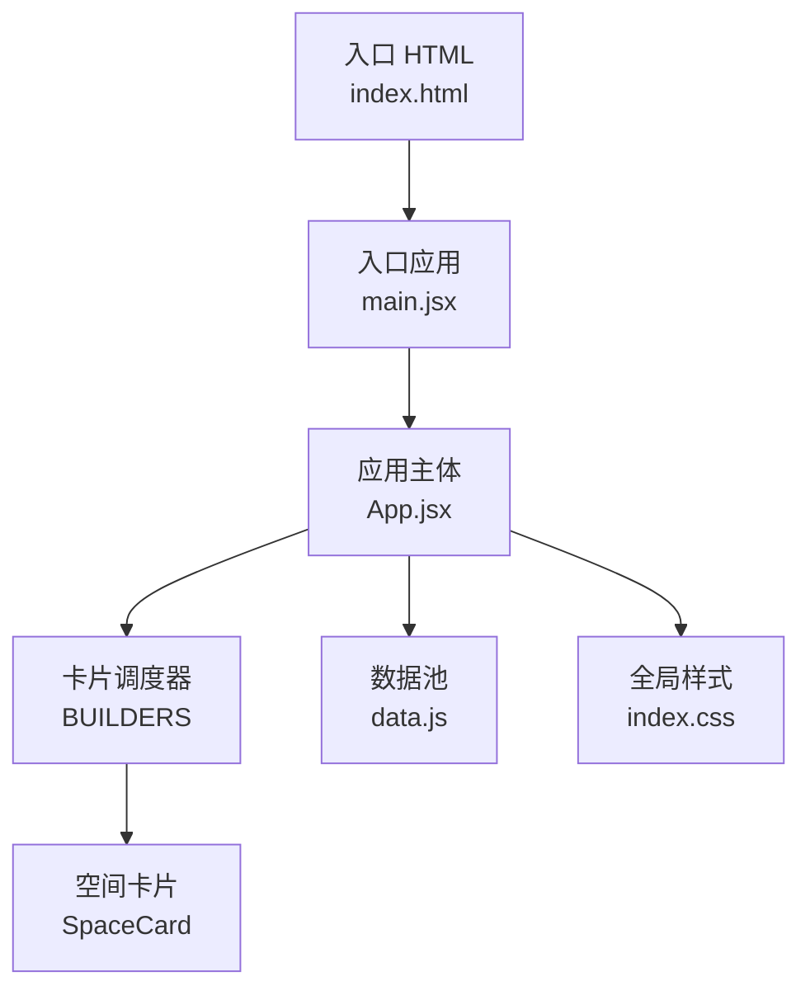
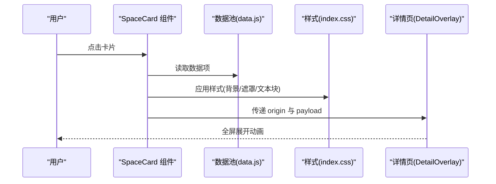
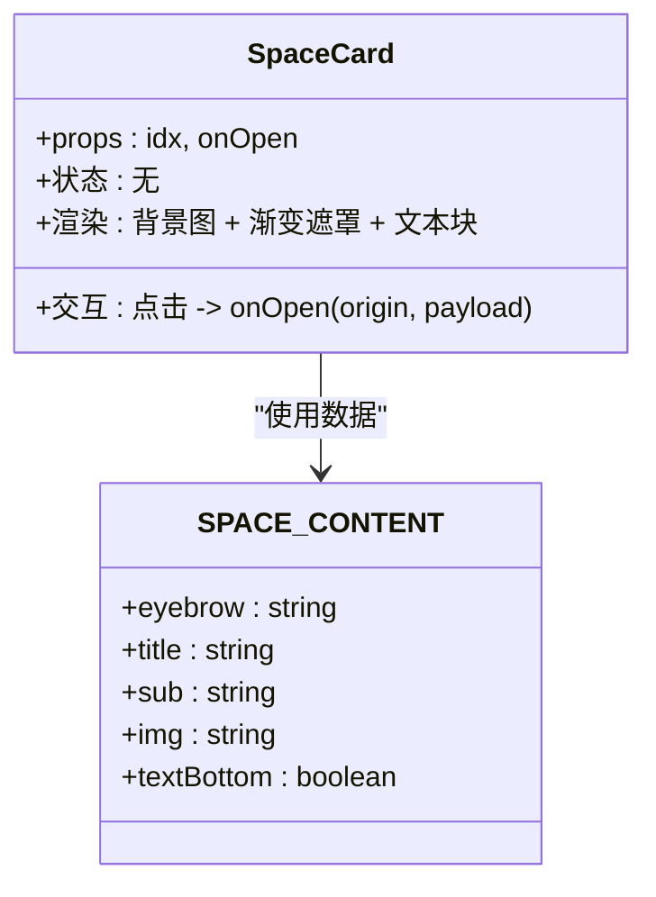
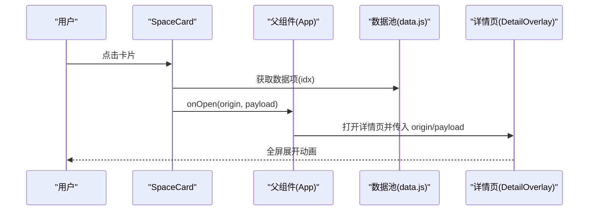
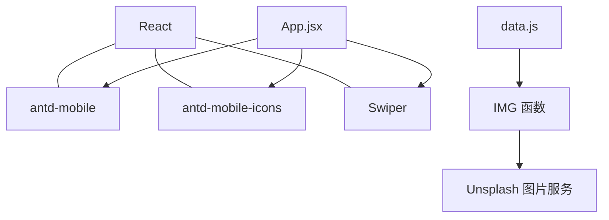

# 空间封面卡片

<cite>
**本文引用的文件**
- [App.jsx](file://src/App.jsx)
- [data.js](file://src/data.js)
- [index.css](file://src/index.css)
- [main.jsx](file://src/main.jsx)
- [package.json](file://package.json)
- [index.html](file://index.html)
</cite>

## 目录
1. [简介](#简介)
2. [项目结构](#项目结构)
3. [核心组件](#核心组件)
4. [架构总览](#架构总览)
5. [详细组件分析](#详细组件分析)
6. [依赖分析](#依赖分析)
7. [性能考量](#性能考量)
8. [故障排查指南](#故障排查指南)
9. [结论](#结论)
10. [附录](#附录)

## 简介
本文件面向“空间封面卡片”组件，系统性阐述其视觉设计原理、渐变遮罩技术、文本定位系统与响应式布局策略，并给出完整的组件接口说明、样式参数与交互事件定义。文档同时提供实现示例路径与最佳实践，帮助开发者快速配置空间卡片的视觉效果与交互行为，涵盖文本底部显示模式、渐变覆盖层与图片加载优化策略。

## 项目结构
该仓库采用前端单页应用结构，核心入口为 React 应用，样式通过全局 CSS 定义，数据通过集中导出的数据池提供。空间卡片位于卡片体系中的第4类，与视频卡、杂志封面、故事卡、列表卡、画廊卡共同组成信息流卡片矩阵。

图表来源
- [index.html:1-16](file://index.html#L1-L16)
- [main.jsx:1-12](file://src/main.jsx#L1-L12)
- [App.jsx:738-741](file://src/App.jsx#L738-L741)
- [data.js:133-146](file://src/data.js#L133-L146)
- [index.css:763-783](file://src/index.css#L763-L783)

章节来源
- [index.html:1-16](file://index.html#L1-L16)
- [main.jsx:1-12](file://src/main.jsx#L1-L12)
- [App.jsx:738-741](file://src/App.jsx#L738-L741)
- [data.js:133-146](file://src/data.js#L133-L146)
- [index.css:763-783](file://src/index.css#L763-L783)

## 核心组件
空间卡片组件负责展示空间主题的封面图片与文案，支持两种文本定位模式：
- 文本顶部显示（默认）
- 文本底部显示（textBottom=true）

组件通过背景图承载图片，叠加渐变遮罩提升可读性，并在点击时触发展示层打开动画。

章节来源
- [App.jsx:466-489](file://src/App.jsx#L466-L489)
- [data.js:133-146](file://src/data.js#L133-L146)

## 架构总览
空间卡片在应用中的职责链如下：
- 数据来源：数据池提供空间卡片数据项（含图片 ID、标题、副标题、是否底部文本等）。
- 渲染逻辑：SpaceCard 组件根据数据项生成卡片 DOM 结构。
- 样式系统：index.css 提供卡片背景、渐变遮罩、文本块定位、模糊覆层等样式。
- 交互流程：点击卡片触发详情页打开动画，传递 origin 与 payload。

图表来源
- [App.jsx:466-489](file://src/App.jsx#L466-L489)
- [data.js:133-146](file://src/data.js#L133-L146)
- [index.css:763-783](file://src/index.css#L763-L783)
- [App.jsx:581-736](file://src/App.jsx#L581-L736)

## 详细组件分析

### 组件结构与数据模型
- 组件名称：SpaceCard
- 组件职责：渲染空间主题封面卡片，支持文本顶部/底部两种布局。
- 数据来源：SPACE_CONTENT 数组，包含字段：
  - eyebrow：小标题
  - title：主标题
  - sub：副标题
  - img：图片 ID（通过 IMG 函数拼接 URL）
  - textBottom：布尔值，控制文本块位置（true 为底部，false 为顶部）

图表来源
- [App.jsx:466-489](file://src/App.jsx#L466-L489)
- [data.js:133-146](file://src/data.js#L133-L146)

章节来源
- [App.jsx:466-489](file://src/App.jsx#L466-L489)
- [data.js:133-146](file://src/data.js#L133-L146)

### 视觉设计原理与渐变遮罩技术
- 背景图承载：卡片背景使用 backgroundImage 设置，确保图片覆盖整个卡片区域。
- 渐变遮罩：
  - 顶部遮罩：用于文本顶部显示模式，自上而下渐变，提升文字可读性。
  - 底部遮罩：当 textBottom 为 true 时，遮罩方向反转，自下而上渐变。
- 文本块定位：
  - 顶部模式：文本块绝对定位在卡片上部，padding 适配标题层级。
  - 底部模式：文本块绝对定位在卡片下部，padding 适配底部留白。
- 模糊覆层：卡片底部采用高斯模糊覆层，配合渐变遮罩形成柔和的视觉层次。

章节来源
- [index.css:763-783](file://src/index.css#L763-L783)
- [index.css:765-772](file://src/index.css#L765-L772)
- [index.css:773-783](file://src/index.css#L773-L783)

### 文本定位系统
- 顶部文本块：位于卡片上部，使用相对定位与 padding 控制间距。
- 底部文本块：通过 text-bottom 类切换，将文本块移动至底部，同时调整遮罩方向。
- 字体与阴影：标题与副标题采用统一字号与行高，配合文本阴影增强对比度。

章节来源
- [index.css:773-783](file://src/index.css#L773-L783)
- [index.css:765-772](file://src/index.css#L765-L772)
- [index.css:24-86](file://src/index.css#L24-L86)

### 响应式布局与图片适配
- 容器比例：卡片采用固定宽高比，确保在不同设备上保持一致的视觉比例。
- 图片适配：背景图通过 cover 模式填充，避免拉伸；在不同 DPR 下通过 IMG 函数动态选择合适分辨率。
- 文本块宽度限制：底部文本块设置最大宽度，避免在窄屏下溢出。

章节来源
- [index.css:763-764](file://src/index.css#L763-L764)
- [data.js:22-23](file://src/data.js#L22-L23)
- [index.css](file://src/index.css#L783)

### 组件接口说明
- 组件属性（props）
  - idx: number，数据索引，用于从数据池循环取值。
  - onOpen: function，点击卡片时回调，接收 origin 与 payload。
- 事件
  - 点击卡片：触发 onOpen(origin, payload)，其中 payload 包含：
    - eyebrow：小标题
    - title：主标题
    - sub：副标题
    - heroImg：封面图片 URL
- 样式参数
  - textBottom：布尔值，控制文本块位置（true 为底部，false 为顶部）。
  - 背景图：通过 backgroundImage 设置，图片 URL 由 IMG 函数生成。
  - 渐变遮罩：通过 gradient-top 或 gradient-bottom 控制方向。
  - 文本块：通过 text-block 定位，支持顶部/底部两种布局。

章节来源
- [App.jsx:466-489](file://src/App.jsx#L466-L489)
- [data.js:133-146](file://src/data.js#L133-L146)
- [index.css:763-783](file://src/index.css#L763-L783)

### 实现示例与最佳实践
- 配置文本底部显示
  - 在数据项中将 textBottom 设为 true，即可启用底部文本模式。
  - 示例路径：[data.js](file://src/data.js#L136)
- 配置图片与文案
  - 使用 IMG 函数生成图片 URL，确保在不同 DPR 下获得清晰图片。
  - 示例路径：[data.js:22-23](file://src/data.js#L22-L23)
- 交互行为
  - 点击卡片时，传递 origin 与 payload，触发展示层动画。
  - 示例路径：[App.jsx:468-477](file://src/App.jsx#L468-L477)
- 渐变遮罩与模糊覆层
  - 顶部/底部遮罩通过 CSS 类控制方向；模糊覆层用于提升底部信息可读性。
  - 示例路径：[index.css:765-772](file://src/index.css#L765-L772), [index.css:773-783](file://src/index.css#L773-L783)

章节来源
- [data.js:133-146](file://src/data.js#L133-L146)
- [data.js:22-23](file://src/data.js#L22-L23)
- [App.jsx:466-489](file://src/App.jsx#L466-L489)
- [index.css:763-783](file://src/index.css#L763-L783)

### 交互序列图

图表来源
- [App.jsx:466-489](file://src/App.jsx#L466-L489)
- [data.js:133-146](file://src/data.js#L133-L146)
- [App.jsx:581-736](file://src/App.jsx#L581-L736)

## 依赖分析
- React 生态：使用 React 18 与 React DOM 进行渲染。
- UI 组件库：使用 antd-mobile 与 antd-mobile-icons 提供基础 UI 组件与图标。
- 轮播组件：使用 Swiper 用于横向滚动场景（如故事卡、画廊卡）。
- 图片服务：通过 Unsplash 提供高质量图片，IMG 函数统一生成带格式与尺寸参数的 URL。

图表来源
- [package.json:11-18](file://package.json#L11-L18)
- [data.js:22-23](file://src/data.js#L22-L23)
- [App.jsx:1-9](file://src/App.jsx#L1-L9)

章节来源
- [package.json:11-18](file://package.json#L11-L18)
- [data.js:22-23](file://src/data.js#L22-L23)
- [App.jsx:1-9](file://src/App.jsx#L1-L9)

## 性能考量
- 图片加载优化
  - 使用 backgroundImage 与 cover 模式，避免额外的 DOM 层级与布局抖动。
  - 通过 IMG 函数按需选择分辨率，减少不必要的带宽消耗。
- 动画与过渡
  - 详情页打开/关闭使用 transform 与 border-radius 的过渡，避免昂贵的重排。
  - 使用 will-change 提示浏览器优化动画性能。
- 滚动与交互
  - 使用 passive 事件监听器减少滚动阻塞。
  - 详情页滚动容器使用 -webkit-overflow-scrolling: touch 提升滚动体验。

章节来源
- [index.css:1422-1442](file://src/index.css#L1422-L1442)
- [index.css:1443-1487](file://src/index.css#L1443-L1487)
- [App.jsx:994-1008](file://src/App.jsx#L994-L1008)

## 故障排查指南
- 文本不可读
  - 检查遮罩方向是否正确（顶部/底部遮罩类是否生效）。
  - 确认文本阴影与对比度设置是否符合预期。
- 图片显示异常
  - 检查 IMG 函数生成的 URL 是否正确，确认网络可访问性。
  - 确认背景图是否正确设置为 backgroundImage。
- 动画不流畅
  - 检查是否使用了 transform 与 will-change 优化。
  - 确认详情页容器滚动设置是否合理。

章节来源
- [index.css:763-783](file://src/index.css#L763-L783)
- [data.js:22-23](file://src/data.js#L22-L23)
- [index.css:1422-1442](file://src/index.css#L1422-L1442)

## 结论
空间封面卡片通过简洁的背景图承载、灵活的渐变遮罩与可切换的文本定位系统，实现了在不同设备与场景下的稳定表现。结合数据池驱动与全局样式系统，开发者可以快速配置卡片的视觉效果与交互行为，满足多样化的空间主题展示需求。

## 附录
- 组件相关文件路径
  - 组件实现：[App.jsx:466-489](file://src/App.jsx#L466-L489)
  - 数据模型：[data.js:133-146](file://src/data.js#L133-L146)
  - 样式定义：[index.css:763-783](file://src/index.css#L763-L783)
- 交互与动画
  - 详情页打开/关闭：[App.jsx:581-736](file://src/App.jsx#L581-L736)
  - 动画优化：[index.css:1422-1442](file://src/index.css#L1422-L1442)