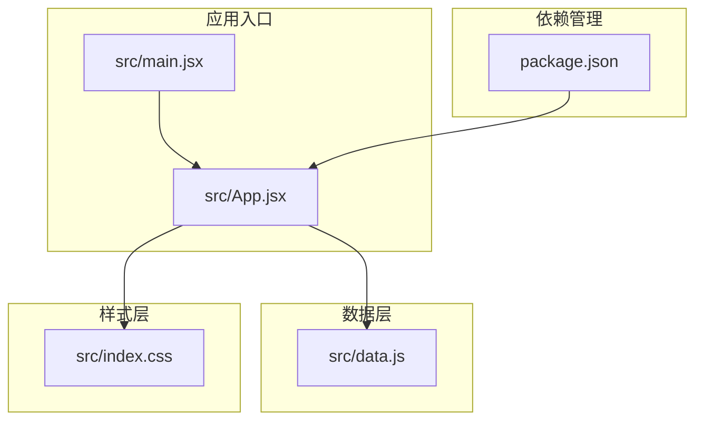
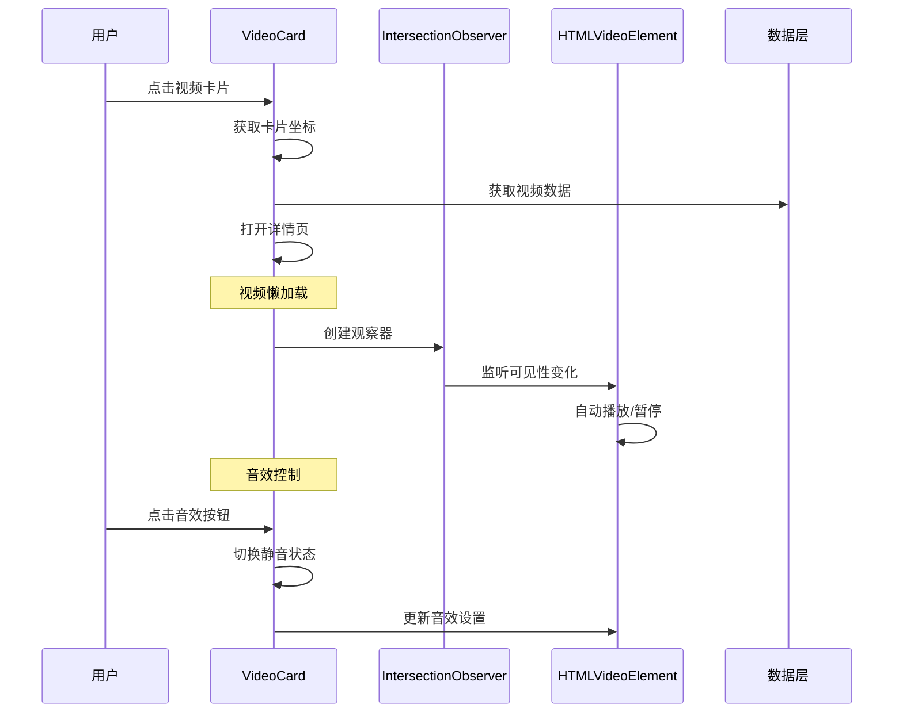
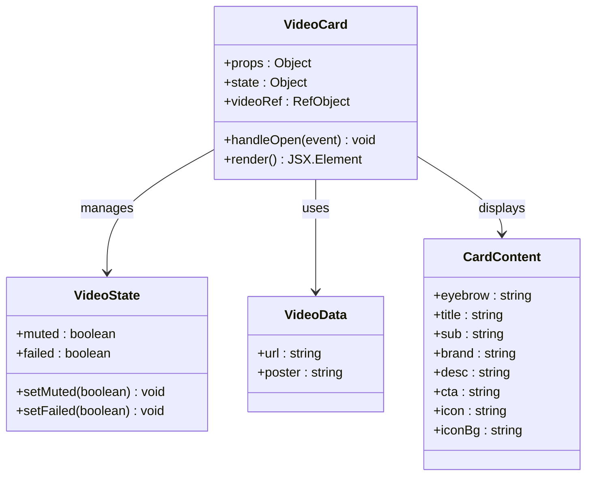
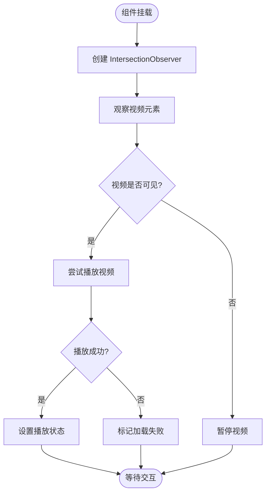
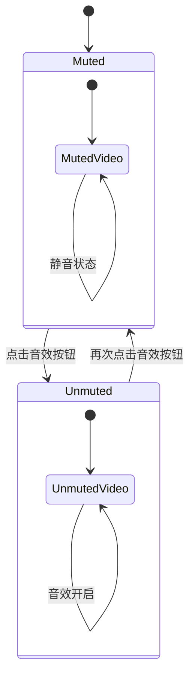
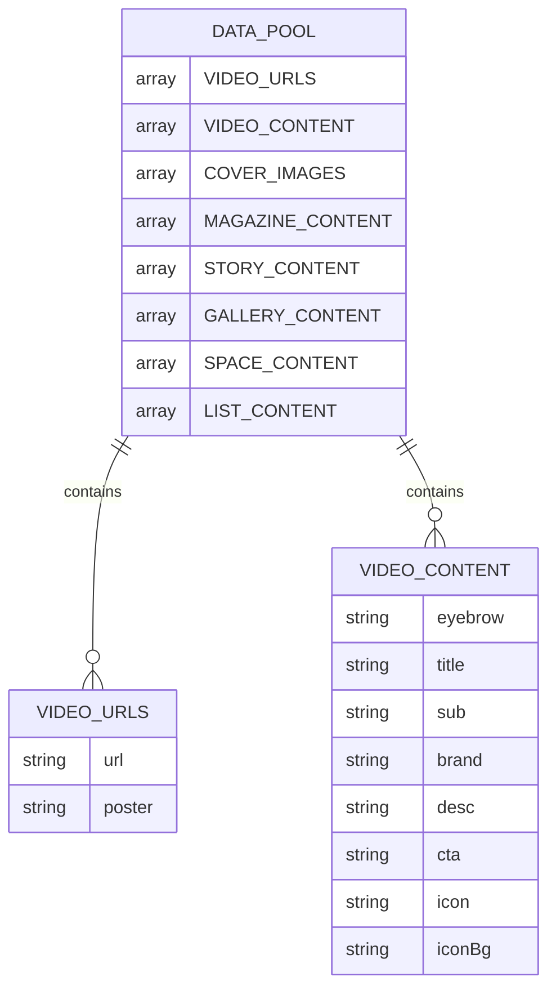
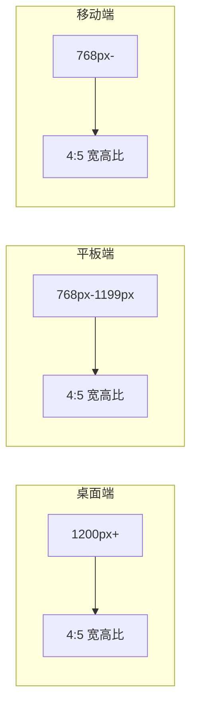
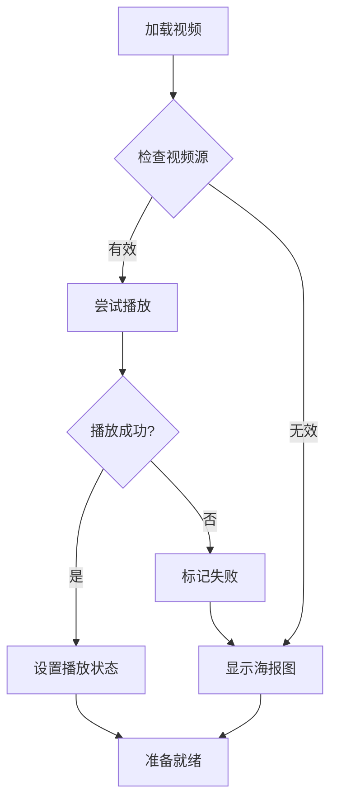
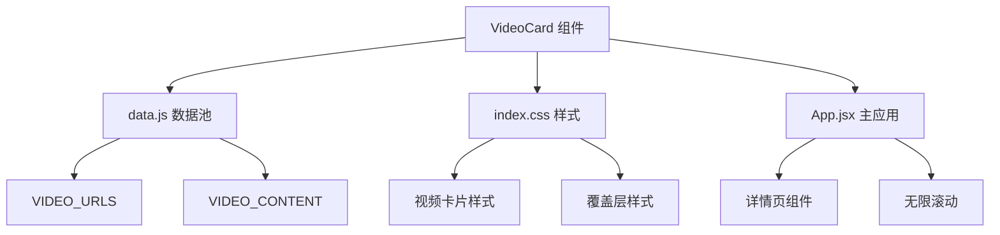

# 视频卡片

<cite>
**本文档引用的文件**
- [src/App.jsx](file://src/App.jsx)
- [src/data.js](file://src/data.js)
- [src/index.css](file://src/index.css)
- [src/main.jsx](file://src/main.jsx)
- [package.json](file://package.json)
</cite>

## 目录
1. [简介](#简介)
2. [项目结构](#项目结构)
3. [核心组件](#核心组件)
4. [架构概览](#架构概览)
5. [详细组件分析](#详细组件分析)
6. [依赖分析](#依赖分析)
7. [性能考虑](#性能考虑)
8. [故障排除指南](#故障排除指南)
9. [结论](#结论)

## 简介

视频卡片组件是 NewSquare 项目中的核心交互元素，负责展示带有背景视频的动态内容卡片。该组件实现了现代化的视频播放控制机制、智能懒加载策略、音效切换功能以及完整的响应式设计。通过 IntersectionObserver API 实现了基于可视区域的视频自动播放控制，确保了良好的用户体验和性能表现。

## 项目结构

该项目采用 React + Vite 的现代前端架构，主要文件组织如下：



**图表来源**
- [src/main.jsx:1-12](file://src/main.jsx#L1-L12)
- [src/App.jsx:1-100](file://src/App.jsx#L1-L100)
- [package.json:1-25](file://package.json#L1-L25)

**章节来源**
- [src/main.jsx:1-12](file://src/main.jsx#L1-L12)
- [src/App.jsx:1-100](file://src/App.jsx#L1-L100)
- [package.json:1-25](file://package.json#L1-L25)

## 核心组件

视频卡片组件位于 App.jsx 文件中，是一个独立的功能组件，具有以下核心特性：

### 组件架构
- **组件名称**: VideoCard
- **文件路径**: src/App.jsx (第288-367行)
- **类型**: React 函数组件
- **依赖**: React Hooks (useState, useEffect, useRef)

### 核心功能特性
1. **智能视频播放控制**
   - 基于 IntersectionObserver 的懒加载
   - 自动播放/暂停机制
   - 移动端兼容性优化

2. **音效控制**
   - 静音/取消静音切换
   - 状态持久化

3. **视觉设计**
   - 海报图优先显示
   - 渐变覆盖层
   - 品牌信息展示

**章节来源**
- [src/App.jsx:288-367](file://src/App.jsx#L288-L367)

## 架构概览

视频卡片组件在整个应用架构中扮演着关键角色，与其他组件形成完整的数据流：



**图表来源**
- [src/App.jsx:288-367](file://src/App.jsx#L288-L367)
- [src/App.jsx:989-991](file://src/App.jsx#L989-L991)

## 详细组件分析

### VideoCard 组件详解

#### 组件结构


**图表来源**
- [src/App.jsx:288-367](file://src/App.jsx#L288-L367)
- [src/data.js:3-46](file://src/data.js#L3-L46)

#### 核心实现逻辑

##### 懒加载机制
组件使用 IntersectionObserver API 实现智能懒加载：



**图表来源**
- [src/App.jsx:313-322](file://src/App.jsx#L313-L322)

##### 音效切换机制
音效控制通过状态管理实现：



**图表来源**
- [src/App.jsx:292-351](file://src/App.jsx#L292-L351)

#### API 接口说明

##### Props 参数
| 参数名 | 类型 | 必填 | 描述 | 默认值 |
|--------|------|------|------|--------|
| idx | number | 是 | 卡片索引，用于从数据池中获取内容 | - |
| onOpen | function | 否 | 打开详情页的回调函数 | - |

##### 状态管理
| 状态名 | 类型 | 描述 | 初始值 |
|--------|------|------|--------|
| muted | boolean | 音效静音状态 | true |
| failed | boolean | 视频加载失败状态 | false |

##### 事件回调
| 回调函数 | 参数 | 描述 |
|----------|------|------|
| onOpen | (origin, spec) => void | 打开详情页时的回调，包含动画原点和内容规格 |

##### 方法定义
| 方法名 | 参数 | 返回值 | 描述 |
|--------|------|--------|------|
| handleOpen | event | void | 处理卡片点击事件，计算动画原点并触发详情页打开 |
| render | - | JSX.Element | 渲染视频卡片组件 |

**章节来源**
- [src/App.jsx:288-367](file://src/App.jsx#L288-L367)

#### 视频资源管理

##### 数据结构
视频资源通过数据池管理，支持多类型内容：



**图表来源**
- [src/data.js:3-175](file://src/data.js#L3-L175)

##### 资源加载策略
- **本地资源**: 开发环境直接从 public 目录加载，零延迟
- **CDN 资源**: 生产环境使用 Unsplash CDN 提供高质量图片
- **预加载**: 使用 `preload="auto"` 提升加载速度

**章节来源**
- [src/data.js:1-23](file://src/data.js#L1-L23)

#### 样式定制选项

##### 响应式设计
组件采用完整的响应式设计方案：



##### 视觉层次
- **渐变覆盖层**: 提供更好的文字可读性
- **毛玻璃效果**: 底部品牌条使用半透明设计
- **阴影系统**: 3D深度感设计

**章节来源**
- [src/index.css:635-693](file://src/index.css#L635-L693)

### 交互行为

#### 动画系统
组件实现了完整的动画过渡系统：

```mermaid
stateDiagram-v2
[*] --> Initial
Initial --> Hover : 鼠标悬停
Hover --> Click : 点击
Click --> Animation : 触发动画
Animation --> Expanded : 展开到全屏
Expanded --> Closing : 关闭
Closing --> Initial : 恢复初始状态
state Hover {
[*] --> Normal
Normal --> Scaled : 缩放效果
}
state Click {
[*] --> Origin
Origin --> Transform : 计算变换矩阵
}
state Animation {
[*] --> Start
Start --> End : 动画完成
}
```

**图表来源**
- [src/App.jsx:590-650](file://src/App.jsx#L590-L650)

#### 错误处理机制
组件具备完善的错误处理能力：



**图表来源**
- [src/App.jsx:346-347](file://src/App.jsx#L346-L347)

**章节来源**
- [src/App.jsx:288-367](file://src/App.jsx#L288-L367)

## 依赖分析

### 外部依赖
项目使用现代化的前端技术栈：

```mermaid
graph TB
subgraph "核心框架"
React[React 18.3.1]
ReactDOM[React DOM 18.3.1]
end
subgraph "UI 组件库"
AntdMobile[Ant Design Mobile 5.38.1]
Icons[Ant Design Icons 0.3.0]
Lucide[Lucide React 1.14.0]
end
subgraph "媒体处理"
Swiper[Swiper 11.1.14]
IntersectionObserver[React Intersection Observer 9.13.1]
end
subgraph "构建工具"
Vite[Vite 5.4.10]
ReactPlugin[@vitejs/plugin-react 4.3.3]
end
React --> AntdMobile
React --> Swiper
React --> IntersectionObserver
AntdMobile --> Icons
AntdMobile --> Lucide
```

**图表来源**
- [package.json:11-24](file://package.json#L11-L24)

### 内部依赖关系
视频卡片组件的内部依赖关系：



**图表来源**
- [src/App.jsx:11-15](file://src/App.jsx#L11-L15)
- [src/data.js:1-23](file://src/data.js#L1-L23)

**章节来源**
- [package.json:11-24](file://package.json#L11-L24)
- [src/App.jsx:11-15](file://src/App.jsx#L11-L15)

## 性能考虑

### 懒加载优化
- **IntersectionObserver**: 使用现代 API 替代传统的滚动监听
- **阈值配置**: 0.4 的交叉阈值平衡性能和体验
- **内存管理**: 组件卸载时自动清理观察器

### 视频播放优化
- **自动播放策略**: 仅在可见时播放，节省带宽
- **预加载控制**: `preload="auto"` 提升加载速度
- **移动端适配**: 特殊的移动端播放属性配置

### 内存管理
- **状态清理**: 组件卸载时清理定时器和观察器
- **事件解绑**: 防止内存泄漏
- **资源释放**: 自动暂停视频释放 GPU 资源

## 故障排除指南

### 常见问题及解决方案

#### 视频无法播放
1. **检查网络连接**: 确保视频资源可访问
2. **移动端限制**: 移动端浏览器可能阻止自动播放
3. **格式兼容性**: 确保视频格式受目标浏览器支持

#### 懒加载失效
1. **浏览器支持**: 确保目标浏览器支持 IntersectionObserver
2. **阈值调整**: 根据实际需求调整交叉阈值
3. **性能监控**: 监控观察器性能影响

#### 样式问题
1. **CSS 优先级**: 确保样式正确加载
2. **响应式断点**: 检查媒体查询配置
3. **渐变覆盖**: 确保文字可读性

**章节来源**
- [src/App.jsx:313-322](file://src/App.jsx#L313-L322)

## 结论

视频卡片组件展现了现代前端开发的最佳实践，通过智能的懒加载机制、优雅的动画过渡和完整的响应式设计，为用户提供了流畅的视频内容体验。组件的设计充分考虑了性能优化和移动端适配，是构建高性能内容展示应用的优秀范例。

该组件的成功实现得益于：
- 现代化的 React Hooks 架构
- 基于 IntersectionObserver 的智能懒加载
- 完善的状态管理和错误处理
- 优雅的 CSS 动画和响应式设计
- 良好的性能优化策略

这些特性使得视频卡片组件不仅功能完善，而且具有良好的可维护性和扩展性，为后续的功能增强奠定了坚实的基础。