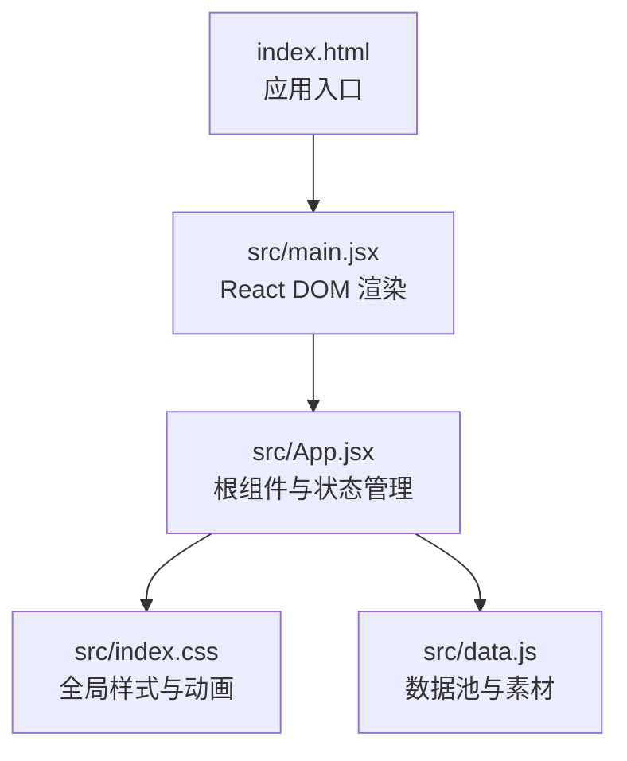
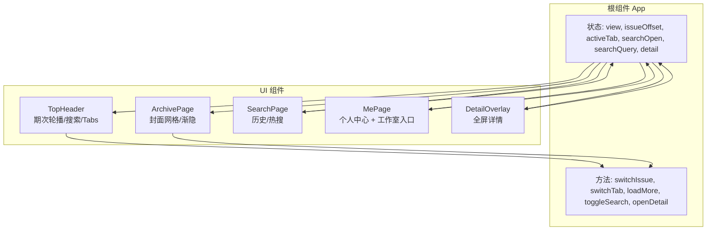
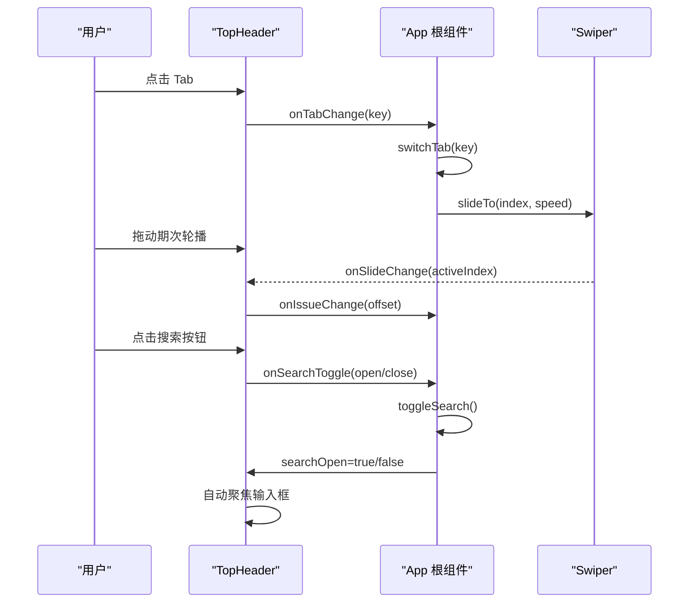
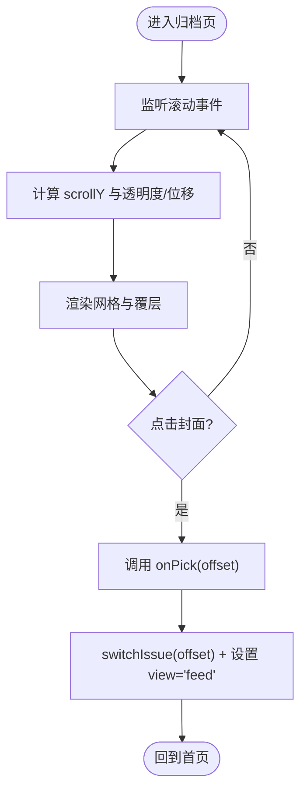
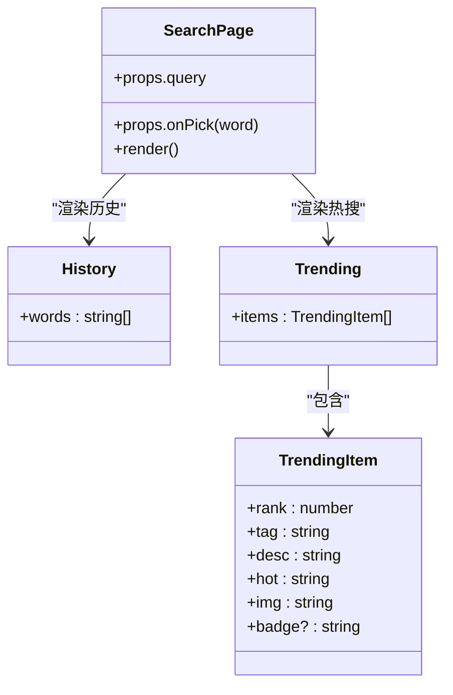
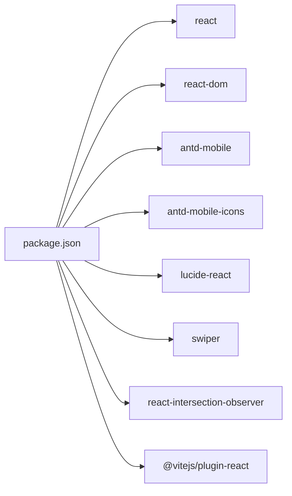

# 导航和头部系统

<cite>
**本文引用的文件**
- [src\App.jsx](file://src\App.jsx)
- [src\main.jsx](file://src\main.jsx)
- [src\data.js](file://src\data.js)
- [src\index.css](file://src\index.css)
- [index.html](file://index.html)
- [package.json](file://package.json)
</cite>

## 更新摘要
**变更内容**
- MyPage 组件重新设计：移除了独立的"我的收藏"和"我的期刊"菜单项
- 收藏功能整合到主界面，通过工作室按钮访问
- MyMagazinesPage 组件仍然存在，但不再作为独立菜单项
- 个人中心布局进行了相应调整，优化了工作室入口的可见性和可用性

## 目录
1. [简介](#简介)
2. [项目结构](#项目结构)
3. [核心组件](#核心组件)
4. [架构总览](#架构总览)
5. [详细组件分析](#详细组件分析)
6. [依赖分析](#依赖分析)
7. [性能考虑](#性能考虑)
8. [故障排查指南](#故障排查指南)
9. [结论](#结论)
10. [附录](#附录)

## 简介
本文件面向 NewSquare 的导航与头部系统，重点解析顶部头部组件的设计与实现，涵盖期次切换机制、搜索功能集成、归档页面导航、导航状态管理、路由处理与用户交互逻辑。文档同时解释如何实现流畅的页面切换动画与响应式导航布局，并提供搜索系统的实现细节（搜索历史管理与热搜标签），以及最佳实践建议。

**更新** 本版本反映了 MyPage 组件的重大重新设计，收藏功能已从独立菜单项整合到主界面的工作室入口中。

## 项目结构
- 应用入口通过 React DOM 渲染根组件，根组件负责组织头部、内容页、搜索页与详情页等模块。
- 样式通过全局 CSS 控制头部、卡片、搜索页、个人中心与详情页的视觉与交互表现。
- 数据通过数据池模块提供视频、封面、内容卡片等素材，支持期次与卡片类型随机化。

图表来源
- [index.html:1-16](file://index.html#L1-L16)
- [src\main.jsx:1-12](file://src\main.jsx#L1-L12)
- [src\App.jsx:929-1059](file://src\App.jsx#L929-L1059)
- [src\index.css:1-1601](file://src\index.css#L1-L1601)
- [src\data.js:1-175](file://src\data.js#L1-L175)

章节来源
- [index.html:1-16](file://index.html#L1-L16)
- [src\main.jsx:1-12](file://src\main.jsx#L1-L12)
- [src\App.jsx:929-1059](file://src\App.jsx#L929-L1059)

## 核心组件
- 顶部头部组件 TopHeader：负责期次标题轮播、Tab 切换、搜索展开/收起与 Alt 标题展示。
- 归档页面 ArchivePage：沉浸式封面网格，支持滚动渐隐与封面选择。
- 搜索页 SearchPage：提供搜索历史与热搜标签，支持关键词选择。
- 个人中心 MePage：展示用户信息、统计、最近浏览与工作室入口。
- 详情页 DetailOverlay：卡片点击放大至全屏的过渡动画与交互。
- 根组件 App：集中管理视图状态、期次偏移、Tab 切换、搜索状态与瀑布流加载。

**更新** 个人中心 MePage 现已整合收藏功能，通过工作室按钮提供收藏入口。

章节来源
- [src\App.jsx:67-205](file://src\App.jsx#L67-L205)
- [src\App.jsx:208-285](file://src\App.jsx#L208-L285)
- [src\App.jsx:742-811](file://src\App.jsx#L742-L811)
- [src\App.jsx:813-909](file://src\App.jsx#L813-L909)
- [src\App.jsx:590-736](file://src\App.jsx#L590-L736)
- [src\App.jsx:929-1059](file://src\App.jsx#L929-L1059)

## 架构总览
NewSquare 采用"根组件集中状态 + 子组件职责清晰"的架构：
- 根组件维护视图模式（feed/archive）、期次偏移、活动 Tab、搜索状态、详情弹层与瀑布流数据。
- 顶部头部组件接收来自根组件的状态与回调，驱动期次轮播与 Tab 切换。
- 归档页面、搜索页、个人中心与详情页均通过条件渲染与动画过渡实现无缝切换。

图表来源
- [src\App.jsx:929-1059](file://src\App.jsx#L929-L1059)
- [src\App.jsx:67-205](file://src\App.jsx#L67-L205)
- [src\App.jsx:208-285](file://src\App.jsx#L208-L285)
- [src\App.jsx:742-811](file://src\App.jsx#L742-L811)
- [src\App.jsx:813-909](file://src\App.jsx#L813-L909)
- [src\App.jsx:590-736](file://src\App.jsx#L590-L736)

## 详细组件分析

### 顶部头部组件 TopHeader
- 功能要点
  - 期次轮播：基于 Swiper 实现标题滑动，支持长标题快速切换与贴边对齐。
  - Tab 切换：支持"当期""推荐""我"三类 Tab，切换时同步轮播索引。
  - 搜索集成：点击放大镜展开搜索输入，支持清空与关闭；输入变化通过回调传递给根组件。
  - Alt 标题：在特定 Tab 下显示替代标题（如"当下编辑推荐"）。
  - 交互优化：根据滚动隐藏头部、搜索态与"我"态下隐藏不同区域，提升信息密度。

- 关键实现路径
  - 期次元数据与计算：见 getIssueMeta、ISSUES、RECOMMEND_ISSUES、offsetToIndex、recommendOffsetToIndex。
  - 轮播配置：见 Swiper 参数（速度、阻力、阈值、长滑阈值与时间）。
  - 状态同步：外部 issueOffset 与 activeTab 变化时，通过 useEffect 同步 Swiper 索引。
  - 搜索展开：useEffect 自动聚焦输入框；搜索开关按钮根据状态切换图标与行为。

图表来源
- [src\App.jsx:67-205](file://src\App.jsx#L67-L205)
- [src\App.jsx:975-988](file://src\App.jsx#L975-L988)
- [src\App.jsx:996-1004](file://src\App.jsx#L996-L1004)

章节来源
- [src\App.jsx:35-57](file://src\App.jsx#L35-L57)
- [src\App.jsx:47-57](file://src\App.jsx#L47-L57)
- [src\App.jsx:67-205](file://src\App.jsx#L67-L205)

### 归档页面 ArchivePage
- 功能要点
  - 浸入式封面网格：两列网格、无间隙、无圆角，覆盖全屏。
  - 顶部渐隐覆层：滚动时控制覆层透明度与位移，营造沉浸感。
  - 选择期次：点击封面触发 onPick 回调，回到首页并切换期次。

- 关键实现路径
  - 滚动监听：requestAnimationFrame 控制 scrollY，避免频繁重排。
  - 渐隐逻辑：introOpacity 与 introTranslate 随滚动距离动态计算。
  - 期次选择：onPick 调用 switchIssue 并设置 view='feed'。

图表来源
- [src\App.jsx:208-285](file://src\App.jsx#L208-L285)
- [src\App.jsx:1006-1014](file://src\App.jsx#L1006-L1014)
- [src\App.jsx:964-971](file://src\App.jsx#L964-L971)

章节来源
- [src\App.jsx:208-285](file://src\App.jsx#L208-L285)

### 搜索页 SearchPage
- 功能要点
  - 搜索历史：展示一组历史关键词，点击后写入查询框。
  - 热搜标签：展示热门主题与热度，支持 badge 标识（HOT/NEW）。
  - 查询提示：当存在查询词时显示"输入中"提示。

- 关键实现路径
  - 历史数据：SEARCH_HISTORY。
  - 热搜数据：SEARCH_TRENDING（含排名、标签、描述、热度与封面）。
  - 交互：onPick(word) 将词写入查询框，触发根组件状态更新。

图表来源
- [src\App.jsx:742-811](file://src\App.jsx#L742-L811)
- [src\App.jsx:754-811](file://src\App.jsx#L754-L811)

章节来源
- [src\App.jsx:742-811](file://src\App.jsx#L742-L811)

### 个人中心 MePage
- 功能要点
  - 用户信息卡片：头像、昵称、等级与统计数据。
  - 最近浏览：横向滚动展示近期浏览的封面。
  - 工作室入口：整合收藏功能，通过工作室按钮访问收藏内容。
  - 菜单项：包含"本地缓存"等入口，简化了原有的收藏和期刊菜单项。

**更新** 个人中心已重新设计，收藏功能通过工作室入口提供，移除了独立的"我的收藏"和"我的期刊"菜单项。

- 关键实现路径
  - 数据池：ME_AVATAR_URL、ME_STATS、ME_RECENT、ME_STUDIO、ME_MENU。
  - 工作室入口：ME_STUDIO 包含空间、Moodboard、AI 模型三个入口。
  - 交互：工作室按钮点击、登出按钮等。

章节来源
- [src\App.jsx:813-909](file://src\App.jsx#L813-L909)
- [src\App.jsx:2964-3065](file://src\App.jsx#L2964-L3065)
- [src\App.jsx:2477-2482](file://src\App.jsx#L2477-L2482)

### 详情页 DetailOverlay
- 功能要点
  - 开启动画：从点击卡片的几何位置放大到全屏，使用双 rAF 确保首帧布局生效。
  - 关闭动画：向上滚动到顶部后执行收拢动画，支持 ESC 键关闭。
  - 内容：根据 variant 渲染不同布局（single/story），包含封面、标题、副标题与正文。

- 关键实现路径
  - 开启动画：计算 origin 与视口比例，设置 transform 与过渡。
  - 关闭流程：监听 transitionend，兼容超时兜底。
  - 键盘事件：监听 Escape 关闭。

章节来源
- [src\App.jsx:590-736](file://src\App.jsx#L590-L736)

### MyMagazinesPage 组件
- 功能要点
  - 期刊收藏展示：展示用户收藏的期刊封面。
  - 滚动渐隐：支持滚动时的渐隐效果。
  - 收藏标记：显示"已收藏"标识。

**更新** MyMagazinesPage 组件仍然存在，但不再作为独立菜单项，而是通过工作室入口的收藏功能访问。

- 关键实现路径
  - 收藏数据：MY_MAGAZINES 数组定义收藏的期次。
  - 滚动监听：与归档页面类似的滚动处理逻辑。
  - 交互：onPick 回调用于选择期刊。

章节来源
- [src\App.jsx:318-395](file://src\App.jsx#L318-L395)
- [src\App.jsx:2488-2489](file://src\App.jsx#L2488-L2489)

## 依赖分析
- 运行时依赖
  - React 与 ReactDOM：应用框架与 DOM 渲染。
  - antd-mobile 与 antd-mobile-icons：移动端 UI 组件与图标。
  - lucide-react：自定义图标库。
  - swiper：期次轮播与卡片横向滚动。
  - react-intersection-observer：视频卡片的可见性观察（用于预加载）。

- 构建工具
  - Vite：开发与构建工具链。

图表来源
- [package.json:11-24](file://package.json#L11-L24)

章节来源
- [package.json:11-24](file://package.json#L11-L24)

## 性能考虑
- 滚动节流：头部隐藏逻辑使用 requestAnimationFrame 控制滚动事件，避免高频重排。
- 期次轮播：Swiper 配置了阻力、阈值与长滑参数，确保在长标题场景下仍具跟手感。
- 搜索展开：搜索态下隐藏非必要元素，减少布局抖动。
- 详情页动画：使用 transform 与 will-change 提升动画性能，双 rAF 确保首帧稳定。
- 无限滚动：分批加载卡片，超过阈值停止加载，降低内存占用。

章节来源
- [src\App.jsx:946-961](file://src\App.jsx#L946-L961)
- [src\App.jsx:166-176](file://src\App.jsx#L166-L176)
- [src\App.jsx:990-994](file://src\App.jsx#L990-L994)
- [src\App.jsx:596-622](file://src\App.jsx#L596-L622)

## 故障排查指南
- 期次轮播不同步
  - 检查外部 issueOffset 与 activeTab 是否正确传递至 TopHeader。
  - 确认 useEffect 中 toIndex 计算与 swiperRef.current 存在。
  - 参考路径：[src\App.jsx:77-82](file://src\App.jsx#L77-L82)

- 搜索展开后无法输入
  - 确认 searchOpen 为 true 时输入框获得焦点（useEffect 自动聚焦）。
  - 检查搜索态样式是否正确应用（.header-search.open）。
  - 参考路径：[src\App.jsx:85-90](file://src\App.jsx#L85-L90)，[src\index.css:172-176](file://src\index.css#L172-L176)

- 归档页滚动异常
  - 确认 scrollRef.current 存在且事件监听器正确移除。
  - 检查 introOpacity/introTranslate 计算逻辑。
  - 参考路径：[src\App.jsx:213-227](file://src\App.jsx#L213-L227)，[src\App.jsx:230-231](file://src\App.jsx#L230-L231)

- 详情页动画不生效
  - 确认 origin 几何信息正确，transformOrigin 与过渡设置。
  - 检查 transitionend 事件监听与兜底超时。
  - 参考路径：[src\App.jsx:609-650](file://src\App.jsx#L609-L650)

- MyPage 收藏功能异常
  - 检查 ME_STUDIO 配置是否正确。
  - 确认 onOpenFav 回调是否正确传递。
  - 参考路径：[src\App.jsx:2983-2993](file://src\App.jsx#L2983-L2993)

## 结论
NewSquare 的导航与头部系统通过清晰的组件边界与状态管理，实现了流畅的期次切换、搜索集成与归档导航。配合 Swiper 的轮播优化、CSS 动画与滚动节流策略，整体交互体验在移动端具备良好的性能与可维护性。

**更新** MyPage 组件的重新设计体现了产品策略的演进：通过整合收藏功能到工作室入口，简化了导航层级，提升了用户体验的连贯性。这一变化要求开发者在后续维护中重点关注工作室入口的可用性和收藏功能的可达性。

建议后续可进一步抽象期次计算逻辑、完善搜索历史持久化与热搜数据的动态更新机制，以及优化工作室入口的视觉层次和交互反馈。

## 附录
- 术语说明
  - 期次：以"今日"为基准的偏移量，负数表示过去的期次。
  - 推荐期次：从 30 期内精选的若干期，便于快速定位。
  - Alt 标题：在特定 Tab 下替代期次标题的文案。
  - 工作室：整合了空间设计、Moodboard 和 AI 模型创作功能的入口。
- 最佳实践
  - 期次轮播：保持长滑阈值与时间参数的一致性，确保不同设备上的手感一致。
  - 搜索态：在展开时禁用非必要交互，收起时恢复焦点与状态。
  - 动画：优先使用 transform 与 will-change，避免触发布局与重绘。
  - 无限滚动：合理设置批次大小与阈值，避免一次性加载过多内容。
  - 导航设计：遵循"少即是多"原则，通过功能整合提升导航效率。