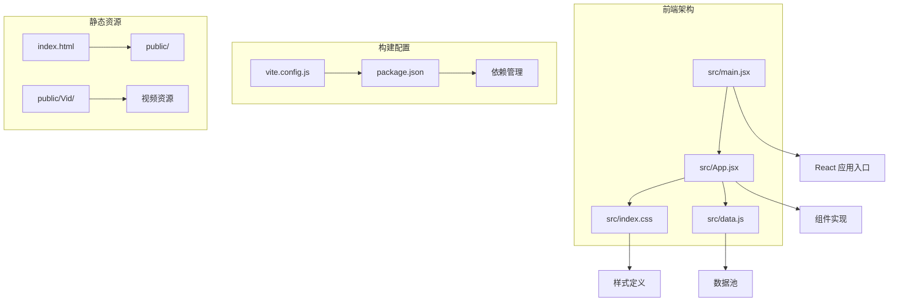
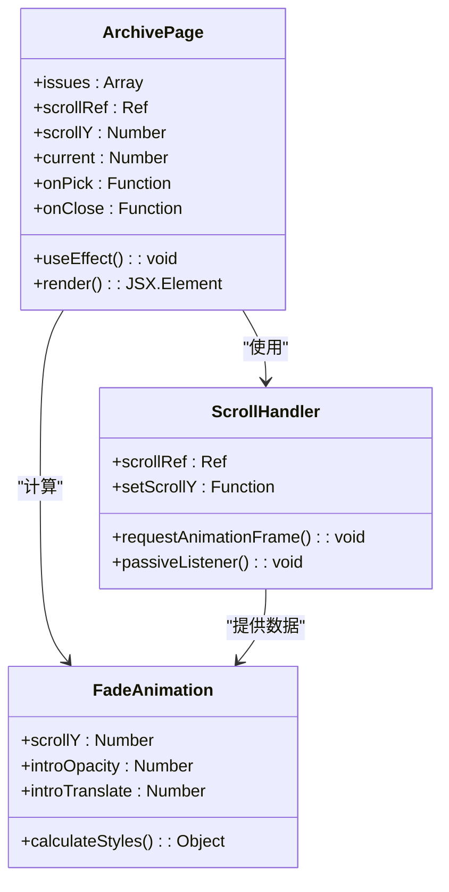
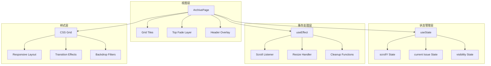
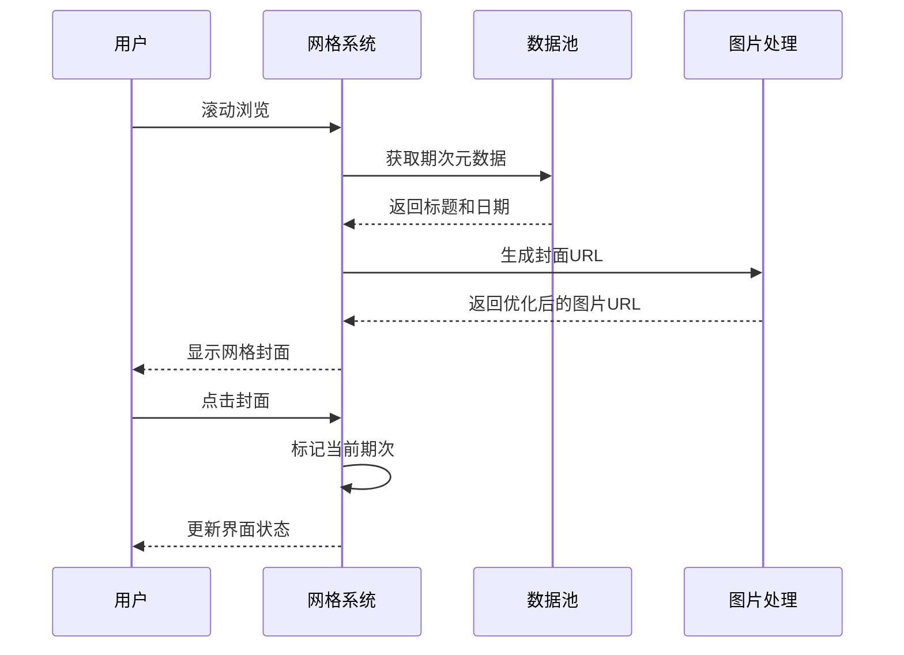
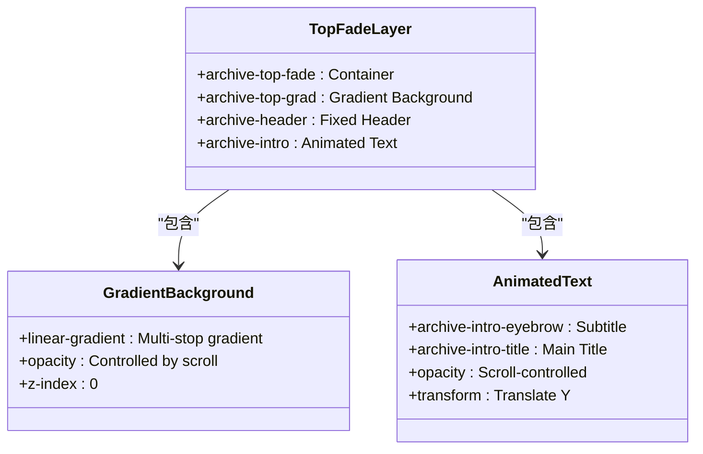
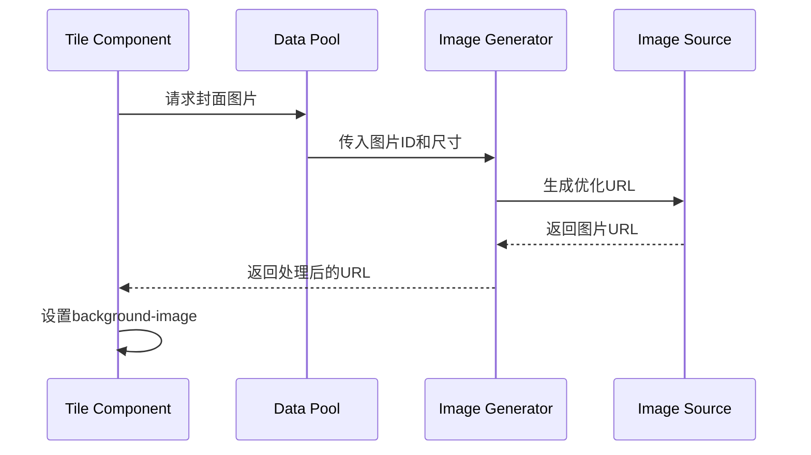
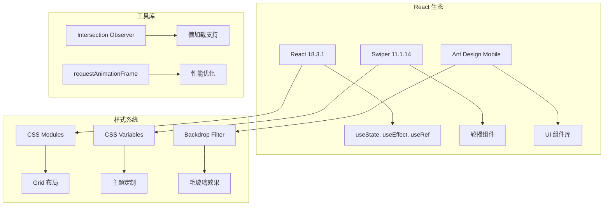
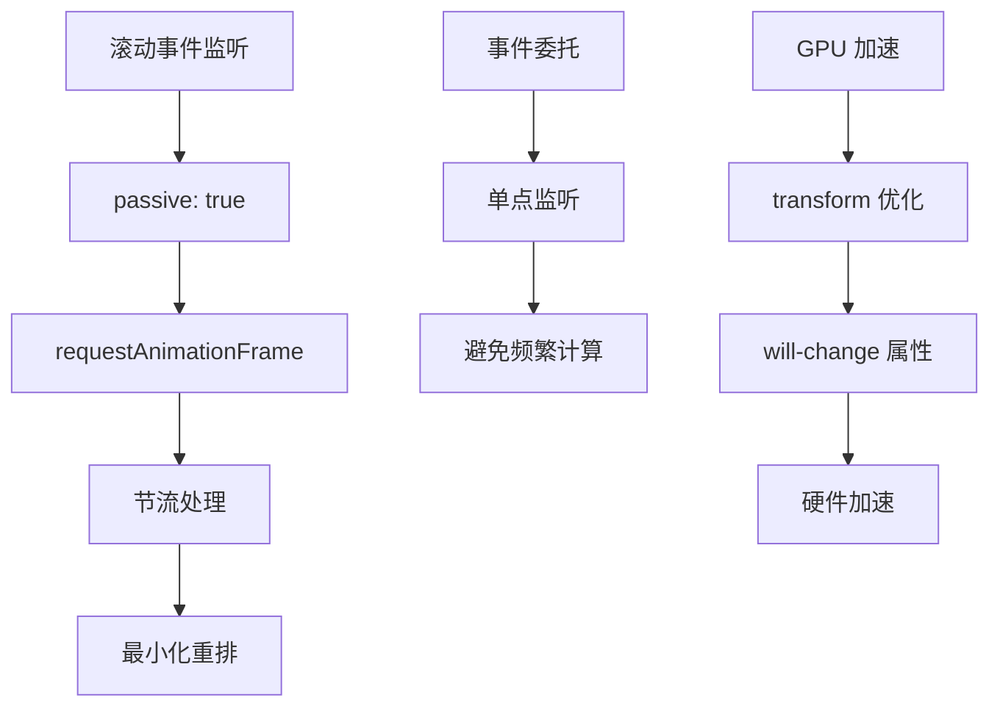
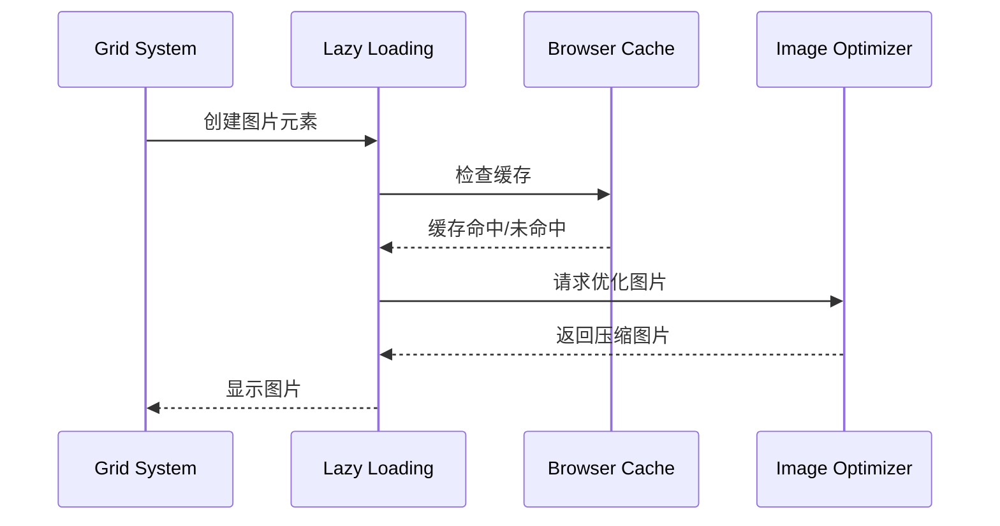

# 归档页面

<cite>
**本文档引用的文件**
- [src/App.jsx](file://src/App.jsx)
- [src/main.jsx](file://src/main.jsx)
- [src/data.js](file://src/data.js)
- [src/index.css](file://src/index.css)
- [index.html](file://index.html)
- [package.json](file://package.json)
</cite>

## 目录
1. [简介](#简介)
2. [项目结构](#项目结构)
3. [核心组件](#核心组件)
4. [架构概览](#架构概览)
5. [详细组件分析](#详细组件分析)
6. [依赖关系分析](#依赖关系分析)
7. [性能考虑](#性能考虑)
8. [故障排除指南](#故障排除指南)
9. [结论](#结论)

## 简介

NewSquare 是一个专注于家装灵感的移动应用，其归档页面提供了沉浸式的期刊封面浏览体验。该页面实现了创新的滚动渐变效果、网格封面展示和流畅的交互动画，为用户提供了类似"翻阅相册"的视觉体验。

归档页面的核心特色包括：
- **沉浸式布局**：全屏覆盖的黑色背景，配合网格化的期刊封面展示
- **滚动渐变效果**：基于滚动位置的透明度和位置变换动画
- **网格封面系统**：响应式网格布局，支持无限滚动
- **当前期次标识**：清晰标注当前期次的视觉标记
- **高性能实现**：使用 requestAnimationFrame 和被动事件监听器优化性能

## 项目结构

NewSquare 采用现代化的 React + Vite 开发栈，项目结构简洁而功能完整：



**图表来源**
- [src/main.jsx:1-12](file://src/main.jsx#L1-L12)
- [src/App.jsx:976-1112](file://src/App.jsx#L976-L1112)

**章节来源**
- [src/main.jsx:1-12](file://src/main.jsx#L1-L12)
- [package.json:1-25](file://package.json#L1-L25)
- [index.html:1-16](file://index.html#L1-L16)

## 核心组件

归档页面由多个精心设计的组件构成，每个组件都有明确的职责和优化策略：

### 1. ArchivePage 组件

这是归档页面的核心组件，实现了沉浸式布局和滚动渐变效果：



**图表来源**
- [src/App.jsx:208-285](file://src/App.jsx#L208-L285)

### 2. 期次管理系统

归档页面实现了复杂的期次轴系统，支持从当前期到过去30期的浏览：

```mermaid
flowchart TD
A[期次轴系统] --> B[ISSUE_COUNT: 30]
B --> C[ISSUES: [-29, ..., -1, 0]]
C --> D[offsetToIndex: off → ISSUE_COUNT-1+off]
A --> E[RECOMMEND_ISSUES: [-27, -20, -14, -9, -5, -2, 0]]
E --> F[recommendOffsetToIndex: off → 精选索引]
D --> G[Swiper 集成]
F --> G
G --> H[滑动切换期次]
```

**图表来源**
- [src/App.jsx:47-57](file://src/App.jsx#L47-L57)

**章节来源**
- [src/App.jsx:208-285](file://src/App.jsx#L208-L285)
- [src/App.jsx:47-57](file://src/App.jsx#L47-L57)

## 架构概览

归档页面采用了分层架构设计，确保了良好的可维护性和扩展性：



**图表来源**
- [src/App.jsx:208-285](file://src/App.jsx#L208-L285)
- [src/index.css:395-575](file://src/index.css#L395-L575)

## 详细组件分析

### 沉浸式布局实现

归档页面的沉浸式布局通过以下技术实现：

#### 1. 网格封面展示系统



**图表来源**
- [src/App.jsx:238-257](file://src/App.jsx#L238-L257)
- [src/data.js:22-31](file://src/data.js#L22-L31)

#### 2. 滚动渐变效果机制

归档页面实现了基于滚动位置的复杂渐变效果：

```mermaid
flowchart TD
A[滚动事件] --> B[requestAnimationFrame]
B --> C[计算 scrollY]
C --> D[计算 introOpacity]
D --> E[计算 introTranslate]
D --> F[0-160px 范围]
F --> G[introOpacity = 1 - scrollY/160]
F --> H[introTranslate = -min(scrollY * 0.4, 60)]
E --> I[应用到 DOM]
I --> J[透明度渐变]
I --> K[位置变换]
```

**图表来源**
- [src/App.jsx:213-232](file://src/App.jsx#L213-L232)

#### 3. 顶部渐变覆层系统



**图表来源**
- [src/App.jsx:261-282](file://src/App.jsx#L261-L282)
- [src/index.css:489-575](file://src/index.css#L489-L575)

**章节来源**
- [src/App.jsx:208-285](file://src/App.jsx#L208-L285)
- [src/index.css:395-575](file://src/index.css#L395-L575)

### 期刊封面生成逻辑

归档页面的期刊封面生成遵循以下流程：

#### 1. 期次元数据生成

```mermaid
flowchart LR
A[getIssueMeta] --> B[计算日期偏移]
B --> C[生成日期字符串]
C --> D[循环选择标题]
D --> E[返回 {title, dateStr}]
F[WEEK_DAYS 数组] --> B
G[ISSUE_NAMES 数组] --> D
```

**图表来源**
- [src/App.jsx:35-41](file://src/App.jsx#L35-L41)

#### 2. 封面图片处理

归档页面使用统一的图片处理函数：



**图表来源**
- [src/App.jsx:240](file://src/App.jsx#L240)
- [src/data.js:22-23](file://src/data.js#L22-L23)

**章节来源**
- [src/App.jsx:35-41](file://src/App.jsx#L35-L41)
- [src/data.js:22-31](file://src/data.js#L22-L31)

### 导航关系与状态同步

归档页面与主内容页面之间建立了完善的导航关系：

```mermaid
stateDiagram-v2
[*] --> FeedView
FeedView --> ArchiveView : 点击标题
ArchiveView --> FeedView : 点击返回
state FeedView {
[*] --> TopHeader
TopHeader --> SearchPage : 打开搜索
TopHeader --> MePage : 切换到"我"
TopHeader --> ArchiveView : 切换到归档
}
state ArchiveView {
[*] --> GridScroll
GridScroll --> PickIssue : 选择期次
PickIssue --> FeedView : 切换到主内容
}
```

**图表来源**
- [src/App.jsx:1053-1061](file://src/App.jsx#L1053-L1061)
- [src/App.jsx:1063-1110](file://src/App.jsx#L1063-L1110)

**章节来源**
- [src/App.jsx:1053-1110](file://src/App.jsx#L1053-L1110)

## 依赖关系分析

归档页面的依赖关系体现了清晰的模块化设计：



**图表来源**
- [package.json:11-18](file://package.json#L11-L18)

**章节来源**
- [package.json:1-25](file://package.json#L1-25)

## 性能考虑

归档页面在性能优化方面采用了多项先进技术：

### 1. 滚动性能优化



**图表来源**
- [src/App.jsx:213-227](file://src/App.jsx#L213-L227)
- [src/index.css:507](file://src/index.css#L507)

### 2. 内存管理策略

归档页面采用了有效的内存管理策略：

- **事件清理**：组件卸载时自动清理滚动监听器
- **引用管理**：使用 useRef 避免不必要的重新渲染
- **状态优化**：使用 useState 精确控制重渲染范围

### 3. 图片加载优化



**章节来源**
- [src/App.jsx:213-227](file://src/App.jsx#L213-L227)
- [src/data.js:22-23](file://src/data.js#L22-L23)

## 故障排除指南

### 常见问题及解决方案

#### 1. 滚动卡顿问题

**症状**：滚动时出现掉帧现象

**解决方案**：
- 确保使用了被动事件监听器
- 避免在滚动回调中进行复杂计算
- 使用 will-change 属性启用 GPU 加速

#### 2. 图片加载失败

**症状**：期刊封面显示为空白

**解决方案**：
- 检查网络连接和图片 URL
- 实现图片加载失败的降级处理
- 使用占位符图片提升用户体验

#### 3. 性能问题

**症状**：页面响应缓慢

**解决方案**：
- 检查是否有过多的 DOM 操作
- 确保正确清理事件监听器
- 优化 CSS 动画属性

**章节来源**
- [src/App.jsx:213-227](file://src/App.jsx#L213-L227)

## 结论

NewSquare 的归档页面展现了现代 Web 应用的优秀实践，通过精心设计的沉浸式布局、高效的滚动渐变效果和优雅的交互动画，为用户提供了出色的浏览体验。

### 技术亮点

1. **创新的沉浸式设计**：全屏覆盖的黑色背景配合网格化布局，营造出专业的期刊浏览体验
2. **高性能滚动系统**：基于 requestAnimationFrame 的滚动监听，确保流畅的用户体验
3. **智能渐变效果**：根据滚动位置动态调整透明度和位置，增强视觉层次感
4. **完善的导航体系**：与主内容页面无缝衔接，支持双向导航和状态同步

### 最佳实践总结

归档页面的设计体现了以下最佳实践：
- 使用现代前端技术栈（React + Vite）
- 注重性能优化和用户体验
- 实现响应式设计和移动端适配
- 采用模块化和组件化架构
- 提供完善的错误处理和降级方案

这个归档页面不仅是一个功能性的组件，更是现代 Web 开发设计理念的完美体现，为类似的应用提供了优秀的参考模板。