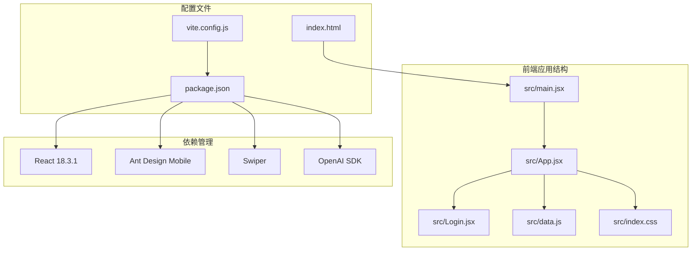
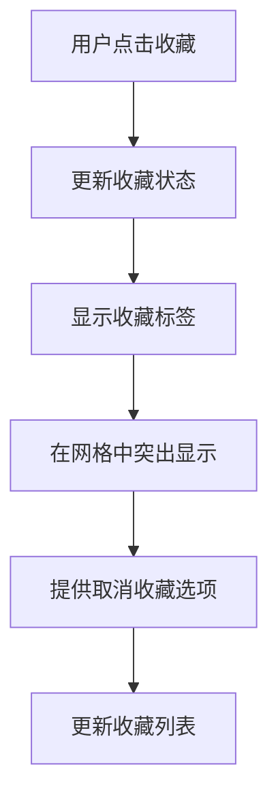
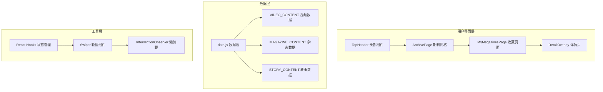
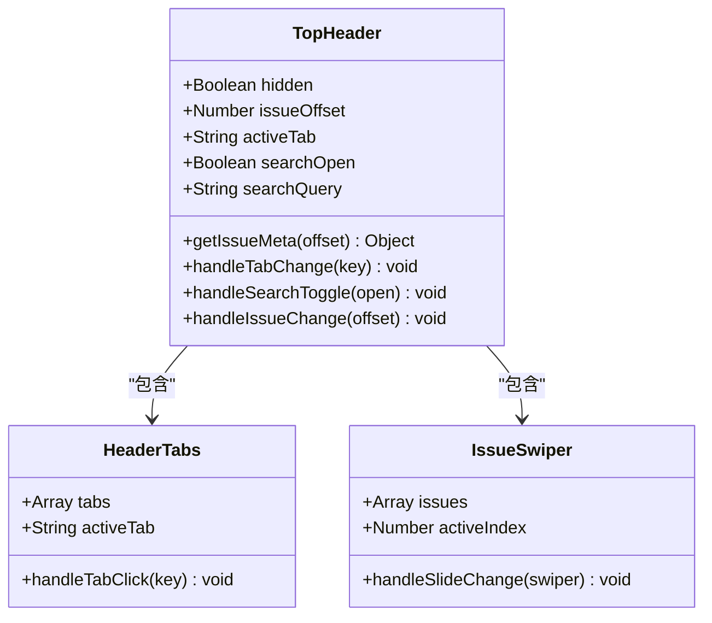
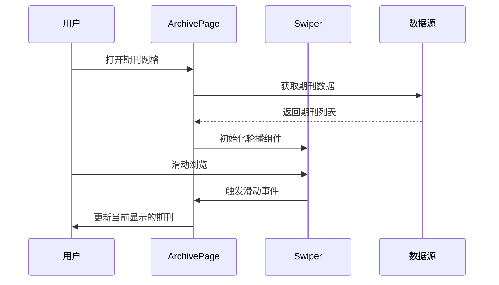
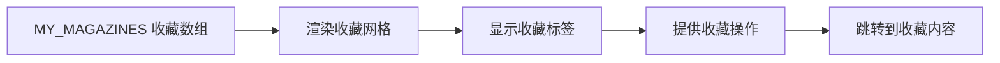
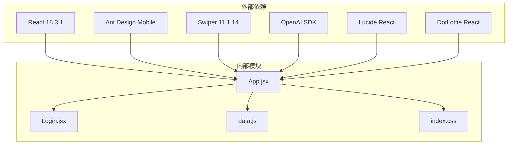

# 我的收藏集合

<cite>
**本文档引用的文件**
- [src/App.jsx](file://src/App.jsx)
- [src/Login.jsx](file://src/Login.jsx)
- [src/data.js](file://src/data.js)
- [src/index.css](file://src/index.css)
- [src/main.jsx](file://src/main.jsx)
- [package.json](file://package.json)
- [vite.config.js](file://vite.config.js)
- [index.html](file://index.html)
</cite>

## 目录
1. [项目概述](#项目概述)
2. [项目结构](#项目结构)
3. [核心组件](#核心组件)
4. [架构概览](#架构概览)
5. [详细组件分析](#详细组件分析)
6. [依赖关系分析](#依赖关系分析)
7. [性能考虑](#性能考虑)
8. [故障排除指南](#故障排除指南)
9. [结论](#结论)

## 项目概述

这是一个基于 React 和 Vite 构建的家装灵感内容应用，专注于"我的收藏集合"功能。该应用提供了丰富的视觉内容展示，包括视频、杂志封面、单品故事、空间设计等内容类型，并允许用户收藏喜欢的期刊内容。

应用的核心特色包括：
- 流畅的动画过渡效果和沉浸式视觉体验
- 多种内容卡片组件，支持不同的展示模式
- 搜索功能和个性化内容推荐
- 响应式设计，适配移动端设备

## 项目结构

**图表来源**
- [src/main.jsx:1-12](file://src/main.jsx#L1-L12)
- [src/App.jsx:1-50](file://src/App.jsx#L1-L50)
- [package.json:1-27](file://package.json#L1-L27)

**章节来源**
- [src/main.jsx:1-12](file://src/main.jsx#L1-L12)
- [src/App.jsx:1-50](file://src/App.jsx#L1-L50)
- [package.json:1-27](file://package.json#L1-L27)

## 核心组件

### 应用主组件 (App.jsx)

应用的主要逻辑集中在 App.jsx 文件中，包含了以下核心功能：

1. **头部导航系统** - 支持当期、推荐和我的三个标签页
2. **期刊封面网格** - 提供历史期刊回顾和收藏功能
3. **内容卡片系统** - 支持多种内容类型的展示
4. **详情页模态框** - 提供沉浸式的全屏内容展示

### 收藏功能实现

应用通过 `MyMagazinesPage` 组件实现了"我的收藏集合"功能：

**图表来源**
- [src/App.jsx:290-367](file://src/App.jsx#L290-L367)

**章节来源**
- [src/App.jsx:290-367](file://src/App.jsx#L290-L367)

## 架构概览

**图表来源**
- [src/App.jsx:63-208](file://src/App.jsx#L63-L208)
- [src/App.jsx:211-288](file://src/App.jsx#L211-L288)
- [src/App.jsx:290-367](file://src/App.jsx#L290-L367)

**章节来源**
- [src/App.jsx:63-208](file://src/App.jsx#L63-L208)
- [src/App.jsx:211-288](file://src/App.jsx#L211-L288)
- [src/App.jsx:290-367](file://src/App.jsx#L290-L367)

## 详细组件分析

### 头部导航组件 (TopHeader)

头部导航组件提供了三个主要标签页：

**图表来源**
- [src/App.jsx:70-208](file://src/App.jsx#L70-L208)

### 期刊网格组件 (ArchivePage)

期刊网格组件实现了沉浸式的期刊浏览体验：

**图表来源**
- [src/App.jsx:211-288](file://src/App.jsx#L211-L288)

### 收藏页面组件 (MyMagazinesPage)

收藏页面组件专门用于展示用户的收藏内容：

**图表来源**
- [src/App.jsx:290-367](file://src/App.jsx#L290-L367)

**章节来源**
- [src/App.jsx:211-288](file://src/App.jsx#L211-L288)
- [src/App.jsx:290-367](file://src/App.jsx#L290-L367)

### 内容卡片系统

应用提供了多种内容卡片组件，每种都有特定的功能和样式：

#### 视频卡片 (VideoCard)
- 支持自动播放和静音控制
- 使用 IntersectionObserver 实现懒加载
- 提供沉浸式全屏展示

#### 杂志卡片 (MagazineCard)
- 展示杂志封面和相关信息
- 支持品牌标识和徽章显示
- 提供底部品牌信息栏

#### 故事卡片 (StoryCard)
- 展示单品故事和产品列表
- 使用 Swiper 实现横向滚动
- 支持自动播放的产品展示

**章节来源**
- [src/App.jsx:370-545](file://src/App.jsx#L370-L545)

## 依赖关系分析

**图表来源**
- [package.json:11-21](file://package.json#L11-L21)
- [src/App.jsx:1-12](file://src/App.jsx#L1-L12)

**章节来源**
- [package.json:11-21](file://package.json#L11-L21)
- [src/App.jsx:1-12](file://src/App.jsx#L1-L12)

## 性能考虑

### 优化策略

1. **懒加载机制**
   - 使用 IntersectionObserver 实现视频和图片的懒加载
   - 减少初始页面加载时间和内存占用

2. **动画性能**
   - 使用 CSS3 变换和过渡实现流畅动画
   - 避免 JavaScript 动画造成的性能问题

3. **资源优化**
   - 使用响应式图片和适当的图片尺寸
   - 通过 CDN 加速静态资源加载

4. **状态管理**
   - 合理使用 React Hooks 管理组件状态
   - 避免不必要的重新渲染

## 故障排除指南

### 常见问题及解决方案

1. **视频无法播放**
   - 检查浏览器自动播放策略
   - 确认视频文件路径正确
   - 验证跨域设置

2. **Swiper 组件不工作**
   - 确认 Swiper 模块正确导入
   - 检查 CSS 文件是否加载
   - 验证初始化参数设置

3. **收藏功能异常**
   - 检查 MY_MAGAZINES 数组定义
   - 确认收藏状态更新逻辑
   - 验证样式类名正确性

**章节来源**
- [src/App.jsx:389-404](file://src/App.jsx#L389-L404)
- [src/App.jsx:290-367](file://src/App.jsx#L290-L367)

## 结论

"我的收藏集合"功能为用户提供了个性化的期刊内容管理体验。通过精心设计的组件架构和优化的性能策略，应用能够提供流畅的用户体验和丰富的视觉内容展示。

主要优势包括：
- 直观的收藏管理和浏览界面
- 流畅的动画过渡效果
- 响应式设计适配多设备
- 高效的内容加载机制

未来可以考虑的功能扩展：
- 收藏内容的分类和标签管理
- 社交分享功能
- 离线缓存支持
- 更丰富的个性化推荐算法