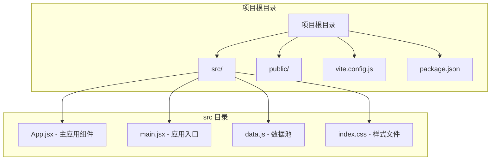
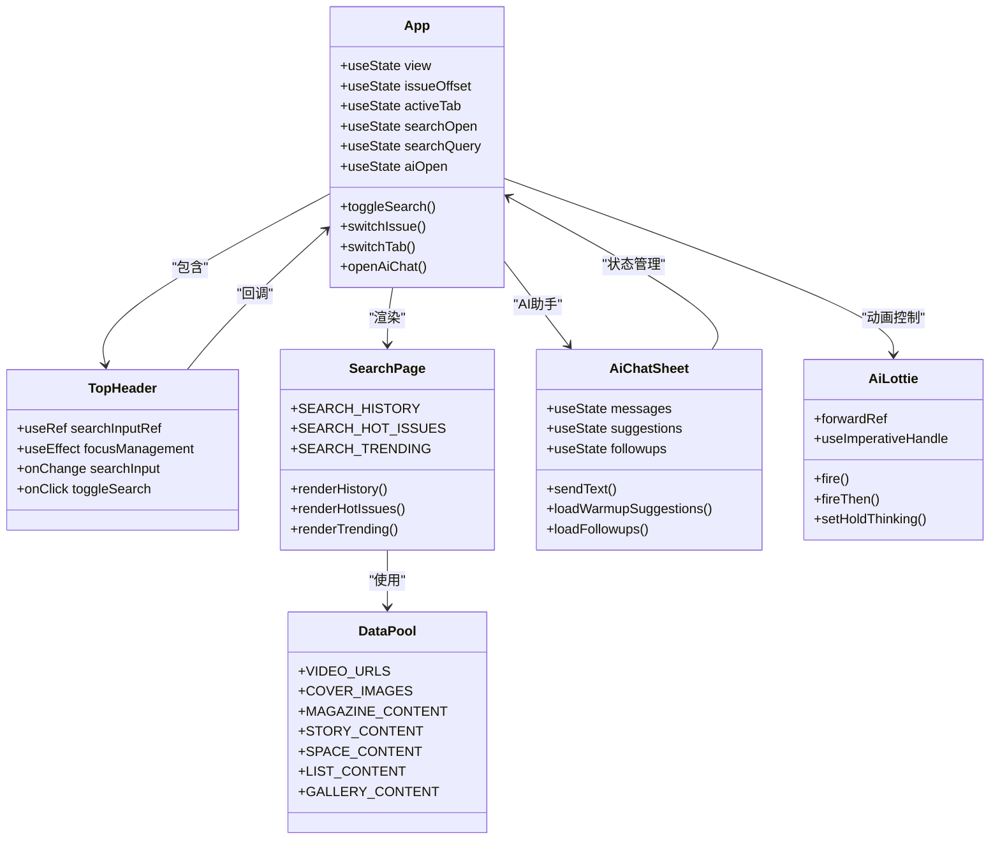
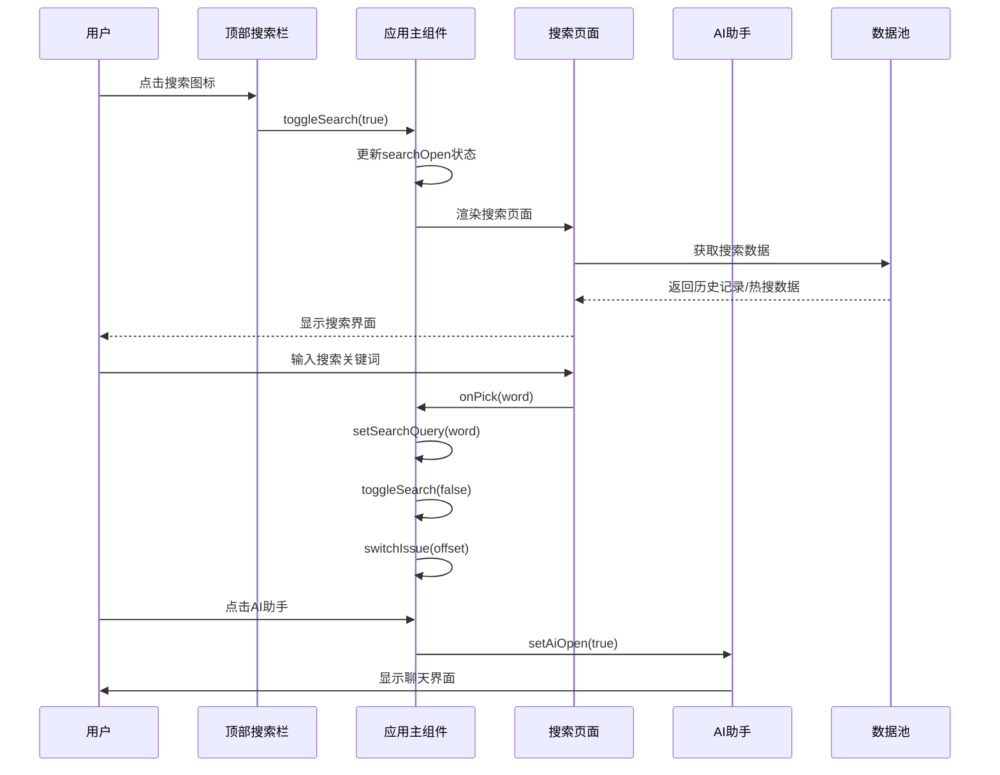
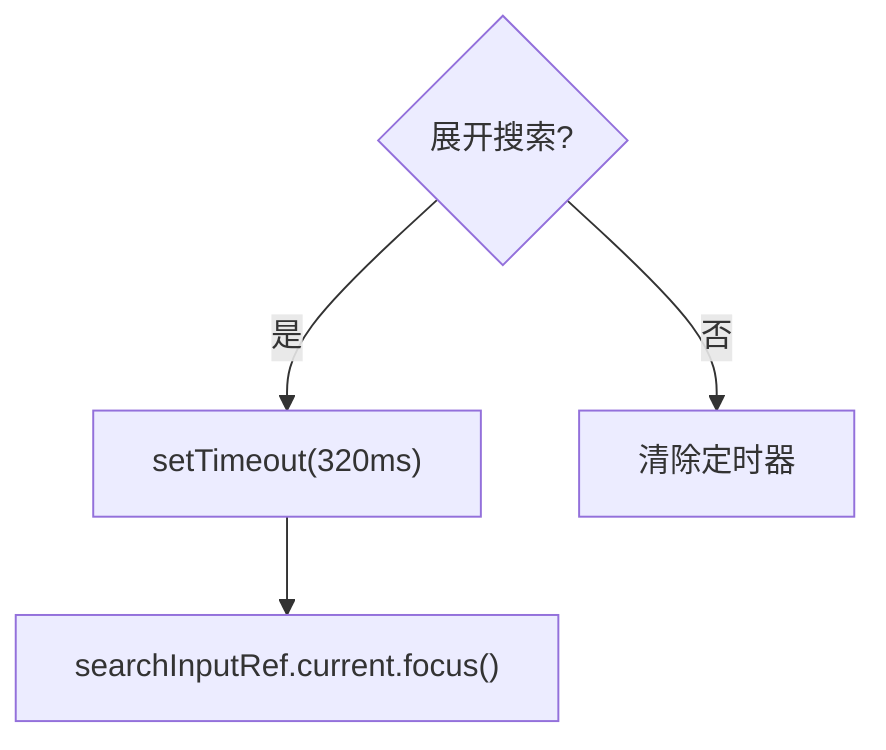
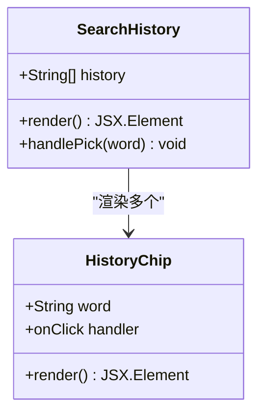
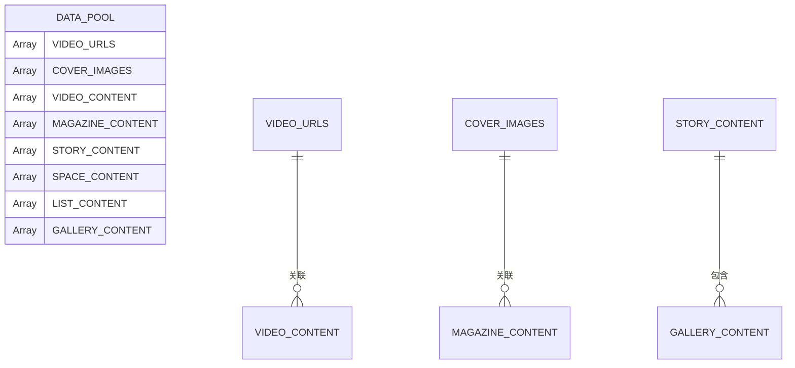
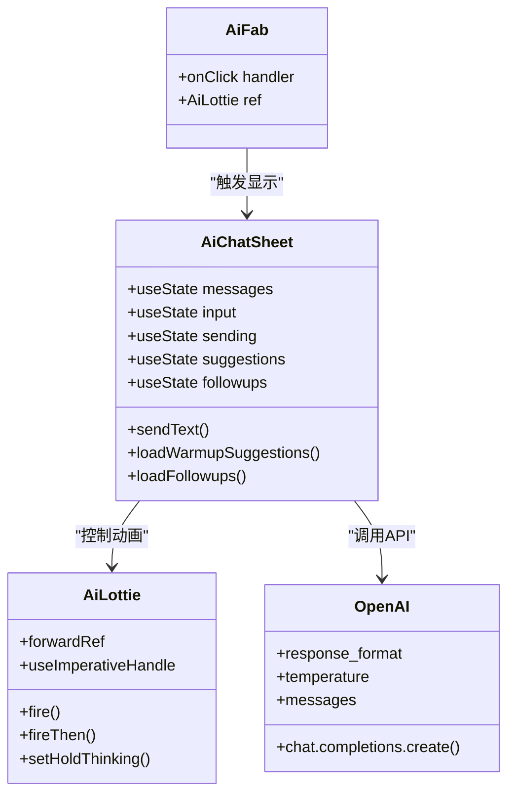
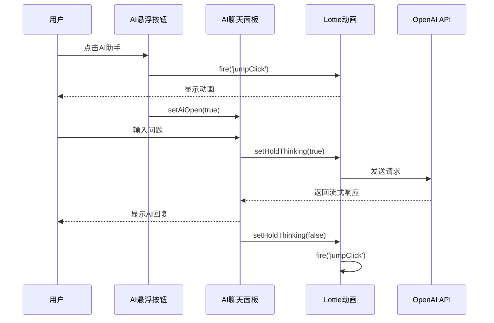

# 搜索系统

<cite>
**本文档引用的文件**
- [src/App.jsx](file://src/App.jsx)
- [src/main.jsx](file://src/main.jsx)
- [src/data.js](file://src/data.js)
- [src/index.css](file://src/index.css)
- [package.json](file://package.json)
</cite>

## 更新摘要
**变更内容**
- 新增AI助手入口和智能聊天功能
- 整合智能建议系统和暖场话题生成
- 更新搜索页面组件以支持AI集成
- 添加Lottie动画状态机和交互控制
- 增强搜索历史管理和热搜标签系统

## 目录
1. [简介](#简介)
2. [项目结构](#项目结构)
3. [核心组件](#核心组件)
4. [架构概览](#架构概览)
5. [详细组件分析](#详细组件分析)
6. [AI助手集成](#ai助手集成)
7. [依赖分析](#依赖分析)
8. [性能考虑](#性能考虑)
9. [故障排除指南](#故障排除指南)
10. [结论](#结论)

## 简介

NewSquare 是一个基于 React 和 Vite 构建的家居设计内容平台，其搜索系统提供了完整的搜索体验，包括搜索历史管理、热搜标签系统、搜索输入处理和AI智能助手集成。该系统实现了现代化的用户界面设计，支持流畅的动画过渡、响应式交互体验和智能化的搜索建议功能。

## 项目结构

NewSquare 项目采用简洁的文件组织结构，主要组件集中在 `src` 目录中，现已集成了AI助手功能：



**图表来源**
- [src/App.jsx:1-3289](file://src/App.jsx#L1-L3289)
- [src/main.jsx:1-12](file://src/main.jsx#L1-L12)

**章节来源**
- [src/App.jsx:1-3289](file://src/App.jsx#L1-L3289)
- [src/main.jsx:1-12](file://src/main.jsx#L1-L12)
- [package.json:1-27](file://package.json#L1-L27)

## 核心组件

搜索系统由多个精心设计的组件组成，现已集成了AI助手功能：

### 主要组件架构



**图表来源**
- [src/App.jsx:3059-3289](file://src/App.jsx#L3059-L3289)
- [src/App.jsx:70-208](file://src/App.jsx#L70-L208)
- [src/App.jsx:1938-2054](file://src/App.jsx#L1938-L2054)
- [src/App.jsx:1152-1932](file://src/App.jsx#L1152-L1932)
- [src/App.jsx:831-962](file://src/App.jsx#L831-L962)

### 搜索状态管理

搜索系统采用集中式状态管理模式，通过 React hooks 实现高效的状态同步：

| 状态属性 | 类型 | 默认值 | 描述 |
|---------|------|--------|------|
| `searchOpen` | boolean | false | 控制搜索界面的显示/隐藏状态 |
| `searchQuery` | string | '' | 当前搜索关键词 |
| `view` | string | 'feed' | 当前视图模式 ('feed' \| 'archive' \| 'history' \| 'mymags' \| 'cache' \| 'fav') |
| `issueOffset` | number | 0 | 期次偏移量，控制内容显示 |
| `activeTab` | string | 'current' | 当前激活的标签页 |
| `aiOpen` | boolean | false | AI助手聊天面板状态 |

**章节来源**
- [src/App.jsx:3059-3289](file://src/App.jsx#L3059-L3289)

## 架构概览

搜索系统的整体架构采用了组件化设计，现已集成了AI助手功能，各个模块之间通过清晰的接口进行通信：



**图表来源**
- [src/App.jsx:3232-3242](file://src/App.jsx#L3232-L3242)
- [src/App.jsx:3269-3285](file://src/App.jsx#L3269-L3285)

## 详细组件分析

### 搜索头部组件 (TopHeader)

顶部搜索栏是用户与搜索系统交互的主要入口，现已集成了AI助手入口，实现了流畅的展开/收起动画和智能的焦点管理：

#### 核心功能特性

1. **动态展开动画**：搜索图标从右上角移动到搜索栏位置
2. **智能焦点管理**：展开时自动聚焦到输入框
3. **AI助手入口**：集成悬浮按钮，提供智能搜索建议
4. **无障碍支持**：正确的 tab 键导航和屏幕阅读器支持
5. **响应式设计**：适配不同屏幕尺寸的交互体验

#### 焦点控制机制



**图表来源**
- [src/App.jsx:87-93](file://src/App.jsx#L87-L93)

**章节来源**
- [src/App.jsx:70-208](file://src/App.jsx#L70-L208)

### 搜索页面组件 (SearchPage)

搜索页面包含了完整的搜索体验，现已集成了AI智能建议功能，包括历史记录、热门期刊、热搜标签和智能搜索建议：

#### 搜索历史管理系统

搜索历史采用静态数组管理，提供了直观的标签式交互：



**图表来源**
- [src/App.jsx:1939-1970](file://src/App.jsx#L1939-L1970)

#### 热门期刊展示系统

热门期刊使用 Swiper 组件实现自动滚动的封面展示：

| 属性 | 值 | 描述 |
|------|-----|------|
| `slidesPerView` | 'auto' | 自适应显示数量 |
| `spaceBetween` | 12 | 卡片间距 |
| `freeMode` | true | 自由滚动模式 |
| `loop` | true | 循环播放 |
| `speed` | 4200 | 滚动速度 |

#### 热搜标签系统

热搜标签系统提供了实时更新的搜索热点展示：

| 字段 | 类型 | 描述 |
|------|------|------|
| `rank` | number | 排名位置 |
| `tag` | string | 搜索标签 |
| `desc` | string | 标签描述 |
| `hot` | string | 热度数值 |
| `img` | string | 背景图片ID |
| `badge` | string | 特殊标识 |

#### 智能搜索建议

新增的智能搜索建议功能，基于AI助手生成暖场话题和追问建议：


**图表来源**
- [src/App.jsx:1297-1340](file://src/App.jsx#L1297-L1340)
- [src/App.jsx:1342-1385](file://src/App.jsx#L1342-L1385)

**章节来源**
- [src/App.jsx:1938-2054](file://src/App.jsx#L1938-L2054)

### 数据管理模块

搜索系统使用专门的数据池来管理各种类型的内容数据：

#### 数据结构组织



**图表来源**
- [src/data.js:1-175](file://src/data.js#L1-L175)

**章节来源**
- [src/data.js:1-175](file://src/data.js#L1-L175)

## AI助手集成

### AI聊天系统架构

AI助手系统是NewSquare搜索系统的重要组成部分，提供了智能化的搜索建议和交互体验：

#### 核心组件结构



**图表来源**
- [src/App.jsx:1152-1932](file://src/App.jsx#L1152-L1932)
- [src/App.jsx:831-962](file://src/App.jsx#L831-L962)
- [src/App.jsx:964-975](file://src/App.jsx#L964-L975)

#### AI系统功能特性

1. **智能暖场建议**：基于系统提示词生成用户常见问题
2. **追问建议**：根据对话上下文生成相关问题
3. **多模态支持**：支持文本和图片的多模态交互
4. **流式响应**：实时显示AI回复内容
5. **状态机控制**：Lottie动画的状态机管理

#### AI聊天流程



**图表来源**
- [src/App.jsx:1431-1454](file://src/App.jsx#L1431-L1454)
- [src/App.jsx:1456-1555](file://src/App.jsx#L1456-L1555)

**章节来源**
- [src/App.jsx:820-1932](file://src/App.jsx#L820-L1932)

## 依赖分析

搜索系统的依赖关系相对简单，主要依赖于 React 生态系统中的核心库，现已增加了AI助手相关的依赖：

```mermaid
graph LR
subgraph "核心依赖"
React[react ^18.3.1]
ReactDOM[react-dom ^18.3.1]
Lucide[lucide-react ^1.14.0]
AntdMobile[antd-mobile ^5.38.1]
end
subgraph "第三方库"
Swiper[swiper ^11.1.14]
Intersect[react-intersection-observer ^9.13.1]
OpenAI[openai ^6.37.0]
Lottie[@lottiefiles/dotlottie-react ^0.19.2]
end
subgraph "构建工具"
Vite[vite ^5.4.10]
PluginReact[@vitejs/plugin-react ^4.3.3]
end
App --> React
App --> Lucide
App --> AntdMobile
App --> Swiper
App --> Intersect
App --> OpenAI
App --> Lottie
Build --> Vite
Build --> PluginReact
```

**图表来源**
- [package.json:11-26](file://package.json#L11-L26)

### 关键依赖说明

| 依赖包 | 版本 | 用途 |
|--------|------|------|
| react | ^18.3.1 | 核心框架 |
| lucide-react | ^1.14.0 | 图标库 |
| antd-mobile | ^5.38.1 | 移动端UI组件 |
| swiper | ^11.1.14 | 轮播组件 |
| react-intersection-observer | ^9.13.1 | 懒加载支持 |
| openai | ^6.37.0 | AI对话API |
| @lottiefiles/dotlottie-react | ^0.19.2 | Lottie动画支持 |

**章节来源**
- [package.json:1-27](file://package.json#L1-L27)

## 性能考虑

搜索系统在设计时充分考虑了性能优化，现已集成了AI助手功能，采用了多种策略来确保流畅的用户体验：

### 动画性能优化

1. **硬件加速**：使用 `transform` 和 `opacity` 属性实现 GPU 加速
2. **will-change 属性**：预声明动画元素，提升渲染性能
3. **requestAnimationFrame**：确保动画在正确的时机执行
4. **Lottie状态机**：优化动画状态切换性能

### AI系统性能优化

1. **流式响应**：实时显示AI回复，避免长时间等待
2. **请求取消**：支持中止正在进行的AI请求
3. **图片压缩**：客户端压缩图片，减少传输体积
4. **状态缓存**：缓存AI生成的建议和回复

### 内存管理

1. **useEffect 清理**：及时清理定时器和事件监听器
2. **条件渲染**：根据状态变化动态渲染组件
3. **引用管理**：使用 useRef 避免不必要的重渲染
4. **AI会话清理**：自动清理AI聊天会话状态

### 用户体验优化

1. **防抖处理**：搜索输入采用防抖机制减少重复请求
2. **懒加载**：内容采用懒加载策略提升初始加载速度
3. **骨架屏**：使用简单的占位符提升感知性能
4. **离线支持**：AI助手支持离线模式和缓存

## 故障排除指南

### 常见问题及解决方案

#### 搜索框无法聚焦

**问题描述**：展开搜索后输入框无法获得焦点

**解决方案**：
1. 检查 `useEffect` 中的定时器是否正确执行
2. 确认 `searchInputRef` 是否正确传递给 input 元素
3. 验证 `tabIndex` 属性的设置

#### AI助手无法正常工作

**问题描述**：AI助手聊天面板无法打开或响应

**解决方案**：
1. 检查OpenAI API密钥和配置
2. 确认网络连接和代理设置
3. 验证Lottie动画文件是否正确加载
4. 检查AI系统提示词配置

#### 搜索历史不显示

**问题描述**：搜索历史标签不显示或点击无效

**解决方案**：
1. 检查 `SEARCH_HISTORY` 数组是否正确导入
2. 确认 `onPick` 回调函数的传递
3. 验证 CSS 样式是否正确应用

#### 热门期刊滚动异常

**问题描述**：Swiper 组件滚动不流畅或显示异常

**解决方案**：
1. 检查 Swiper 的配置参数
2. 确认 `autoplay` 和 `freeMode` 设置
3. 验证图片资源的可用性

#### Lottie动画问题

**问题描述**：AI助手的Lottie动画无法播放或状态异常

**解决方案**：
1. 检查 `.lottie` 文件是否正确加载
2. 确认状态机配置和事件处理
3. 验证动画速度和播放控制

**章节来源**
- [src/App.jsx:87-93](file://src/App.jsx#L87-L93)
- [src/App.jsx:1939-1970](file://src/App.jsx#L1939-L1970)
- [src/App.jsx:1062-1068](file://src/App.jsx#L1062-L1068)

## 结论

NewSquare 的搜索系统展现了现代前端开发的最佳实践，通过精心设计的组件架构、高效的性能优化和优秀的用户体验，为用户提供了流畅的搜索体验。系统现已集成了AI助手功能，通过智能化的搜索建议和交互，进一步提升了用户的搜索效率和体验质量。

系统的主要优势包括：

1. **模块化设计**：清晰的组件分离和职责划分，支持AI功能集成
2. **性能优化**：多维度的性能优化策略，包括AI系统的流式响应
3. **用户体验**：流畅的动画和响应式交互，支持智能搜索建议
4. **可维护性**：简洁的代码结构和良好的扩展性，便于AI功能扩展
5. **智能化**：AI助手提供智能搜索建议和交互体验

该搜索系统为类似的内容平台提供了优秀的参考实现，其设计理念和实现方式值得其他项目借鉴学习。AI助手的集成展示了现代Web应用的发展趋势，通过智能化技术提升用户体验和搜索效率。