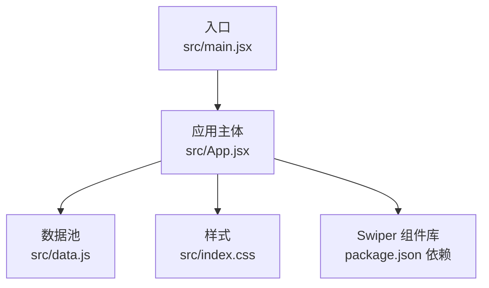
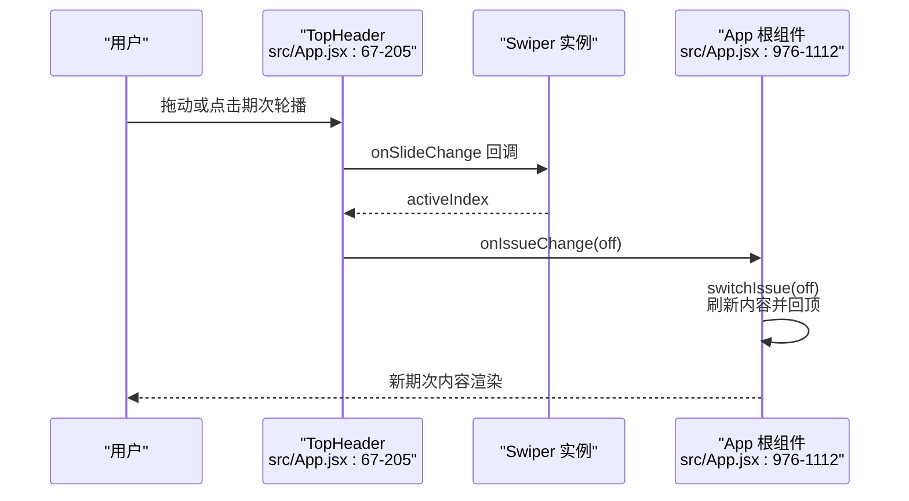
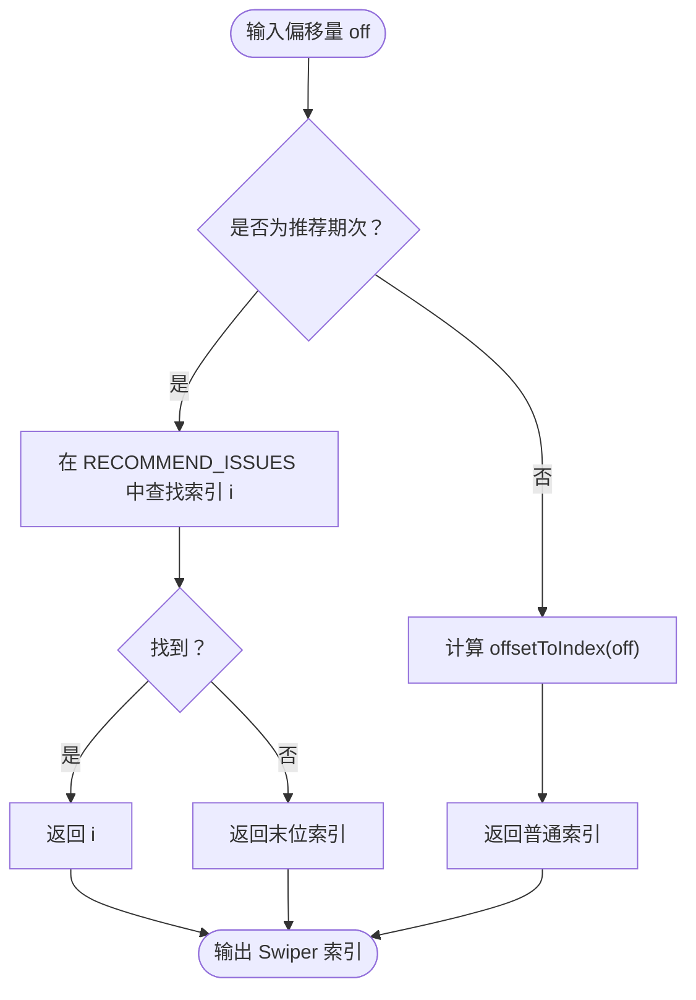
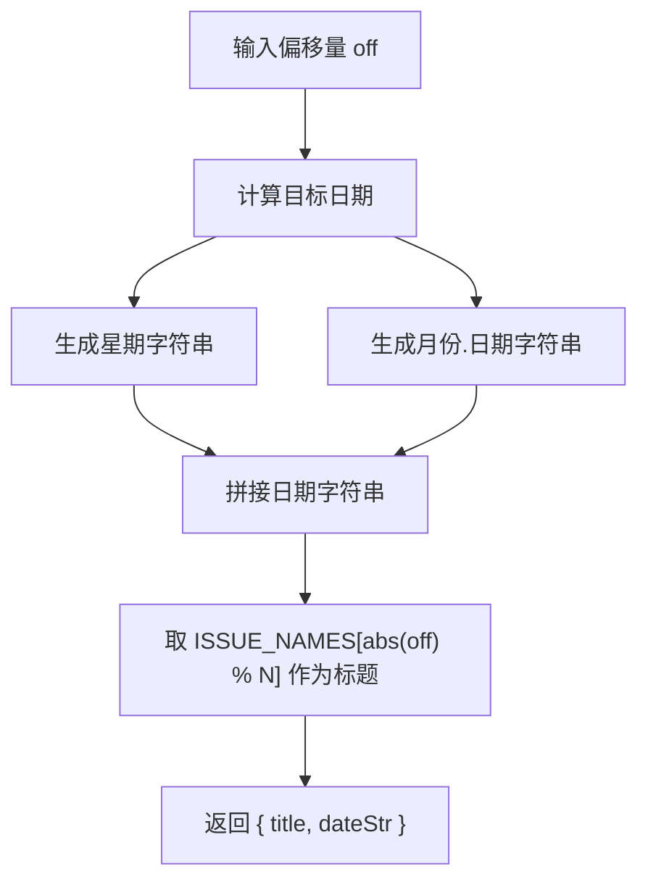
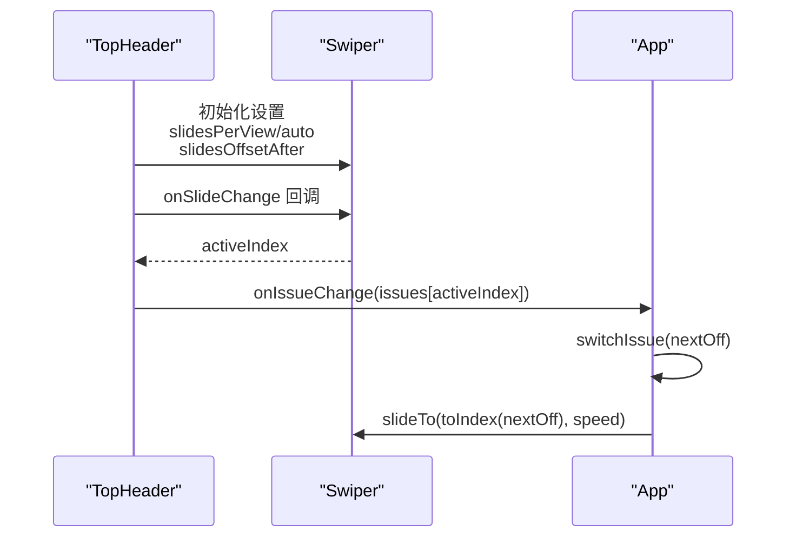
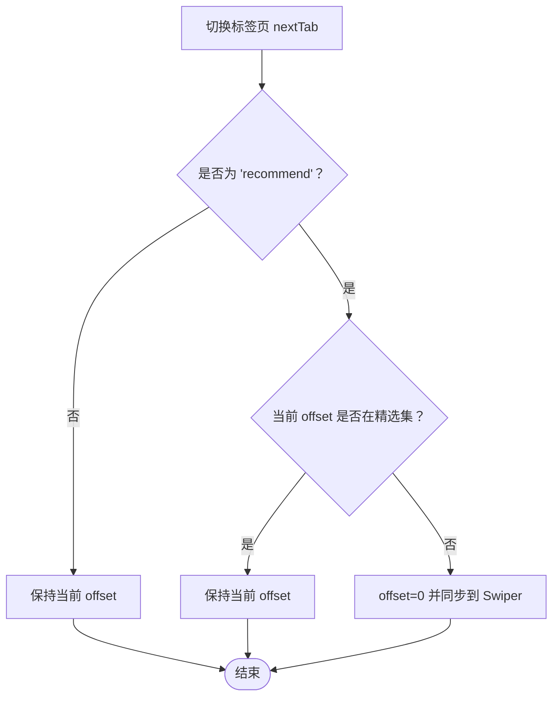
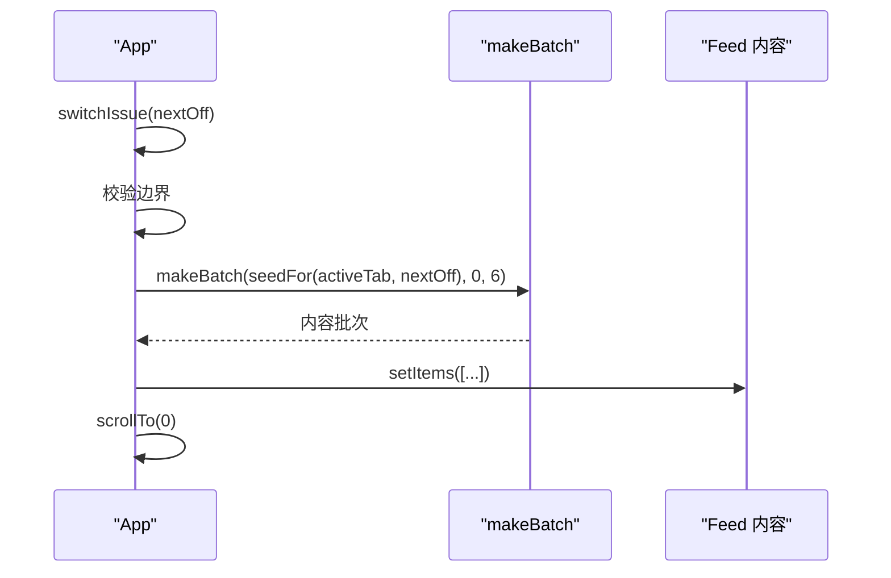
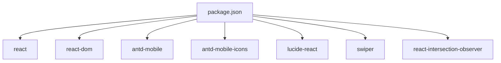

# 期次切换轮播

<cite>
**本文引用的文件**
- [src/App.jsx](file://src/App.jsx)
- [src/data.js](file://src/data.js)
- [src/main.jsx](file://src/main.jsx)
- [src/index.css](file://src/index.css)
- [package.json](file://package.json)
</cite>

## 目录
1. [简介](#简介)
2. [项目结构](#项目结构)
3. [核心组件](#核心组件)
4. [架构总览](#架构总览)
5. [详细组件分析](#详细组件分析)
6. [依赖分析](#依赖分析)
7. [性能考量](#性能考量)
8. [故障排查指南](#故障排查指南)
9. [结论](#结论)
10. [附录](#附录)

## 简介
本文件面向 NewSquare 的期次切换轮播系统，围绕 Swiper 轮播组件在期次轴上的实现进行深入解析。内容涵盖：
- 期次轴的数学建模与索引映射函数
- 推荐期次与普通期次的差异化处理
- 滑动交互逻辑与平滑过渡动画
- 期次名称生成算法、日期格式化与星期显示
- 性能优化策略与用户体验提升方案
- 配置参数说明与可扩展性建议

## 项目结构
该项目采用 React + Vite 构建，Swiper 用于实现期次轮播与多种场景的横向滚动。核心入口与样式如下：
- 入口与应用主体：src/main.jsx、src/App.jsx
- 数据池与资源：src/data.js
- 样式与主题：src/index.css
- 依赖与版本：package.json

图表来源
- [src/main.jsx:1-12](file://src/main.jsx#L1-L12)
- [src/App.jsx:1-10](file://src/App.jsx#L1-L10)
- [package.json:11-18](file://package.json#L11-L18)

章节来源
- [src/main.jsx:1-12](file://src/main.jsx#L1-L12)
- [src/App.jsx:1-10](file://src/App.jsx#L1-L10)
- [package.json:11-18](file://package.json#L11-L18)

## 核心组件
- 顶部期次轮播头部组件：负责展示“当期/推荐/我”三个标签页下的期次轮播，支持滑动切换与点击跳转。
- 期次轴与索引映射：定义期次轴范围、普通期次与推荐期次的索引映射函数。
- 期次元信息生成：根据偏移量计算期次标题与日期字符串。
- 期次切换逻辑：在切换期次或标签页时刷新内容并保持滚动位置。
- 搜索页与归档页：提供热门期次快速浏览与历史期次检索能力。

章节来源
- [src/App.jsx:67-205](file://src/App.jsx#L67-L205)
- [src/App.jsx:35-57](file://src/App.jsx#L35-L57)
- [src/App.jsx:976-1112](file://src/App.jsx#L976-L1112)

## 架构总览
期次切换轮播系统围绕“期次轴 → 索引映射 → Swiper 轮播 → 期次元信息 → 内容刷新”的闭环构建。交互流程如下：

图表来源
- [src/App.jsx:155-196](file://src/App.jsx#L155-L196)
- [src/App.jsx:173-176](file://src/App.jsx#L173-L176)
- [src/App.jsx:1011-1018](file://src/App.jsx#L1011-L1018)

## 详细组件分析

### 期次轴与索引映射
- 期次轴：以“今日”为末位，向前扩展的连续负偏移数组，形成“[-29, ..., -1, 0]”。该轴确保“今日”始终位于轮播末尾，便于“右侧 peek”与左对齐。
- 普通期次映射：通过 offsetToIndex(off) 将偏移量映射为 Swiper 的绝对索引，使 activeIndex 与期次轴一一对应。
- 推荐期次映射：RECOMMEND_ISSUES 为精选期次集合，recommendOffsetToIndex(off) 将不在精选集内的偏移量回落至末位，保证推荐 tab 的一致性。

图表来源
- [src/App.jsx:47-57](file://src/App.jsx#L47-L57)

章节来源
- [src/App.jsx:47-57](file://src/App.jsx#L47-L57)

### 期次元信息生成与日期格式化
- 星期常量：WEEK_DAYS 提供中文星期枚举，用于日期字符串的星期部分。
- 期次元信息：getIssueMeta(off) 基于偏移量计算目标日期，生成“星期 + 月份.日期”的日期字符串，以及 ISSUE_NAMES 中对应的期次标题。
- 标题长度与视觉：轮播项宽度自适应，标题字号较大且带描边，强调“当期/推荐”期次的可读性与辨识度。

图表来源
- [src/App.jsx:19-41](file://src/App.jsx#L19-L41)

章节来源
- [src/App.jsx:19-41](file://src/App.jsx#L19-L41)

### Swiper 轮播配置与交互逻辑
- 轮播容器：title-swiper 使用 slidesPerView="auto"、spaceBetween 控制间距，slidesOffsetAfter 为末位留白，使最后一页可贴到容器左缘。
- 拖动与阻力：resistance 与 resistanceRatio 控制拖动阻力；threshold、longSwipesRatio、longSwipesMs、shortSwipes 与 followFinger 保证长标题下快速切换与跟手体验。
- 索引同步：外部 issueOffset 变化时，通过 toIndex(issueOffset) 计算目标索引并 slideTo，实现双向同步。
- 活动状态：SwiperSlide 的 isActive 参数用于高亮当前期次，点击可触发跳转或标题点击事件。

图表来源
- [src/App.jsx:155-196](file://src/App.jsx#L155-L196)
- [src/App.jsx:173-176](file://src/App.jsx#L173-L176)
- [src/App.jsx:1011-1018](file://src/App.jsx#L1011-L1018)

章节来源
- [src/App.jsx:155-196](file://src/App.jsx#L155-L196)
- [src/App.jsx:173-176](file://src/App.jsx#L173-L176)

### 推荐期次与普通期次的差异化处理
- 推荐期次：RECOMMEND_ISSUES 限定精选期次集合，recommendOffsetToIndex(off) 将不在集合内的偏移量回落至末位，确保推荐 tab 的期次连续性与稳定性。
- 标签页切换：switchTab 在切换到推荐 tab 时，若当前期次不在精选集，则强制回到今日（0），避免无效期次显示。
- 视觉替代：当非期次类 tab（如“我”）激活时，顶部显示替代标题而非期次轮播，提升信息密度与可用性。

图表来源
- [src/App.jsx:1022-1035](file://src/App.jsx#L1022-L1035)
- [src/App.jsx:53-57](file://src/App.jsx#L53-L57)

章节来源
- [src/App.jsx:1022-1035](file://src/App.jsx#L1022-L1035)
- [src/App.jsx:53-57](file://src/App.jsx#L53-L57)

### 期次之间的平滑过渡动画
- 轮播速度：speed=320ms，确保滑动切换顺滑。
- 阻力与阈值：resistanceRatio=0.45、threshold=4，兼顾拖动手感与误触防护。
- 长滑阈值：longSwipesRatio=0.15、longSwipesMs=220，保证长标题在短时间内快速切换。
- 标题高亮：active 期次颜色与透明度变化，增强视觉反馈。
- 顶部遮罩：backdrop-filter 与渐变背景，提升标题可读性与层次感。

章节来源
- [src/App.jsx:162-171](file://src/App.jsx#L162-L171)
- [src/App.jsx:380-384](file://src/App.jsx#L380-L384)
- [src/index.css:97-99](file://src/index.css#L97-L99)

### 期次名称生成算法与数据池
- ISSUE_NAMES：固定期次标题库，按 abs(offset) % N 取值，确保“今日/上期”等相对关系稳定对应同一刊名。
- 数据池：VIDEO_URLS、COVER_IMAGES、各内容类型的数据池通过循环取用，保证多期次内容的多样性与一致性。
- 图片资源：IMG(id, w) 统一生成图片 URL，支持不同分辨率与质量参数。

章节来源
- [src/App.jsx:24-33](file://src/App.jsx#L24-L33)
- [src/data.js:3-31](file://src/data.js#L3-L31)
- [src/data.js:48-175](file://src/data.js#L48-L175)

### 交互与内容刷新流程
- 期次切换：switchIssue(nextOff) 校验边界（不得大于今日），更新状态并刷新内容批次 makeBatch(seedFor(activeTab, nextOff), 0, 6)，随后回顶。
- 标签页切换：switchTab(nextTab) 在推荐 tab 下校验当前期次是否在精选集，必要时回退至今日并刷新内容。
- 内容批次：makeBatch(seedFor(tab, offset), startIndex, count) 以 seed 偏移打乱内容顺序，使每期/每 tab 的内容呈现不同组合。

图表来源
- [src/App.jsx:1011-1018](file://src/App.jsx#L1011-L1018)
- [src/App.jsx:962-973](file://src/App.jsx#L962-L973)
- [src/App.jsx:958-960](file://src/App.jsx#L958-L960)

章节来源
- [src/App.jsx:1011-1018](file://src/App.jsx#L1011-L1018)
- [src/App.jsx:962-973](file://src/App.jsx#L962-L973)
- [src/App.jsx:958-960](file://src/App.jsx#L958-L960)

## 依赖分析
- React 生态：React、React DOM、IntersectionObserver（用于视频卡自动播放）
- UI 组件：antd-mobile、antd-mobile-icons、lucide-react
- 轮播库：swiper（React 组件与模块）

图表来源
- [package.json:11-18](file://package.json#L11-L18)

章节来源
- [package.json:11-18](file://package.json#L11-L18)

## 性能考量
- 滑动性能
  - 使用 requestAnimationFrame 控制滚动头部隐藏/显示，降低主线程压力。
  - Swiper 配置 followFinger、longSwipesRatio/longSwipesMs 提升长标题场景的切换流畅度。
- 内容渲染
  - makeBatch 以 seed 偏移生成内容批次，避免重复渲染相同内容。
  - InfiniteScroll 分页加载，限制一次性渲染数量，提高首屏性能。
- 资源加载
  - 图片通过 IMG(id, w) 动态生成 URL，按需设置分辨率与质量参数，平衡清晰度与体积。
  - 视频卡使用 IntersectionObserver 控制自动播放时机，减少不必要的资源消耗。
- 交互优化
  - slidesOffsetAfter 与 resistanceRatio 优化拖动体验，减少误触。
  - 顶部 header 使用 backdrop-filter 与过渡动画，避免频繁重排。

章节来源
- [src/App.jsx:993-1008](file://src/App.jsx#L993-L1008)
- [src/App.jsx:162-171](file://src/App.jsx#L162-L171)
- [src/App.jsx:962-973](file://src/App.jsx#L962-L973)
- [src/App.jsx:1037-1041](file://src/App.jsx#L1037-L1041)
- [src/data.js:22-23](file://src/data.js#L22-L23)
- [src/App.jsx:313-322](file://src/App.jsx#L313-L322)

## 故障排查指南
- 期次轮播不响应
  - 检查 onSlideChange 回调是否正确触发，确认 issues 数组与 activeIndex 对应关系。
  - 确认 toIndex(issueOffset) 返回有效索引，避免越界。
- 推荐 tab 期次异常
  - 若当前期次不在 RECOMMEND_ISSUES，switchTab 会回退至今日（0）。检查推荐期次集合与映射函数。
- 标题不显示或错位
  - 检查 slidesPerView="auto" 与 spaceBetween 设置，确保宽度自适应与间距正常。
  - 确认 slidesOffsetAfter 与容器宽度匹配，避免末位贴边异常。
- 性能问题
  - 减少一次性渲染内容数量，启用 InfiniteScroll 分页。
  - 优化图片分辨率与质量参数，避免超大资源导致卡顿。
  - 使用 IntersectionObserver 控制媒体资源加载时机。

章节来源
- [src/App.jsx:173-176](file://src/App.jsx#L173-L176)
- [src/App.jsx:1022-1035](file://src/App.jsx#L1022-L1035)
- [src/App.jsx:155-196](file://src/App.jsx#L155-L196)
- [src/App.jsx:1037-1041](file://src/App.jsx#L1037-L1041)
- [src/data.js:22-23](file://src/data.js#L22-L23)
- [src/App.jsx:313-322](file://src/App.jsx#L313-L322)

## 结论
NewSquare 的期次切换轮播系统通过清晰的期次轴建模、稳定的索引映射与 Swiper 的精细配置，实现了“今日”为中心的期次导航与平滑过渡体验。推荐期次与普通期次的差异化处理确保了内容的一致性与可发现性。配合性能优化与交互细节，系统在移动端具备良好的可用性与可扩展性。

## 附录
- 配置参数速查
  - 轮播容器：slidesPerView="auto"、spaceBetween、slidesOffsetAfter、initialSlide、speed、resistance、resistanceRatio、threshold、longSwipesRatio、longSwipesMs、shortSwipes、followFinger、allowTouchMove
  - 标题样式：font-size、font-weight、letter-spacing、-webkit-text-stroke、opacity、transition
  - 顶部 header：backdrop-filter、渐变背景、过渡动画
- 扩展建议
  - 支持键盘/遥控器导航，提升可访问性。
  - 增加期次缓存机制，避免重复计算与渲染。
  - 提供期次预加载策略，缩短滑动时延。