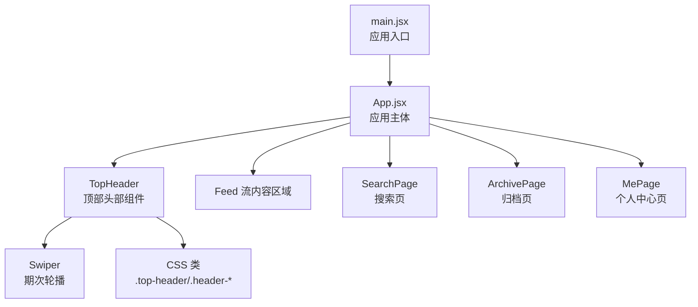
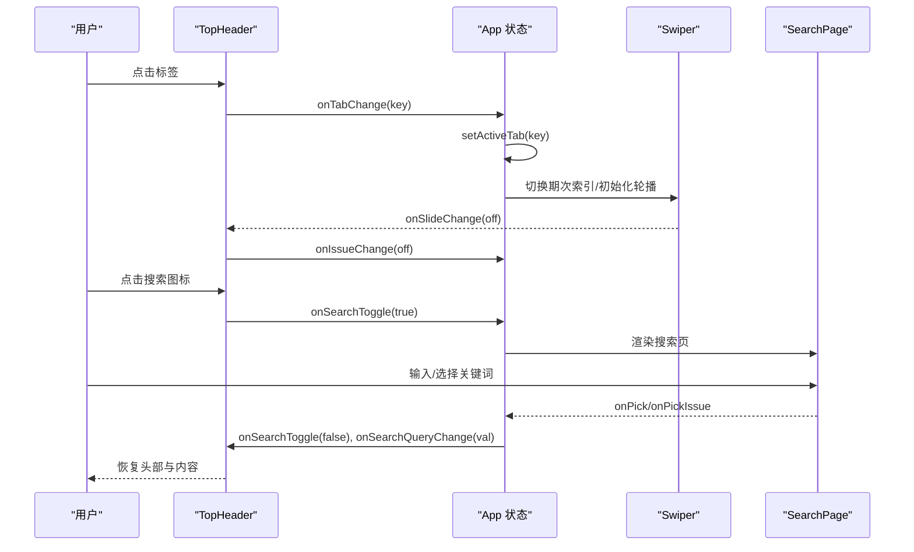
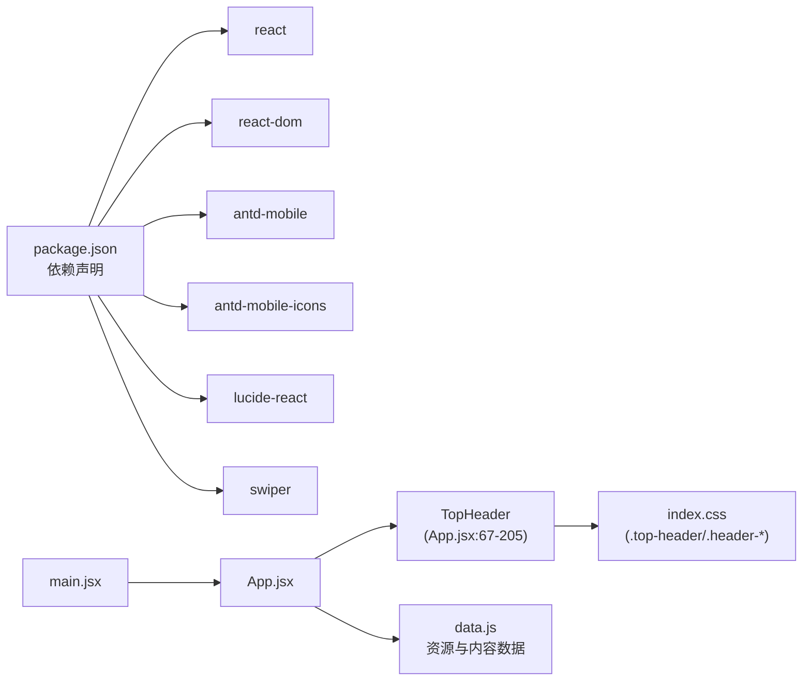

# 顶部头部组件

<cite>
**本文引用的文件**
- [src/App.jsx](file://src/App.jsx)
- [src/main.jsx](file://src/main.jsx)
- [src/index.css](file://src/index.css)
- [src/data.js](file://src/data.js)
- [package.json](file://package.json)
</cite>

## 目录
1. [简介](#简介)
2. [项目结构](#项目结构)
3. [核心组件](#核心组件)
4. [架构总览](#架构总览)
5. [组件详细分析](#组件详细分析)
6. [依赖关系分析](#依赖关系分析)
7. [性能考量](#性能考量)
8. [故障排查指南](#故障排查指南)
9. [结论](#结论)
10. [附录](#附录)

## 简介
本文件面向 NewSquare 项目的顶部头部组件（TopHeader），系统性阐述其设计架构、实现细节与最佳实践。重点覆盖：
- 头部导航栏的布局结构与响应式设计
- 标签切换机制与期次轮播交互
- 搜索模式切换与焦点管理
- 隐藏/显示动画与可访问性支持
- 状态管理、Props 接口与事件处理逻辑
- 样式定制与移动端适配建议

## 项目结构
NewSquare 采用 React + Vite 构建，入口为 main.jsx，应用主体在 App.jsx 中组织。TopHeader 作为顶层 UI 组件，贯穿首页、归档页、搜索页与“我”页的导航体验。

图表来源
- [src/main.jsx:7-11](file://src/main.jsx#L7-L11)
- [src/App.jsx:976-1111](file://src/App.jsx#L976-L1111)
- [src/index.css:88-393](file://src/index.css#L88-L393)

章节来源
- [src/main.jsx:1-12](file://src/main.jsx#L1-L12)
- [src/App.jsx:1-1112](file://src/App.jsx#L1-L1112)

## 核心组件
TopHeader 是一个受控组件，负责：
- 渲染顶部标签行与搜索输入
- 控制期次轮播（Swiper）以展示“当期/推荐/我”的标题与日期
- 根据 activeTab、searchOpen、hidden 等状态切换 UI 显示与动画
- 提供回调事件：切换期次、切换标签、打开/关闭搜索、搜索词变更、点击标题

章节来源
- [src/App.jsx:67-205](file://src/App.jsx#L67-L205)

## 架构总览
TopHeader 与应用状态的交互路径如下：

图表来源
- [src/App.jsx:976-1111](file://src/App.jsx#L976-L1111)
- [src/App.jsx:67-205](file://src/App.jsx#L67-L205)

## 组件详细分析

### Props 接口与状态管理
TopHeader 的 props 用于驱动其行为与外观：
- hidden: 是否隐藏头部（配合滚动隐藏）
- issueOffset: 当前期次偏移量
- onIssueChange: 期次变更回调
- onTitleClick: 点击当前标题（触发归档页）
- activeTab: 当前激活标签（current/recommend/me）
- onTabChange: 标签切换回调
- searchOpen: 搜索是否展开
- searchQuery: 搜索词
- onSearchQueryChange: 搜索词变更回调
- onSearchToggle: 搜索开关回调

内部状态与副作用：
- 通过 useEffect 同步 Swiper 活动项与外部 issueOffset
- 展开搜索时自动聚焦输入框
- 根据 activeTab 动态决定期次列表与标题显示

章节来源
- [src/App.jsx:67-205](file://src/App.jsx#L67-L205)
- [src/App.jsx:976-1051](file://src/App.jsx#L976-L1051)

### 布局结构与响应式设计
- 顶部容器固定定位，使用 backdrop-filter 实现毛玻璃效果
- 标签行与搜索框在同一行，搜索态下仅显示搜索行，隐藏主体内容
- 期次轮播在 current/recommend 标签下可见，me 标签下折叠
- 替代标题（如“编辑推荐”）在相应标签下替代轮播位置

章节来源
- [src/index.css:88-393](file://src/index.css#L88-L393)
- [src/App.jsx:94-204](file://src/App.jsx#L94-L204)

### 标签切换机制
- 三个标签：当期、推荐、我
- 切换标签时，若从“推荐”切换至其他标签且当前期次不在推荐集合内，则回退到今日
- 标签切换会刷新内容种子，确保不同标签下的内容批次不同

章节来源
- [src/App.jsx:1022-1035](file://src/App.jsx#L1022-L1035)
- [src/App.jsx:60-65](file://src/App.jsx#L60-L65)

### 期次轮播与标题交互
- 使用 Swiper 实现期次轮播，支持长滑与短滑阈值，保证长标题下的顺滑切换
- 点击当前标题触发 onTitleClick（通常打开归档页）
- 点击非当前标题触发 Swiper 切换到目标项

章节来源
- [src/App.jsx:155-196](file://src/App.jsx#L155-L196)
- [src/index.css:348-393](file://src/index.css#L348-L393)

### 搜索模式切换与焦点管理
- 搜索态下，标签行隐藏，搜索框展开并获得焦点
- 关闭搜索时清空查询词
- 搜索图标根据状态显示“打开/清空/关闭”不同语义

章节来源
- [src/App.jsx:110-149](file://src/App.jsx#L110-L149)
- [src/App.jsx:84-90](file://src/App.jsx#L84-L90)
- [src/index.css:154-269](file://src/index.css#L154-L269)

### 隐藏/显示动画
- 通过 transform: translateY(-110%) 与 opacity: 0 实现向上淡出
- 结合滚动事件在一定阈值下隐藏，在向上滚动时恢复
- 顶部容器具备过渡动画，提升交互质感

章节来源
- [src/index.css:322-329](file://src/index.css#L322-L329)
- [src/App.jsx:993-1008](file://src/App.jsx#L993-L1008)

### 无障碍访问支持
- 标签行在搜索态下设置 aria-hidden，避免读屏器干扰
- 搜索输入与按钮在不同状态下通过 tabindex 控制焦点顺序
- 按钮提供 aria-label，明确操作语义（返回、打开搜索、清空）

章节来源
- [src/App.jsx:97-149](file://src/App.jsx#L97-L149)
- [src/index.css:127-132](file://src/index.css#L127-L132)

### 使用示例与集成方式
在 App.jsx 中，TopHeader 作为顶层组件被渲染，并传入完整的状态与回调：
- 传入 hidden、issueOffset、activeTab、searchOpen、searchQuery
- 传入 onIssueChange、onTitleClick、onTabChange、onSearchToggle、onSearchQueryChange
- 在搜索态下，渲染 SearchPage 并处理 onPick/onPickIssue 回调

章节来源
- [src/App.jsx:1063-1111](file://src/App.jsx#L1063-L1111)

### 样式定制与移动端适配
- 字体与字号采用变量化，便于主题定制
- 期次标题采用 -webkit-text-stroke 提升可读性
- 搜索态下，输入框与按钮的显隐通过 opacity/width/transform 过渡，兼顾性能与视觉
- 期次轮播使用 touch-action: pan-x，避免与系统手势冲突

章节来源
- [src/index.css:88-393](file://src/index.css#L88-L393)

## 依赖关系分析

图表来源
- [package.json:11-18](file://package.json#L11-L18)
- [src/main.jsx:1-5](file://src/main.jsx#L1-L5)
- [src/App.jsx:1-15](file://src/App.jsx#L1-L15)
- [src/index.css:88-393](file://src/index.css#L88-L393)
- [src/data.js:1-175](file://src/data.js#L1-L175)

章节来源
- [package.json:1-25](file://package.json#L1-L25)
- [src/App.jsx:1-15](file://src/App.jsx#L1-L15)

## 性能考量
- Swiper 参数优化：longSwipesRatio/longSwipesMs 确保长标题顺滑切换；followFinger 与 allowTouchMove 提升触控跟随性
- 顶部容器使用 will-change 与 transform/opacity 过渡，避免布局抖动
- 滚动隐藏采用 requestAnimationFrame 与被动监听，降低主线程压力
- 搜索态下隐藏非必要 DOM，减少渲染负担

章节来源
- [src/App.jsx:166-171](file://src/App.jsx#L166-L171)
- [src/index.css:100-104](file://src/index.css#L100-L104)
- [src/App.jsx:993-1008](file://src/App.jsx#L993-L1008)

## 故障排查指南
- 期次轮播不联动：检查 onIssueChange 回调是否正确触发，以及 effect 中的 toIndex 与 issueOffset 同步逻辑
- 搜索态焦点异常：确认 onSearchToggle(true) 后的延时聚焦与搜索输入 ref 的绑定
- 标签切换错位：检查 switchTab 中对推荐标签的期次回退逻辑
- 动画卡顿：检查 will-change 与过渡属性是否被过度使用，或是否存在阻塞主线程的操作
- 无障碍问题：核对 aria-hidden 与 tabindex 的条件设置，确保读屏器不会读取隐藏内容

章节来源
- [src/App.jsx:76-90](file://src/App.jsx#L76-L90)
- [src/App.jsx:1022-1035](file://src/App.jsx#L1022-L1035)
- [src/App.jsx:976-1008](file://src/App.jsx#L976-L1008)

## 结论
TopHeader 通过清晰的 Props 接口与副作用管理，实现了头部导航、期次轮播、搜索态与标签切换的统一控制。结合 CSS 过渡与无障碍属性，提供了流畅、可访问且易于定制的顶部导航体验。建议在后续迭代中持续关注滚动性能与跨设备一致性，并保持样式变量化的扩展性。

## 附录

### 代码片段路径参考
- TopHeader 组件定义与渲染：[src/App.jsx:67-205](file://src/App.jsx#L67-L205)
- App 状态与事件处理：[src/App.jsx:976-1111](file://src/App.jsx#L976-L1111)
- 顶部头部样式：[src/index.css:88-393](file://src/index.css#L88-L393)
- 依赖声明：[package.json:11-18](file://package.json#L11-L18)