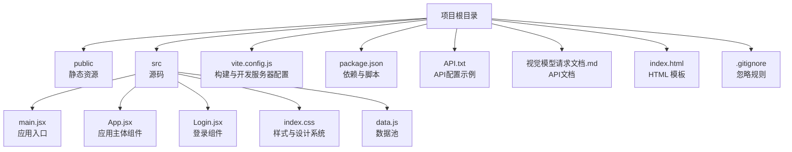
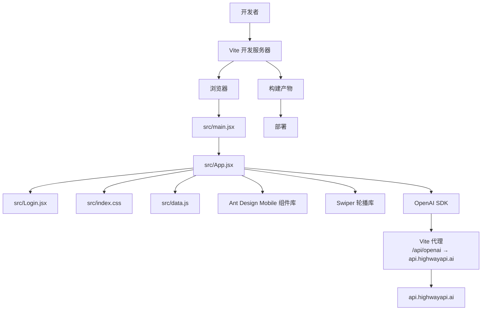
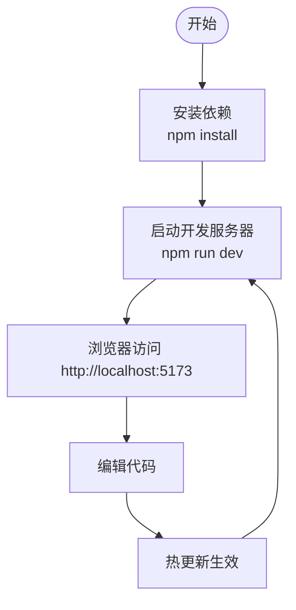
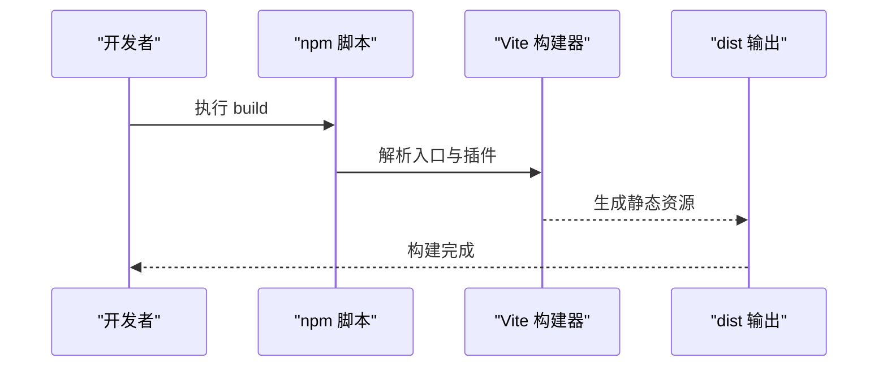
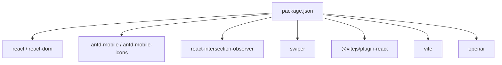

# 开发指南

<cite>
**本文引用的文件**
- [package.json](file://package.json)
- [vite.config.js](file://vite.config.js)
- [API.txt](file://API.txt)
- [视觉模型请求文档.md](file://视觉模型请求文档.md)
- [index.html](file://index.html)
- [src/main.jsx](file://src/main.jsx)
- [src/App.jsx](file://src/App.jsx)
- [src/Login.jsx](file://src/Login.jsx)
- [src/index.css](file://src/index.css)
- [src/data.js](file://src/data.js)
- [.gitignore](file://.gitignore)
</cite>

## 更新摘要
**变更内容**
- 更新Vite配置中的OpenAI API端点从`api.jiekou.ai`迁移到`api.highwayapi.ai`
- 更新应用代码中的AI客户端配置以使用新的代理路径
- 更新API文档示例以反映新的端点变更
- 新增API端点迁移的技术说明和注意事项

## 目录
1. [简介](#简介)
2. [项目结构](#项目结构)
3. [核心组件](#核心组件)
4. [架构总览](#架构总览)
5. [详细组件分析](#详细组件分析)
6. [依赖分析](#依赖分析)
7. [性能考虑](#性能考虑)
8. [调试与故障排除](#调试与故障排除)
9. [结论](#结论)
10. [附录](#附录)

## 简介
本指南面向 NewSquare 项目的开发者，提供从环境搭建、代码规范、构建与部署到调试与协作的全流程说明。项目基于 Vite + React 技术栈，采用移动端优先的设计理念，结合 Ant Design Mobile 与 Swiper 实现丰富的交互体验。

**更新** 项目现已升级到新的OpenAI API端点`api.highwayapi.ai`，通过Vite代理实现CORS绕过，确保开发环境的稳定性和安全性。

## 项目结构
项目采用"根目录 + 源码分离"的组织方式，核心入口与构建配置集中在根目录，源码位于 src 目录，公共资源位于 public 目录，Vite 配置集中于 vite.config.js。

**图表来源**
- [vite.config.js:1-19](file://vite.config.js#L1-L19)
- [package.json:1-25](file://package.json#L1-L25)
- [API.txt:1-50](file://API.txt#L1-L50)
- [视觉模型请求文档.md:1-227](file://视觉模型请求文档.md#L1-L227)

**章节来源**
- [package.json:1-25](file://package.json#L1-L25)
- [vite.config.js:1-19](file://vite.config.js#L1-L19)
- [API.txt:1-50](file://API.txt#L1-L50)
- [视觉模型请求文档.md:1-227](file://视觉模型请求文档.md#L1-L227)
- [index.html:1-16](file://index.html#L1-L16)
- [src/main.jsx:1-12](file://src/main.jsx#L1-L12)
- [src/App.jsx:1-3882](file://src/App.jsx#L1-L3882)
- [src/Login.jsx:1-463](file://src/Login.jsx#L1-L463)
- [src/index.css:1-1601](file://src/index.css#L1-L1601)
- [src/data.js:1-175](file://src/data.js#L1-L175)
- [.gitignore:1-2](file://.gitignore#L1-L2)

## 核心组件
- 应用入口与渲染
  - 入口文件负责引入全局样式与 Ant Design Mobile 全局样式，并通过 ReactDOM 将 App 渲染到 DOM 根节点。
- 应用主体组件
  - App.jsx 提供头部导航、期次轮播、内容卡片流、详情弹层、归档页等核心功能，采用 Swiper 实现流畅的横向滚动与切换。
  - **新增** AI聊天功能集成，支持文本和视觉语言模型，通过OpenAI SDK实现智能对话。
- 登录组件
  - Login.jsx 提供完整的用户认证流程，包括邮箱登录、验证码验证、注册和企业账户登录。
- 样式与设计系统
  - index.css 定义了统一的字体体系、颜色与间距变量，以及各卡片类型的视觉规范，确保设计一致性。
- 数据池
  - data.js 提供视频、图片、封面、内容卡片的数据集合，支持多类型内容的复用与扩展。

**章节来源**
- [src/main.jsx:1-12](file://src/main.jsx#L1-L12)
- [src/App.jsx:1-3882](file://src/App.jsx#L1-L3882)
- [src/Login.jsx:1-463](file://src/Login.jsx#L1-L463)
- [src/index.css:1-1601](file://src/index.css#L1-L1601)
- [src/data.js:1-175](file://src/data.js#L1-L175)

## 架构总览
NewSquare 采用前端单页应用架构，Vite 作为构建工具与开发服务器，React 负责视图层，Ant Design Mobile 与 Swiper 提供交互组件与轮播能力。数据通过 data.js 注入，样式通过 index.css 统一管理。**新增** AI功能通过OpenAI SDK集成，使用Vite代理实现CORS绕过。

**图表来源**
- [vite.config.js:9-16](file://vite.config.js#L9-L16)
- [src/App.jsx:1427-1433](file://src/App.jsx#L1427-L1433)
- [package.json:11-23](file://package.json#L11-L23)

## 详细组件分析

### 开发环境与运行
- Node.js 版本要求
  - 项目使用 ES Module 语法与现代包管理器特性，建议使用较新的 LTS 版本以获得最佳兼容性。
- 依赖安装
  - 使用 npm 进行依赖安装，根目录已提供 package.json，包含生产与开发依赖。
- 开发服务器
  - Vite 默认监听端口为 5173，可通过 vite.config.js 修改 host 与 port；通过 npm scripts 启动 dev、build、preview。
  - **更新** Vite配置已更新到新的OpenAI API端点`api.highwayapi.ai`，通过`/api/openai`代理路径访问。

**图表来源**
- [package.json:6-10](file://package.json#L6-L10)
- [vite.config.js:4-10](file://vite.config.js#L4-L10)

**章节来源**
- [package.json:1-25](file://package.json#L1-L25)
- [vite.config.js:1-19](file://vite.config.js#L1-L19)

### API配置与端点迁移
- OpenAI API端点迁移
  - **变更** 从`api.jiekou.ai`迁移到`api.highwayapi.ai`
  - 通过Vite代理实现CORS绕过，使用`/api/openai`作为统一代理路径
  - 代理配置将请求重写为`/openai`路径，确保与OpenAI标准API兼容
- AI客户端配置
  - App.jsx中的OpenAI客户端使用代理路径`/api/openai`
  - OpenAI SDK内部使用`new URL(baseURL)`校验，必须是绝对地址
  - 通过`window.location.origin`拼接同源origin，确保代理正常工作

**章节来源**
- [vite.config.js:11-16](file://vite.config.js#L11-L16)
- [src/App.jsx:1427-1433](file://src/App.jsx#L1427-L1433)
- [API.txt:3-6](file://API.txt#L3-L6)
- [视觉模型请求文档.md:179-180](file://视觉模型请求文档.md#L179-L180)

### 代码规范与最佳实践
- JavaScript 编码标准
  - 使用 React Hooks（useState、useEffect、useRef）进行状态与副作用管理；组件按功能拆分，保持单一职责。
  - 使用 Swiper 的模块化导入与配置，避免不必要的全局依赖。
  - **新增** AI功能使用OpenAI SDK，支持流式响应和多模态输入（文本+图片）。
- CSS 样式规范
  - 使用 CSS 变量统一字体、字号、行高与透明度层级，确保跨组件一致性。
  - 采用类名前缀区分不同区域（如 .top-header、.tcard-*），提升可读性与可维护性。
- 组件设计原则
  - 卡片组件抽象为可复用单元（VideoCard、MagazineCard、StoryCard、SpaceCard、ListCard、GalleryCard），通过 props 传递数据与行为。
  - 使用 IntersectionObserver 控制媒体自动播放，优化性能与用户体验。
  - **新增** AI聊天组件支持图片上传和多模态对话，提供智能内容生成能力。

**章节来源**
- [src/App.jsx:1-3882](file://src/App.jsx#L1-L3882)
- [src/Login.jsx:1-463](file://src/Login.jsx#L1-L463)
- [src/index.css:1-1601](file://src/index.css#L1-L1601)
- [src/data.js:1-175](file://src/data.js#L1-L175)

### 构建流程与部署策略
- 构建命令
  - 使用 npm run build 生成生产构建产物，输出至 dist 目录（由 Vite 默认行为决定）。
- 预览命令
  - 使用 npm run preview 在本地预览生产构建效果。
- 部署建议
  - 将 dist 目录部署至静态站点托管服务（如 GitHub Pages、Vercel、Netlify）或 CDN。
  - 确保公开资源路径正确（如 data.js 中的图片与视频地址）。
  - **新增** 部署时无需修改API端点配置，因为使用的是代理路径。

**图表来源**
- [package.json:6-10](file://package.json#L6-L10)
- [vite.config.js:1-19](file://vite.config.js#L1-L19)

**章节来源**
- [package.json:1-25](file://package.json#L1-L25)
- [vite.config.js:1-19](file://vite.config.js#L1-L19)

### 版本管理与协作
- 版本号
  - 项目版本号在 package.json 中定义，遵循语义化版本管理。
- 忽略规则
  - .gitignore 仅忽略 node_modules，便于快速同步与排查。
- 工作流程建议
  - 使用分支管理功能迭代与修复，提交信息清晰描述变更内容。
  - 在合并前进行本地预览与测试，确保构建产物可用。
  - **新增** API端点迁移属于基础设施变更，无需修改业务逻辑代码。

**章节来源**
- [package.json:1-25](file://package.json#L1-L25)
- [.gitignore:1-2](file://.gitignore#L1-L2)

## 依赖分析
- 生产依赖
  - React 与 ReactDOM：应用框架与渲染。
  - Ant Design Mobile 与图标库：提供移动端 UI 组件与图标。
  - react-intersection-observer：媒体自动播放控制。
  - Swiper：轮播与滑动交互。
  - **新增** openai：OpenAI SDK，支持GPT和视觉语言模型。
- 开发依赖
  - @vitejs/plugin-react：React 插件。
  - vite：构建工具与开发服务器。

**图表来源**
- [package.json:11-23](file://package.json#L11-L23)

**章节来源**
- [package.json:1-25](file://package.json#L1-L25)

## 性能考虑
- 媒体优化
  - 使用 IntersectionObserver 控制视频自动播放，减少首屏资源压力。
  - 图片通过统一的 IMG 函数生成，便于后续接入懒加载与尺寸裁剪。
  - **新增** AI图片处理支持压缩和多模态输入，优化传输效率。
- 动画与滚动
  - Swiper 的长滑与短滑阈值配置提升滑动体验；滚动容器使用 requestAnimationFrame 优化滚动事件处理。
- 样式与渲染
  - 使用 CSS 变量与统一类名减少重复样式；backdrop-filter 与 mask-image 提升视觉层次但需注意性能影响。
  - **新增** AI聊天界面使用Lottie动画，提供流畅的用户体验。

**章节来源**
- [src/App.jsx:1-3882](file://src/App.jsx#L1-L3882)
- [src/Login.jsx:1-463](file://src/Login.jsx#L1-L463)
- [src/index.css:1-1601](file://src/index.css#L1-L1601)
- [src/data.js:1-175](file://src/data.js#L1-L175)

## 调试与故障排除
- 常见问题
  - 浏览器无法访问开发服务器：检查 host 与端口配置，确认防火墙与网络设置。
  - 视频无法自动播放：检查移动端自动播放限制与 muted 状态；确认 IntersectionObserver 是否正确触发。
  - 图片加载失败：核对 IMG 函数生成的 URL 与网络连通性。
  - **新增** AI请求失败：检查Vite代理配置是否正确，确认`/api/openai`代理指向`api.highwayapi.ai`。
- 调试技巧
  - 使用浏览器开发者工具检查元素与样式变量，定位布局与滚动问题。
  - 在 Swiper 事件回调中添加日志，验证滑动与索引切换逻辑。
  - 通过 npm run preview 验证生产构建的资源路径与渲染结果。
  - **新增** 检查OpenAI API响应，确认代理路径和端点配置正确。

**章节来源**
- [vite.config.js:9-16](file://vite.config.js#L9-L16)
- [src/App.jsx:1427-1433](file://src/App.jsx#L1427-L1433)
- [src/data.js:1-175](file://src/data.js#L1-L175)

## 结论
NewSquare 项目以简洁的结构与清晰的组件划分实现了移动端内容展示与交互体验。**更新** 项目现已集成AI功能并通过新的OpenAI API端点提供智能服务。遵循本文的开发指南，可高效完成环境搭建、功能迭代与问题排查，并在团队协作中保持一致的编码与交付质量。

## 附录
- HTML 模板
  - index.html 提供基础页面结构与元信息，确保移动端适配与主题色设置。
- 入口与渲染
  - main.jsx 引入全局样式与组件，确保应用在严格模式下渲染。
- **新增** API配置示例
  - API.txt 提供OpenAI SDK配置示例，展示如何使用新的API端点。
  - 视觉模型请求文档.md 提供完整的API调用说明和多模态输入示例。

**章节来源**
- [index.html:1-16](file://index.html#L1-L16)
- [src/main.jsx:1-12](file://src/main.jsx#L1-L12)
- [API.txt:1-50](file://API.txt#L1-L50)
- [视觉模型请求文档.md:1-227](file://视觉模型请求文档.md#L1-L227)