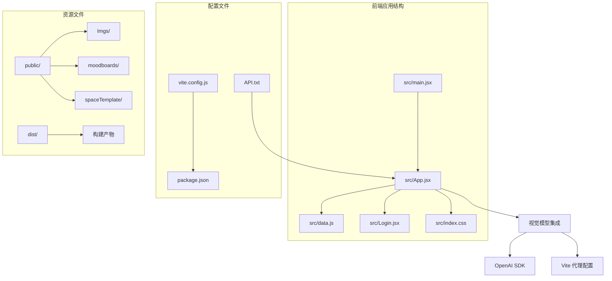
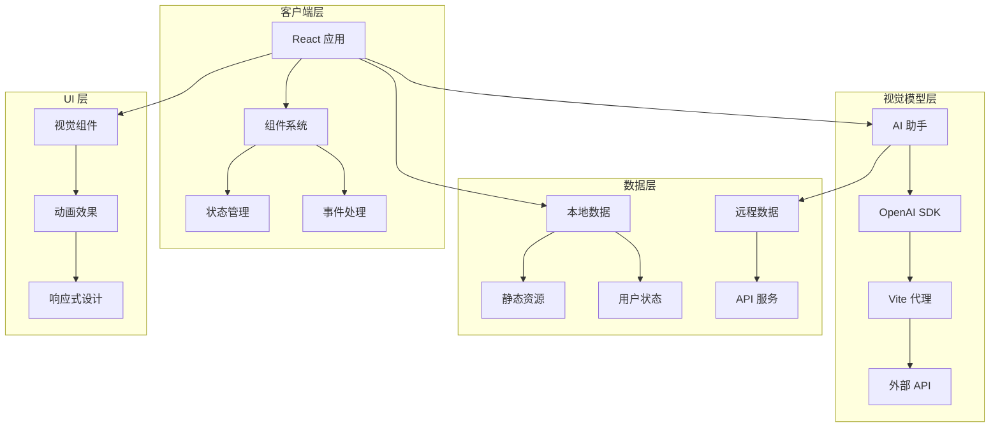
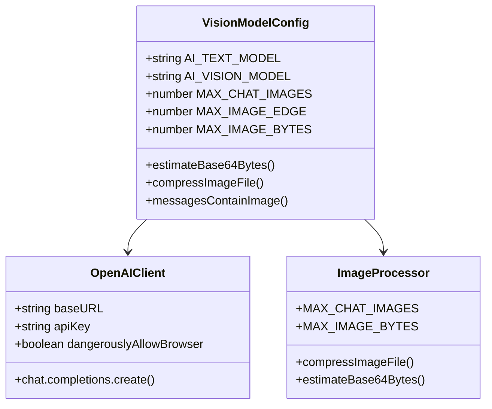
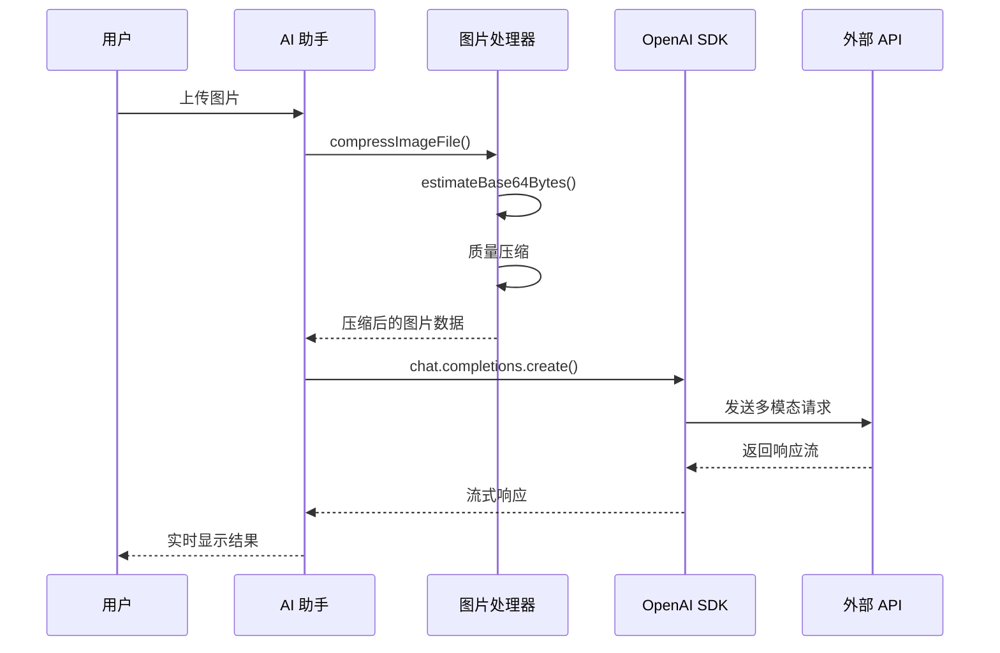
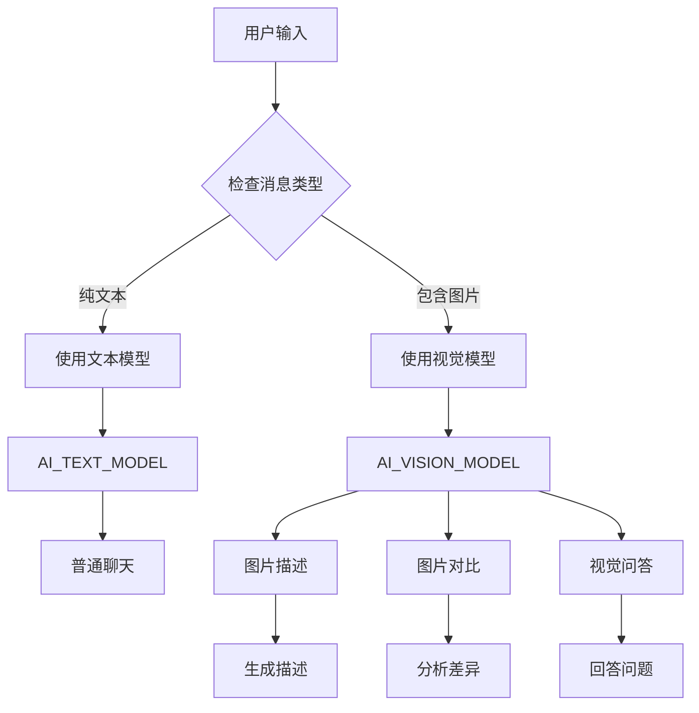
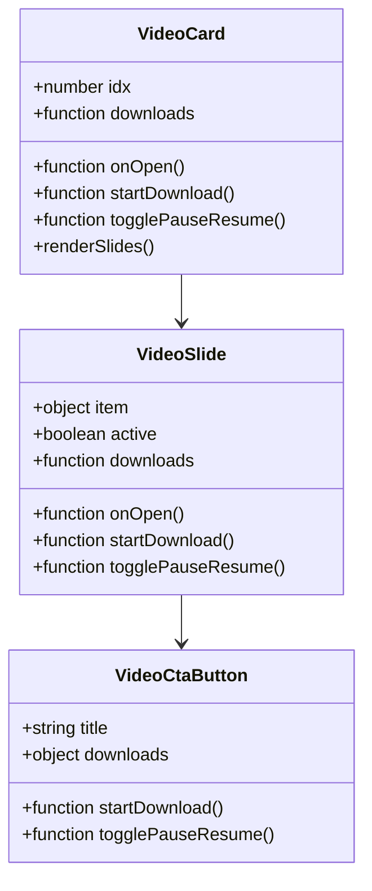
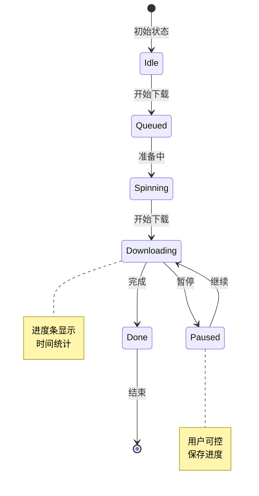
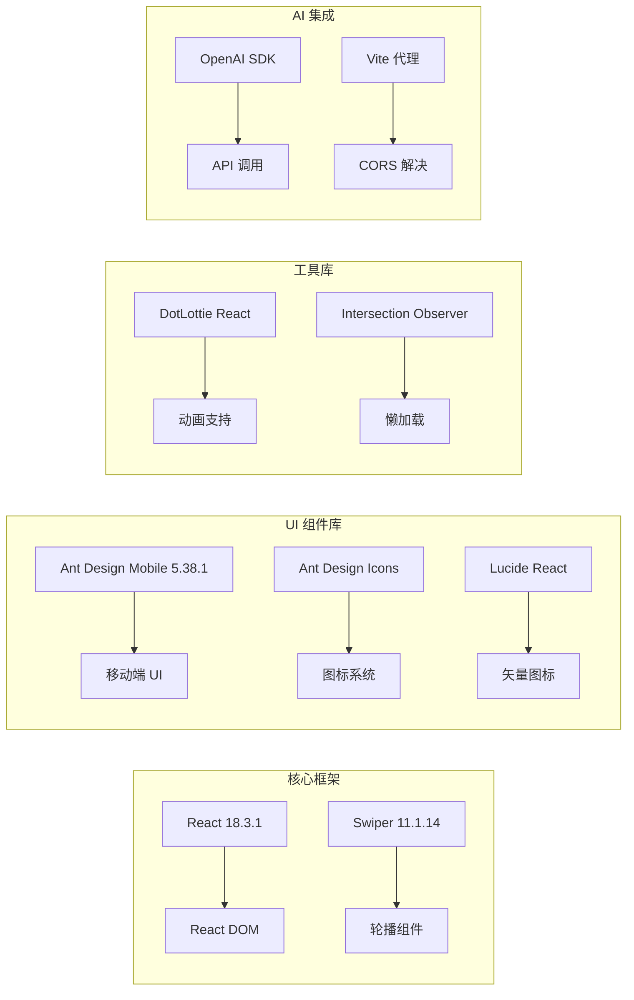
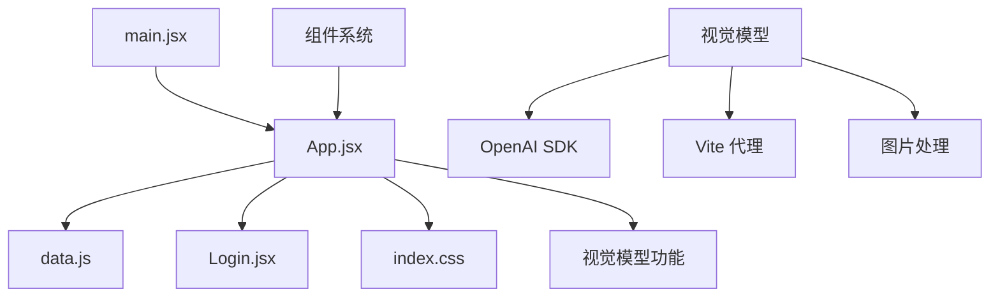
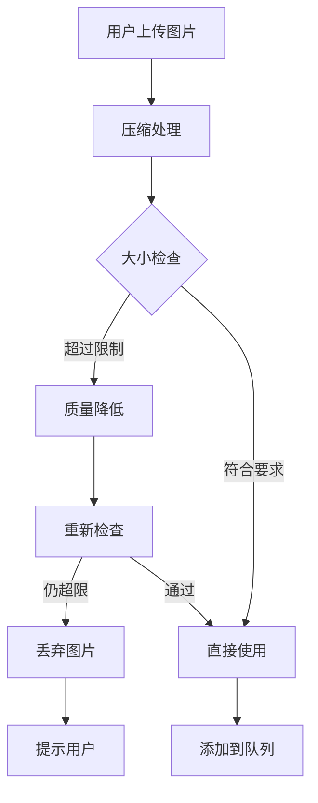

# 视觉模型请求文档

<cite>
**本文档引用的文件**
- [App.jsx](file://src/App.jsx)
- [main.jsx](file://src/main.jsx)
- [data.js](file://src/data.js)
- [Login.jsx](file://src/Login.jsx)
- [index.css](file://src/index.css)
- [package.json](file://package.json)
- [vite.config.js](file://vite.config.js)
- [API.txt](file://API.txt)
- [视觉模型请求文档.md](file://视觉模型请求文档.md)
</cite>

## 目录
1. [项目概述](#项目概述)
2. [项目结构](#项目结构)
3. [核心组件](#核心组件)
4. [架构概览](#架构概览)
5. [详细组件分析](#详细组件分析)
6. [依赖关系分析](#依赖关系分析)
7. [性能考虑](#性能考虑)
8. [故障排除指南](#故障排除指南)
9. [结论](#结论)

## 项目概述

这是一个基于 React 和 Vite 构建的家装设计应用，名为 "Cuba Zone"。该应用提供了丰富的视觉内容展示功能，包括视频轮播、杂志封面、空间展示、单品故事等多种内容形式。项目的核心特色在于集成了视觉语言模型（Vision-Language Model, VLM）功能，允许用户上传图片并与 AI 助手进行多模态交互。

应用采用现代化的设计理念，提供沉浸式的视觉体验，支持多种内容消费模式，包括当期内容、推荐内容和个人收藏等功能。

## 项目结构

**图表来源**
- [main.jsx:1-12](file://src/main.jsx#L1-L12)
- [App.jsx:1-800](file://src/App.jsx#L1-L800)
- [vite.config.js:1-20](file://vite.config.js#L1-L20)

**章节来源**
- [main.jsx:1-12](file://src/main.jsx#L1-L12)
- [package.json:1-27](file://package.json#L1-L27)
- [vite.config.js:1-20](file://vite.config.js#L1-L20)

## 核心组件

### 主应用组件 (App.jsx)

应用的核心组件位于 `src/App.jsx`，包含了完整的应用逻辑和界面结构。主要功能包括：

- **内容展示系统**：支持视频轮播、杂志封面、空间展示、单品故事等多种内容形式
- **导航系统**：提供当期、推荐、个人中心三个主要导航标签
- **搜索功能**：集成搜索框和搜索历史管理
- **下载系统**：完整的离线下载队列管理
- **AI 助手**：集成视觉语言模型的聊天功能

### 数据管理系统 (data.js)

负责管理应用中的静态数据，包括：

- **媒体资源**：视频 URL、图片资源、封面图片
- **内容模板**：视频内容、杂志内容、故事内容、空间内容、列表内容、画廊内容
- **用户数据**：我的收藏、浏览历史、个人统计

### 登录系统 (Login.jsx)

提供完整的用户认证流程，包括：

- **多阶段登录**：邮箱/手机号输入、验证码验证、注册、企业登录
- **用户体验优化**：沉浸式封面、底部弹出式登录面板
- **安全机制**：验证码验证、错误处理

**章节来源**
- [App.jsx:1-800](file://src/App.jsx#L1-L800)
- [data.js:1-176](file://src/data.js#L1-L176)
- [Login.jsx:1-463](file://src/Login.jsx#L1-L463)

## 架构概览

**图表来源**
- [App.jsx:1390-1405](file://src/App.jsx#L1390-L1405)
- [vite.config.js:9-16](file://vite.config.js#L9-L16)
- [package.json:11-21](file://package.json#L11-L21)

应用采用分层架构设计，确保了良好的可维护性和扩展性。视觉模型功能通过代理层与外部 API 通信，避免了浏览器 CORS 限制。

## 详细组件分析

### 视觉语言模型集成

应用集成了先进的视觉语言模型功能，支持用户上传图片并与 AI 助手进行多模态交互。

#### 模型配置

**图表来源**
- [App.jsx:1390-1405](file://src/App.jsx#L1390-L1405)
- [App.jsx:1406-1451](file://src/App.jsx#L1406-L1451)
- [App.jsx:1453-1466](file://src/App.jsx#L1453-L1466)

#### 图片处理流程

**图表来源**
- [App.jsx:1926-1952](file://src/App.jsx#L1926-L1952)
- [App.jsx:1784-1800](file://src/App.jsx#L1784-L1800)

#### 多模态消息处理

应用支持复杂的多模态消息格式，包括文本和图片的组合输入：

**图表来源**
- [App.jsx:1784-1790](file://src/App.jsx#L1784-L1790)
- [App.jsx:1453-1466](file://src/App.jsx#L1453-L1466)

### 内容展示系统

应用提供了多种内容展示形式，每种都有独特的交互体验：

#### 视频轮播组件

**图表来源**
- [App.jsx:555-592](file://src/App.jsx#L555-L592)
- [App.jsx:461-553](file://src/App.jsx#L461-L553)
- [App.jsx:400-459](file://src/App.jsx#L400-L459)

#### 杂志封面组件

支持静态和动态的杂志封面展示，提供丰富的视觉层次：

- **封面展示**：精美的杂志封面图片
- **品牌信息**：品牌名称、描述、徽章
- **交互功能**：点击查看详情、CTA 按钮

#### 空间展示组件

提供沉浸式的空间展示体验：

- **全屏背景**：高质量的空间图片
- **渐变覆盖**：提升文字可读性的渐变层
- **文本层**：标题、副标题、描述信息

### 下载系统

应用实现了完整的离线下载功能，支持多种内容类型的下载管理：

**图表来源**
- [App.jsx:3088-3204](file://src/App.jsx#L3088-L3204)
- [App.jsx:3206-3244](file://src/App.jsx#L3206-L3244)

**章节来源**
- [App.jsx:555-592](file://src/App.jsx#L555-L592)
- [App.jsx:461-553](file://src/App.jsx#L461-L553)
- [App.jsx:400-459](file://src/App.jsx#L400-L459)
- [App.jsx:3088-3204](file://src/App.jsx#L3088-L3204)

## 依赖关系分析

### 外部依赖

应用使用了现代化的前端技术栈，主要依赖包括：

**图表来源**
- [package.json:11-21](file://package.json#L11-L21)

### 内部模块依赖

**图表来源**
- [main.jsx:1-12](file://src/main.jsx#L1-L12)
- [App.jsx:1-800](file://src/App.jsx#L1-L800)

**章节来源**
- [package.json:11-21](file://package.json#L11-L21)
- [main.jsx:1-12](file://src/main.jsx#L1-L12)

## 性能考虑

### 图片优化策略

应用采用了多层次的图片优化策略：

1. **尺寸控制**：最大边长限制为 1280px
2. **文件大小限制**：最大 600KB
3. **质量压缩**：自动调整 JPEG 质量
4. **格式优化**：优先使用 JPEG 格式

### 流式处理

AI 响应采用流式处理机制：

- **实时显示**：响应内容实时显示，无需等待完整响应
- **超时保护**：1.5秒看门狗机制防止死锁
- **错误恢复**：完善的错误处理和重试机制

### 内存管理

**图表来源**
- [App.jsx:1443-1451](file://src/App.jsx#L1443-L1451)

## 故障排除指南

### 常见问题及解决方案

#### CORS 问题

**问题描述**：浏览器阻止跨域请求
**解决方案**：使用 Vite 代理配置解决 CORS 限制

#### 图片上传失败

**问题描述**：图片无法上传或显示
**解决方案**：
1. 检查图片格式（仅支持图片文件）
2. 确认图片大小不超过限制
3. 验证网络连接

#### AI 助手无响应

**问题描述**：AI 响应长时间无显示
**解决方案**：
1. 检查网络连接
2. 验证 API 密钥配置
3. 查看浏览器控制台错误信息

#### 下载功能异常

**问题描述**：下载队列无法正常工作
**解决方案**：
1. 检查存储权限
2. 清理浏览器缓存
3. 重启应用

**章节来源**
- [vite.config.js:9-16](file://vite.config.js#L9-L16)
- [App.jsx:1815-1822](file://src/App.jsx#L1815-L1822)

## 结论

该项目是一个功能完整、架构清晰的现代家装设计应用。其核心优势包括：

1. **创新的视觉模型集成**：支持多模态交互，提供智能化的视觉内容处理能力
2. **优秀的用户体验**：流畅的动画效果、直观的交互设计
3. **完善的下载系统**：支持离线内容消费
4. **现代化的技术栈**：基于 React 和 Vite 的高性能应用

项目的视觉模型功能特别值得关注，它不仅支持基础的图片上传和描述功能，还能处理复杂的多模态交互场景，为用户提供更加丰富的视觉内容体验。通过合理的性能优化和错误处理机制，确保了应用的稳定性和可靠性。