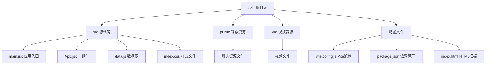
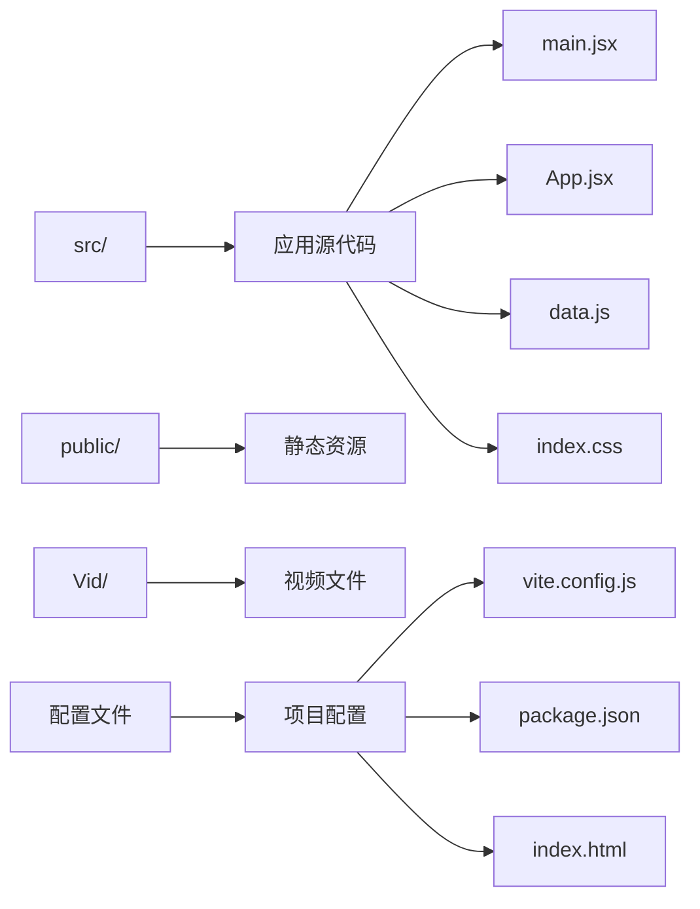
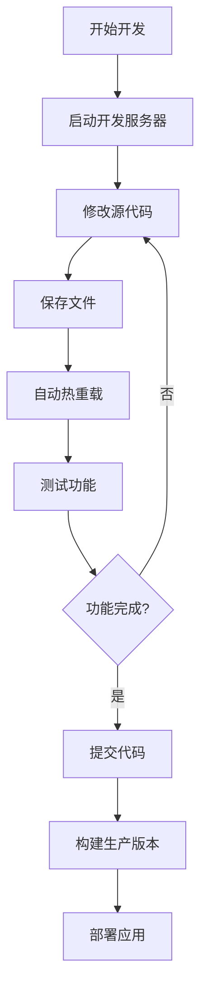

# 快速开始

<cite>
**本文档引用的文件**
- [package.json](file://package.json)
- [vite.config.js](file://vite.config.js)
- [index.html](file://index.html)
- [src/main.jsx](file://src/main.jsx)
- [src/App.jsx](file://src/App.jsx)
- [src/data.js](file://src/data.js)
- [src/index.css](file://src/index.css)
</cite>

## 目录
1. [简介](#简介)
2. [项目结构](#项目结构)
3. [环境要求](#环境要求)
4. [安装步骤](#安装步骤)
5. [开发服务器](#开发服务器)
6. [构建生产版本](#构建生产版本)
7. [预览应用](#预览应用)
8. [目录结构详解](#目录结构详解)
9. [关键文件说明](#关键文件说明)
10. [常见开发工作流程](#常见开发工作流程)
11. [调试技巧](#调试技巧)
12. [故障排除](#故障排除)
13. [总结](#总结)

## 简介

NewSquare 是一个基于 React 和 Vite 构建的现代化家装灵感应用。该项目展示了丰富的交互设计，包括轮播卡片、视频播放、详情页展开等高级功能。应用采用了最新的前端技术栈，提供了流畅的移动端体验和优雅的视觉效果。

## 项目结构



**图表来源**
- [package.json:1-25](file://package.json#L1-L25)
- [vite.config.js:1-11](file://vite.config.js#L1-L11)
- [index.html:1-16](file://index.html#L1-L16)

## 环境要求

### Node.js 版本要求
- **最低版本**: Node.js 16.0.0 或更高版本
- **推荐版本**: Node.js 18.x 或 20.x

### 开发工具
- **包管理器**: npm 8.0.0+ 或 yarn 1.0+
- **IDE**: VS Code（推荐）
- **浏览器**: Chrome 90+（用于开发调试）

## 安装步骤

### 步骤 1: 克隆项目
```bash
git clone https://github.com/your-repo/NewSquare.git
cd NewSquare
```

### 步骤 2: 安装依赖
```bash
npm install
```

**章节来源**
- [package.json:11-23](file://package.json#L11-L23)

### 步骤 3: 验证安装
```bash
npm run dev
```
访问 `http://localhost:5173` 查看应用是否正常运行

## 开发服务器

### 启动开发服务器
```bash
npm run dev
```

### 开发服务器配置
- **主机地址**: `0.0.0.0`（允许局域网访问）
- **端口号**: `5173`
- **热重载**: 自动刷新
- **代理支持**: 内置开发代理

### 远程访问设置
如果需要从其他设备访问开发服务器：
```bash
npm run dev -- --host
```

**章节来源**
- [vite.config.js:6-9](file://vite.config.js#L6-L9)
- [package.json:7](file://package.json#L7)

## 构建生产版本

### 生产构建
```bash
npm run build
```

### 构建输出
- **输出目录**: `dist/`
- **构建优化**: 代码压缩、资源优化
- **静态资源**: 自动哈希命名

### 构建产物说明
- `dist/index.html`: 主页面文件
- `dist/assets/`: 静态资源文件
- `dist/[hash].css`: 样式文件
- `dist/[hash].js`: JavaScript文件

**章节来源**
- [package.json:8](file://package.json#L8)

## 预览应用

### 本地预览
```bash
npm run preview
```

### 预览配置
- **主机地址**: `0.0.0.0`
- **端口号**: `4173`（默认预览端口）
- **静态服务器**: Vite 内置静态文件服务器

### 生产环境部署
```bash
# 构建生产版本
npm run build

# 启动预览服务器
npm run preview
```

**章节来源**
- [package.json:9](file://package.json#L9)

## 目录结构详解

### 核心目录说明



**图表来源**
- [src/main.jsx:1-12](file://src/main.jsx#L1-L12)
- [src/App.jsx:1-1060](file://src/App.jsx#L1-L1060)
- [src/data.js:1-175](file://src/data.js#L1-L175)
- [src/index.css:1-1601](file://src/index.css#L1-L1601)

### 目录详细说明

#### `src/` 目录
- **main.jsx**: 应用入口文件，负责初始化 React 应用
- **App.jsx**: 主应用组件，包含所有业务逻辑
- **data.js**: 数据源文件，提供各类内容数据
- **index.css**: 全局样式文件，定义设计系统

#### `public/` 目录
- 存放静态资源文件
- 开发服务器会直接提供这些文件

#### `Vid/` 目录
- 存放视频资源文件
- 用于演示视频播放功能

## 关键文件说明

### 应用入口文件 (`src/main.jsx`)

应用入口文件负责：
- 导入 React 和 ReactDOM
- 加载全局样式和主题
- 渲染根组件到 DOM

### 主应用组件 (`src/App.jsx`)

主应用组件包含：
- 头部导航系统
- 期刊封面浏览
- 多种卡片组件
- 详情页展开动画
- 搜索功能实现

### 数据源文件 (`src/data.js`)

数据源文件提供：
- 视频URL列表
- 图片资源函数
- 各类内容数据
- 示例数据集合

### 样式文件 (`src/index.css`)

样式文件定义：
- 字体系统和排版规范
- 组件样式规范
- 动画和过渡效果
- 响应式设计

**章节来源**
- [src/main.jsx:1-12](file://src/main.jsx#L1-L12)
- [src/App.jsx:1-1060](file://src/App.jsx#L1-L1060)
- [src/data.js:1-175](file://src/data.js#L1-L175)
- [src/index.css:1-1601](file://src/index.css#L1-L1601)

## 常见开发工作流程

### 开发流程图



### 日常开发任务

#### 添加新功能
1. 分析现有组件结构
2. 创建新的组件文件
3. 更新路由配置
4. 测试功能完整性

#### 修改样式
1. 查找相关样式规则
2. 修改 CSS 变量
3. 测试响应式效果
4. 保持设计一致性

#### 性能优化
1. 分析 bundle 大小
2. 实施代码分割
3. 优化图片资源
4. 减少不必要的重渲染

## 调试技巧

### 开发调试

#### 浏览器开发者工具
- **Elements面板**: 检查DOM结构和样式
- **Console面板**: 查看JavaScript错误和日志
- **Sources面板**: 设置断点调试
- **Network面板**: 监控资源加载

#### React DevTools
- 检查组件树结构
- 分析组件状态变化
- 跟踪性能问题

### 常见问题排查

#### 页面无法加载
```bash
# 检查端口占用
netstat -ano | findstr :5173

# 重启开发服务器
npm run dev
```

#### 样式不生效
```bash
# 清除缓存
npm run build -- --mode development

# 检查CSS导入路径
```

#### 组件渲染异常
```javascript
// 在组件中添加调试信息
console.log('组件渲染:', props);
```

## 故障排除

### 环境问题

#### Node.js 版本不兼容
```bash
# 检查 Node.js 版本
node --version

# 升级到推荐版本
# 使用 nvm 管理 Node.js 版本
nvm install 18
nvm use 18
```

#### 依赖安装失败
```bash
# 清理缓存
npm cache clean --force

# 删除 node_modules 和 package-lock.json
rm -rf node_modules package-lock.json

# 重新安装
npm install
```

### 开发服务器问题

#### 端口冲突
```bash
# 更改端口号
npm run dev -- --port 5174

# 或者杀死占用进程
taskkill /PID <进程号> /F
```

#### 热重载失效
```bash
# 重启开发服务器
npm run dev

# 检查文件监听权限
```

### 构建问题

#### 构建失败
```bash
# 检查语法错误
npm run build -- --mode development

# 清理构建缓存
rm -rf dist
```

#### 预览服务器问题
```bash
# 检查构建输出
ls -la dist/

# 重新构建
npm run build
npm run preview
```

## 总结

NewSquare 项目为开发者提供了一个完整的现代化前端应用示例。通过本指南，您应该能够：

1. **快速搭建开发环境** - 安装 Node.js 和项目依赖
2. **启动开发服务器** - 使用 Vite 提供的热重载功能
3. **理解项目结构** - 掌握 React + Vite 的最佳实践
4. **进行日常开发** - 添加新功能、修改样式、调试问题
5. **构建生产版本** - 生成优化后的部署文件

### 下一步建议

- 探索 `src/App.jsx` 中的各种组件实现
- 查看 `src/data.js` 中的数据结构
- 研究 `src/index.css` 中的设计系统
- 实现自定义功能和样式修改

记住，这是一个开源项目，欢迎贡献代码和提出改进建议。祝您开发愉快！