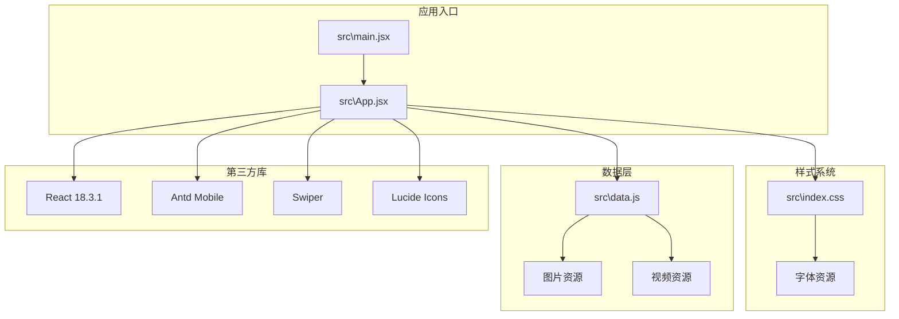
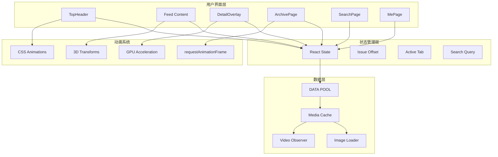
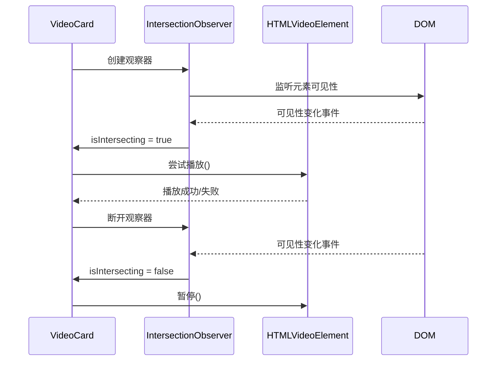
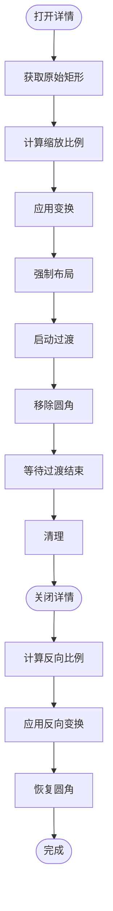
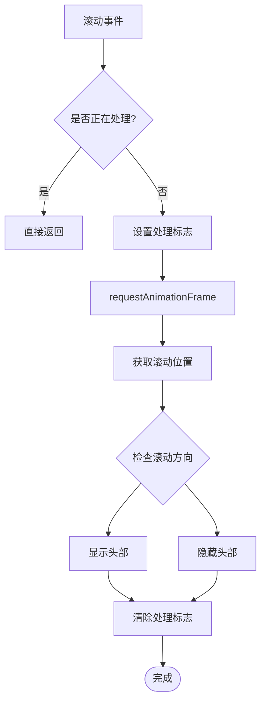
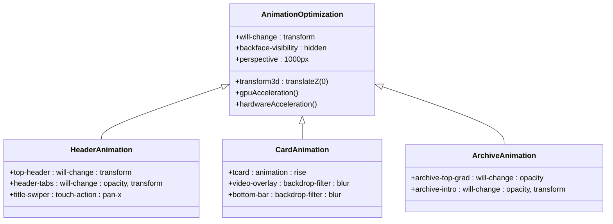
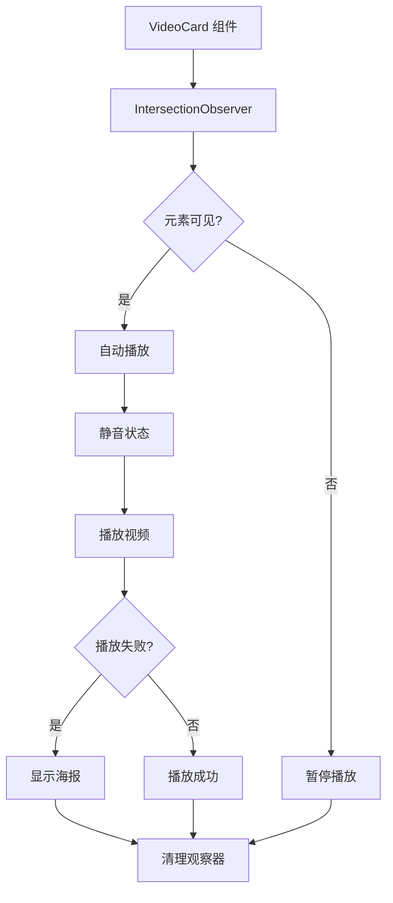

# 性能优化

<cite>
**本文引用的文件**
- [src\App.jsx](file://src\App.jsx)
- [src\main.jsx](file://src\main.jsx)
- [src\index.css](file://src\index.css)
- [src\data.js](file://src\data.js)
- [package.json](file://package.json)
- [vite.config.js](file://vite.config.js)
</cite>

## 目录
1. [简介](#简介)
2. [项目结构](#项目结构)
3. [核心组件](#核心组件)
4. [架构概览](#架构概览)
5. [详细组件分析](#详细组件分析)
6. [依赖分析](#依赖分析)
7. [性能考虑](#性能考虑)
8. [故障排除指南](#故障排除指南)
9. [结论](#结论)

## 简介

NewSquare 是一个专注于家居生活内容展示的 React 应用，通过精心设计的性能优化策略实现了流畅的用户体验。该项目采用了多种先进的性能优化技术，包括懒加载、动画性能优化、内存管理和移动端适配。

该应用的核心特点：
- 基于 React 18.3.1 和 Vite 构建
- 集成了 Swiper 进行高性能滑动体验
- 实现了 IntersectionObserver 进行智能媒体加载
- 采用 CSS 硬件加速优化动画性能
- 提供完整的移动端性能优化方案

## 项目结构



**图表来源**
- [src\main.jsx:1-12](file://src\main.jsx#L1-L12)
- [src\App.jsx:1-16](file://src\App.jsx#L1-L16)
- [package.json:11-19](file://package.json#L11-L19)

**章节来源**
- [src\main.jsx:1-12](file://src\main.jsx#L1-L12)
- [package.json:1-25](file://package.json#L1-L25)

## 核心组件

### 主要组件架构

NewSquare 采用模块化组件设计，主要包含以下核心组件：

1. **TopHeader** - 顶部导航组件，支持期次切换和搜索功能
2. **ArchivePage** - 期刊封面档案页面
3. **卡片组件系列** - 包括视频卡、杂志卡、故事卡、空间卡、列表卡、画廊卡
4. **DetailOverlay** - 详情弹窗组件
5. **SearchPage** - 搜索页面
6. **MePage** - 个人中心页面

### 组件性能特征

每个组件都经过专门的性能优化设计：

- **懒加载实现**：使用 IntersectionObserver 监控视频元素可见性
- **状态管理优化**：合理使用 useState 和 useEffect 避免不必要的重渲染
- **内存管理**：及时清理事件监听器和观察器
- **渲染优化**：使用 requestAnimationFrame 进行动画同步

**章节来源**
- [src\App.jsx:67-205](file://src\App.jsx#L67-L205)
- [src\App.jsx:208-285](file://src\App.jsx#L208-L285)
- [src\App.jsx:287-589](file://src\App.jsx#L287-L589)

## 架构概览



**图表来源**
- [src\App.jsx:976-1112](file://src\App.jsx#L976-L1112)
- [src\App.jsx:307-322](file://src\App.jsx#L307-L322)
- [src\App.jsx:624-650](file://src\App.jsx#L624-L650)

## 详细组件分析

### 视频卡组件性能分析

视频卡组件实现了智能的懒加载机制：



**图表来源**
- [src\App.jsx:288-367](file://src\App.jsx#L288-L367)
- [src\App.jsx:313-322](file://src\App.jsx#L313-L322)

#### 性能优化要点

1. **IntersectionObserver 使用**：阈值设置为 0.4，确保视频在接近视口时才开始加载
2. **自动播放控制**：使用 IntersectionObserver 控制视频的自动播放行为
3. **内存管理**：组件卸载时及时断开观察器连接
4. **错误处理**：视频加载失败时降级到海报图显示

**章节来源**
- [src\App.jsx:288-367](file://src\App.jsx#L288-L367)

### 详情弹窗动画优化

详情弹窗实现了流畅的缩放过渡效果：



**图表来源**
- [src\App.jsx:590-657](file://src\App.jsx#L590-L657)
- [src\App.jsx:624-650](file://src\App.jsx#L624-L650)

#### 动画性能优化

1. **双 requestAnimationFrame**：确保首帧布局生效后再启动过渡
2. **硬件加速**：使用 transform 属性而非 top/left
3. **过渡优化**：使用 cubic-bezier 缓动函数
4. **边界处理**：兼容 transitionend 事件未触发的情况

**章节来源**
- [src\App.jsx:590-657](file://src\App.jsx#L590-L657)

### 滚动性能优化

应用实现了高效的滚动监听机制：



**图表来源**
- [src\App.jsx:993-1008](file://src\App.jsx#L993-L1008)
- [src\App.jsx:213-227](file://src\App.jsx#L213-L227)

#### 滚动优化策略

1. **节流机制**：使用 ticking 标志防止重复处理
2. **requestAnimationFrame**：确保动画同步
3. **被动事件监听器**：使用 {passive: true} 提升滚动性能
4. **条件渲染**：根据滚动位置动态显示/隐藏头部

**章节来源**
- [src\App.jsx:993-1008](file://src\App.jsx#L993-L1008)
- [src\App.jsx:213-227](file://src\App.jsx#L213-L227)

### CSS 动画性能优化

应用广泛使用了高性能的 CSS 动画技术：



**图表来源**
- [src\index.css:98-104](file://src\index.css#L98-L104)
- [src\index.css:125-126](file://src\index.css#L125-L126)
- [src\index.css:293-294](file://src\index.css#L293-L294)
- [src\index.css:507-508](file://src\index.css#L507-L508)
- [src\index.css:556-557](file://src\index.css#L556-L557)

#### CSS 性能优化技术

1. **will-change 属性**：提前告知浏览器元素将发生变化
2. **backdrop-filter**：使用硬件加速的滤镜效果
3. **transform3d**：启用 GPU 加速
4. **touch-action**：优化触摸交互性能
5. **perspective**：提升 3D 变换性能

**章节来源**
- [src\index.css:98-104](file://src\index.css#L98-L104)
- [src\index.css:598-633](file://src\index.css#L598-L633)

## 依赖分析

### 核心依赖关系

```mermaid
graph TB
subgraph "运行时依赖"
React[react: ^18.3.1]
ReactDOM[react-dom: ^18.3.1]
AntdMobile[antd-mobile: ^5.38.1]
Icons[antd-mobile-icons: ^0.3.0]
Lucide[lucide-react: ^1.14.0]
Swiper[swiper: ^11.1.14]
Intersect[react-intersection-observer: ^9.13.1]
end
subgraph "开发依赖"
Vite[vite: ^5.4.10]
ReactPlugin[@vitejs/plugin-react: ^4.3.3]
end
subgraph "应用代码"
App[src\App.jsx]
Main[src\main.jsx]
CSS[src\index.css]
Data[src\data.js]
end
App --> React
App --> ReactDOM
App --> AntdMobile
App --> Icons
App --> Lucide
App --> Swiper
App --> Intersect
Main --> App
CSS --> App
Data --> App
Vite --> ReactPlugin
```

**图表来源**
- [package.json:11-23](file://package.json#L11-L23)
- [src\App.jsx:1-6](file://src\App.jsx#L1-L6)

### 性能相关依赖特性

1. **React 18.3.1**：提供并发特性和自动批处理
2. **Swiper 11.1.14**：高性能滑动组件，支持硬件加速
3. **IntersectionObserver**：浏览器原生懒加载支持
4. **Vite 5.4.10**：快速构建工具，支持热更新

**章节来源**
- [package.json:11-23](file://package.json#L11-L23)

## 性能考虑

### 懒加载实现策略

#### 图片懒加载

应用使用了智能的图片加载策略：

1. **响应式图片**：根据设备像素密度选择合适的图片尺寸
2. **CDN 优化**：使用 Unsplash CDN 提供压缩后的图片
3. **预加载策略**：根据滚动位置动态加载图片

#### 视频懒加载



**图表来源**
- [src\App.jsx:307-322](file://src\App.jsx#L307-L322)
- [src\App.jsx:344-347](file://src\App.jsx#L344-L347)

#### 内存管理最佳实践

1. **事件监听器清理**：组件卸载时及时移除监听器
2. **观察器断开**：使用 IntersectionObserver 时注意断开连接
3. **定时器清理**：及时清理 setTimeout 和 setInterval
4. **DOM 引用管理**：使用 useRef 管理 DOM 引用

**章节来源**
- [src\App.jsx:307-322](file://src\App.jsx#L307-L322)
- [src\App.jsx:213-227](file://src\App.jsx#L213-L227)

### 动画性能优化

#### 硬件加速技术

应用广泛使用了硬件加速技术：

1. **transform 属性**：使用 translate3d 而非 top/left
2. **backdrop-filter**：利用 GPU 处理滤镜效果
3. **will-change**：提前告知浏览器元素将发生变化
4. **perspective**：提升 3D 变换性能

#### 动画优化策略

1. **requestAnimationFrame**：确保动画与浏览器刷新率同步
2. **cubic-bezier 缓动函数**：提供自然的动画效果
3. **GPU 加速**：启用硬件加速渲染
4. **动画合成**：避免触发布局和绘制

**章节来源**
- [src\index.css:598-633](file://src\index.css#L598-L633)
- [src\App.jsx:624-650](file://src\App.jsx#L624-L650)

### 内存管理优化

#### 组件生命周期管理

1. **useEffect 清理**：确保清理所有订阅和监听器
2. **useRef 优化**：避免不必要的重新渲染
3. **状态最小化**：只存储必要的状态数据
4. **批量更新**：使用 React 18 的自动批处理

#### 资源释放策略

1. **视频资源**：离开可视区域时暂停播放
2. **图片资源**：不再需要时释放内存
3. **事件监听器**：组件卸载时及时移除
4. **定时器**：清理所有定时任务

**章节来源**
- [src\App.jsx:307-322](file://src\App.jsx#L307-L322)
- [src\App.jsx:213-227](file://src\App.jsx#L213-L227)

### 移动端性能优化

#### 触摸交互优化

1. **touch-action 属性**：精确控制触摸行为
2. **passive 事件监听器**：提升滚动性能
3. **viewport 优化**：适配不同设备尺寸
4. **硬件加速**：充分利用移动设备 GPU

#### 移动端特殊考虑

1. **电池优化**：减少后台活动
2. **网络优化**：智能缓存策略
3. **内存限制**：注意移动设备内存限制
4. **性能监控**：实时监控性能指标

**章节来源**
- [src\index.css:354-356](file://src\index.css#L354-L356)
- [src\index.css:413-414](file://src\index.css#L413-L414)

## 故障排除指南

### 性能监控方法

#### 开发者工具使用

1. **Chrome DevTools**
   - Performance 面板：录制和分析性能
   - Memory 面板：监控内存使用情况
   - Lighthouse：自动化性能审计

2. **React DevTools**
   - Profiler：分析组件渲染性能
   - Highlight Updates：可视化组件更新

#### 关键性能指标

1. **First Contentful Paint (FCP)**：首屏内容绘制时间
2. **Largest Contentful Paint (LCP)**：最大内容绘制时间
3. **First Input Delay (FID)**：首次输入延迟
4. **Cumulative Layout Shift (CLS)**：累积布局偏移

### 常见问题诊断

#### 滚动性能问题

**症状**：滚动时出现卡顿或掉帧

**解决方案**：
1. 检查 requestAnimationFrame 使用是否正确
2. 确认 passive 事件监听器配置
3. 验证 will-change 属性使用
4. 优化滚动容器层级

#### 动画性能问题

**症状**：动画出现撕裂或掉帧

**解决方案**：
1. 确保使用 transform 而非 top/left
2. 检查 GPU 加速是否启用
3. 验证动画持续时间和缓动函数
4. 减少动画元素数量

#### 内存泄漏问题

**症状**：页面长时间使用后内存持续增长

**解决方案**：
1. 检查 useEffect 清理函数
2. 确认事件监听器是否正确移除
3. 验证 IntersectionObserver 是否断开
4. 监控定时器使用情况

**章节来源**
- [src\App.jsx:307-322](file://src\App.jsx#L307-L322)
- [src\App.jsx:213-227](file://src\App.jsx#L213-L227)

### 调试工具使用指南

#### 性能分析工具

1. **Chrome Performance Panel**
   - 录制用户交互场景
   - 分析主线程占用情况
   - 识别长任务和阻塞操作

2. **Lighthouse Audit**
   - 自动化性能测试
   - 生成性能报告
   - 提供优化建议

3. **Memory Profiling**
   - 监控内存分配模式
   - 识别内存泄漏
   - 分析垃圾回收行为

#### 移动端调试

1. **Chrome DevTools 移动设备模式**
   - 模拟不同设备性能
   - 测试触摸交互
   - 分析移动端特定问题

2. **Safari Web Inspector**
   - iOS 设备调试
   - 内存使用分析
   - 网络请求监控

**章节来源**
- [src\App.jsx:307-322](file://src\App.jsx#L307-L322)
- [src\App.jsx:213-227](file://src\App.jsx#L213-L227)

## 结论

NewSquare 项目展示了现代前端应用的性能优化最佳实践。通过综合运用懒加载、硬件加速、内存管理和移动端适配等技术，实现了流畅的用户体验。

### 主要成就

1. **智能懒加载**：使用 IntersectionObserver 实现高效的媒体加载
2. **硬件加速**：充分利用 GPU 性能提升动画流畅度
3. **内存优化**：完善的资源管理和清理机制
4. **移动端适配**：针对移动设备的专门优化

### 技术亮点

- **React 18 并发特性**：利用自动批处理和 Suspense
- **CSS 硬件加速**：广泛使用 transform 和 backdrop-filter
- **高性能滑动**：Swiper 组件的深度优化
- **智能缓存**：CDN 和本地缓存策略

### 未来优化方向

1. **代码分割**：进一步拆分组件以实现更好的懒加载
2. **Web Workers**：处理复杂的计算任务
3. **Service Workers**：实现离线缓存和推送通知
4. **性能预算**：建立性能监控和预警机制

这个项目为其他前端应用提供了宝贵的性能优化参考，特别是在媒体内容展示和移动端体验方面具有重要的借鉴意义。