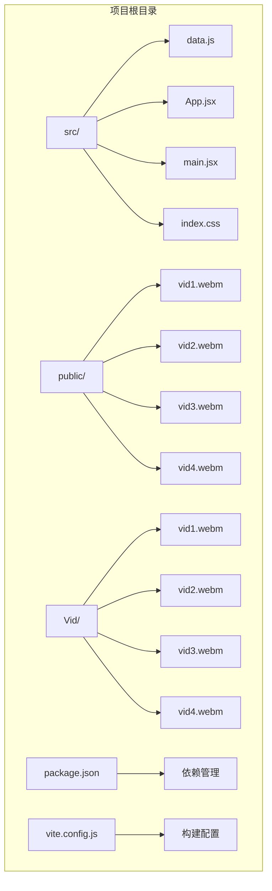
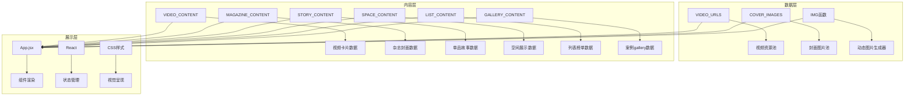
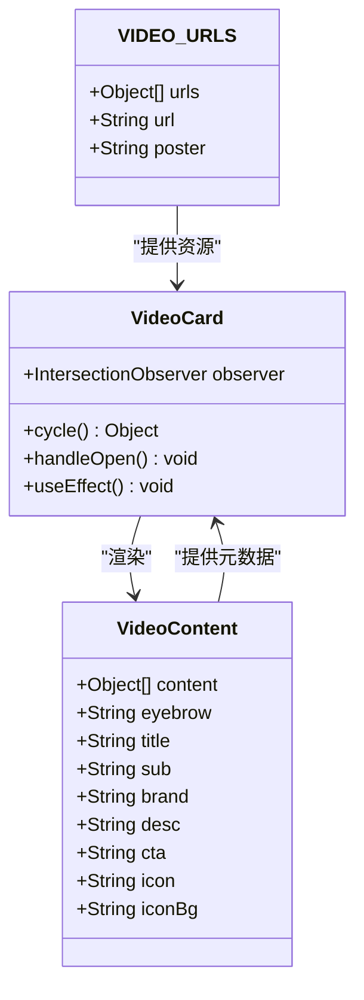
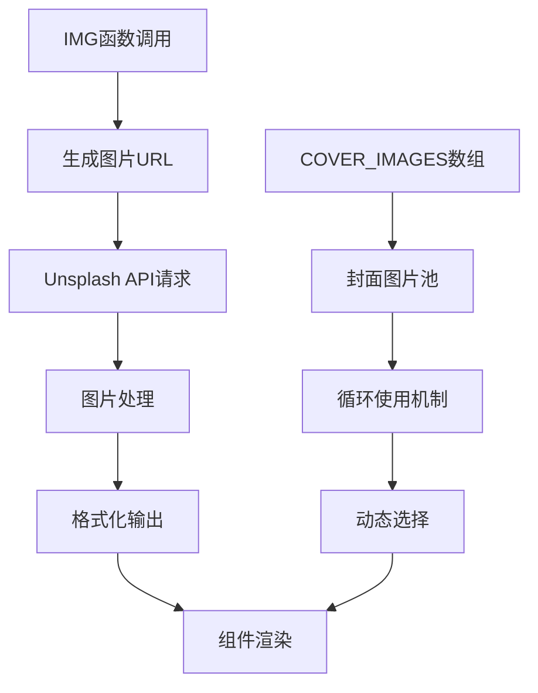
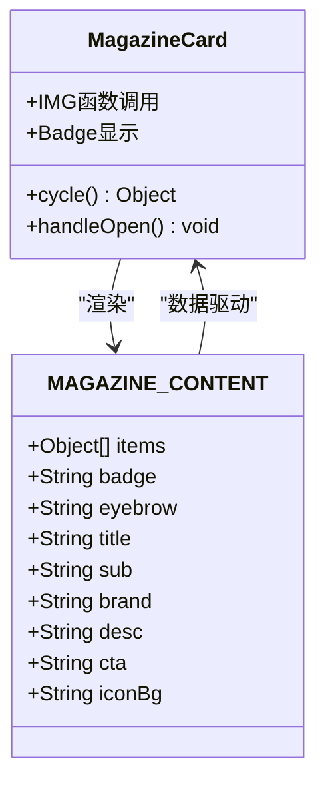
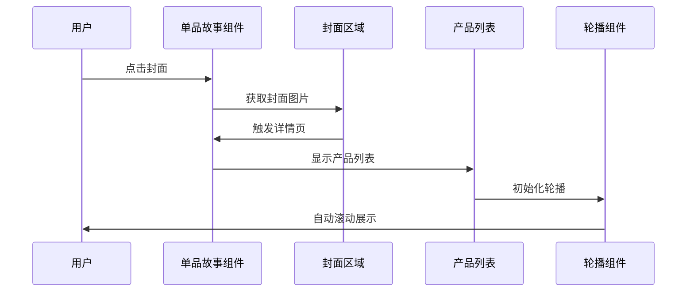
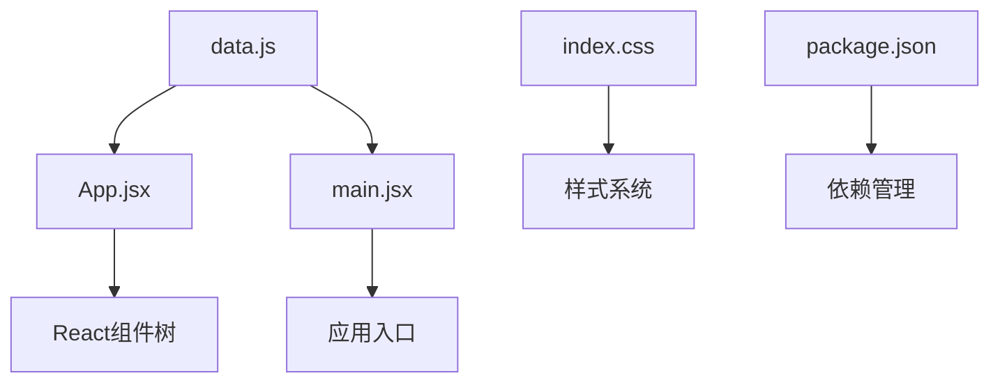
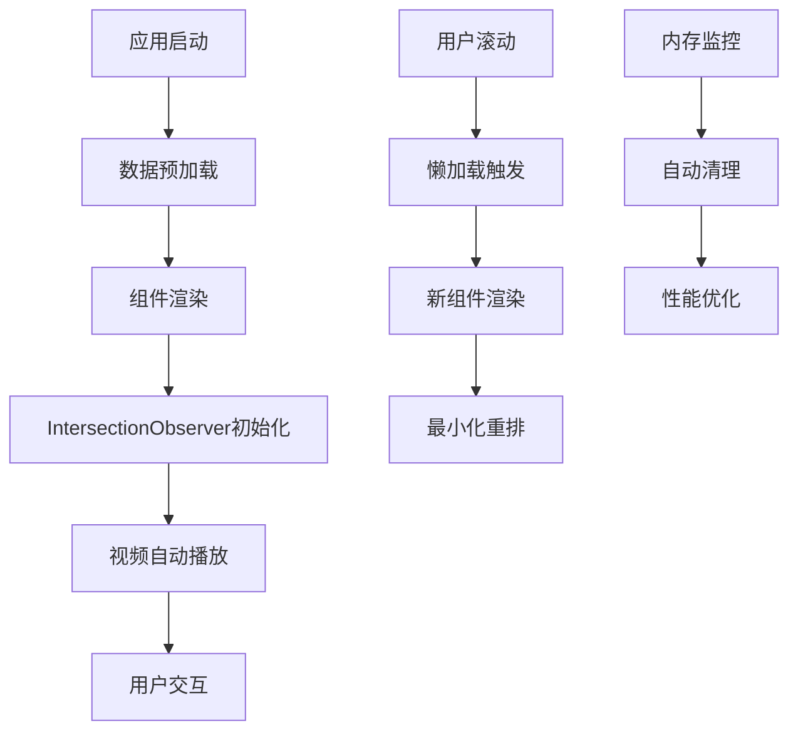

# 数据管理系统

<cite>
**本文档引用的文件**
- [data.js](file://src/data.js)
- [App.jsx](file://src/App.jsx)
- [main.jsx](file://src/main.jsx)
- [index.css](file://src/index.css)
- [package.json](file://package.json)
</cite>

## 目录
1. [简介](#简介)
2. [项目结构](#项目结构)
3. [核心组件](#核心组件)
4. [架构概览](#架构概览)
5. [详细组件分析](#详细组件分析)
6. [依赖分析](#依赖分析)
7. [性能考虑](#性能考虑)
8. [故障排除指南](#故障排除指南)
9. [结论](#结论)

## 简介

NewSquare 是一个专注于家居生活内容展示的移动端应用，采用 React + Vite 技术栈构建。该系统的核心是一个精心设计的数据管理系统，负责管理各类家居相关内容，包括视频、图片、文章和产品信息等。

该数据管理系统通过模块化的数据结构设计，实现了内容的高效组织和灵活展示。系统支持多种内容类型，包括视频卡片、杂志封面、单品故事、空间展示、列表榜单和案例 gallery 等，为用户提供丰富的视觉体验。

## 项目结构

项目采用现代化的前端项目结构，主要文件分布如下：



**图表来源**
- [data.js:1-175](file://src/data.js#L1-L175)
- [App.jsx:1-1112](file://src/App.jsx#L1-L1112)
- [main.jsx:1-12](file://src/main.jsx#L1-L12)

**章节来源**
- [package.json:1-25](file://package.json#L1-L25)
- [data.js:1-175](file://src/data.js#L1-L175)

## 核心组件

### 数据池架构

系统采用集中式数据池设计，所有内容数据都定义在单一的 `data.js` 文件中。这种设计提供了以下优势：

- **单一数据源**：所有组件共享同一份数据，确保数据一致性
- **易于维护**：数据变更只需在一个地方进行
- **性能优化**：避免重复的数据请求和处理逻辑

### 内容类型分类

系统支持七种主要的内容类型，每种类型都有其特定的数据结构和展示方式：

1. **视频内容** (`VIDEO_CONTENT`)
2. **杂志内容** (`MAGAZINE_CONTENT`)  
3. **单品故事** (`STORY_CONTENT`)
4. **空间展示** (`SPACE_CONTENT`)
5. **列表内容** (`LIST_CONTENT`)
6. **案例 gallery** (`GALLERY_CONTENT`)
7. **图片资源** (`COVER_IMAGES`, `IMG` 函数)

**章节来源**
- [data.js:33-175](file://src/data.js#L33-L175)

## 架构概览

系统采用分层架构设计，清晰分离了数据层、业务逻辑层和展示层：



**图表来源**
- [data.js:1-175](file://src/data.js#L1-L175)
- [App.jsx:11-15](file://src/App.jsx#L11-L15)

## 详细组件分析

### 视频管理系统

视频系统是 NewSquare 的核心功能之一，采用了本地资源管理和外部 API 集成相结合的策略。

#### 视频资源管理



**图表来源**
- [data.js:3-20](file://src/data.js#L3-L20)
- [data.js:33-46](file://src/data.js#L33-L46)
- [App.jsx:288-367](file://src/App.jsx#L288-L367)

视频系统的关键特性：

1. **本地资源优先**：所有视频文件都存储在 `public/` 目录下，确保快速加载
2. **智能播放控制**：使用 IntersectionObserver 实现懒加载和自动播放
3. **静音默认**：所有视频默认静音，符合移动端用户体验最佳实践
4. **跨平台兼容**：针对不同移动设备进行了专门的播放器配置

#### 图片资源管理

系统采用 Unsplash API 进行图片资源管理，提供了高质量的家居相关内容图片。



**图表来源**
- [data.js:22-31](file://src/data.js#L22-L31)
- [data.js:22-23](file://src/data.js#L22-L23)

图片系统的优化策略：

1. **CDN加速**：使用 Unsplash CDN 提供全球加速
2. **响应式尺寸**：根据组件需求动态调整图片尺寸
3. **质量控制**：统一的图片质量参数确保视觉一致性
4. **缓存策略**：浏览器自动缓存机制减少重复请求

**章节来源**
- [data.js:22-31](file://src/data.js#L22-L31)
- [App.jsx:288-367](file://src/App.jsx#L288-L367)

### 内容展示组件

系统实现了六种不同的内容展示组件，每种都有其独特的数据结构和交互模式。

#### 杂志封面组件



**图表来源**
- [data.js:48-61](file://src/data.js#L48-L61)
- [App.jsx:369-403](file://src/App.jsx#L369-L403)

#### 单品故事组件

单品故事组件是最复杂的内容类型，支持封面展示和产品列表的联动效果。



**图表来源**
- [data.js:63-99](file://src/data.js#L63-L99)
- [App.jsx:405-463](file://src/App.jsx#L405-L463)

**章节来源**
- [data.js:48-99](file://src/data.js#L48-L99)
- [App.jsx:369-463](file://src/App.jsx#L369-L463)

### 数据验证和错误处理

系统在数据层面实现了基本的验证和错误处理机制：

1. **数据完整性检查**：每个内容对象都包含必需字段
2. **资源降级策略**：视频加载失败时使用海报图片作为后备
3. **循环引用保护**：使用 `cycle` 函数防止数组越界
4. **异步加载容错**：IntersectionObserver 提供了优雅的降级方案

**章节来源**
- [App.jsx:17-32](file://src/App.jsx#L17-L32)
- [App.jsx:295-322](file://src/App.jsx#L295-L322)

## 依赖分析

### 外部依赖

系统使用了现代化的前端技术栈，主要依赖包括：

```mermaid
graph LR
subgraph "核心框架"
A[React 18.3.1] --> B[组件基础]
C[React DOM 18.3.1] --> D[DOM渲染]
end
subgraph "UI组件库"
E[antd-mobile 5.38.1] --> F[移动端组件]
G[antd-mobile-icons 0.3.0] --> H[图标系统]
I[lucide-react 1.14.0] --> J[SVG图标]
end
subgraph "多媒体"
K[swiper 11.11.14] --> L[轮播组件]
M[react-intersection-observer 9.13.1] --> N[视口检测]
end
subgraph "构建工具"
O[@vitejs/plugin-react 4.3.3] --> P[Vite构建]
Q[Vite 5.4.10] --> R[开发服务器]
end
```

**图表来源**
- [package.json:11-23](file://package.json#L11-L23)

### 内部依赖关系



**图表来源**
- [data.js:1-175](file://src/data.js#L1-L175)
- [App.jsx:1-12](file://src/App.jsx#L1-L12)
- [main.jsx:1-12](file://src/main.jsx#L1-L12)

**章节来源**
- [package.json:11-23](file://package.json#L11-L23)

## 性能考虑

### 数据加载优化

1. **本地资源优先**：视频文件直接从 `public/` 目录加载，避免网络延迟
2. **图片懒加载**：使用 IntersectionObserver 实现智能懒加载
3. **缓存策略**：浏览器自动缓存图片和视频资源
4. **内存管理**：组件卸载时自动清理观察者和事件监听器

### 渲染性能优化



**图表来源**
- [App.jsx:313-322](file://src/App.jsx#L313-L322)
- [App.jsx:652-656](file://src/App.jsx#L652-L656)

### 缓存策略最佳实践

1. **浏览器缓存**：静态资源自动缓存，减少重复请求
2. **组件状态缓存**：React 组件状态保持，避免重复计算
3. **图片尺寸缓存**：动态生成的图片尺寸结果缓存
4. **滚动位置缓存**：用户滚动位置记忆，提升导航体验

## 故障排除指南

### 常见问题及解决方案

#### 视频播放问题

**问题症状**：
- 视频无法自动播放
- 视频加载缓慢
- 移动端播放异常

**解决方案**：
1. 检查视频文件是否正确放置在 `public/` 目录
2. 确认视频格式兼容性（WebM）
3. 验证网络连接和 CDN 可用性
4. 检查浏览器的自动播放策略设置

#### 图片加载问题

**问题症状**：
- 图片显示为占位符
- 图片加载缓慢
- 图片质量不佳

**解决方案**：
1. 验证 Unsplash API 的可用性和配额
2. 检查图片尺寸参数是否合理
3. 确认网络连接稳定
4. 清除浏览器缓存重新加载

#### 组件渲染问题

**问题症状**：
- 组件显示异常
- 数据不匹配
- 交互功能失效

**解决方案**：
1. 检查数据结构是否完整
2. 验证组件 props 传递
3. 确认 React 版本兼容性
4. 查看浏览器控制台错误信息

**章节来源**
- [App.jsx:313-322](file://src/App.jsx#L313-L322)
- [App.jsx:652-656](file://src/App.jsx#L652-L656)

## 结论

NewSquare 的数据管理系统展现了现代前端应用的最佳实践。通过精心设计的数据结构、高效的资源管理和优雅的错误处理机制，系统为用户提供了流畅的家居内容浏览体验。

### 主要优势

1. **模块化设计**：清晰的数据分离和组件化架构
2. **性能优化**：本地资源优先和智能缓存策略
3. **用户体验**：流畅的动画效果和响应式交互
4. **可维护性**：单一数据源和标准化的数据结构

### 发展建议

1. **数据持久化**：考虑引入本地存储机制
2. **实时更新**：实现内容的实时推送和更新
3. **A/B测试**：支持内容展示效果的实验性测试
4. **国际化支持**：扩展多语言内容管理能力

该系统为家居内容展示应用提供了一个坚实的技术基础，通过持续的优化和扩展，可以满足不断增长的业务需求。