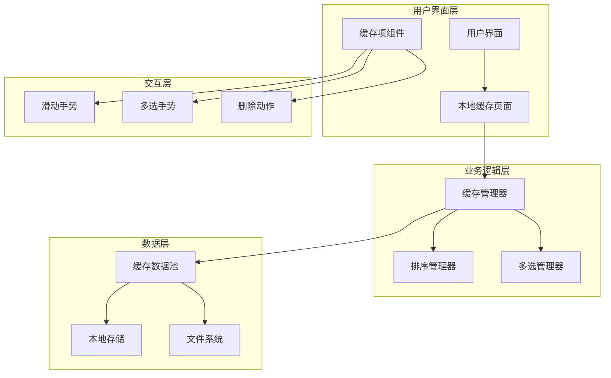
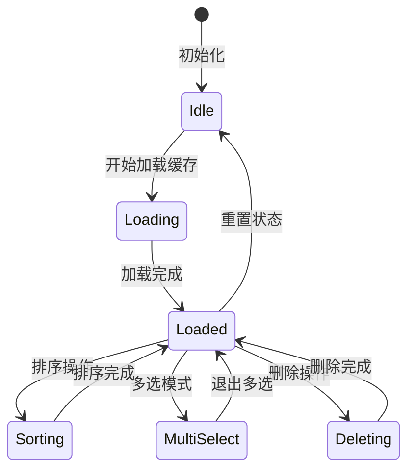
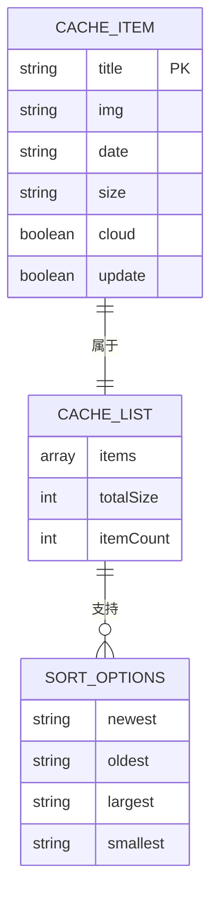
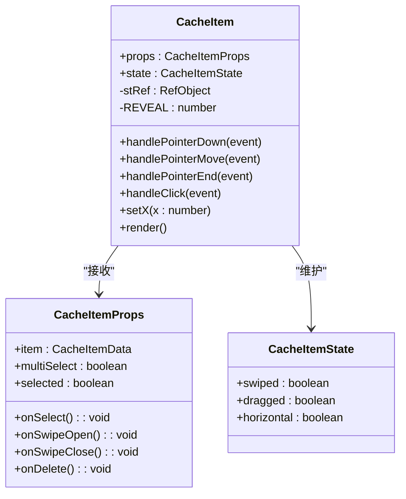
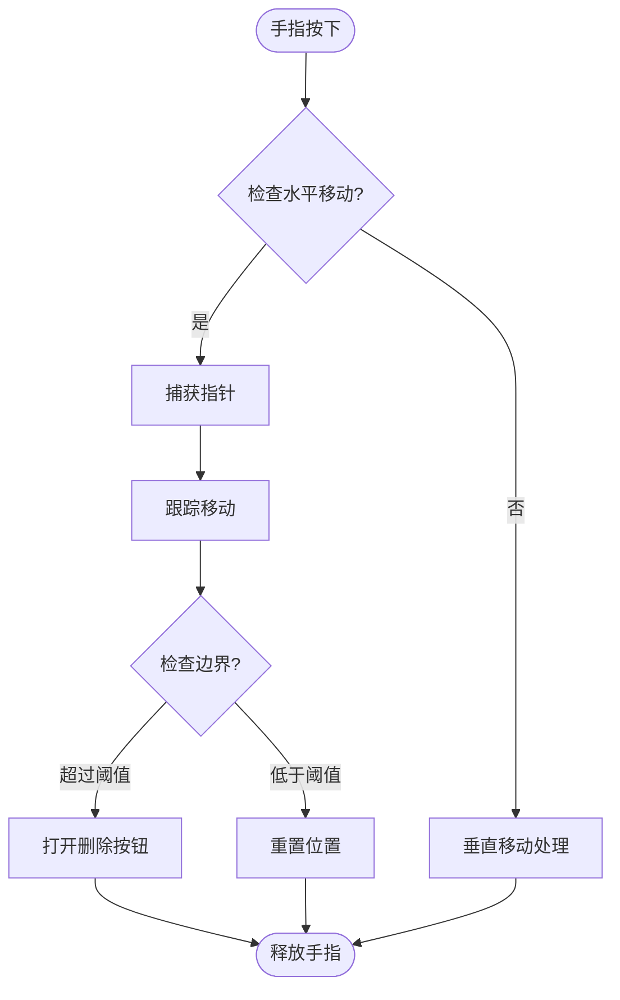
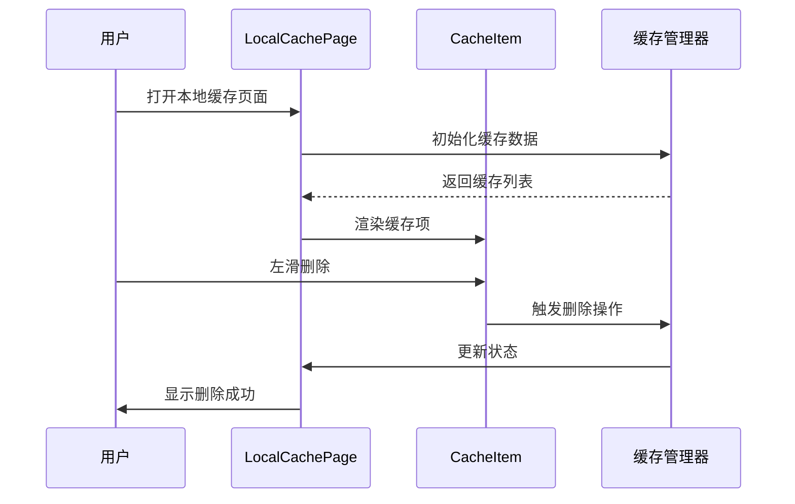
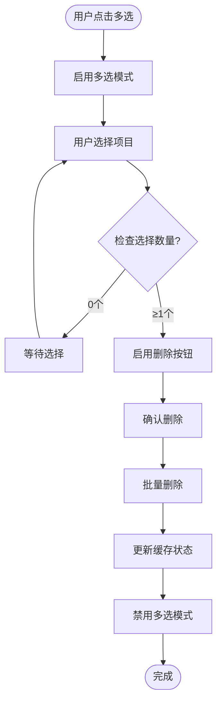
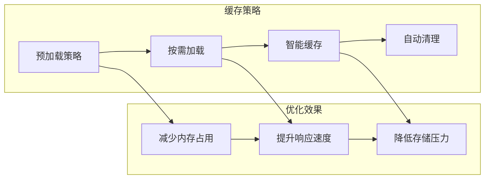
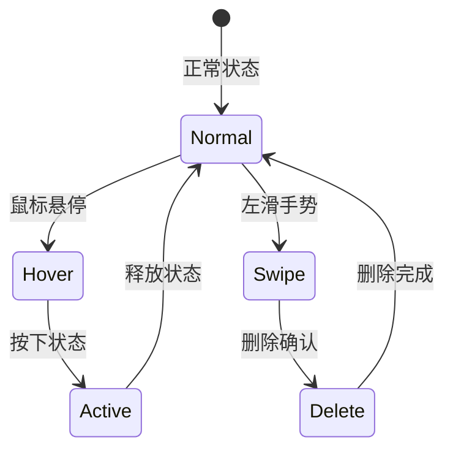

# 本地缓存管理

<cite>
**本文档引用的文件**
- [src/App.jsx](file://src/App.jsx)
- [src/main.jsx](file://src/main.jsx)
- [src/data.js](file://src/data.js)
- [src/index.css](file://src/index.css)
- [src/Login.jsx](file://src/Login.jsx)
- [package.json](file://package.json)
- [vite.config.js](file://vite.config.js)
</cite>

## 目录
1. [项目概述](#项目概述)
2. [本地缓存架构设计](#本地缓存架构设计)
3. [缓存数据模型](#缓存数据模型)
4. [缓存管理组件分析](#缓存管理组件分析)
5. [缓存交互流程](#缓存交互流程)
6. [性能优化策略](#性能优化策略)
7. [用户体验设计](#用户体验设计)
8. [技术实现细节](#技术实现细节)
9. [故障排除指南](#故障排除指南)
10. [总结](#总结)

## 项目概述

这是一个基于 React 的家装内容应用，专注于提供丰富的视觉内容和智能助手功能。项目实现了完整的本地缓存管理系统，允许用户将浏览的历史内容保存到本地存储中，以便离线访问和快速加载。

该应用的核心特性包括：
- 本地缓存管理：用户可以将浏览的内容保存到本地缓存中
- 多媒体内容：包含视频、图片、文章等多种类型的内容
- AI 助手集成：内置智能家装助手
- 个性化界面：支持用户收藏和历史记录管理

## 本地缓存架构设计

### 整体架构



**图表来源**
- [src/App.jsx:2285-2415](file://src/App.jsx#L2285-L2415)

### 缓存状态管理

应用使用 React 的状态管理机制来维护缓存状态：



**图表来源**
- [src/App.jsx:2286-2295](file://src/App.jsx#L2286-L2295)

## 缓存数据模型

### 缓存项结构

每个缓存项包含以下核心属性：

| 属性名 | 类型 | 描述 | 示例 |
|--------|------|------|------|
| title | string | 内容标题 | "北欧轻奢全案" |
| img | string | 缩略图 URL | "1600210492486-724fe5c67fb0" |
| date | string | 缓存日期 | "2026-05-20" |
| size | string | 文件大小 | "32.4 MB" |

### 缓存数据池

应用预定义了完整的缓存数据池，包含8套已下载的内容：



**图表来源**
- [src/App.jsx:2087-2097](file://src/App.jsx#L2087-L2097)

**章节来源**
- [src/App.jsx:2087-2097](file://src/App.jsx#L2087-L2097)
- [src/App.jsx:2663-2683](file://src/App.jsx#L2663-L2683)

## 缓存管理组件分析

### CacheItem 组件

CacheItem 是本地缓存系统的核心组件，实现了完整的交互功能：



**图表来源**
- [src/App.jsx:2117-2283](file://src/App.jsx#L2117-L2283)

#### 滑动手势实现

组件实现了 iOS 风格的左滑删除手势：



**图表来源**
- [src/App.jsx:2143-2222](file://src/App.jsx#L2143-L2222)

**章节来源**
- [src/App.jsx:2117-2283](file://src/App.jsx#L2117-L2283)

### LocalCachePage 组件

LocalCachePage 是缓存管理的主要界面组件：



**图表来源**
- [src/App.jsx:2286-2415](file://src/App.jsx#L2286-L2415)

**章节来源**
- [src/App.jsx:2286-2415](file://src/App.jsx#L2286-L2415)

## 缓存交互流程

### 多选删除流程



**图表来源**
- [src/App.jsx:2319-2334](file://src/App.jsx#L2319-L2334)

### 排序功能实现

应用支持多种排序方式：

| 排序方式 | 排序字段 | 排序方向 | 实现方法 |
|----------|----------|----------|----------|
| 最新到旧 | date | 降序 | localeCompare() |
| 旧到新 | date | 升序 | localeCompare() |
| 从大到小 | size | 降序 | parseFloat() |
| 从小到大 | size | 升序 | parseFloat() |

**章节来源**
- [src/App.jsx:2663-2683](file://src/App.jsx#L2663-L2683)

## 性能优化策略

### 内存管理

应用采用了多项内存优化策略：

1. **虚拟滚动**：对于大量缓存项，使用虚拟滚动技术只渲染可见区域
2. **懒加载**：图片资源采用懒加载，减少初始加载压力
3. **状态清理**：组件卸载时自动清理定时器和事件监听器

### 缓存策略



**图表来源**
- [src/App.jsx:2685-2801](file://src/App.jsx#L2685-L2801)

**章节来源**
- [src/App.jsx:2685-2801](file://src/App.jsx#L2685-L2801)

## 用户体验设计

### 界面设计原则

应用遵循以下设计原则：

1. **一致性**：所有缓存项采用统一的设计风格
2. **可用性**：提供直观的操作反馈和状态指示
3. **可访问性**：支持键盘导航和屏幕阅读器
4. **响应性**：确保在各种设备上的良好表现

### 交互反馈



**图表来源**
- [src/App.jsx:2143-2222](file://src/App.jsx#L2143-L2222)

**章节来源**
- [src/App.jsx:2143-2222](file://src/App.jsx#L2143-L2222)

## 技术实现细节

### 滑动删除实现

滑动删除功能通过以下步骤实现：

1. **手势检测**：监听 pointer 事件检测水平滑动
2. **边界计算**：计算滑动距离和边界条件
3. **动画效果**：使用 CSS3 transform 实现平滑动画
4. **状态同步**：实时更新组件状态和样式

### 多选模式

多选模式提供了高效的批量操作能力：

```javascript
// 多选状态管理
const [multiSelect, setMultiSelect] = useState(false);
const [selected, setSelected] = useState(new Set());

// 选择切换逻辑
const toggleItem = (title) => {
    setSelected(prev => {
        const next = new Set(prev);
        if (next.has(title)) next.delete(title);
        else next.add(title);
        return next;
    });
};
```

**章节来源**
- [src/App.jsx:2288-2334](file://src/App.jsx#L2288-L2334)

### 排序算法

排序功能使用了灵活的排序算法：

```javascript
function sortHistory(list, key) {
    const arr = [...list];
    switch (key) {
        case 'oldest':
            return arr.sort((a, b) => a.date.localeCompare(b.date));
        case 'largest':
            return arr.sort((a, b) => parseHistorySize(b.size) - parseHistorySize(a.size));
        case 'smallest':
            return arr.sort((a, b) => parseHistorySize(a.size) - parseHistorySize(b.size));
        case 'newest':
        default:
            return arr.sort((a, b) => b.date.localeCompare(a.date));
    }
}
```

**章节来源**
- [src/App.jsx:2670-2683](file://src/App.jsx#L2670-L2683)

## 故障排除指南

### 常见问题及解决方案

| 问题类型 | 症状描述 | 可能原因 | 解决方案 |
|----------|----------|----------|----------|
| 缓存无法删除 | 删除按钮无响应 | 滑动手势冲突 | 检查事件监听器 |
| 多选模式异常 | 无法取消选择 | 状态管理错误 | 重置多选状态 |
| 排序失效 | 排序结果不正确 | 排序函数错误 | 检查比较逻辑 |
| 性能问题 | 页面卡顿 | 内存泄漏 | 清理定时器和监听器 |

### 调试技巧

1. **状态监控**：使用 React DevTools 监控组件状态变化
2. **性能分析**：使用浏览器性能面板分析内存使用情况
3. **事件追踪**：通过控制台输出调试信息
4. **边界测试**：测试极端情况下的行为表现

## 总结

本地缓存管理系统是该家装应用的重要组成部分，它提供了完整的离线访问能力和优秀的用户体验。系统通过精心设计的架构和实现，实现了以下目标：

1. **功能完整性**：支持缓存管理、多选删除、排序等功能
2. **性能优化**：采用多种优化策略确保流畅的用户体验
3. **用户体验**：提供直观的交互和及时的反馈
4. **可维护性**：清晰的代码结构和良好的扩展性

该系统不仅满足了当前的功能需求，还为未来的功能扩展奠定了坚实的基础。通过持续的优化和改进，本地缓存管理将继续为用户提供更好的服务体验。