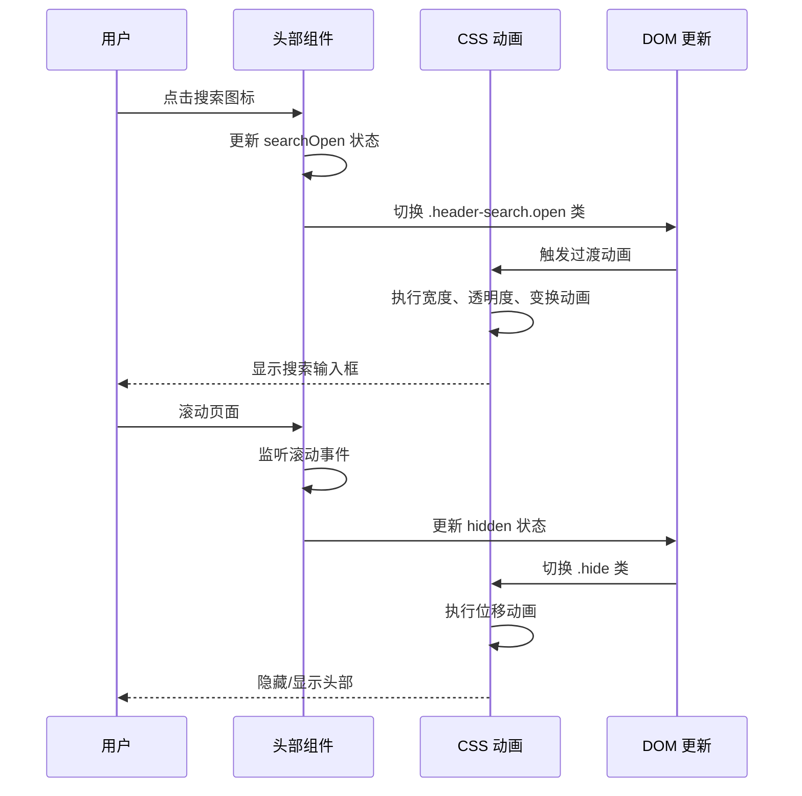
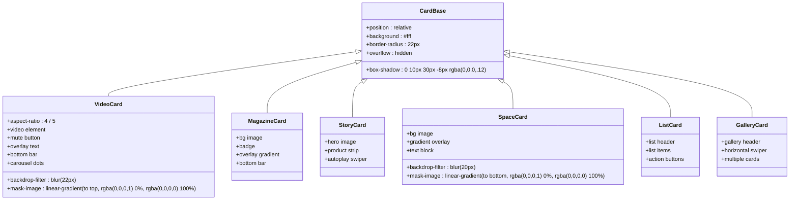
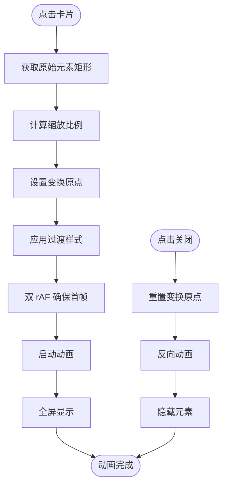
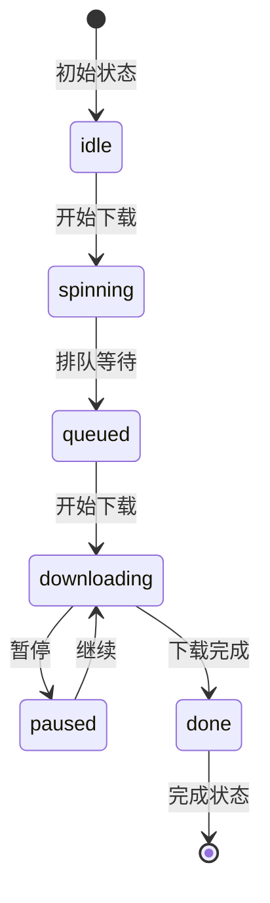

# 样式和动画系统

<cite>
**本文档引用的文件**
- [index.css](file://src/index.css)
- [App.jsx](file://src/App.jsx)
- [main.jsx](file://src/main.jsx)
- [index.html](file://index.html)
- [package.json](file://package.json)
- [vite.config.js](file://vite.config.js)
</cite>

## 更新摘要
**变更内容**
- 新增大量CSS样式支持3D视觉效果、毛玻璃滤镜效果、渐变叠加、阴影配置等高级视觉特性
- 扩展了毛玻璃效果系统，包括backdrop-filter和saturate滤镜组合
- 新增渐变叠加层和多层阴影配置
- 增强了下载系统和轮播指示器的视觉效果
- 优化了移动端适配和性能考虑

## 目录
1. [简介](#简介)
2. [项目结构](#项目结构)
3. [核心组件](#核心组件)
4. [架构概览](#架构概览)
5. [详细组件分析](#详细组件分析)
6. [高级视觉效果系统](#高级视觉效果系统)
7. [下载系统架构](#下载系统架构)
8. [轮播指示器系统](#轮播指示器系统)
9. [依赖分析](#依赖分析)
10. [性能考虑](#性能考虑)
11. [故障排除指南](#故障排除指南)
12. [结论](#结论)

## 简介

NewSquare 是一个基于 React 和 Vite 构建的现代化移动应用，专注于家居设计灵感展示。该项目采用了先进的 CSS 架构设计，实现了完整的样式隔离、响应式布局和丰富的动画效果。系统通过精心设计的 CSS 变量体系、组件化样式架构和高性能动画实现，为用户提供了流畅的视觉体验。

**更新** 新增了完整的下载系统、轮播指示器功能以及大量高级视觉效果，包括毛玻璃滤镜、渐变叠加、阴影配置等，显著增强了用户的交互体验和视觉反馈。

## 项目结构

NewSquare 项目采用模块化的前端架构，主要包含以下关键文件：

```mermaid
graph TB
subgraph "项目根目录"
HTML[index.html]
PKG[package.json]
VITE[vite.config.js]
END
subgraph "源代码目录 (src)"
MAIN[main.jsx]
APP[App.jsx]
CSS[index.css]
END
subgraph "构建工具"
VITE_PLUGIN[@vitejs/plugin-react]
SWIPER[Swiper]
ANTD_MOBILE[Ant Design Mobile]
END
HTML --> MAIN
MAIN --> APP
MAIN --> CSS
APP --> SWIPER
APP --> ANTD_MOBILE
PKG --> VITE_PLUGIN
```

**图表来源**
- [index.html:1-16](file://index.html#L1-L16)
- [main.jsx:1-12](file://src/main.jsx#L1-L12)
- [package.json:1-25](file://package.json#L1-L25)

**章节来源**
- [index.html:1-16](file://index.html#L1-L16)
- [main.jsx:1-12](file://src/main.jsx#L1-L12)
- [package.json:1-25](file://package.json#L1-L25)

## 核心组件

### CSS 架构设计

NewSquare 的样式系统采用了现代化的设计方法论，主要包括以下几个核心方面：

#### 全局样式组织
系统使用统一的全局样式初始化，确保跨浏览器的一致性：
- **盒模型标准化**: 使用 `box-sizing: border-box` 统一盒模型计算
- **字体平滑**: 启用 `-webkit-font-smoothing` 和 `-moz-osx-font-smoothing`
- **滚动行为**: 设置 `overscroll-behavior: none` 防止意外的页面滚动
- **视口适配**: 通过 `env(safe-area-inset-*)` 变量处理刘海屏和安全区域

#### 组件样式隔离
每个组件都采用独立的样式命名空间，避免样式冲突：
- **卡片组件**: `.tcard-*`、`.gcard-*` 等前缀区分不同类型卡片
- **页面组件**: `.search-page`、`.me-page`、`.archive-page` 等页面级样式
- **交互组件**: `.header-*`、`.detail-*` 等功能组件样式
- **下载组件**: `.download-fab`、`.dl-center-*` 等下载系统样式

#### 响应式设计实现
系统支持多种设备尺寸，通过以下机制实现响应式：
- **媒体查询**: 针对不同屏幕尺寸的断点设计
- **弹性布局**: 使用 Flexbox 和 CSS Grid 实现自适应布局
- **相对单位**: 大量使用 `rem`、`em`、`%` 等相对单位

**章节来源**
- [index.css:1-18](file://src/index.css#L1-L18)
- [index.css:88-104](file://src/index.css#L88-L104)

## 架构概览

NewSquare 的样式系统采用分层架构设计，从基础样式到高级动画效果形成了完整的层次结构：

```mermaid
graph TD
subgraph "基础层"
BASE[基础样式<br/>全局重置、字体、颜色]
UTIL[工具类<br/>通用样式工具]
END
subgraph "组件层"
HEADER[头部组件<br/>导航、搜索、标签]
CARD[卡片组件<br/>视频、杂志、故事等]
PAGE[页面组件<br/>搜索、个人中心、详情]
DOWNLOAD[下载系统<br/>下载按钮、进度指示]
CAROUSEL[轮播系统<br/>指示器、切换效果]
END
subgraph "高级视觉层"
BACKDROP[毛玻璃滤镜<br/>backdrop-filter + saturate]
GRADIENT[渐变叠加<br/>linear-gradient + mask-image]
SHADOW[阴影配置<br/>box-shadow + 多层投影]
ANIMATION[动画层<br/>CSS 过渡效果]
END
subgraph "交互层"
TRANSITION[过渡动画<br/>CSS 过渡效果]
KEYFRAME[关键帧动画<br/>@keyframes 定义]
TRANSFORM[变换动画<br/>transform 属性]
END
subgraph "状态层"
TOUCH[触摸交互<br/>手势识别、触摸反馈]
SCROLL[滚动效果<br/>滚动监听、视差效果]
STATE[状态管理<br/>激活、悬停、禁用状态]
END
BASE --> HEADER
BASE --> CARD
BASE --> PAGE
BASE --> DOWNLOAD
BASE --> CAROUSEL
HEADER --> BACKDROP
CARD --> BACKDROP
PAGE --> BACKDROP
DOWNLOAD --> BACKDROP
CAROUSEL --> BACKDROP
BACKDROP --> GRADIENT
GRADIENT --> SHADOW
SHADOW --> ANIMATION
TRANSITION --> KEYFRAME
TRANSITION --> TRANSFORM
TOUCH --> STATE
SCROLL --> STATE
```

**图表来源**
- [index.css:24-86](file://src/index.css#L24-L86)
- [index.css:576-596](file://src/index.css#L576-L596)
- [App.jsx:976-1112](file://src/App.jsx#L976-L1112)

## 详细组件分析

### 头部组件系统

头部组件是 NewSquare 的核心交互界面，实现了复杂的动画效果和状态管理：

#### 头部状态管理
头部组件通过多个状态属性实现动态行为：
- **隐藏状态**: `hidden` 控制头部的显示/隐藏
- **搜索状态**: `searchOpen` 管理搜索界面的展开/收起
- **标签状态**: `activeTab` 切换不同功能区域
- **期次状态**: `issueOffset` 管理当前期次

#### 动画实现机制
头部组件使用了多层次的动画效果：



**图表来源**
- [App.jsx:67-205](file://src/App.jsx#L67-L205)
- [index.css:89-104](file://src/index.css#L89-L104)

#### 关键动画效果
头部组件实现了多种动画效果：

1. **渐隐渐显动画**: 使用 `transform: translateY()` 实现头部的隐藏/显示
2. **搜索展开动画**: 通过 `width` 和 `padding` 的过渡实现搜索框的展开
3. **标签切换动画**: 使用 `opacity` 和 `transform` 实现标签的淡入淡出
4. **期次轮播动画**: 通过 `@keyframes` 实现期次标题的滑动效果

**章节来源**
- [App.jsx:67-205](file://src/App.jsx#L67-L205)
- [index.css:98-104](file://src/index.css#L98-L104)
- [index.css:343-346](file://src/index.css#L343-L346)

### 卡片系统架构

NewSquare 的卡片系统是整个应用的核心视觉组件，包含了多种不同类型的卡片：

#### 卡片类型分类
系统定义了六种主要的卡片类型：



**图表来源**
- [App.jsx:288-489](file://src/App.jsx#L288-L489)
- [index.css:584-629](file://src/index.css#L584-L629)

#### 卡片动画系统
每种卡片类型都实现了独特的动画效果：

1. **上升动画**: 所有卡片使用 `@keyframes rise` 实现从底部升起的效果
2. **模糊背景**: 使用 `backdrop-filter: blur()` 创建毛玻璃效果
3. **渐变遮罩**: 通过 `linear-gradient` 实现从上到下的渐变遮罩
4. **品牌条动画**: 底部品牌条使用 `backdrop-filter` 实现半透明效果

**章节来源**
- [App.jsx:288-489](file://src/App.jsx#L288-L489)
- [index.css:584-629](file://src/index.css#L584-L629)

### 详情页动画系统

详情页是 NewSquare 的重点动画组件，实现了复杂的转场效果：

#### 开启动画流程
详情页使用了精心设计的转场动画：



**图表来源**
- [App.jsx:590-736](file://src/App.jsx#L590-L736)
- [index.css:1354-1363](file://src/index.css#L1354-L1363)

#### 动画参数配置
详情页动画使用了精确的参数配置：
- **动画时长**: `0.46s` 和 `0.4s` 的不同阶段
- **缓动函数**: `cubic-bezier(.22,.8,.36,1)` 和 `cubic-bezier(.4,0,.2,1)`
- **变换属性**: `transform` 和 `border-radius` 的同步变化

**章节来源**
- [App.jsx:590-736](file://src/App.jsx#L590-L736)
- [index.css:1354-1363](file://src/index.css#L1354-L1363)

### 搜索页交互系统

搜索页实现了完整的搜索交互体验，包含历史记录、热门推荐等功能：

#### 搜索状态管理
搜索页通过状态管理实现复杂的交互逻辑：
- **展开状态**: `searchOpen` 控制搜索界面的显示
- **查询状态**: `searchQuery` 管理搜索关键词
- **历史状态**: `SEARCH_HISTORY` 存储搜索历史记录

#### 热门推荐系统
搜索页集成了热门期刊推荐功能：
- **自动轮播**: 使用 `Swiper` 实现横向自动滚动
- **热点标记**: 通过徽章标识热门内容
- **快速跳转**: 点击即可跳转到对应的期刊页面

**章节来源**
- [App.jsx:742-858](file://src/App.jsx#L742-L858)
- [index.css:918-931](file://src/index.css#L918-L931)

## 高级视觉效果系统

### 毛玻璃滤镜效果

NewSquare 项目实现了全面的毛玻璃滤镜效果系统，这是其高级视觉特性的核心组成部分：

#### 毛玻璃滤镜实现原理
系统使用 `backdrop-filter` 属性结合多种滤镜效果：

```css
/* 基础毛玻璃效果 */
.backdrop-blur {
  backdrop-filter: blur(22px);
  -webkit-backdrop-filter: blur(22px);
}

/* 饱和度增强的毛玻璃 */
.saturated-blur {
  backdrop-filter: saturate(180%) blur(22px);
  -webkit-backdrop-filter: saturate(180%) blur(22px);
}

/* 渐变遮罩配合毛玻璃 */
.masked-blur {
  backdrop-filter: blur(22px);
  -webkit-backdrop-filter: blur(22px);
  mask-image: linear-gradient(to top, rgba(0,0,0,1) 0%, rgba(0,0,0,0) 100%);
  -webkit-mask-image: linear-gradient(to top, rgba(0,0,0,1) 0%, rgba(0,0,0,0) 100%);
}
```

#### 应用场景分布
毛玻璃效果广泛应用于各个组件：

1. **头部组件**: `top-header` 使用 `saturate(180%) blur(18px)` 实现半透明背景
2. **视频卡片**: `tcard-video` 和 `tcard-space` 使用不同强度的模糊效果
3. **底部品牌条**: `bottom-bar` 使用 `saturate(180%) blur(22px)` 实现深色半透明效果
4. **下载悬浮按钮**: `download-fab` 使用 `saturate(180%) blur(20px)` 实现毛玻璃效果
5. **历史页面**: `history-header` 和 `history-search-bar` 使用毛玻璃背景

#### 毛玻璃效果的技术优势
- **性能优化**: 使用 `will-change` 提示浏览器优化渲染
- **兼容性处理**: 同时提供标准属性和 `-webkit-` 前缀版本
- **渐变遮罩**: 通过 `mask-image` 实现精确的遮罩控制
- **多层叠加**: 支持与其他滤镜效果的组合使用

**章节来源**
- [index.css:99-101](file://src/index.css#L99-L101)
- [index.css:677-681](file://src/index.css#L677-L681)
- [index.css:884-885](file://src/index.css#L884-L885)
- [index.css:2265-2266](file://src/index.css#L2265-L2266)

### 渐变叠加系统

NewSquare 实现了多层次的渐变叠加效果，为界面提供了丰富的视觉层次：

#### 渐变效果类型
系统使用多种渐变效果来增强视觉表现：

```css
/* 顶部渐变覆层 */
.archive-top-grad {
  background: linear-gradient(to bottom,
    rgba(0,0,0,.85) 0%,
    rgba(0,0,0,.65) 40%,
    rgba(0,0,0,.25) 80%,
    rgba(0,0,0,0) 100%);
}

/* 视频覆盖渐变 */
.video-overlay {
  background: linear-gradient(to top, rgba(0,0,0,.7) 0%, rgba(0,0,0,.25) 60%, rgba(0,0,0,0) 100%);
}

/* 产品卡片渐变 */
.gcard-gradient {
  background: linear-gradient(to top, rgba(0,0,0,.7) 0%, rgba(0,0,0,.2) 50%, rgba(0,0,0,0) 100%);
}

/* 空间卡片渐变 */
.gradient-top {
  background: linear-gradient(to bottom, rgba(0,0,0,.55) 0%, rgba(0,0,0,0) 50%);
}
```

#### 渐变遮罩技术
通过 `mask-image` 实现精确的渐变遮罩控制：

```css
/* 顶部渐变遮罩 */
.tcard-video::before {
  mask-image: linear-gradient(to top, rgba(0,0,0,1) 0%, rgba(0,0,0,0) 100%);
  -webkit-mask-image: linear-gradient(to top, rgba(0,0,0,1) 0%, rgba(0,0,0,0) 100%);
}

/* 底部渐变遮罩 */
.tcard-space::before {
  mask-image: linear-gradient(to bottom, rgba(0,0,0,1) 0%, rgba(0,0,0,0) 100%);
  -webkit-mask-image: linear-gradient(to bottom, rgba(0,0,0,1) 0%, rgba(0,0,0,0) 100%);
}
```

#### 渐变效果的应用价值
- **视觉层次**: 通过渐变实现从深到浅的视觉过渡
- **内容突出**: 渐变遮罩帮助突出主要内容区域
- **品牌一致性**: 统一的渐变风格强化品牌识别
- **可访问性**: 适当的对比度确保内容可读性

**章节来源**
- [index.css:571-575](file://src/index.css#L571-L575)
- [index.css:876](file://src/index.css#L876)
- [index.css:1117](file://src/index.css#L1117)
- [index.css:1030](file://src/index.css#L1030)

### 阴影配置系统

NewSquare 实现了精细的阴影配置系统，为界面元素提供立体感和深度感：

#### 阴影效果类型
系统使用多种阴影效果来创造不同的视觉层次：

```css
/* 卡片阴影 */
.tcard {
  box-shadow: 0 10px 30px -8px rgba(0,0,0,.12), 0 2px 6px rgba(0,0,0,.04);
}

/* 导航栏阴影 */
.me-studio-card {
  box-shadow: 0 4px 16px -6px rgba(0,0,0,.08), 0 1px 2px rgba(0,0,0,.04);
}

/* 下载悬浮按钮阴影 */
.download-fab {
  box-shadow:
    0 8px 24px rgba(0, 0, 0, 0.16),
    0 0 0 0.5px rgba(0, 0, 0, 0.06);
}

/* 详情页阴影 */
.detail-overlay {
  box-shadow: 0 10px 40px -12px rgba(0,0,0,.25);
}
```

#### 阴影技术实现
阴影效果通过 `box-shadow` 属性实现，支持多重阴影叠加：

- **外阴影**: 主要的投影效果，创造立体感
- **内阴影**: 增强边框的立体感
- **多层叠加**: 通过多个阴影值实现复杂的投影效果
- **透明度控制**: 使用 RGBA 颜色值控制阴影的透明度

#### 阴影配置的优势
- **深度感知**: 通过阴影创造空间深度感
- **层次分明**: 不同强度的阴影区分界面层次
- **品牌特色**: 统一的阴影风格强化品牌识别
- **可访问性**: 适当的阴影对比度确保界面可读性

**章节来源**
- [index.css:659](file://src/index.css#L659)
- [index.css:1662](file://src/index.css#L1662)
- [index.css:2267-2269](file://src/index.css#L2267-L2269)
- [index.css:1987](file://src/index.css#L1987)

## 下载系统架构

NewSquare 的下载系统是应用的重要功能模块，提供了完整的下载管理和状态反馈机制。

### 下载按钮状态系统

下载按钮根据不同的下载状态显示相应的视觉反馈：

#### 状态分类
系统定义了五种下载状态：



#### 状态样式实现
每种状态都有对应的样式类和动画效果：

1. **待下载状态** (`idle`): 显示云朵下载图标
2. **准备中状态** (`spinning`): 显示旋转加载动画
3. **排队中状态** (`queued`): 显示旋转加载动画
4. **下载中状态** (`downloading`): 显示圆形进度条
5. **已暂停状态** (`paused`): 显示播放图标
6. **已完成状态** (`done`): 显示进入按钮

#### 样式特点
- **统一尺寸**: 所有下载按钮都使用 62px × 32px 的统一尺寸
- **圆角设计**: 使用 999px 的圆角半径实现胶囊形状
- **颜色系统**: 使用蓝色系 (#007aff) 作为主要颜色
- **过渡动画**: 所有状态切换都配有平滑的过渡效果

**章节来源**
- [App.jsx:400-459](file://src/App.jsx#L400-L459)
- [index.css:3515-3591](file://src/index.css#L3515-L3591)

### 下载悬浮按钮

下载悬浮按钮 (Download Fab) 提供了全局的下载状态可视化：

#### 功能特性
- **自动显示**: 当有活动下载任务时自动显示
- **进度指示**: 使用圆形进度条显示当前下载进度
- **状态切换**: 支持暂停/继续操作
- **数量显示**: 显示当前下载任务在整个队列中的位置

#### 动画效果
- **入场动画**: 使用 `@keyframes downloadFabIn` 实现从底部弹入的效果
- **缩放反馈**: 按钮按下时有轻微的缩放反馈
- **层级管理**: 使用 z-index 确保在详情页之上可见

**章节来源**
- [App.jsx:3206-3244](file://src/App.jsx#L3206-L3244)
- [index.css:2102-2180](file://src/index.css#L2102-L2180)

### 下载中心面板

下载中心面板提供了完整的下载任务管理界面：

#### 面板特性
- **抽屉式设计**: 从底部滑出的抽屉式面板
- **任务列表**: 显示所有下载任务的完整列表
- **状态管理**: 支持开始、暂停、继续、删除等操作
- **进度监控**: 实时显示每个任务的下载进度

#### 样式设计
- **毛玻璃效果**: 使用 `backdrop-filter` 实现毛玻璃背景
- **圆角设计**: 顶部圆角半径 18px，符合 iOS 设计规范
- **阴影效果**: 使用多层阴影营造立体感
- **动画过渡**: 滑入滑出都有平滑的动画效果

**章节来源**
- [App.jsx:3246-3457](file://src/App.jsx#L3246-L3457)
- [index.css:2268-2410](file://src/index.css#L2268-L2410)

## 轮播指示器系统

NewSquare 的轮播指示器系统为视频轮播提供了直观的状态反馈。

### 指示器设计

#### 形态设计
轮播指示器采用胶囊形状设计，具有以下特点：
- **位置居中**: 位于轮播区域顶部中央
- **半透明背景**: 使用 rgba(20,20,22,.42) 的深色半透明背景
- **毛玻璃效果**: 通过 `backdrop-filter` 实现模糊背景
- **圆角设计**: 999px 的圆角半径

#### 状态样式
指示器包含多个小圆点，每个圆点都有不同的样式：

1. **普通状态**: 5px × 5px 的圆形，半透明白色
2. **激活状态**: 16px × 6px 的椭圆形，实心白色
3. **过渡动画**: 状态切换时有 0.25s 的平滑过渡

#### 交互行为
- **不可点击**: 使用 `pointer-events: none` 确保不影响轮播操作
- **自动同步**: 随着轮播切换自动更新激活状态
- **位置固定**: 使用 `position: absolute` 固定在轮播区域内

**章节来源**
- [index.css:764-791](file://src/index.css#L764-L791)
- [App.jsx:585-589](file://src/App.jsx#L585-L589)

### 详情页轮播指示器

详情页的轮播指示器与主页面略有不同：

#### 设计差异
- **位置调整**: 位于轮播区域的顶部中央
- **样式优化**: 专门为详情页的深色背景设计
- **响应式**: 根据内容自动调整位置和大小

#### 底部品牌条集成
详情页的轮播指示器与底部品牌条完美融合：
- **品牌条覆盖**: 使用 `backdrop-filter` 实现半透明效果
- **文字对比**: 在深色背景下确保指示器的可见性
- **层次管理**: 通过 z-index 确保正确的显示层级

**章节来源**
- [App.jsx:928-932](file://src/App.jsx#L928-L932)
- [index.css:842-856](file://src/index.css#L842-L856)

## 依赖分析

### 外部依赖关系

NewSquare 的样式系统依赖于多个外部库和框架：

```mermaid
graph LR
subgraph "样式系统"
CSS[CSS 架构]
ANTD[Ant Design Mobile]
SWIPER[Swiper]
END
subgraph "构建工具"
VITE[Vite]
REACT[React]
POSTCSS[PostCSS]
END
subgraph "字体服务"
SMILEY[Smiley Sans]
OPPO[OPPO Sans]
END
CSS --> ANTD
CSS --> SWIPER
ANTD --> REACT
SWIPER --> REACT
VITE --> REACT
CSS --> SMILEY
CSS --> OPPO
```

**图表来源**
- [package.json:11-19](file://package.json#L11-L19)
- [index.css:1-3](file://src/index.css#L1-L3)

### 样式依赖链

系统中的样式依赖关系如下：

1. **全局样式依赖**: `index.css` 作为所有样式的入口文件
2. **组件样式依赖**: 各组件通过类名引用全局样式定义
3. **第三方样式依赖**: Ant Design Mobile 和 Swiper 提供的基础样式
4. **字体资源依赖**: 通过 CDN 加载的中文字体资源

**章节来源**
- [package.json:11-19](file://package.json#L11-L19)
- [index.css:1-3](file://src/index.css#L1-L3)

## 性能考虑

### 动画性能优化

NewSquare 在动画性能方面采用了多项优化策略：

#### GPU 加速优化
- **will-change 属性**: 对频繁变化的属性使用 `will-change` 提示浏览器
- **transform3d**: 使用 `translateZ(0)` 启用硬件加速
- **backface-visibility**: 防止翻转时的闪烁效果

#### 浏览器兼容性
- **前缀处理**: 自动添加 `-webkit-`、`-moz-` 等浏览器前缀
- **降级方案**: 为不支持的特性提供降级方案
- **特性检测**: 使用 JavaScript 检测浏览器支持情况

#### 内存管理
- **事件清理**: 及时清理滚动和触摸事件监听器
- **定时器管理**: 使用 `requestAnimationFrame` 替代 `setTimeout`
- **DOM 操作优化**: 减少不必要的 DOM 查询和修改

### 移动端性能优化

针对移动端设备，系统实现了专门的性能优化：

#### 触摸交互优化
- **触摸事件**: 使用 `touch-action: pan-x` 限制手势方向
- **滚动优化**: 启用 `-webkit-overflow-scrolling: touch`
- **防抖处理**: 对高频事件进行防抖处理

#### 资源加载优化
- **字体懒加载**: 通过 `unicode-range` 子集按需加载
- **图片优化**: 使用适当的图片格式和尺寸
- **CSS 压缩**: 生产环境自动压缩 CSS 文件

#### 高级视觉效果优化
- **毛玻璃性能**: 使用 `will-change: transform` 优化 backdrop-filter 性能
- **渐变渲染**: 通过 `will-change: opacity` 优化渐变效果
- **阴影优化**: 使用硬件加速的阴影渲染技术

## 故障排除指南

### 常见问题诊断

#### 动画异常问题
1. **动画不执行**: 检查 `@keyframes` 定义是否正确
2. **性能问题**: 使用浏览器开发者工具检查 GPU 使用情况
3. **兼容性问题**: 确认目标浏览器支持相关 CSS 特性

#### 样式冲突问题
1. **类名冲突**: 检查是否有重复的类名定义
2. **优先级问题**: 分析 CSS 选择器的优先级
3. **作用域问题**: 确认样式的作用域范围

#### 移动端适配问题
1. **视口问题**: 检查 `viewport` 元标签配置
2. **触摸问题**: 验证触摸事件的处理逻辑
3. **性能问题**: 监控移动端的内存和 CPU 使用

#### 高级视觉效果问题
1. **毛玻璃失效**: 检查 `backdrop-filter` 属性支持情况
2. **渐变遮罩异常**: 验证 `mask-image` 属性的兼容性
3. **阴影渲染问题**: 确认 `box-shadow` 属性的正确使用

### 调试工具推荐

1. **Chrome DevTools**: 使用 Performance 面板分析动画性能
2. **Lighthouse**: 检查 PWA 和性能指标
3. **浏览器插件**: 使用 CSS Grid 和 Flexbox 辅助工具
4. **移动端调试**: 使用 Safari Web Inspector 调试 iOS 设备

## 结论

NewSquare 的样式和动画系统展现了现代前端开发的最佳实践。通过精心设计的 CSS 架构、组件化样式隔离和高性能动画实现，系统为用户提供了流畅、美观的视觉体验。

**更新** 新增的下载系统、轮播指示器功能以及大量高级视觉效果（毛玻璃滤镜、渐变叠加、阴影配置等）进一步完善了用户体验，提供了完整的状态反馈和交互机制。

### 技术亮点

1. **架构清晰**: 分层设计使得样式系统易于维护和扩展
2. **性能优秀**: 多项性能优化确保在各种设备上的流畅运行
3. **用户体验**: 丰富的动画效果和状态反馈提升了整体的用户体验
4. **移动端适配**: 完善的移动端支持确保跨设备一致性
5. **功能完整**: 新增的下载系统提供了完整的离线内容管理能力
6. **高级视觉效果**: 毛玻璃滤镜、渐变叠加、阴影配置等技术提升了视觉品质

### 改进建议

1. **样式模块化**: 可以考虑引入 CSS Modules 或 styled-components
2. **主题系统**: 建立更完善的主题切换机制
3. **动画管理**: 实现统一的动画状态管理
4. **测试覆盖**: 增加样式和动画的自动化测试
5. **文档完善**: 为新增的功能模块补充详细的使用文档
6. **性能监控**: 建立性能监控机制，持续优化视觉效果的性能表现

这个项目为移动端 Web 应用的样式设计提供了优秀的参考范例，展示了如何在保持性能的同时实现丰富的视觉效果和完整的功能体验。新增的高级视觉效果系统特别值得其他开发者学习和借鉴。