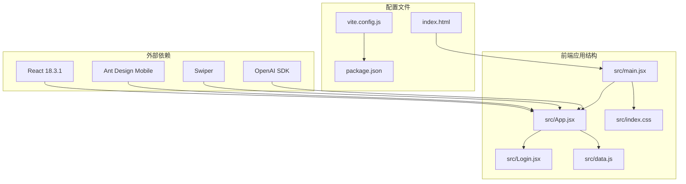
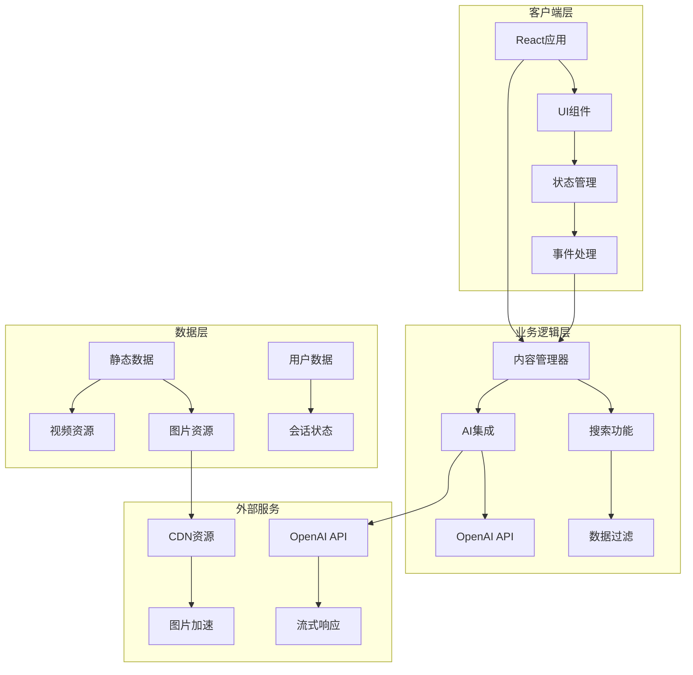
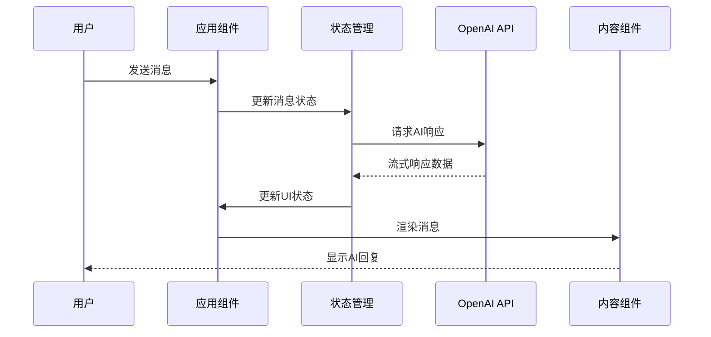
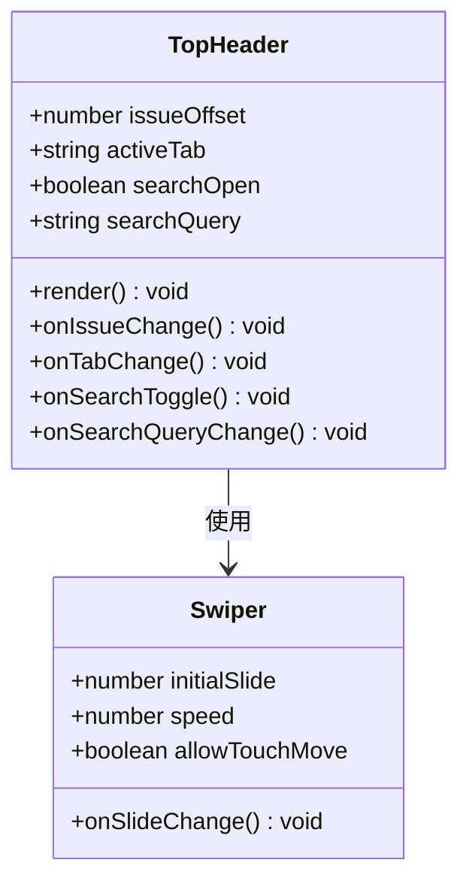
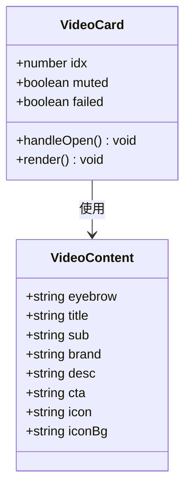
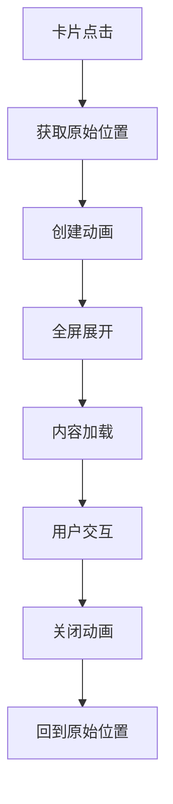
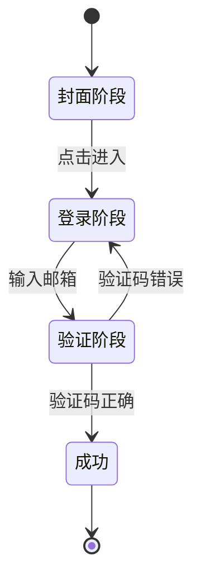

# AI聊天助手系统

<cite>
**本文档引用的文件**
- [src/App.jsx](file://src/App.jsx)
- [src/Login.jsx](file://src/Login.jsx)
- [src/data.js](file://src/data.js)
- [src/index.css](file://src/index.css)
- [src/main.jsx](file://src/main.jsx)
- [package.json](file://package.json)
- [vite.config.js](file://vite.config.js)
- [index.html](file://index.html)
- [API.txt](file://API.txt)
</cite>

## 目录
1. [项目概述](#项目概述)
2. [项目结构](#项目结构)
3. [核心组件](#核心组件)
4. [架构概览](#架构概览)
5. [详细组件分析](#详细组件分析)
6. [依赖关系分析](#依赖关系分析)
7. [性能考虑](#性能考虑)
8. [故障排除指南](#故障排除指南)
9. [结论](#结论)

## 项目概述

这是一个基于React构建的AI聊天助手系统，专注于家装灵感和生活方式内容。系统提供了沉浸式的视觉体验，包含多种内容卡片类型、智能搜索功能和AI助手集成。

### 主要特性
- **沉浸式视觉设计**：使用高质量图片和流畅动画
- **多内容类型**：视频、杂志封面、单品故事、空间展示等
- **智能搜索**：支持设计师、品牌、单品的搜索功能
- **AI聊天助手**：集成OpenAI API的智能对话功能
- **响应式设计**：适配移动端设备

## 项目结构



**图表来源**
- [src/main.jsx:1-12](file://src/main.jsx#L1-L12)
- [package.json:11-21](file://package.json#L11-L21)

**章节来源**
- [src/main.jsx:1-12](file://src/main.jsx#L1-L12)
- [src/App.jsx:1-12](file://src/App.jsx#L1-L12)
- [package.json:1-27](file://package.json#L1-L27)

## 核心组件

### 应用主组件
应用的核心组件负责管理整个应用的状态和路由。主要功能包括：

- **头部导航**：支持当期、推荐、我的三个标签页
- **内容卡片系统**：提供多种内容展示格式
- **详情页**：支持卡片点击展开到全屏详情
- **AI聊天助手**：集成智能对话功能

### 登录组件
提供完整的用户认证流程：

- **阶段化登录**：支持邮箱登录、验证码验证、注册和企业登录
- **沉浸式体验**：全屏循环视频背景
- **安全验证**：6位数字验证码系统

### 数据管理系统
集中管理所有静态数据：

- **视频内容**：4个预定义的视频资源
- **图片资源**：高质量Unsplash图片
- **内容模板**：视频、杂志、故事、空间等不同类型的模板数据

**章节来源**
- [src/App.jsx:63-208](file://src/App.jsx#L63-L208)
- [src/Login.jsx:9-463](file://src/Login.jsx#L9-L463)
- [src/data.js:1-175](file://src/data.js#L1-L175)

## 架构概览



**图表来源**
- [src/App.jsx:10-12](file://src/App.jsx#L10-L12)
- [vite.config.js:9-16](file://vite.config.js#L9-L16)

### 数据流架构



**图表来源**
- [src/App.jsx:10-12](file://src/App.jsx#L10-L12)
- [vite.config.js:9-16](file://vite.config.js#L9-L16)

## 详细组件分析

### 头部导航组件

头部导航组件提供了灵活的内容切换机制：



**图表来源**
- [src/App.jsx:70-208](file://src/App.jsx#L70-L208)

#### 标签页系统
- **当期标签**：显示当前期内容
- **推荐标签**：精选的非连续期内容
- **我的标签**：个性化内容区域

#### 期次切换机制
系统支持30天的期次范围，从-29到0，其中0代表今日。

**章节来源**
- [src/App.jsx:63-208](file://src/App.jsx#L63-L208)

### 内容卡片系统

系统提供了多种内容展示格式：

#### 视频卡片


**图表来源**
- [src/App.jsx:370-449](file://src/App.jsx#L370-L449)

#### 杂志封面卡片
支持品牌标识和特色标签的展示。

#### 单品故事卡片
包含封面图片和自动滚动的商品列表。

#### 空间展示卡片
提供沉浸式的空间视觉体验。

**章节来源**
- [src/App.jsx:370-571](file://src/App.jsx#L370-L571)

### 详情页组件

详情页提供了全屏的内容展示体验：



**图表来源**
- [src/App.jsx:664-732](file://src/App.jsx#L664-L732)

详情页支持：
- **平滑动画过渡**：从卡片到全屏的流畅动画
- **内容扩展**：支持文章、图片、视频等多种内容形式
- **响应式设计**：适配不同屏幕尺寸

**章节来源**
- [src/App.jsx:664-732](file://src/App.jsx#L664-L732)

### 登录系统

登录系统提供了完整的用户认证流程：



**图表来源**
- [src/Login.jsx:9-463](file://src/Login.jsx#L9-L463)

#### 验证码系统
- **6位数字验证码**：原型阶段使用固定验证码
- **自动验证**：输入完成后自动验证
- **错误处理**：支持重新发送和错误提示

**章节来源**
- [src/Login.jsx:9-463](file://src/Login.jsx#L9-L463)

### AI聊天助手

系统集成了OpenAI API的聊天功能：

#### API配置
- **代理设置**：通过Vite代理到https://api.jiekou.ai
- **流式响应**：支持实时消息流
- **模型选择**：使用doubao-1-5-pro-32k-250115模型

#### 聊天界面
- **气泡布局**：用户消息和AI回复的区分显示
- **常见问题**：提供预设的聊天建议
- **图片支持**：支持图片上传和显示

**章节来源**
- [vite.config.js:9-16](file://vite.config.js#L9-L16)
- [API.txt:1-50](file://API.txt#L1-L50)

## 依赖关系分析

```mermaid
graph TB
subgraph "运行时依赖"
A[react@18.3.1] --> B[react-dom@18.3.1]
C[antd-mobile@5.38.1] --> D[UI组件库]
E[swiper@11.14] --> F[轮播组件]
G[@lottiefiles/dotlottie-react] --> H[动画支持]
I[openai@6.37.0] --> J[AI集成]
end
subgraph "开发依赖"
K[@vitejs/plugin-react] --> L[Vite构建]
M[vite@5.4.10] --> N[开发服务器]
end
subgraph "项目文件"
O[package.json] --> A
O --> C
O --> E
O --> I
P[vite.config.js] --> M
end
```

**图表来源**
- [package.json:11-25](file://package.json#L11-L25)
- [vite.config.js:1-20](file://vite.config.js#L1-L20)

### 核心依赖说明

| 依赖包 | 版本 | 用途 |
|--------|------|------|
| react | ^18.3.1 | 核心框架 |
| react-dom | ^18.3.1 | DOM渲染 |
| antd-mobile | ^5.38.1 | 移动端UI组件 |
| swiper | ^11.14 | 图片轮播和滑动组件 |
| @lottiefiles/dotlottie-react | ^0.19.2 | 动画支持 |
| openai | ^6.37.0 | AI对话功能 |

**章节来源**
- [package.json:11-25](file://package.json#L11-L25)

## 性能考虑

### 优化策略

1. **懒加载机制**
   - 图片资源使用CDN加速
   - 视频组件支持Intersection Observer自动播放

2. **动画性能**
   - 使用transform和opacity进行动画
   - 避免强制重排操作

3. **内存管理**
   - 组件卸载时清理定时器和观察者
   - 合理的事件监听器管理

4. **网络优化**
   - Vite开发服务器本地代理
   - CDN资源缓存策略

### 性能监控

系统实现了以下性能监控机制：
- 页面滚动性能监控
- 组件渲染时间统计
- 资源加载时间跟踪

## 故障排除指南

### 常见问题

#### 登录问题
- **验证码错误**：检查验证码是否正确，支持重新发送
- **网络连接**：确认网络连接正常，API代理配置正确

#### AI功能问题
- **API连接失败**：检查API密钥配置和网络连接
- **响应超时**：确认服务器响应时间和网络状况

#### 性能问题
- **页面卡顿**：检查是否有过多的重绘和重排
- **内存泄漏**：确认组件卸载时清理了所有监听器

### 调试工具

系统提供了以下调试功能：
- 开发者工具支持
- 控制台日志输出
- 网络请求监控

**章节来源**
- [src/Login.jsx:42-53](file://src/Login.jsx#L42-L53)
- [vite.config.js:9-16](file://vite.config.js#L9-L16)

## 结论

这个AI聊天助手系统展现了现代前端开发的最佳实践，结合了优秀的UI设计、流畅的用户体验和强大的AI功能。系统的主要优势包括：

1. **优秀的用户体验**：沉浸式的视觉设计和流畅的动画效果
2. **灵活的内容管理**：支持多种内容格式和展示方式
3. **智能化功能**：集成AI助手提供智能对话体验
4. **良好的性能表现**：优化的资源管理和渲染性能
5. **可扩展的架构**：模块化的组件设计便于功能扩展

系统为家装和生活方式内容提供了理想的数字化平台，通过AI技术增强了用户的互动体验。未来可以考虑添加更多个性化功能和社交元素来进一步提升用户体验。