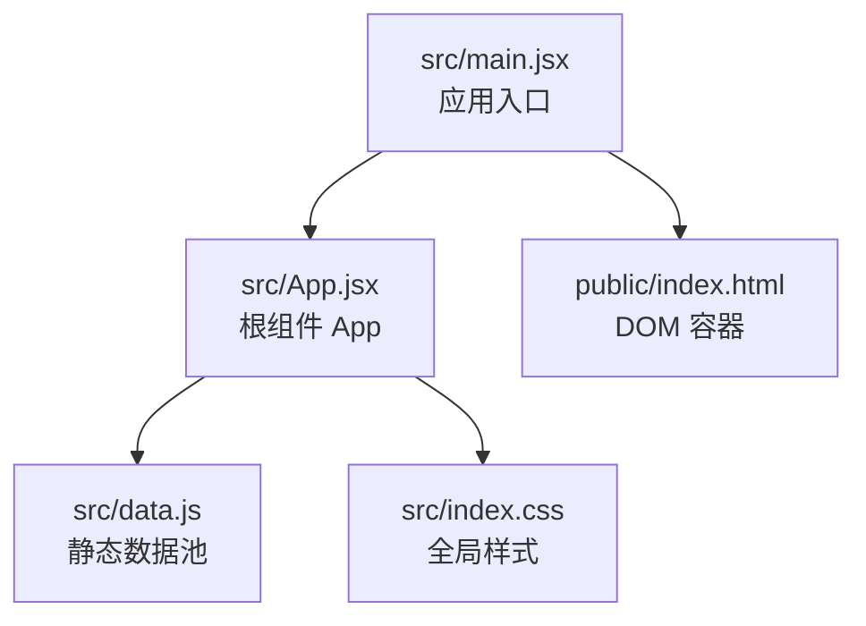
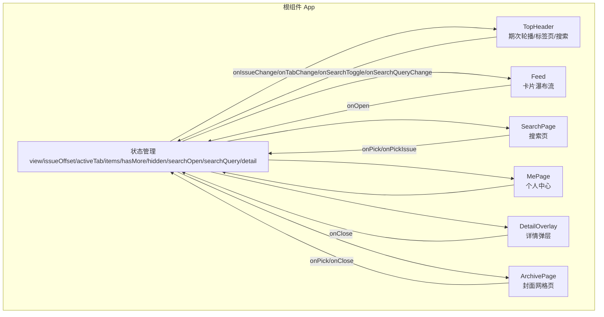
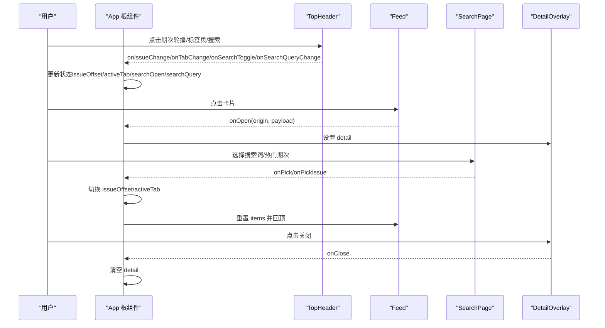
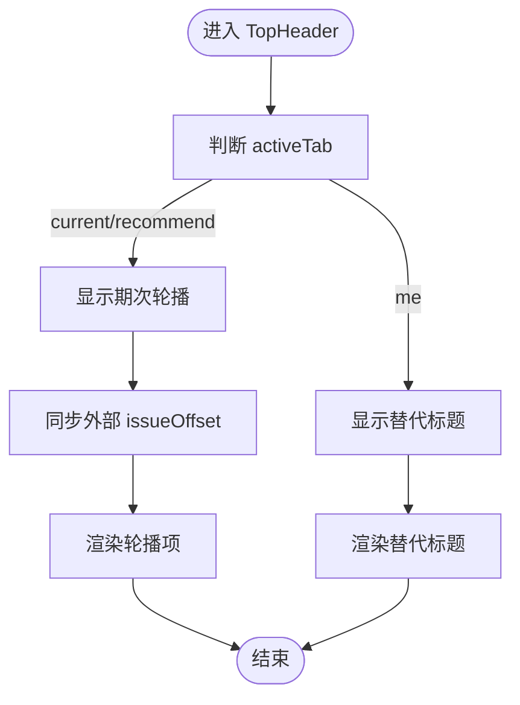
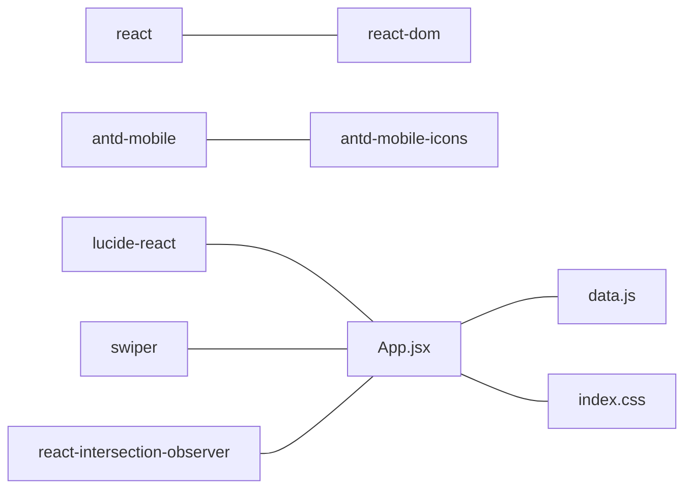

# 主应用组件

<cite>
**本文引用的文件**
- [src/App.jsx](file://src/App.jsx)
- [src/main.jsx](file://src/main.jsx)
- [src/data.js](file://src/data.js)
- [src/index.css](file://src/index.css)
- [package.json](file://package.json)
</cite>

## 目录
1. [简介](#简介)
2. [项目结构](#项目结构)
3. [核心组件](#核心组件)
4. [架构总览](#架构总览)
5. [详细组件分析](#详细组件分析)
6. [依赖分析](#依赖分析)
7. [性能考虑](#性能考虑)
8. [故障排查指南](#故障排查指南)
9. [结论](#结论)
10. [附录](#附录)

## 简介
本文件面向 NewSquare 主应用组件 App.jsx，提供从架构设计到实现细节的全面技术文档。重点涵盖：
- 根组件的整体架构与组件树结构
- 状态管理策略与生命周期
- 组件间通信机制
- 主要状态变量（如 issueOffset、activeTab、searchOpen 等）的作用与生命周期
- 渲染流程、事件处理机制与性能优化策略
- 扩展与自定义主应用组件功能的实践建议

## 项目结构
NewSquare 采用最小化的 Vite + React 架构，入口文件负责挂载根组件，数据通过集中导出模块提供，样式采用全局 CSS 实现。

图表来源
- [src/main.jsx:1-12](file://src/main.jsx#L1-L12)
- [src/App.jsx:1-1112](file://src/App.jsx#L1-L1112)
- [src/data.js:1-175](file://src/data.js#L1-L175)
- [src/index.css:1-1601](file://src/index.css#L1-L1601)

章节来源
- [src/main.jsx:1-12](file://src/main.jsx#L1-L12)
- [package.json:1-25](file://package.json#L1-L25)

## 核心组件
App.jsx 是整个应用的根组件，负责：
- 管理应用视图模式（feed/archive）、期次偏移（issueOffset）、活动标签页（activeTab）、搜索状态（searchOpen/searchQuery）、详情弹层（detail）等主要状态
- 提供期次切换、标签页切换、无限滚动加载、搜索交互、详情弹层等核心业务逻辑
- 组织顶层头部、搜索页、个人中心、瀑布流卡片、详情弹层等子组件

主要状态变量与职责
- view: 控制当前视图模式（feed/archive）
- issueOffset: 当前期次偏移，影响期次标题、封面网格与内容批次
- activeTab: 活动标签页（current/recommend/me），决定内容类型与种子偏移
- items: 当前页面的卡片批次，包含类型与索引，用于动态渲染
- hasMore: 无限滚动加载状态
- hidden: 顶部头部的显隐控制
- searchOpen/searchQuery: 搜索展开与查询词
- detail: 详情弹层的数据载体

章节来源
- [src/App.jsx:976-1112](file://src/App.jsx#L976-L1112)

## 架构总览
应用采用“根组件集中状态 + 子组件纯函数渲染”的模式，通过 props 下发与回调上送实现组件间通信。整体架构如下：

图表来源
- [src/App.jsx:67-205](file://src/App.jsx#L67-L205)
- [src/App.jsx:208-285](file://src/App.jsx#L208-L285)
- [src/App.jsx:287-579](file://src/App.jsx#L287-L579)
- [src/App.jsx:581-736](file://src/App.jsx#L581-L736)
- [src/App.jsx:742-858](file://src/App.jsx#L742-L858)
- [src/App.jsx:860-956](file://src/App.jsx#L860-L956)
- [src/App.jsx:976-1112](file://src/App.jsx#L976-L1112)

## 详细组件分析

### 根组件 App：状态管理与生命周期
- 状态初始化与作用域
  - view/issueOffset/activeTab/items/hasMore/hidden/searchOpen/searchQuery/detail 等状态在根组件内集中管理，驱动子组件渲染与行为
- 生命周期与滚动控制
  - 通过 requestAnimationFrame 与被动监听滚动事件，计算 y 方向位移与阈值，控制顶部头部的显隐
- 期次与标签页切换
  - switchIssue：限制偏移范围、重置批次、回顶
  - switchTab：根据目标标签页调整种子偏移，必要时回落到 Today，并重置批次与回顶
- 无限滚动与内容批次
  - loadMore：延时模拟加载，追加批次；超过阈值后停止加载
  - makeBatch：基于 seedFor（结合 activeTab 与 issueOffset）生成卡片批次，确保每期/每标签页内容“不同”
- 搜索与详情
  - toggleSearch：展开/收起搜索，清空查询词
  - openDetail：接收卡片点击的 origin 与 payload，打开详情弹层

图表来源
- [src/App.jsx:976-1112](file://src/App.jsx#L976-L1112)
- [src/App.jsx:67-205](file://src/App.jsx#L67-L205)
- [src/App.jsx:287-579](file://src/App.jsx#L287-L579)
- [src/App.jsx:742-858](file://src/App.jsx#L742-L858)
- [src/App.jsx:581-736](file://src/App.jsx#L581-L736)

章节来源
- [src/App.jsx:976-1112](file://src/App.jsx#L976-L1112)

### 顶部头部 TopHeader：期次轮播与搜索
- 功能要点
  - 根据 activeTab 显示期次轮播或替代标题
  - 期次轮播支持拖拽与快速切换，同步外部 issueOffset
  - 搜索态下隐藏日期与头像，仅保留 tabs 行
  - 支持展开/收起搜索输入框，自动聚焦
- 交互机制
  - onIssueChange：轮播切换时更新期次
  - onTabChange：切换标签页
  - onSearchToggle/onSearchQueryChange：控制搜索态与查询词
  - onTitleClick：点击标题进入归档页

图表来源
- [src/App.jsx:67-205](file://src/App.jsx#L67-L205)

章节来源
- [src/App.jsx:67-205](file://src/App.jsx#L67-L205)

### 归档页 ArchivePage：沉浸式封面网格
- 功能要点
  - 沉浸式网格滚动，顶部黑色渐变覆层随滚动渐隐
  - 点击封面切换期次并返回 feed
- 性能与交互
  - 使用 requestAnimationFrame 优化滚动监听
  - intro 渐隐与轻微上推效果由滚动距离驱动

章节来源
- [src/App.jsx:208-285](file://src/App.jsx#L208-L285)

### 卡片体系：视频、杂志、故事、空间、榜单、画廊
- 设计原则
  - 统一的卡片尺寸与视觉层级，底部品牌条采用深色毛玻璃
  - 视频卡支持自动播放与静音控制，基于 IntersectionObserver 优化
  - 故事卡与画廊卡使用 Swiper 实现横向滚动
- 交互机制
  - 点击卡片触发 onOpen(origin, payload)，由根组件打开详情弹层
  - 列表卡与榜单卡为只读展示

章节来源
- [src/App.jsx:287-579](file://src/App.jsx#L287-L579)

### 搜索页 SearchPage：热搜与热门期次
- 功能要点
  - 搜索历史 chips、热门热搜列表、热门期次封面自动滚动
  - 选择热搜或热门期次可直接跳转到对应期次
- 交互机制
  - onPick/onPickIssue 回调由根组件处理，切换期次并收起搜索

章节来源
- [src/App.jsx:742-858](file://src/App.jsx#L742-L858)

### 个人中心 MePage：用户信息与菜单
- 功能要点
  - 用户头像、统计信息、最近浏览、菜单项
  - 使用 Swiper 展示最近浏览的封面

章节来源
- [src/App.jsx:860-956](file://src/App.jsx#L860-L956)

### 详情弹层 DetailOverlay：全屏展开与收起
- 功能要点
  - 基于 origin 的入场/出场动画，使用双 requestAnimationFrame 确保首帧布局
  - ESC 键支持关闭
- 交互机制
  - onClose 回调由根组件处理，清空 detail 状态

章节来源
- [src/App.jsx:581-736](file://src/App.jsx#L581-L736)

## 依赖分析
- 运行时依赖
  - react/react-dom：框架基础
  - antd-mobile 与 antd-mobile-icons：移动端 UI 组件与图标
  - lucide-react：通用图标库
  - swiper：轮播组件
  - react-intersection-observer：视频卡懒加载
- 开发依赖
  - @vitejs/plugin-react、vite：构建工具链

图表来源
- [package.json:11-24](file://package.json#L11-L24)
- [src/App.jsx:1-10](file://src/App.jsx#L1-L10)
- [src/data.js:1-175](file://src/data.js#L1-L175)
- [src/index.css:1-1601](file://src/index.css#L1-L1601)

章节来源
- [package.json:1-25](file://package.json#L1-L25)

## 性能考虑
- 滚动优化
  - 使用 requestAnimationFrame 与被动滚动监听，降低主线程压力
  - 顶部头部显隐基于 y 方向位移与阈值，避免频繁重排
- 视频卡优化
  - 基于 IntersectionObserver 控制播放/暂停，减少后台资源占用
  - 首次尝试播放，兼容部分移动端浏览器
- 无限滚动
  - 分批加载与节流（setTimeout 模拟），避免一次性渲染过多节点
- 动画与过渡
  - 使用 will-change 与硬件加速属性，提升过渡流畅度
- 样式与字体
  - 字体按需加载与 CSS 变量统一字号与行高，减少样式抖动

章节来源
- [src/App.jsx:993-1008](file://src/App.jsx#L993-L1008)
- [src/App.jsx:313-322](file://src/App.jsx#L313-L322)
- [src/App.jsx:1037-1041](file://src/App.jsx#L1037-L1041)
- [src/index.css:1-1601](file://src/index.css#L1-L1601)

## 故障排查指南
- 期次轮播不响应
  - 检查 activeTab 与 toIndex 映射是否正确，确认外部 issueOffset 是否变化
  - 确认 Swiper 初始化与允许触摸移动配置
- 搜索展开后无法输入
  - 检查 searchOpen 状态与输入框的 tabIndex/pointer-events
- 视频卡无法播放
  - 确认浏览器允许自动播放策略，检查 IntersectionObserver 是否连接
- 详情弹层动画异常
  - 确认 origin 尺寸与窗口尺寸计算，检查 transitionend 事件与兼容降级
- 无限滚动不触发
  - 检查 hasMore 状态与 loadMore 回调绑定，确认滚动容器与监听事件

章节来源
- [src/App.jsx:77-82](file://src/App.jsx#L77-L82)
- [src/App.jsx:85-90](file://src/App.jsx#L85-L90)
- [src/App.jsx:313-322](file://src/App.jsx#L313-L322)
- [src/App.jsx:642-656](file://src/App.jsx#L642-L656)
- [src/App.jsx:1097-1103](file://src/App.jsx#L1097-L1103)

## 结论
App.jsx 通过集中状态管理与清晰的组件边界，实现了期次导航、标签页切换、搜索、无限滚动与详情弹层等复杂交互。其设计兼顾了移动端体验与性能优化，适合在此基础上进行功能扩展与定制。

## 附录

### 扩展与自定义建议
- 新增标签页
  - 在 HEADER_TABS 中添加新标签，扩展 activeTab 分支逻辑
  - 在 TAB_SEED_OFFSET 中增加种子偏移，确保内容差异化
- 新增卡片类型
  - 在 ORDER 与 BUILDERS 中注册新卡片类型，确保 makeBatch 能生成对应批次
- 新增期次范围
  - 扩展 ISSUES/RECOMMEND_ISSUES 数组，注意 toIndex 映射与滑动行为
- 搜索增强
  - 在 SearchPage 中接入实时搜索接口，替换现有静态数据
- 详情弹层扩展
  - 在 DetailOverlay 中新增 variant 类型与渲染分支，复用现有动画与交互

章节来源
- [src/App.jsx:60-65](file://src/App.jsx#L60-L65)
- [src/App.jsx:959-960](file://src/App.jsx#L959-L960)
- [src/App.jsx:963-973](file://src/App.jsx#L963-L973)
- [src/App.jsx:742-858](file://src/App.jsx#L742-L858)
- [src/App.jsx:581-736](file://src/App.jsx#L581-L736)