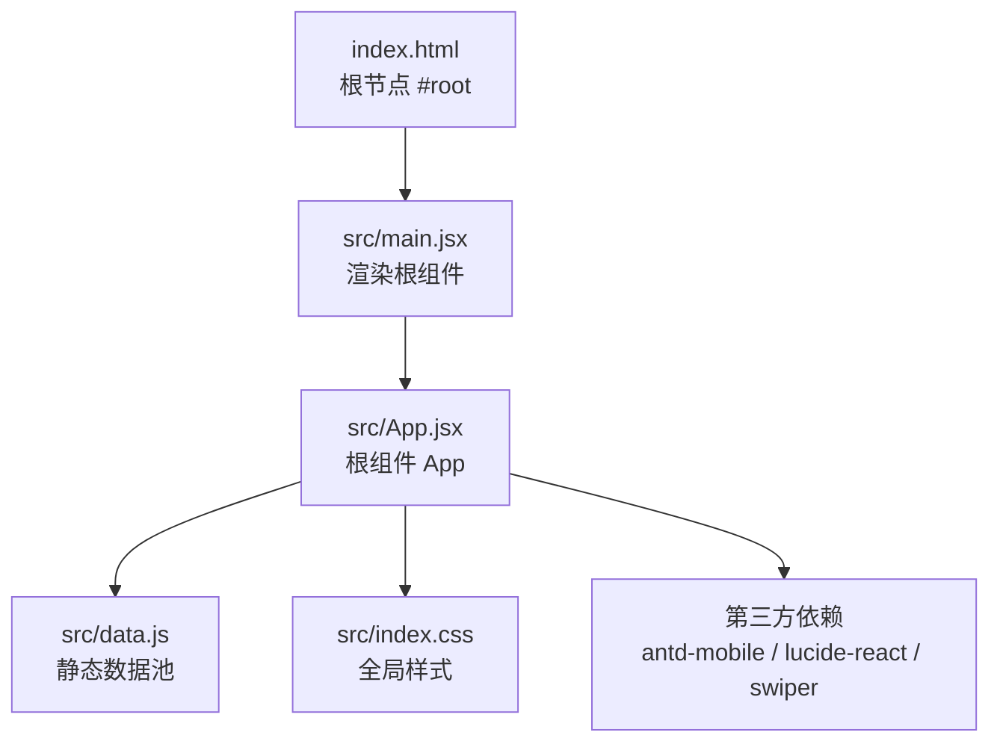
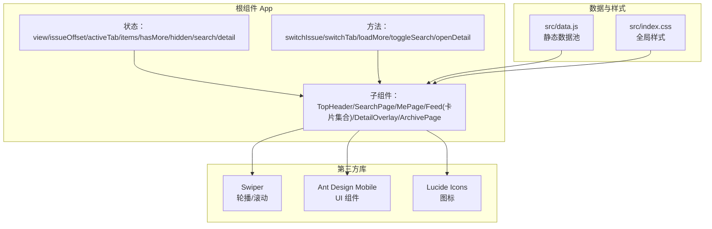
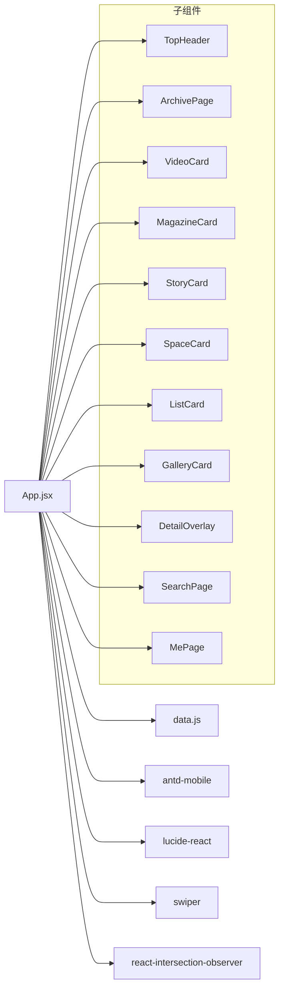
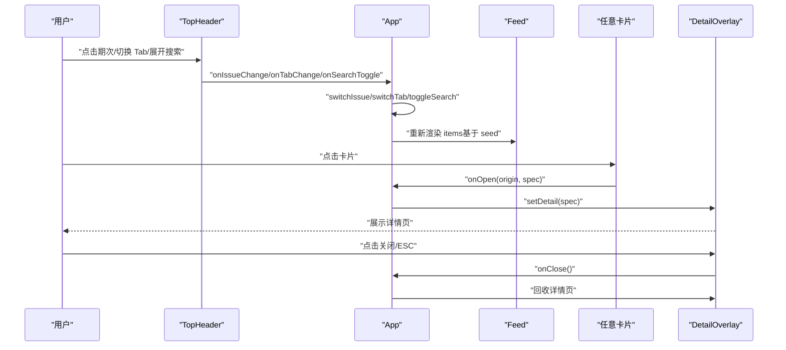

# 核心组件系统

<cite>
**本文引用的文件**
- [src/App.jsx](file://src/App.jsx)
- [src/main.jsx](file://src/main.jsx)
- [src/data.js](file://src/data.js)
- [src/index.css](file://src/index.css)
- [index.html](file://index.html)
- [package.json](file://package.json)
</cite>

## 目录
1. [简介](#简介)
2. [项目结构](#项目结构)
3. [核心组件](#核心组件)
4. [架构总览](#架构总览)
5. [组件详解](#组件详解)
6. [依赖关系分析](#依赖关系分析)
7. [性能考量](#性能考量)
8. [故障排查指南](#故障排查指南)
9. [结论](#结论)
10. [附录](#附录)

## 简介
本文件面向 NewSquare 的核心组件系统，重点围绕 App.jsx 作为根组件的设计架构进行深入解析。内容涵盖：
- 根组件 App 的职责划分与视图切换策略
- 子组件的组织结构与通信机制
- React Hooks 的使用场景与最佳实践
- 生命周期管理、props 传递模式与事件处理
- 交互与动画流程（头部、详情页、归档页）
- 可扩展性与自定义建议

## 项目结构
NewSquare 采用 Vite + React 18 的现代前端栈，核心入口为 main.jsx，根组件为 App.jsx，数据通过 data.js 提供，样式集中在 index.css。

图表来源
- [index.html:11-14](file://index.html#L11-L14)
- [src/main.jsx:1-12](file://src/main.jsx#L1-L12)
- [src/App.jsx:929-1059](file://src/App.jsx#L929-L1059)
- [src/data.js:1-175](file://src/data.js#L1-L175)
- [src/index.css:1-18](file://src/index.css#L1-L18)
- [package.json:11-19](file://package.json#L11-L19)

章节来源
- [index.html:1-16](file://index.html#L1-L16)
- [src/main.jsx:1-12](file://src/main.jsx#L1-L12)
- [src/App.jsx:929-1059](file://src/App.jsx#L929-L1059)
- [src/data.js:1-175](file://src/data.js#L1-L175)
- [src/index.css:1-18](file://src/index.css#L1-L18)
- [package.json:11-19](file://package.json#L11-L19)

## 核心组件
本节聚焦根组件 App 的状态管理、视图切换与子组件调度。

- 状态域
  - 视图模式：view（feed/archive）
  - 期次偏移：issueOffset（用于计算期次标题与内容种子）
  - 当前 Tab：activeTab（current/recommend/me）
  - 列表项批次：items（基于 seed 的卡片批次）
  - 是否还有更多：hasMore
  - 头部隐藏：hidden
  - 搜索态：searchOpen/searchQuery
  - 详情页：detail
  - 滚动节流：lastY/ticking（用于头部隐藏逻辑）

- 关键行为
  - 期次切换：switchIssue
  - Tab 切换：switchTab（含推荐期次约束）
  - 加载更多：loadMore（无限滚动）
  - 搜索开关：toggleSearch
  - 打开详情：openDetail

- 子组件调度
  - ORDER 定义卡片类型顺序
  - BUILDERS 映射类型到具体组件
  - makeBatch 基于 seed 生成批次，确保每期/每 Tab 内容“不同”

章节来源
- [src/App.jsx:929-1059](file://src/App.jsx#L929-L1059)
- [src/App.jsx:911-926](file://src/App.jsx#L911-L926)

## 架构总览
整体采用“根组件集中状态 + 子组件纯展示/受控”的模式，配合 Swiper、Ant Design Mobile 等第三方库实现高性能交互。

图表来源
- [src/App.jsx:929-1059](file://src/App.jsx#L929-L1059)
- [src/data.js:1-175](file://src/data.js#L1-L175)
- [src/index.css:1-18](file://src/index.css#L1-L18)
- [package.json:11-19](file://package.json#L11-L19)

## 组件详解

### 根组件 App（集中状态与视图编排）
- 视图编排
  - feed：根据 activeTab + issueOffset 渲染卡片流
  - archive：归档页（沉浸式网格）
  - search：搜索页（展开搜索态）
  - detail：详情页（卡片点击放大）

- 状态与副作用
  - 头部隐藏：基于滚动节流（requestAnimationFrame + passive 事件）
  - 期次/Tab 切换：重置批次并回顶
  - 无限滚动：分批加载，超过阈值停止

- 事件与回调
  - 顶部头部：期次变更、Tab 切换、搜索开关
  - 卡片：点击打开详情（携带 origin 动画参数）
  - 归档页：选择期次并返回 feed

章节来源
- [src/App.jsx:929-1059](file://src/App.jsx#L929-L1059)
- [src/App.jsx:946-961](file://src/App.jsx#L946-L961)
- [src/App.jsx:964-994](file://src/App.jsx#L964-L994)
- [src/App.jsx:996-1004](file://src/App.jsx#L996-L1004)

### 顶部头部 TopHeader
- 功能要点
  - 期次轮播：Swiper 标题滑动，支持推荐期次与当期期次两套索引映射
  - Tab 切换：current/recommend/me
  - 搜索展开：输入框自动聚焦、返回按钮、清空/关闭
  - 头部隐藏：滚动阈值控制

- 交互细节
  - 外部同步：当外部 issueOffset 或 activeTab 变化时，内部 Swiper 同步到目标索引
  - 搜索态：搜索输入框展开时禁用其他交互，返回按钮与输入框渐显

章节来源
- [src/App.jsx:67-205](file://src/App.jsx#L67-L205)
- [src/App.jsx:77-82](file://src/App.jsx#L77-L82)
- [src/App.jsx:85-90](file://src/App.jsx#L85-L90)

### 归档页 ArchivePage
- 功能要点
  - 沉浸式网格：全屏滚动，顶部黑色渐变覆层
  - 滚动联动：滚动时覆层渐隐与上移，营造沉浸体验
  - 期次选择：点击网格项切换期次并返回 feed

- 性能优化
  - 滚动监听使用 requestAnimationFrame 节流
  - passive 事件提升滚动性能

章节来源
- [src/App.jsx:208-285](file://src/App.jsx#L208-L285)
- [src/App.jsx:213-227](file://src/App.jsx#L213-L227)

### 卡片体系（VideoCard/MagazineCard/StoryCard/SpaceCard/ListCard/GalleryCard）
- 设计原则
  - 统一的“点击放大”协议：onOpen(origin, spec)，由根组件接管为 DetailOverlay
  - 每类卡片的数据来自 data.js 对应集合，通过 cycle(idx) 循环取用
  - 部分卡片内置 Swiper（StoryCard/GalleryCard），用于横向滚动

- VideoCard 特性
  - 自动播放与暂停：IntersectionObserver 控制可见性
  - 静音切换：useState 管理静音状态
  - 失败兜底：poster 始终可见

- StoryCard 特性
  - 自动横向滚动商品条（Autoplay + FreeMode）
  - 点击封面打开详情，商品项点击可复用相同协议

- GalleryCard 特性
  - 横向滚动案例卡片，点击卡片打开详情

章节来源
- [src/App.jsx:288-367](file://src/App.jsx#L288-L367)
- [src/App.jsx:370-403](file://src/App.jsx#L370-L403)
- [src/App.jsx:406-463](file://src/App.jsx#L406-L463)
- [src/App.jsx:466-489](file://src/App.jsx#L466-L489)
- [src/App.jsx:492-525](file://src/App.jsx#L492-L525)
- [src/App.jsx:528-579](file://src/App.jsx#L528-L579)

### 详情页 DetailOverlay
- 动画策略
  - 打开：从 origin rect 放大到全屏，双 rAF 确保首帧布局生效
  - 关闭：向上滚动至顶部，保持视觉 origin 准确，过渡结束后回收

- 交互细节
  - ESC 键关闭
  - 点击遮罩关闭（可结合样式限制）
  - 根据 variant 渲染不同内容（single/story）

章节来源
- [src/App.jsx:590-736](file://src/App.jsx#L590-L736)
- [src/App.jsx:596-622](file://src/App.jsx#L596-L622)
- [src/App.jsx:624-656](file://src/App.jsx#L624-L656)

### 搜索页 SearchPage
- 功能要点
  - 搜索历史与热搜标签
  - 点击历史/热搜更新查询词
  - 输入态提示

章节来源
- [src/App.jsx:742-811](file://src/App.jsx#L742-L811)

### 个人中心 MePage
- 功能要点
  - 用户信息卡片
  - 最近浏览（Swiper 横向）
  - 菜单项（含图标与额外数量）

章节来源
- [src/App.jsx:813-909](file://src/App.jsx#L813-L909)

### Feed 与无限滚动
- Feed
  - 基于 items 渲染卡片集合
  - 每个卡片通过 onOpen(origin, spec) 与根组件通信

- 无限滚动
  - InfiniteScroll 包裹，加载更多时追加批次
  - 达到阈值后停止

章节来源
- [src/App.jsx:1038-1051](file://src/App.jsx#L1038-L1051)
- [src/App.jsx:990-994](file://src/App.jsx#L990-L994)

## 依赖关系分析
- 组件依赖
  - App.jsx 依赖 data.js 的数据池
  - 多数子组件依赖 Ant Design Mobile 组件（Button、Image、InfiniteScroll、DotLoading）
  - 使用 Swiper 实现轮播与横向滚动
  - 使用 lucide-react 图标库

- 外部依赖
  - react、react-dom
  - antd-mobile、antd-mobile-icons
  - lucide-react
  - swiper
  - react-intersection-observer（用于视频自动播放控制）

图表来源
- [src/App.jsx:1-15](file://src/App.jsx#L1-L15)
- [src/data.js:1-175](file://src/data.js#L1-L175)
- [package.json:11-19](file://package.json#L11-L19)

章节来源
- [src/App.jsx:1-15](file://src/App.jsx#L1-L15)
- [src/data.js:1-175](file://src/data.js#L1-L175)
- [package.json:11-19](file://package.json#L11-L19)

## 性能考量
- 滚动节流
  - 头部隐藏与归档页滚动均使用 requestAnimationFrame + passive 事件，降低主线程压力
- IntersectionObserver
  - VideoCard 使用 IO 控制视频播放，仅在可见时尝试播放，减少后台资源占用
- 无限滚动
  - 分批加载，达到阈值后停止，避免一次性渲染过多节点
- 动画
  - 详情页打开/关闭使用 transform + border-radius 过渡，配合 will-change 与双 rAF，保证流畅度
- 样式
  - 使用 backdrop-filter 与 mask-image 实现毛玻璃与渐变覆盖，注意在低端设备上的性能影响

章节来源
- [src/App.jsx:946-961](file://src/App.jsx#L946-L961)
- [src/App.jsx:213-227](file://src/App.jsx#L213-L227)
- [src/App.jsx:313-322](file://src/App.jsx#L313-L322)
- [src/App.jsx:990-994](file://src/App.jsx#L990-L994)
- [src/App.jsx:596-622](file://src/App.jsx#L596-L622)
- [src/index.css:598-633](file://src/index.css#L598-L633)

## 故障排查指南
- 视频无法自动播放
  - 检查浏览器策略与移动端自动播放限制，组件内已尝试首次播放并捕获错误
  - 确认 IntersectionObserver 是否正确观察到元素
- 详情页动画异常
  - 确认 origin rect 是否有效，检查窗口尺寸变化是否影响定位
  - 关闭时确保 transitionend 事件触发，兼容 fallback 超时
- 归档页滚动卡顿
  - 检查滚动监听是否重复绑定，确认 requestAnimationFrame 节流生效
- 期次/Tab 切换无效
  - 确认外部传入的 issueOffset/activeTab 是否变化，内部 useEffect 是否同步 Swiper
- 搜索态焦点问题
  - 检查搜索展开时的自动聚焦逻辑与键盘事件

章节来源
- [src/App.jsx:313-322](file://src/App.jsx#L313-L322)
- [src/App.jsx:624-656](file://src/App.jsx#L624-L656)
- [src/App.jsx:213-227](file://src/App.jsx#L213-L227)
- [src/App.jsx:77-82](file://src/App.jsx#L77-L82)
- [src/App.jsx:85-90](file://src/App.jsx#L85-L90)

## 结论
NewSquare 的核心组件系统以 App.jsx 为中心，通过集中状态与受控子组件实现了清晰的职责分离与良好的可扩展性。借助 Swiper、Ant Design Mobile 与 lucide-react 等库，系统在移动端具备优秀的交互体验与性能表现。建议后续可在以下方面持续优化：
- 将数据池抽象为可配置模块，便于多主题/多语言切换
- 将动画参数与样式变量抽取为常量，统一维护
- 对无限滚动与 IntersectionObserver 的边界条件做更完善的测试

## 附录

### React Hooks 使用场景速览
- useState
  - 管理视图模式、期次、Tab、搜索态、详情态、列表批次与“是否还有更多”
- useEffect
  - 头部隐藏滚动监听、搜索展开自动聚焦、详情页打开/关闭动画初始化、ESC 键监听
- useRef
  - Swiper 实例、搜索输入框、详情页根节点、滚动节流标记、关闭过程中的防抖

章节来源
- [src/App.jsx:929-1059](file://src/App.jsx#L929-L1059)
- [src/App.jsx:67-205](file://src/App.jsx#L67-L205)
- [src/App.jsx:208-285](file://src/App.jsx#L208-L285)
- [src/App.jsx:288-367](file://src/App.jsx#L288-L367)
- [src/App.jsx:590-736](file://src/App.jsx#L590-L736)

### 组件通信与事件处理流程（序列图）

图表来源
- [src/App.jsx:1018-1058](file://src/App.jsx#L1018-L1058)
- [src/App.jsx:942-944](file://src/App.jsx#L942-L944)
- [src/App.jsx:590-736](file://src/App.jsx#L590-L736)