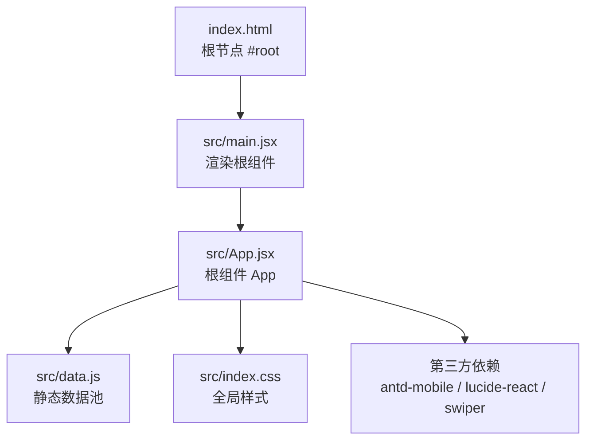
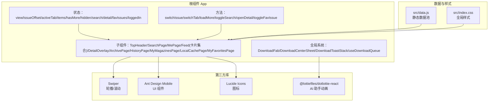
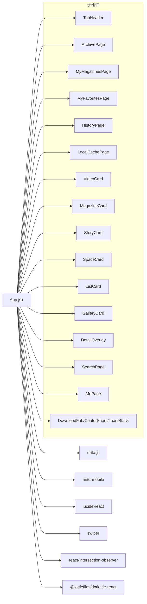
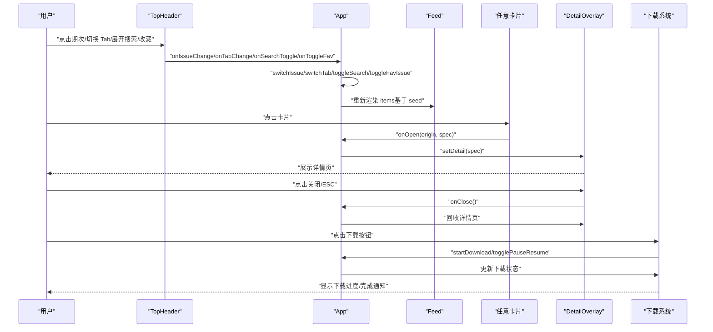
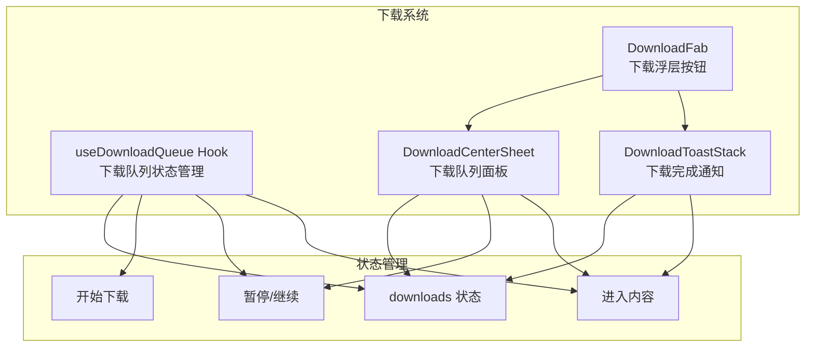

# 核心组件系统

<cite>
**本文引用的文件**
- [src/App.jsx](file://src/App.jsx)
- [src/main.jsx](file://src/main.jsx)
- [src/data.js](file://src/data.js)
- [src/index.css](file://src/index.css)
- [index.html](file://index.html)
- [package.json](file://package.json)
</cite>

## 目录
1. [简介](#简介)
2. [项目结构](#项目结构)
3. [核心组件](#核心组件)
4. [架构总览](#架构总览)
5. [组件详解](#组件详解)
6. [依赖关系分析](#依赖关系分析)
7. [性能考量](#性能考量)
8. [故障排查指南](#故障排查指南)
9. [结论](#结论)
10. [附录](#附录)

## 简介
本文件面向 NewSquare 的核心组件系统，重点围绕 App.jsx 作为根组件的设计架构进行深入解析。内容涵盖：
- 根组件 App 的职责划分与视图切换策略
- 子组件的组织结构与通信机制
- React Hooks 的使用场景与最佳实践
- 生命周期管理、props 传递模式与事件处理
- 交互与动画流程（头部、详情页、归档页）
- 收藏按钮系统、全局下载覆盖层、视频轮播功能等重大架构改进
- 可扩展性与自定义建议

## 项目结构
NewSquare 采用 Vite + React 18 的现代前端栈，核心入口为 main.jsx，根组件为 App.jsx，数据通过 data.js 提供，样式集中在 index.css。

图表来源
- [index.html:11-14](file://index.html#L11-L14)
- [src/main.jsx:1-12](file://src/main.jsx#L1-L12)
- [src/App.jsx:929-1059](file://src/App.jsx#L929-L1059)
- [src/data.js:1-175](file://src/data.js#L1-L175)
- [src/index.css:1-18](file://src/index.css#L1-L18)
- [package.json:11-19](file://package.json#L11-L19)

章节来源
- [index.html:1-16](file://index.html#L1-L16)
- [src/main.jsx:1-12](file://src/main.jsx#L1-L12)
- [src/App.jsx:929-1059](file://src/App.jsx#L929-L1059)
- [src/data.js:1-175](file://src/data.js#L1-L175)
- [src/index.css:1-18](file://src/index.css#L1-L18)
- [package.json:11-19](file://package.json#L11-L19)

## 核心组件
本节聚焦根组件 App 的状态管理、视图切换与子组件调度。

- 状态域
  - 视图模式：view（feed/archive/history/mymags/cache/fav）
  - 期次偏移：issueOffset（用于计算期次标题与内容种子）
  - 当前 Tab：activeTab（current/recommend/me）
  - 列表项批次：items（基于 seed 的卡片批次）
  - 是否还有更多：hasMore
  - 头部隐藏：hidden
  - 搜索态：searchOpen/searchQuery
  - 详情页：detail
  - 滚动节流：lastY/ticking（用于头部隐藏逻辑）
  - 收藏状态：favIssues（Set 类型，存储已收藏期次）
  - 登录状态：loggedIn

- 关键行为
  - 期次切换：switchIssue
  - Tab 切换：switchTab（含推荐期次约束）
  - 加载更多：loadMore（无限滚动）
  - 搜索开关：toggleSearch
  - 打开详情：openDetail
  - 收藏切换：toggleFavIssue

- 子组件调度
  - ORDER 定义卡片类型顺序
  - BUILDERS 映射类型到具体组件
  - makeBatch 基于 seed 生成批次，确保每期/每 Tab 内容"不同"

- 全局下载系统
  - useDownloadQueue：下载队列 Hook
  - DownloadFab：下载浮层按钮
  - DownloadCenterSheet：下载队列面板
  - DownloadToastStack：下载完成 Toast

章节来源
- [src/App.jsx:3502-3775](file://src/App.jsx#L3502-L3775)
- [src/App.jsx:3088-3206](file://src/App.jsx#L3088-L3206)

## 架构总览
整体采用"根组件集中状态 + 子组件纯展示/受控"的模式，配合 Swiper、Ant Design Mobile 等第三方库实现高性能交互。新增的收藏按钮系统、全局下载覆盖层和视频轮播功能进一步增强了用户体验。

图表来源
- [src/App.jsx:3502-3775](file://src/App.jsx#L3502-L3775)
- [src/data.js:1-175](file://src/data.js#L1-L175)
- [src/index.css:1-18](file://src/index.css#L1-L18)
- [package.json:11-19](file://package.json#L11-L19)

## 组件详解

### 根组件 App（集中状态与视图编排）
- 视图编排
  - feed：根据 activeTab + issueOffset 渲染卡片流
  - archive：归档页（沉浸式网格）
  - history：浏览历史页（仿 App Store 已购内容）
  - mymags：我的期刊页
  - cache：本地缓存页
  - fav：我的收藏页
  - detail：详情页（卡片点击放大）

- 状态与副作用
  - 头部隐藏：基于滚动节流（requestAnimationFrame + passive 事件）
  - 期次/Tab 切换：重置批次并回顶
  - 无限滚动：分批加载，超过阈值停止
  - 登录状态管理：未登录时显示登录页

- 事件与回调
  - 顶部头部：期次变更、Tab 切换、搜索开关、收藏切换
  - 卡片：点击打开详情（携带 origin 动画参数）
  - 归档页：选择期次并返回 feed
  - 下载系统：全局下载覆盖层、下载队列面板、下载完成 Toast

**更新** 新增了完整的下载系统集成，包括全局下载浮层、下载队列面板和下载完成通知

章节来源
- [src/App.jsx:3502-3775](file://src/App.jsx#L3502-L3775)
- [src/App.jsx:3578-3620](file://src/App.jsx#L3578-L3620)
- [src/App.jsx:3625-3640](file://src/App.jsx#L3625-L3640)

### 顶部头部 TopHeader
- 功能要点
  - 期次轮播：Swiper 标题滑动，支持推荐期次与当期期次两套索引映射
  - Tab 切换：current/recommend/me
  - 搜索展开：输入框自动聚焦、返回按钮、清空/关闭
  - 头部隐藏：滚动阈值控制
  - 收藏按钮：爱心图标，支持收藏/取消收藏当前期次

- 交互细节
  - 外部同步：当外部 issueOffset 或 activeTab 变化时，内部 Swiper 同步到目标索引
  - 搜索态：搜索输入框展开时禁用其他交互，返回按钮与输入框渐显
  - 收藏态：根据 favIssues Set 状态显示实心/空心爱心

**更新** 新增了收藏按钮功能，支持用户收藏感兴趣的期刊期次

章节来源
- [src/App.jsx:70-222](file://src/App.jsx#L70-L222)
- [src/App.jsx:205-219](file://src/App.jsx#L205-L219)

### 归档页 ArchivePage
- 功能要点
  - 沉浸式网格：全屏滚动，顶部黑色渐变覆层
  - 滚动联动：滚动时覆层渐隐与上移，营造沉浸体验
  - 期次选择：点击网格项切换期次并返回 feed
  - 收藏功能：每个期刊封面右上角显示收藏按钮

- 性能优化
  - 滚动监听使用 requestAnimationFrame 节流
  - passive 事件提升滚动性能

**更新** 新增了收藏功能，用户可以在归档页直接收藏期刊

章节来源
- [src/App.jsx:225-316](file://src/App.jsx#L225-L316)
- [src/App.jsx:269-283](file://src/App.jsx#L269-L283)

### 我收藏的期刊 MyMagazinesPage
- 功能要点
  - 仿期刊日历页：14 期期刊封面网格排列
  - 沉浸式体验：顶部渐变覆层 + 标题
  - 收藏标签：每个期刊显示"已收藏"标签
  - 期次选择：点击进入对应期次详情

- 特殊设计
  - 顶部"当前"标签标识当前期次
  - 已收藏期刊显示特殊标签

**更新** 新增了专门的"我的期刊"页面，展示用户收藏的所有期刊

章节来源
- [src/App.jsx:319-395](file://src/App.jsx#L319-L395)
- [src/App.jsx:359-367](file://src/App.jsx#L359-L367)

### 我的收藏 MyFavoritesPage
- 功能要点
  - 三个标签页：空间、Moodboard、AI 模型
  - 空间：瀑布流布局，支持收藏切换
  - Moodboard：瀑布流布局
  - AI 模型：双列正方形网格
  - 收藏切换：每个项目右上角的心形按钮

- 交互特性
  - 标题栏可隐藏/显示
  - 滚动时标题栏自动隐藏
  - 收藏状态本地保存

**更新** 新增了完整的收藏管理系统，支持多种类型的收藏内容

章节来源
- [src/App.jsx:2798-2927](file://src/App.jsx#L2798-L2927)
- [src/App.jsx:2805-2811](file://src/App.jsx#L2805-L2811)

### 视频轮播 VideoCard
- 功能要点
  - 内置 Swiper 轮播：支持左右滑动切换视频
  - 视频自动播放：IntersectionObserver 控制可见性
  - 静音控制：支持静音/取消静音切换
  - 视频失败兜底：海报始终可见
  - 下载按钮：每个视频支持云下载功能

- 视频轮播特性
  - 多个视频聚合：基于 VIDEO_CONTENT 和 VIDEO_URLS
  - 活动指示点：显示当前播放视频索引
  - 详情页集成：点击视频封面打开详情页

**更新** 视频轮播功能得到增强，现在支持完整的下载系统集成

章节来源
- [src/App.jsx:555-592](file://src/App.jsx#L555-L592)
- [src/App.jsx:555-592](file://src/App.jsx#L555-L592)
- [src/App.jsx:461-553](file://src/App.jsx#L461-L553)

### 详情页 DetailOverlay
- 动画策略
  - 打开：从 origin rect 放大到全屏，双 rAF 确保首帧布局生效
  - 关闭：向上滚动至顶部，保持视觉 origin 准确，过渡结束后回收

- 交互细节
  - ESC 键关闭
  - 点击遮罩关闭（可结合样式限制）
  - 根据 variant 渲染不同内容（single/video/story）
  - 视频轮播：详情页内嵌视频轮播，镜像主页轮播效果

**更新** 详情页现在支持视频轮播功能，用户可以在详情页内观看视频

章节来源
- [src/App.jsx:937-1146](file://src/App.jsx#L937-L1146)
- [src/App.jsx:888-935](file://src/App.jsx#L888-L935)

### 浏览历史 HistoryPage
- 功能要点
  - 仿 App Store 已购内容界面
  - 支持排序：最新、大小、名称
  - 下载状态显示：排队中、准备中、下载中、已暂停、已完成
  - 搜索功能：搜索浏览历史
  - 操作按钮：进入、暂停/继续、删除

- 下载状态管理
  - 四种状态：queued/spinning/downloading/paused/done
  - 进度条显示：圆形进度条 + 百分比
  - 操作控制：暂停/继续、删除、进入

**更新** 新增了完整的浏览历史页面，集成下载系统

章节来源
- [src/App.jsx:3342-3523](file://src/App.jsx#L3342-L3523)
- [src/App.jsx:3431-3488](file://src/App.jsx#L3431-L3488)

### 本地缓存 LocalCachePage
- 功能要点
  - iOS 风格左滑删除 + 多选
  - 支持排序：最新、大小、名称
  - 多选删除：支持批量删除缓存内容
  - 悬浮删除按钮：左滑显示删除选项

- 交互特性
  - 左滑删除：iOS 风格的滑动手势
  - 多选模式：点击多选按钮进入批量操作
  - 悬浮删除：删除按钮在滑动时显示

**更新** 新增了本地缓存管理功能，支持用户管理本地存储的内容

章节来源
- [src/App.jsx:2628-2757](file://src/App.jsx#L2628-L2757)
- [src/App.jsx:2459-2625](file://src/App.jsx#L2459-L2625)

### 个人中心 MePage
- 功能要点
  - 用户信息卡片
  - 最近浏览（Swiper 横向）
  - 菜单项：我的期刊、我的收藏、本地缓存等
  - 工作台入口：空间、Moodboard、AI 模型

- 导航功能
  - 点击菜单项跳转到对应页面
  - 支持快捷访问常用功能

**更新** 个人中心现在集成了下载系统和收藏管理入口

章节来源
- [src/App.jsx:2929-2946](file://src/App.jsx#L2929-L2946)

### Feed 与无限滚动
- Feed
  - 基于 items 渲染卡片集合
  - 每个卡片通过 onOpen(origin, spec) 与根组件通信

- 无限滚动
  - InfiniteScroll 包裹，加载更多时追加批次
  - 达到阈值后停止

**更新** Feed 现在包含视频轮播卡片，提供更丰富的多媒体内容体验

章节来源
- [src/App.jsx:3737-3753](file://src/App.jsx#L3737-L3753)
- [src/App.jsx:3605-3610](file://src/App.jsx#L3605-L3610)

## 依赖关系分析
- 组件依赖
  - App.jsx 依赖 data.js 的数据池
  - 多数子组件依赖 Ant Design Mobile 组件（Button、Image、InfiniteScroll、DotLoading）
  - 使用 Swiper 实现轮播与横向滚动
  - 使用 lucide-react 图标库
  - 使用 @lottiefiles/dotlottie-react 实现 AI 助手动画

- 外部依赖
  - react、react-dom
  - antd-mobile、antd-mobile-icons
  - lucide-react
  - swiper
  - react-intersection-observer（用于视频自动播放控制）
  - @lottiefiles/dotlottie-react（用于 AI 助手动画）

图表来源
- [src/App.jsx:1-15](file://src/App.jsx#L1-L15)
- [src/data.js:1-175](file://src/data.js#L1-L175)
- [package.json:11-19](file://package.json#L11-L19)

章节来源
- [src/App.jsx:1-15](file://src/App.jsx#L1-L15)
- [src/data.js:1-175](file://src/data.js#L1-L175)
- [package.json:11-19](file://package.json#L11-L19)

## 性能考量
- 滚动节流
  - 头部隐藏与归档页滚动均使用 requestAnimationFrame + passive 事件，降低主线程压力
- IntersectionObserver
  - VideoCard 使用 IO 控制视频播放，仅在可见时尝试播放，减少后台资源占用
- 无限滚动
  - 分批加载，达到阈值后停止，避免一次性渲染过多节点
- 动画
  - 详情页打开/关闭使用 transform + border-radius 过渡，配合 will-change 与双 rAF，保证流畅度
- 样式
  - 使用 backdrop-filter 与 mask-image 实现毛玻璃与渐变覆盖，注意在低端设备上的性能影响
- 下载系统
  - 使用 requestAnimationFrame 控制进度更新，避免频繁重绘
  - 下载队列采用状态机管理，支持暂停/继续功能

**更新** 新增了下载系统的性能优化，包括进度更新节流和状态机管理

章节来源
- [src/App.jsx:3562-3576](file://src/App.jsx#L3562-L3576)
- [src/App.jsx:230-244](file://src/App.jsx#L230-L244)
- [src/App.jsx:3128-3163](file://src/App.jsx#L3128-L3163)

## 故障排查指南
- 视频无法自动播放
  - 检查浏览器策略与移动端自动播放限制，组件内已尝试首次播放并捕获错误
  - 确认 IntersectionObserver 是否正确观察到元素
- 详情页动画异常
  - 确认 origin rect 是否有效，检查窗口尺寸变化是否影响定位
  - 关闭时确保 transitionend 事件触发，兼容 fallback 超时
- 归档页滚动卡顿
  - 检查滚动监听是否重复绑定，确认 requestAnimationFrame 节流生效
- 期次/Tab 切换无效
  - 确认外部传入的 issueOffset/activeTab 是否变化，内部 useEffect 是否同步 Swiper
- 搜索态焦点问题
  - 检查搜索展开时的自动聚焦逻辑与键盘事件
- 收藏功能异常
  - 检查 favIssues Set 是否正确更新，确认收藏按钮状态同步
- 下载系统问题
  - 检查下载队列状态机是否正常运行，确认进度更新定时器
  - 确认下载完成通知是否正确触发

**更新** 新增了收藏功能和下载系统的故障排查指南

章节来源
- [src/App.jsx:493-505](file://src/App.jsx#L493-L505)
- [src/App.jsx:971-997](file://src/App.jsx#L971-L997)
- [src/App.jsx:230-244](file://src/App.jsx#L230-L244)
- [src/App.jsx:3590-3603](file://src/App.jsx#L3590-L3603)
- [src/App.jsx:3517-3519](file://src/App.jsx#L3517-L3519)
- [src/App.jsx:3165-3172](file://src/App.jsx#L3165-L3172)

## 结论
NewSquare 的核心组件系统以 App.jsx 为中心，通过集中状态与受控子组件实现了清晰的职责分离与良好的可扩展性。借助 Swiper、Ant Design Mobile 与 lucide-react 等库，系统在移动端具备优秀的交互体验与性能表现。

**重大架构改进总结：**
- 收藏按钮系统：支持用户收藏期刊、内容和空间，提供统一的收藏管理体验
- 全局下载覆盖层：提供统一的下载管理和进度监控，支持多任务并发下载
- 视频轮播功能：增强视频内容展示，支持详情页内嵌视频轮播
- 完整的历史管理：浏览历史、本地缓存、下载队列一体化管理

建议后续可在以下方面持续优化：
- 将数据池抽象为可配置模块，便于多主题/多语言切换
- 将动画参数与样式变量抽取为常量，统一维护
- 对无限滚动与 IntersectionObserver 的边界条件做更完善的测试
- 优化下载系统的内存使用，支持更大规模的下载任务
- 增强收藏系统的数据持久化，支持跨会话同步

## 附录

### React Hooks 使用场景速览
- useState
  - 管理视图模式、期次、Tab、搜索态、详情态、列表批次与"是否还有更多"
  - 管理收藏状态、登录状态、下载队列状态
- useEffect
  - 头部隐藏滚动监听、搜索展开自动聚焦、详情页打开/关闭动画初始化、ESC 键监听
  - 滚动监听、下载进度更新定时器清理
- useRef
  - Swiper 实例、搜索输入框、详情页根节点、滚动节流标记、关闭过程中的防抖
  - 下载队列定时器引用、下载进度定时器引用

**更新** 新增了下载系统相关的 Hook 使用场景

章节来源
- [src/App.jsx:3502-3775](file://src/App.jsx#L3502-L3775)
- [src/App.jsx:3088-3206](file://src/App.jsx#L3088-L3206)
- [src/App.jsx:3562-3576](file://src/App.jsx#L3562-L3576)
- [src/App.jsx:3128-3163](file://src/App.jsx#L3128-L3163)

### 组件通信与事件处理流程（序列图）

**更新** 新增了下载系统的交互流程

图表来源
- [src/App.jsx:3754-3762](file://src/App.jsx#L3754-L3762)
- [src/App.jsx:3557-3559](file://src/App.jsx#L3557-L3559)
- [src/App.jsx:3088-3206](file://src/App.jsx#L3088-L3206)

### 下载系统架构图

**更新** 新增了下载系统的架构图

图表来源
- [src/App.jsx:3088-3206](file://src/App.jsx#L3088-L3206)
- [src/App.jsx:3205-3244](file://src/App.jsx#L3205-L3244)
- [src/App.jsx:3246-3340](file://src/App.jsx#L3246-L3340)
- [src/App.jsx:3342-3523](file://src/App.jsx#L3342-L3523)