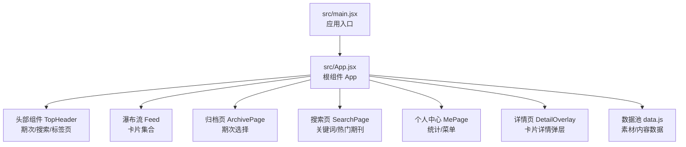
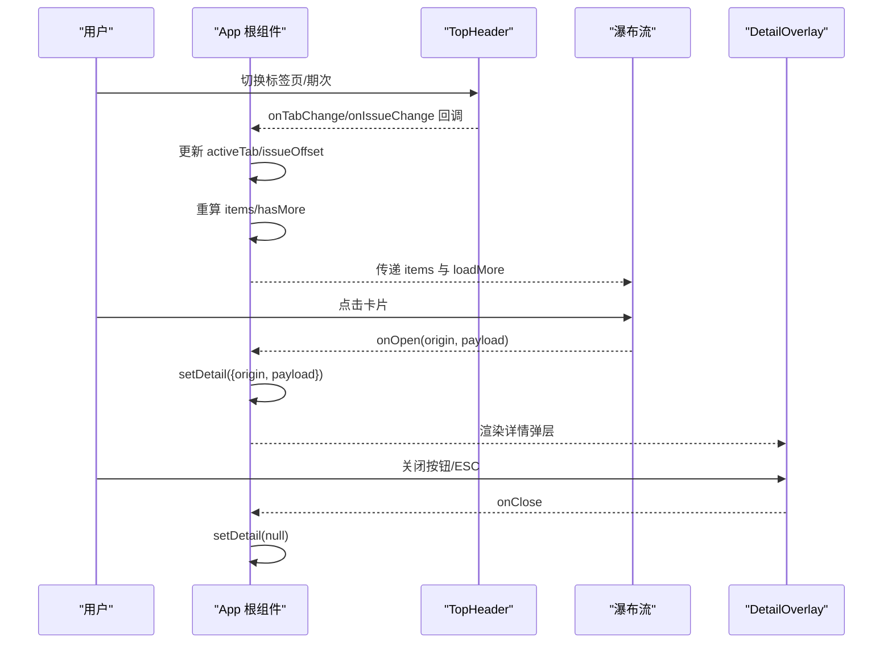
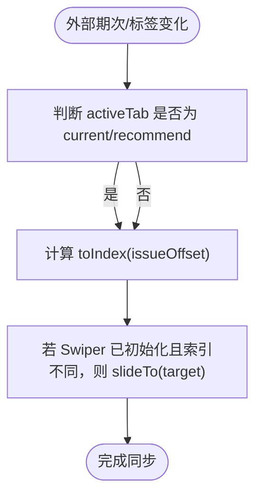
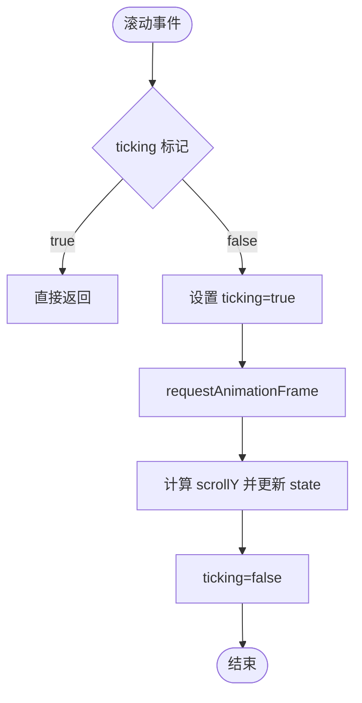
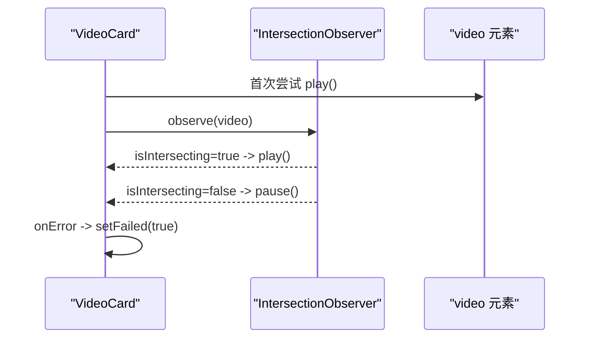
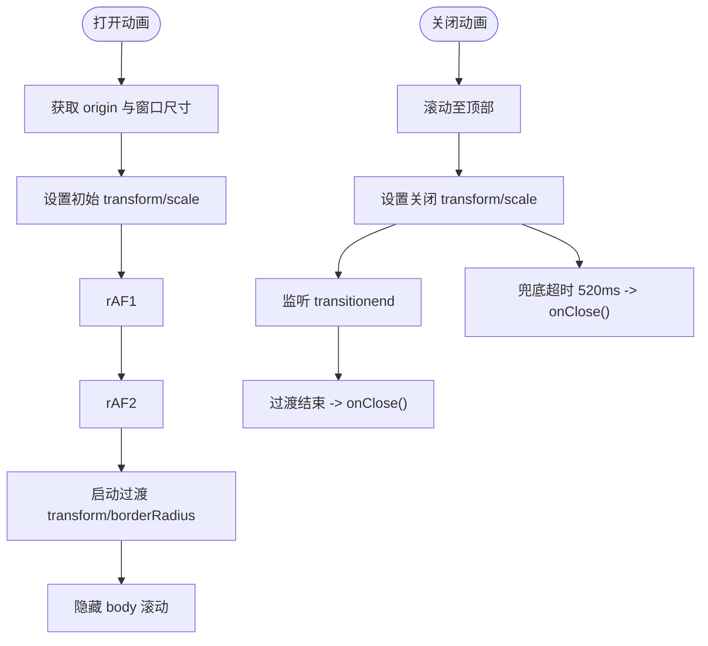
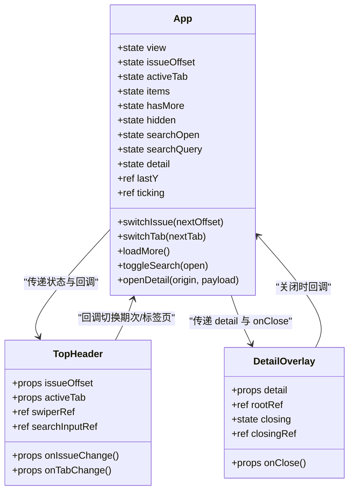
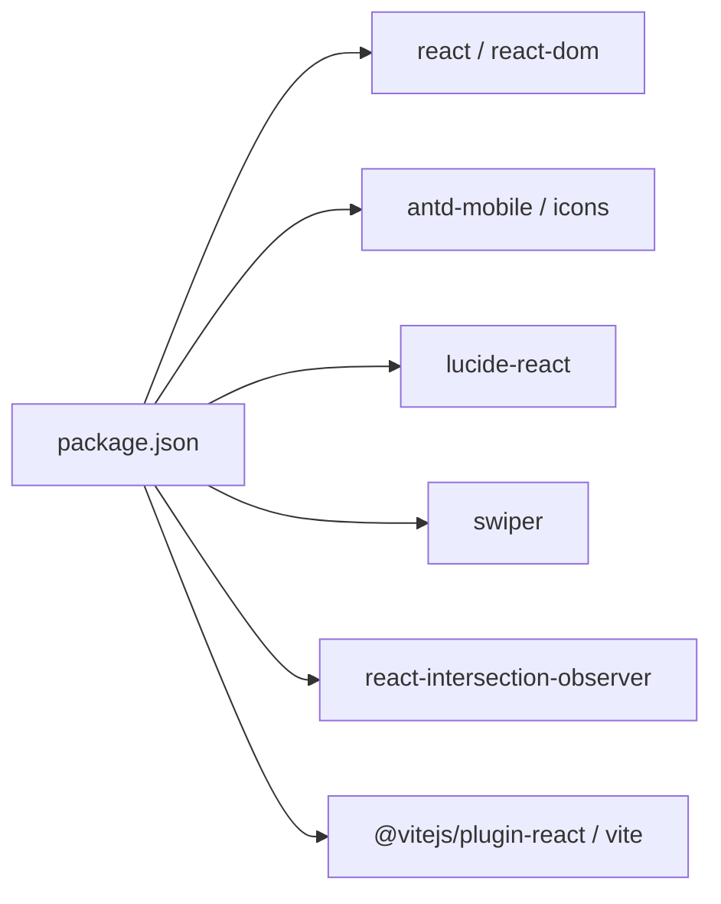

# 状态管理

<cite>
**本文引用的文件**
- [src/App.jsx](file://src/App.jsx)
- [src/main.jsx](file://src/main.jsx)
- [src/data.js](file://src/data.js)
- [package.json](file://package.json)
</cite>

## 目录
1. [简介](#简介)
2. [项目结构](#项目结构)
3. [核心组件](#核心组件)
4. [架构总览](#架构总览)
5. [详细组件分析](#详细组件分析)
6. [依赖关系分析](#依赖关系分析)
7. [性能考量](#性能考量)
8. [故障排查指南](#故障排查指南)
9. [结论](#结论)
10. [附录](#附录)

## 简介
本技术文档围绕 NewSquare 的状态管理系统进行深入解析，重点阐述 React Hooks 在项目中的实际应用，包括 useState、useEffect、useRef 的使用场景与最佳实践。文档将系统性地说明应用状态的组织结构（期次状态、搜索状态、详情页状态等）、状态更新的触发机制、副作用处理以及内存管理策略，并通过流程图与类图直观展示状态流转与组件交互，帮助读者快速理解并扩展该状态管理体系。

## 项目结构
项目采用基于功能的组织方式，入口文件负责挂载根组件，根组件集中管理全局状态与视图切换，子组件通过 props 接收状态与回调函数，形成自上而下的数据流与事件流。

图表来源
- [src/main.jsx:1-12](file://src/main.jsx#L1-L12)
- [src/App.jsx:976-1112](file://src/App.jsx#L976-L1112)
- [src/data.js:1-175](file://src/data.js#L1-L175)

章节来源
- [src/main.jsx:1-12](file://src/main.jsx#L1-L12)
- [src/App.jsx:976-1112](file://src/App.jsx#L976-L1112)
- [src/data.js:1-175](file://src/data.js#L1-L175)

## 核心组件
本节聚焦于根组件 App 及其状态组织，涵盖期次状态、搜索状态、详情页状态、滚动与可见性控制等。

- 期次状态
  - issueOffset：当前期次偏移（负数表示历史期），用于决定期次轴与精选期次。
  - activeTab：当前激活的标签页（current/recommend/me），影响期次轴与卡片生成。
  - view：视图模式（feed/archive），用于在首页与归档页之间切换。
- 搜索状态
  - searchOpen：是否处于搜索态。
  - searchQuery：当前搜索关键词。
- 详情页状态
  - detail：详情弹层的数据载体，包含 origin 与 payload。
- 列表与滚动状态
  - items：瀑布流卡片批次，每次期次/标签页切换或加载更多时更新。
  - hasMore：是否还有更多内容。
  - hidden：头部在滚动时的隐藏/显示状态。
- 引用与内存管理
  - useRef：用于 DOM 引用、滚动节流标记、关闭过程中的状态保护等。

章节来源
- [src/App.jsx:976-1112](file://src/App.jsx#L976-L1112)

## 架构总览
NewSquare 的状态管理遵循“集中式状态 + 子组件受控”的模式：
- 根组件集中持有全局状态与派发逻辑。
- 子组件通过 props 接收状态与回调，避免跨层级共享状态。
- 通过 useEffect 处理副作用（滚动监听、焦点管理、IntersectionObserver、键盘事件等）。
- 通过 useRef 管理 DOM 引用与内存安全（清理定时器、取消 rAF、断开观察者）。

图表来源
- [src/App.jsx:976-1112](file://src/App.jsx#L976-L1112)

## 详细组件分析

### 期次轴与标签页切换（TopHeader）
- 状态与引用
  - 通过 props 接收 issueOffset、activeTab，并回调 onIssueChange/onTabChange。
  - 使用 useRef 管理 Swiper 实例与搜索输入框焦点。
- 副作用
  - useEffect 同步外部期次/标签变化到 Swiper 当前索引。
  - useEffect 在搜索态展开时自动聚焦输入框。
- 期次轴映射
  - current/recommend 使用不同的期次数组与索引映射函数，确保 Today 总在末位且支持 peek 效果。

图表来源
- [src/App.jsx:67-205](file://src/App.jsx#L67-L205)

章节来源
- [src/App.jsx:67-205](file://src/App.jsx#L67-L205)

### 归档页（ArchivePage）
- 状态
  - scrollY：通过滚动事件与 requestAnimationFrame 节流计算，用于控制顶部渐隐效果。
- 副作用
  - 监听滚动事件，passive 优化提升性能。
  - 清理监听器，防止内存泄漏。
- 视觉效果
  - introOpacity 与 introTranslate 基于 scrollY 动态计算，实现平滑过渡。

图表来源
- [src/App.jsx:208-285](file://src/App.jsx#L208-L285)

章节来源
- [src/App.jsx:208-285](file://src/App.jsx#L208-L285)

### 视频卡片（VideoCard）
- 状态
  - muted：视频静音状态。
  - failed：视频加载失败状态。
- 引用
  - video 元素引用，用于首次尝试播放与暂停控制。
- 副作用
  - 首次渲染尝试播放（兼容移动端浏览器需要手动触发）。
  - IntersectionObserver 监听进入视口时播放，离开时暂停。
  - 清理观察器，避免内存泄漏。
- 交互
  - 点击卡片打开详情弹层，传递 payload 与 origin。

图表来源
- [src/App.jsx:288-367](file://src/App.jsx#L288-L367)

章节来源
- [src/App.jsx:288-367](file://src/App.jsx#L288-L367)

### 详情弹层（DetailOverlay）
- 状态
  - closing：关闭动画进行中，用于样式切换。
  - closingRef：关闭过程中的防抖引用，避免重复触发。
- 引用
  - rootRef：详情根节点，用于动画与过渡。
- 副作用
  - 打开动画：双 requestAnimationFrame 确保首帧布局后启动过渡，隐藏 body 滚动。
  - 关闭动画：向上滚动至顶部保证视觉 origin 准确，监听 transitionend 并设置兜底超时。
  - 键盘 ESC 关闭。
- 交互
  - 点击关闭按钮或 ESC 触发关闭流程。

图表来源
- [src/App.jsx:590-736](file://src/App.jsx#L590-L736)

章节来源
- [src/App.jsx:590-736](file://src/App.jsx#L590-L736)

### 根组件 App 的状态组织与更新机制
- 全局状态
  - view、issueOffset、activeTab、items、hasMore、hidden、searchOpen、searchQuery、detail。
- 状态更新触发点
  - 期次切换：switchIssue
  - 标签页切换：switchTab
  - 滚动监听：滚动节流与头部隐藏逻辑
  - 搜索态切换：toggleSearch
  - 无限滚动：loadMore
  - 详情弹层：openDetail/setDetail
- 副作用与内存管理
  - 滚动监听：passive 优化，卸载时移除监听。
  - 详情弹层：动画期间隐藏 body 滚动，清理 rAF 与事件监听。
  - 视频卡片：断开 IntersectionObserver。
- 数据来源
  - data.js 提供素材与内容数据，根组件通过 makeBatch 与 seedFor 生成卡片批次，确保每期/每个标签页内容不同。

图表来源
- [src/App.jsx:976-1112](file://src/App.jsx#L976-L1112)
- [src/App.jsx:67-205](file://src/App.jsx#L67-L205)
- [src/App.jsx:590-736](file://src/App.jsx#L590-L736)

章节来源
- [src/App.jsx:976-1112](file://src/App.jsx#L976-L1112)

## 依赖关系分析
- React 生态
  - react、react-dom：基础框架。
  - antd-mobile、antd-mobile-icons、lucide-react：UI 组件与图标库。
  - swiper：轮播组件，用于期次轴、热门期刊、案例卡片等。
  - react-intersection-observer：视频卡片的可见性监听。
- 开发工具
  - @vitejs/plugin-react、vite：构建与热更新。

图表来源
- [package.json:1-25](file://package.json#L1-L25)

章节来源
- [package.json:1-25](file://package.json#L1-L25)

## 性能考量
- 滚动节流
  - 使用 requestAnimationFrame 与节流标记（ticking）降低滚动事件频率，避免频繁重排。
- 事件监听优化
  - 滚动监听采用 passive 选项，减少主线程阻塞。
- 动画与过渡
  - 详情弹层使用 transform 与 border-radius 过渡，避免触发布局与重绘。
  - 双 rAF 确保首帧布局后再启动过渡，避免闪烁。
- 资源加载
  - 视频卡片使用 IntersectionObserver 控制播放时机，减少不必要的资源消耗。
- 内存管理
  - 所有副作用均在卸载时清理：移除事件监听、断开观察器、取消 rAF。
- 列表渲染
  - 无限滚动分批加载，限制最大条目数量，避免一次性渲染过多节点。

[本节为通用性能建议，不直接分析特定文件]

## 故障排查指南
- 视频无法自动播放
  - 现象：部分移动浏览器首次加载无法自动播放。
  - 处理：组件内首次尝试播放并在进入视口时再次尝试；若失败则降级显示海报图。
  - 参考路径：[src/App.jsx:288-367](file://src/App.jsx#L288-L367)
- 详情弹层关闭异常
  - 现象：关闭动画结束后未触发 onClose 或出现视觉错位。
  - 处理：确保先滚动至顶部再执行关闭 transform；监听 transitionend 并设置兜底超时。
  - 参考路径：[src/App.jsx:590-736](file://src/App.jsx#L590-L736)
- 期次轴不同步
  - 现象：外部期次/标签变化后 Swiper 未同步。
  - 处理：检查 swiperRef 是否存在、目标索引是否计算正确、slideTo 是否被调用。
  - 参考路径：[src/App.jsx:67-205](file://src/App.jsx#L67-L205)
- 搜索输入框未聚焦
  - 现象：展开搜索后输入框未自动聚焦。
  - 处理：确认 useEffect 在 searchOpen 变化时执行，且延时足够等待 DOM 渲染。
  - 参考路径：[src/App.jsx:67-205](file://src/App.jsx#L67-L205)
- 无限滚动不触发
  - 现象：滚动到底部未加载更多。
  - 处理：检查 InfiniteScroll 的 hasMore 与 loadMore 回调；确保 items 数量增长与 hasMore 更新逻辑正确。
  - 参考路径：[src/App.jsx:976-1112](file://src/App.jsx#L976-L1112)

章节来源
- [src/App.jsx:288-367](file://src/App.jsx#L288-L367)
- [src/App.jsx:590-736](file://src/App.jsx#L590-L736)
- [src/App.jsx:67-205](file://src/App.jsx#L67-L205)
- [src/App.jsx:976-1112](file://src/App.jsx#L976-L1112)

## 结论
NewSquare 的状态管理以根组件为中心，结合 useState、useEffect、useRef 实现了清晰的状态组织与可靠的副作用处理。通过期次轴、标签页、搜索态、详情弹层等多维度状态协同，配合滚动节流、资源懒加载与内存清理，实现了流畅的用户体验与良好的性能表现。该模式具备良好的可扩展性，便于后续引入更复杂的状态管理方案（如 Context 或第三方库）时保持一致的开发体验。

[本节为总结性内容，不直接分析特定文件]

## 附录
- 数据来源
  - data.js 提供视频、图片、封面、内容等素材与数据，根组件通过 makeBatch 与 seedFor 生成卡片批次，确保每期/每个标签页内容不同。
- 扩展建议
  - 对于更复杂的跨层级状态共享，可考虑引入 Context 或状态管理库（如 Zustand、Redux Toolkit）。
  - 对于高频滚动场景，可进一步优化节流策略与虚拟列表。
  - 对于多媒体资源，可增加预加载队列与错误重试机制。

章节来源
- [src/data.js:1-175](file://src/data.js#L1-L175)
- [src/App.jsx:958-973](file://src/App.jsx#L958-L973)