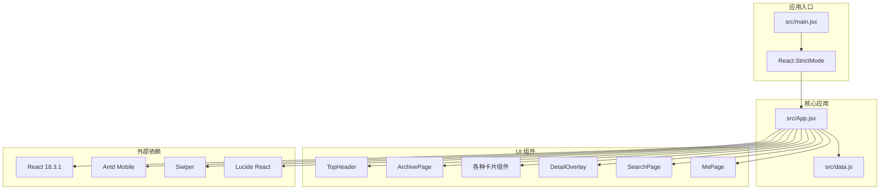
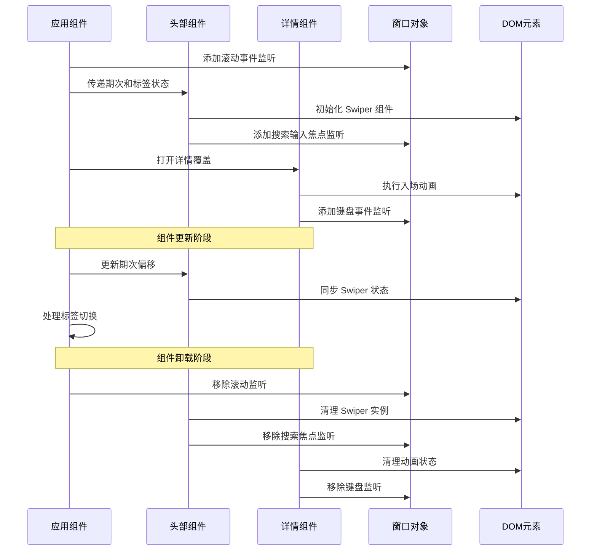
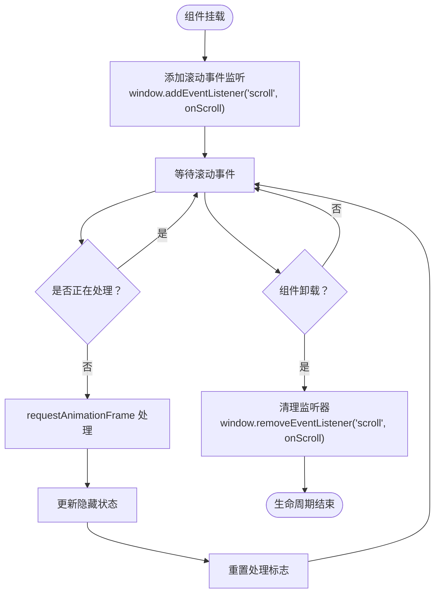
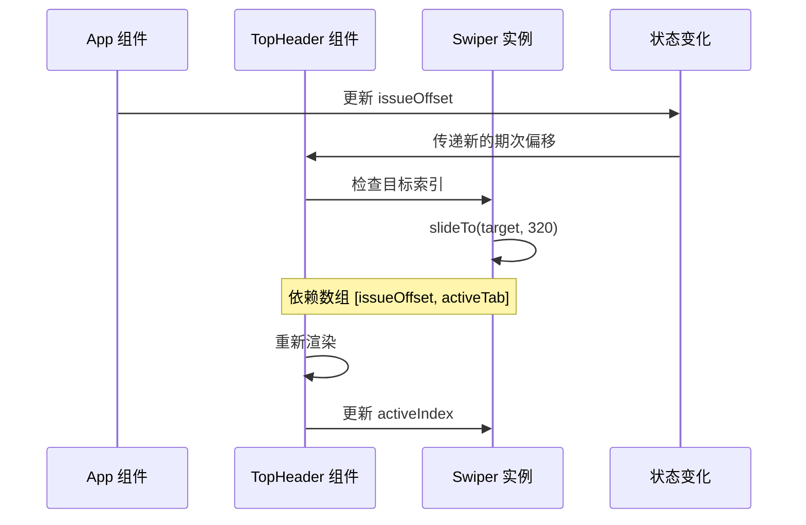
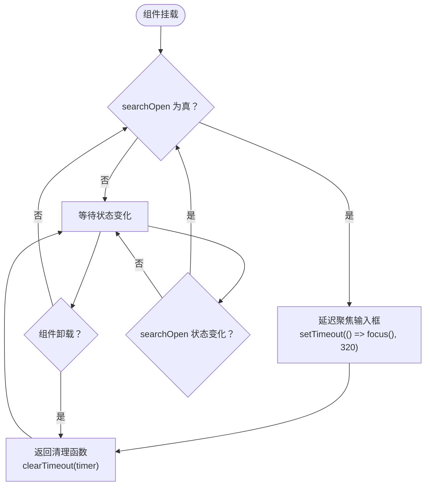
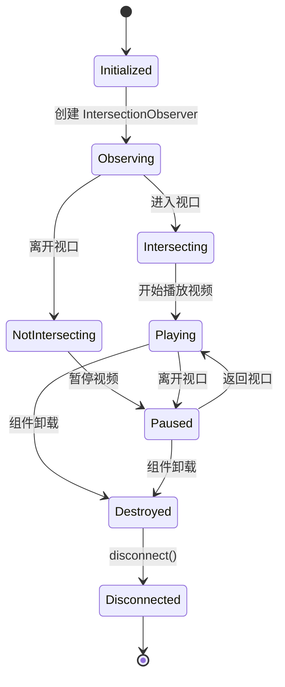
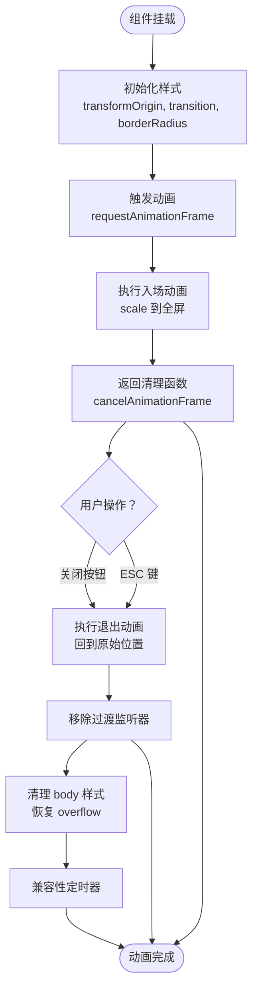

# 生命周期管理

<cite>
**本文引用的文件**
- [src\App.jsx](file://src\App.jsx)
- [src\main.jsx](file://src\main.jsx)
- [src\data.js](file://src\data.js)
- [package.json](file://package.json)
</cite>

## 目录
1. [简介](#简介)
2. [项目结构](#项目结构)
3. [核心组件](#核心组件)
4. [架构概览](#架构概览)
5. [详细组件分析](#详细组件分析)
6. [依赖关系分析](#依赖关系分析)
7. [性能考虑](#性能考虑)
8. [故障排除指南](#故障排除指南)
9. [结论](#结论)

## 简介

NewSquare 是一个基于 React 18.3.1 的现代化家居生活应用，专注于家装生活内容的展示和交互。该项目深入运用了 React 函数组件的生命周期管理机制，特别是 useEffect 钩子的使用模式，实现了高效的资源管理和状态同步。

该应用采用函数式组件架构，通过精心设计的生命周期钩子确保了：
- 组件挂载时的初始化和事件绑定
- 组件更新时的依赖追踪和条件执行
- 组件卸载时的完整资源清理
- 性能优化的依赖数组配置
- 副作用的正确管理和清理

## 项目结构

NewSquare 项目采用简洁而功能明确的文件组织结构：



**图表来源**
- [src\main.jsx:1-12](file://src\main.jsx#L1-L12)
- [src\App.jsx:1-1112](file://src\App.jsx#L1-L1112)
- [package.json:1-25](file://package.json#L1-L25)

**章节来源**
- [src\main.jsx:1-12](file://src\main.jsx#L1-L12)
- [package.json:1-25](file://package.json#L1-L25)

## 核心组件

NewSquare 的生命周期管理主要体现在以下几个核心组件中：

### 主应用组件 (App)
这是整个应用的根组件，负责全局状态管理和生命周期控制：

- **状态管理**：维护视图状态、期次偏移、活动标签、搜索状态等
- **生命周期钩子**：处理窗口滚动事件监听和清理
- **数据生成**：基于种子偏移算法生成内容批次

### 头部组件 (TopHeader)
负责顶部导航栏的生命周期管理：

- **Swiper 同步**：根据外部状态变化同步轮播组件
- **搜索输入焦点**：在搜索展开时自动聚焦输入框
- **期次切换**：响应用户操作进行期次切换

### 详情覆盖组件 (DetailOverlay)
实现复杂的动画和交互生命周期：

- **入场动画**：从原始位置放大到全屏的过渡效果
- **键盘事件**：ESC 键关闭详情页
- **资源清理**：动画结束后的 DOM 状态恢复

**章节来源**
- [src\App.jsx:976-1112](file://src\App.jsx#L976-L1112)
- [src\App.jsx:67-205](file://src\App.jsx#L67-L205)
- [src\App.jsx:590-736](file://src\App.jsx#L590-L736)

## 架构概览

NewSquare 采用了基于函数组件的声明式架构，每个组件都遵循 React 的生命周期模式：



**图表来源**
- [src\App.jsx:993-1008](file://src\App.jsx#L993-L1008)
- [src\App.jsx:77-82](file://src\App.jsx#L77-L82)
- [src\App.jsx:85-90](file://src\App.jsx#L85-L90)
- [src\App.jsx:652-656](file://src\App.jsx#L652-L656)

## 详细组件分析

### 1. 滚动监听生命周期管理

App 组件中的滚动监听体现了典型的 useEffect 使用模式：



**图表来源**
- [src\App.jsx:993-1008](file://src\App.jsx#L993-L1008)

这种实现模式的关键优势：
- **防抖优化**：通过 `ticking` 标志防止重复处理
- **RAF 优化**：使用 `requestAnimationFrame` 提升性能
- **被动监听**：设置 `{ passive: true }` 提升滚动性能
- **完整清理**：在卸载时移除所有事件监听器

### 2. Swiper 同步生命周期

TopHeader 组件展示了跨组件的状态同步生命周期：



**图表来源**
- [src\App.jsx:77-82](file://src\App.jsx#L77-L82)

关键实现要点：
- **条件检查**：避免不必要的滑动操作
- **销毁检测**：检查 Swiper 实例是否已销毁
- **性能优化**：仅在状态变化时执行同步逻辑

### 3. 搜索输入焦点生命周期

搜索功能展示了条件 useEffect 的使用模式：



**图表来源**
- [src\App.jsx:85-90](file://src\App.jsx#L85-L90)

这种模式的优势：
- **条件执行**：仅在需要时执行副作用
- **资源清理**：及时清理定时器资源
- **用户体验**：提供流畅的交互体验

### 4. IntersectionObserver 生命周期

VideoCard 组件展示了观察者模式的生命周期管理：



**图表来源**
- [src\App.jsx:313-322](file://src\App.jsx#L313-L322)

实现特点：
- **懒加载优化**：仅在可见时尝试播放
- **自动暂停**：离开视口时自动暂停
- **完整清理**：卸载时断开观察器连接

### 5. 动画过渡生命周期

DetailOverlay 组件展示了复杂动画的生命周期管理：



**图表来源**
- [src\App.jsx:596-622](file://src\App.jsx#L596-L622)
- [src\App.jsx:652-656](file://src\App.jsx#L652-L656)

关键优化点：
- **双 RAF 确保**：确保首帧布局后再启动过渡
- **兼容性处理**：提供 fallback 定时器
- **状态同步**：动画状态与组件状态保持一致

**章节来源**
- [src\App.jsx:993-1008](file://src\App.jsx#L993-L1008)
- [src\App.jsx:77-82](file://src\App.jsx#L77-L82)
- [src\App.jsx:85-90](file://src\App.jsx#L85-L90)
- [src\App.jsx:313-322](file://src\App.jsx#L313-L322)
- [src\App.jsx:596-622](file://src\App.jsx#L596-L622)
- [src\App.jsx:652-656](file://src\App.jsx#L652-L656)

## 依赖关系分析

NewSquare 项目的依赖关系展现了清晰的层次结构：

```mermaid
graph TB
subgraph "运行时依赖"
React[react@18.3.1]
ReactDOM[react-dom@18.3.1]
AntdMobile[antd-mobile@5.38.1]
Swiper[swiper@11.11.14]
Icons[antd-mobile-icons@0.3.0]
Lucide[lucide-react@1.14.0]
end
subgraph "开发依赖"
Vite[@vitejs/plugin-react@4.3.3]
ViteDev[vite@5.4.10]
end
subgraph "应用代码"
App[App.jsx]
Main[main.jsx]
Data[data.js]
end
App --> React
App --> ReactDOM
App --> AntdMobile
App --> Swiper
App --> Icons
App --> Lucide
Main --> React
Main --> ReactDOM
App --> Data
Main --> App
```

**图表来源**
- [package.json:11-24](file://package.json#L11-L24)

**章节来源**
- [package.json:11-24](file://package.json#L11-L24)

## 性能考虑

NewSquare 在生命周期管理方面体现了多项性能优化策略：

### 1. 事件监听器优化
- 使用被动监听器提升滚动性能
- 通过 `ticking` 标志防止重复处理
- 及时清理事件监听器避免内存泄漏

### 2. 动画性能优化
- 使用 `requestAnimationFrame` 替代 `setTimeout`
- 双 `requestAnimationFrame` 确保布局稳定性
- CSS3 过渡动画优于 JavaScript 动画

### 3. 资源管理优化
- IntersectionObserver 自动管理视频播放
- 清晰的清理函数确保资源释放
- 条件副作用避免不必要的计算

### 4. 依赖数组优化
- 精确的依赖追踪减少不必要的重渲染
- 空依赖数组用于一次性初始化
- 动态依赖数组支持状态变化

## 故障排除指南

### 1. 常见生命周期问题

**问题：事件监听器未正确清理**
- 检查清理函数是否返回
- 确认组件卸载时机
- 验证事件监听器移除调用

**问题：IntersectionObserver 不工作**
- 确认观察器实例正确创建
- 检查元素可见性状态
- 验证清理函数调用

**问题：动画卡顿**
- 检查 `requestAnimationFrame` 使用
- 确认 CSS 过渡属性正确设置
- 验证 DOM 操作时机

### 2. 调试技巧

**使用 React DevTools**
- 检查组件生命周期钩子调用次数
- 监控状态变化和依赖数组
- 分析渲染性能瓶颈

**内存泄漏检测**
- 监控事件监听器数量
- 检查定时器清理情况
- 验证观察器断开状态

**章节来源**
- [src\App.jsx:993-1008](file://src\App.jsx#L993-L1008)
- [src\App.jsx:313-322](file://src\App.jsx#L313-L322)

## 结论

NewSquare 项目在生命周期管理方面展现了 React 函数组件的最佳实践：

### 主要成就
- **完善的资源管理**：所有副作用都有对应的清理函数
- **性能优化策略**：多处使用防抖、节流和请求动画帧
- **用户体验优化**：流畅的动画过渡和交互响应
- **代码组织清晰**：每个组件都有明确的生命周期职责

### 技术亮点
- **精确的依赖追踪**：合理使用依赖数组避免不必要的重渲染
- **条件副作用**：仅在需要时执行副作用操作
- **资源生命周期**：从创建到销毁的完整资源管理
- **错误处理机制**：完善的清理和降级处理

### 最佳实践总结
1. **始终返回清理函数**：确保所有副作用都有对应的清理
2. **精确依赖数组**：避免过度或不足的依赖追踪
3. **性能优先**：使用合适的异步和动画技术
4. **资源管理**：及时清理事件监听器、定时器和观察器
5. **用户体验**：提供流畅的交互和过渡效果

这些实践为 React 函数组件的生命周期管理提供了优秀的参考范例，展示了如何在实际项目中有效运用 useEffect 和相关生命周期概念。