# 登录系统

<cite>
**本文档引用的文件**
- [Login.jsx](file://src/Login.jsx)
- [App.jsx](file://src/App.jsx)
- [main.jsx](file://src/main.jsx)
- [data.js](file://src/data.js)
- [index.css](file://src/index.css)
- [package.json](file://package.json)
- [vite.config.js](file://vite.config.js)
- [index.html](file://index.html)
</cite>

## 目录
1. [简介](#简介)
2. [项目结构](#项目结构)
3. [核心组件](#核心组件)
4. [架构概览](#架构概览)
5. [详细组件分析](#详细组件分析)
6. [依赖分析](#依赖分析)
7. [性能考虑](#性能考虑)
8. [故障排除指南](#故障排除指南)
9. [结论](#结论)

## 简介

这是一个基于 React 和 Vite 构建的现代化登录系统，专为家装灵感应用设计。该系统提供了沉浸式的登录体验，包含多种登录方式和流畅的用户界面交互。

## 项目结构

该项目采用现代化的前端技术栈，主要包含以下核心文件：

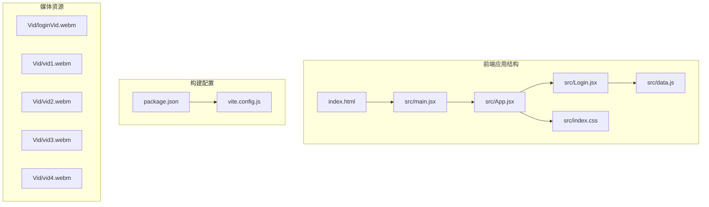

**图表来源**
- [index.html:1-16](file://index.html#L1-L16)
- [main.jsx:1-12](file://src/main.jsx#L1-L12)
- [App.jsx:1-50](file://src/App.jsx#L1-L50)
- [Login.jsx:1-50](file://src/Login.jsx#L1-L50)

**章节来源**
- [package.json:1-27](file://package.json#L1-L27)
- [vite.config.js:1-20](file://vite.config.js#L1-L20)

## 核心组件

### 登录组件架构

登录系统的核心是 `Login` 组件，它实现了完整的登录流程：

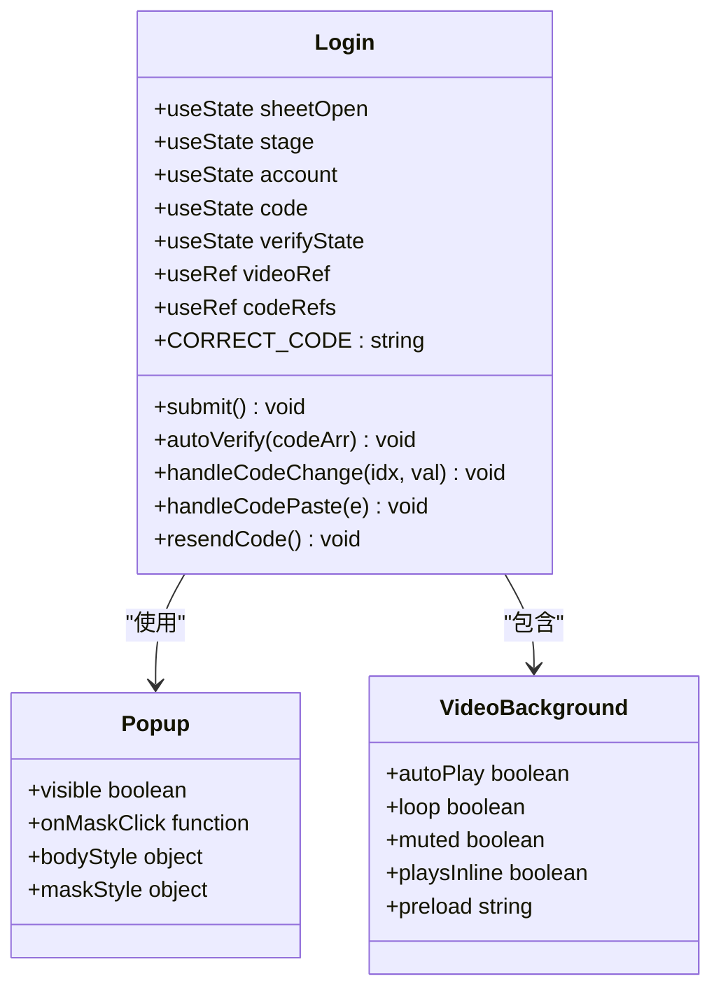

**图表来源**
- [Login.jsx:9-463](file://src/Login.jsx#L9-L463)

### 多阶段登录流程

系统支持四种不同的登录阶段：

1. **账户登录阶段** (`stage: 'account'`)
2. **验证码验证阶段** (`stage: 'verify'`)
3. **注册阶段** (`stage: 'signup'`)
4. **企业账户登录阶段** (`stage: 'enterprise'`)

**章节来源**
- [Login.jsx:11-25](file://src/Login.jsx#L11-L25)

## 架构概览

### 整体系统架构

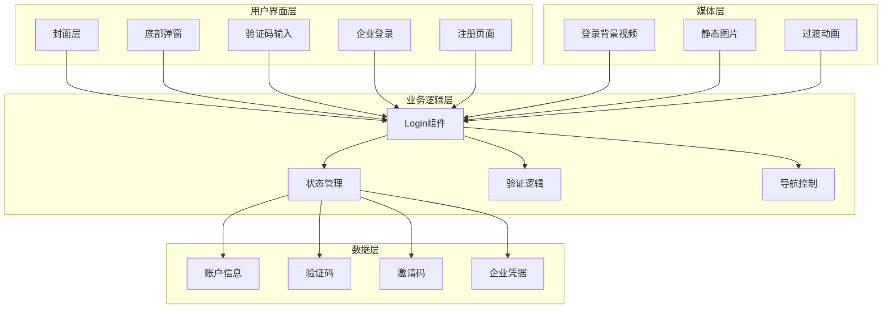

**图表来源**
- [Login.jsx:175-463](file://src/Login.jsx#L175-L463)
- [App.jsx:1-50](file://src/App.jsx#L1-L50)

### 用户交互流程

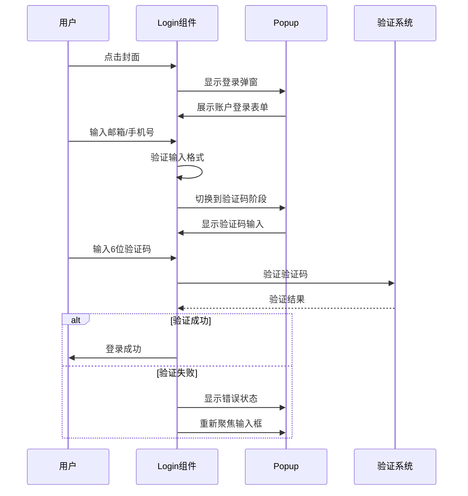

**图表来源**
- [Login.jsx:56-87](file://src/Login.jsx#L56-L87)
- [Login.jsx:164-173](file://src/Login.jsx#L164-L173)

## 详细组件分析

### 登录组件详细分析

#### 状态管理系统

登录组件使用 React Hooks 实现了复杂的状态管理：

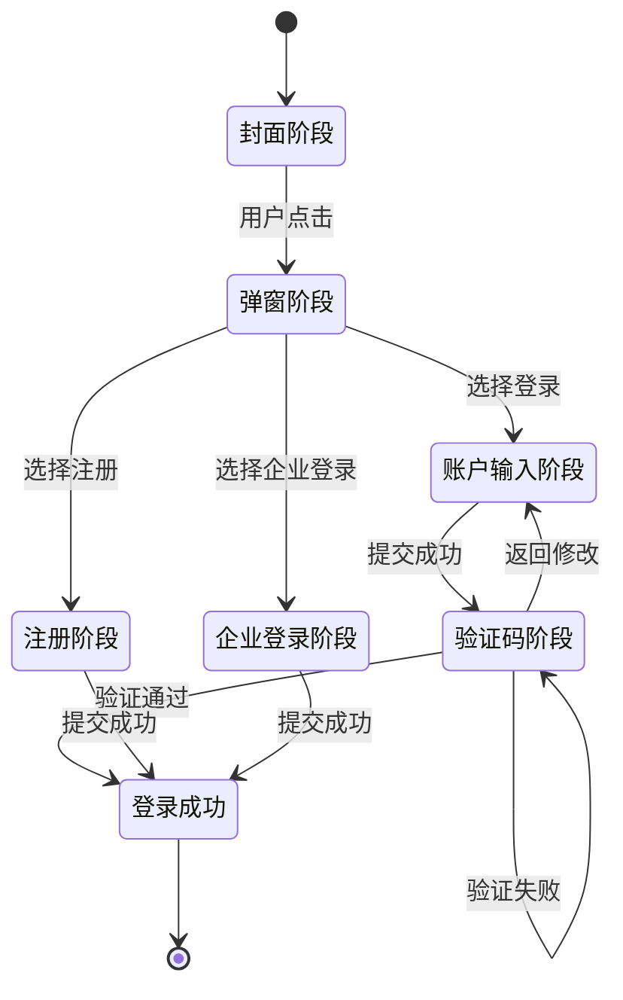

**图表来源**
- [Login.jsx:10-162](file://src/Login.jsx#L10-L162)

#### 验证码输入组件

验证码输入组件具有以下特性：

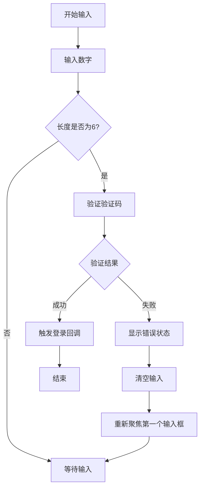

**图表来源**
- [Login.jsx:68-87](file://src/Login.jsx#L68-L87)
- [Login.jsx:89-123](file://src/Login.jsx#L89-L123)

#### 验证码重发机制

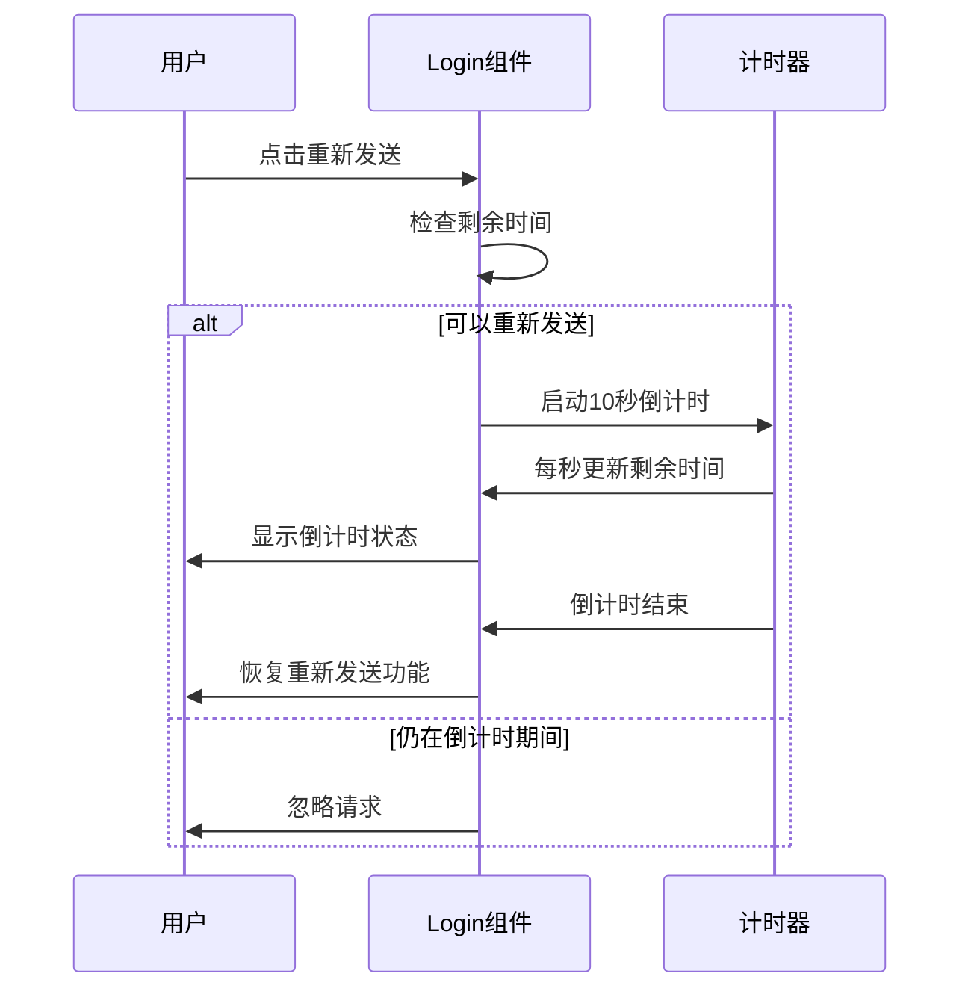

**图表来源**
- [Login.jsx:164-173](file://src/Login.jsx#L164-L173)

**章节来源**
- [Login.jsx:1-463](file://src/Login.jsx#L1-L463)

### 样式系统分析

#### 登录页面样式架构

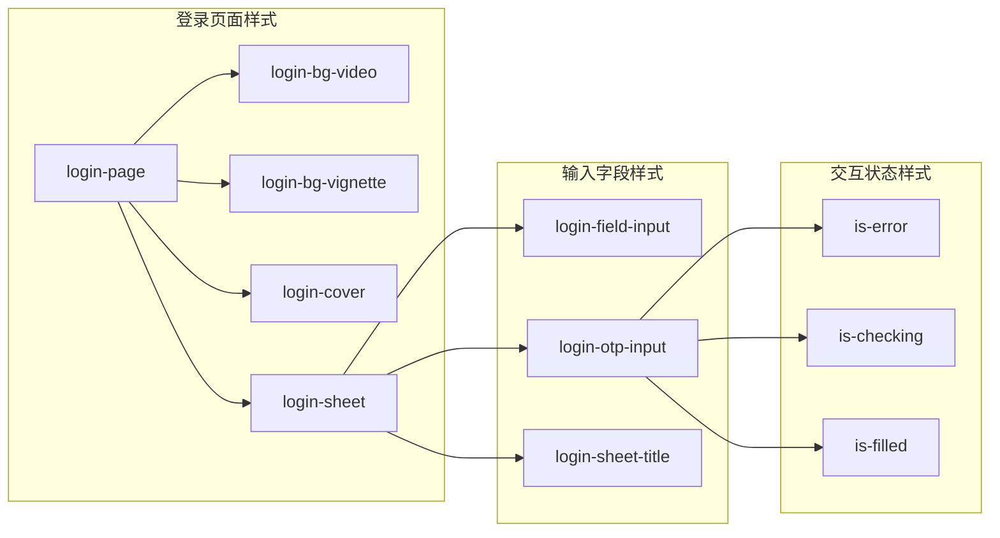

**图表来源**
- [index.css:1-800](file://src/index.css#L1-L800)

**章节来源**
- [index.css:1-800](file://src/index.css#L1-L800)

### 数据管理系统

#### 内容数据结构

系统使用集中式数据管理：

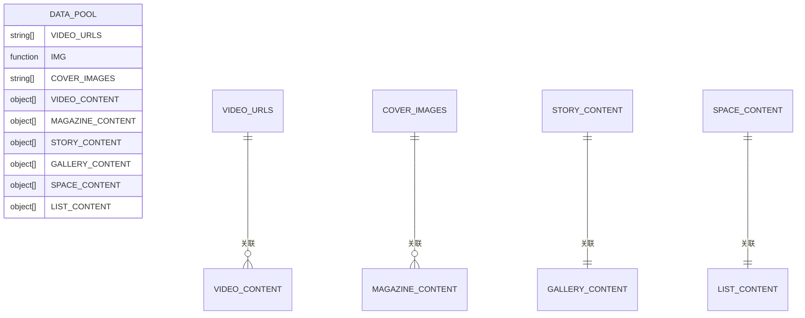

**图表来源**
- [data.js:1-176](file://src/data.js#L1-L176)

**章节来源**
- [data.js:1-176](file://src/data.js#L1-L176)

## 依赖分析

### 技术栈依赖关系

```mermaid
graph TD
subgraph "核心依赖"
REACT[react ^18.3.1]
REACTDOM[react-dom ^18.3.1]
VITE[vite ^5.4.10]
RAX[react-intersection-observer ^9.13.1]
end
subgraph "UI组件库"
AM[antd-mobile ^5.38.1]
AMI[antd-mobile-icons ^0.3.0]
LUCIDE[lucide-react ^1.14.0]
end
subgraph "多媒体处理"
SWIPER[swiper ^11.1.14]
DOTLOTTIE[@lottiefiles/dotlottie-react ^0.19.2]
end
subgraph "AI集成"
OPENAI[openai ^6.37.0]
end
subgraph "开发工具"
REACT_PLUGIN[@vitejs/plugin-react ^4.3.3]
end
REACT --> AM
REACT --> SWIPER
REACT --> RAX
AM --> AMI
SWIPER --> LUCIDE
VITE --> REACT_PLUGIN
OPENAI --> VITE
```

**图表来源**
- [package.json:11-26](file://package.json#L11-L26)

### 构建配置分析

#### Vite 开发服务器配置

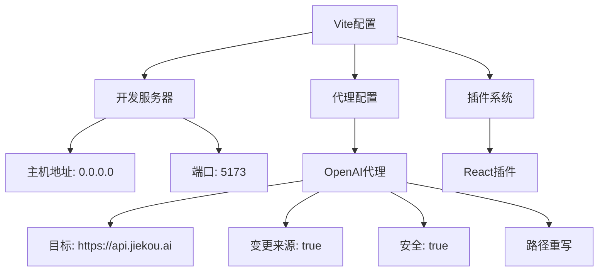

**图表来源**
- [vite.config.js:4-19](file://vite.config.js#L4-L19)

**章节来源**
- [package.json:1-27](file://package.json#L1-L27)
- [vite.config.js:1-20](file://vite.config.js#L1-L20)

## 性能考虑

### 视频播放优化

系统采用了多项视频播放优化策略：

1. **自动播放处理**：针对移动端 Safari 的自动播放拦截问题，实现了首帧用户交互后的兜底播放机制
2. **预加载策略**：使用 `preload="auto"` 确保视频资源及时加载
3. **内联播放**：通过 `playsInline` 属性确保视频在移动设备上的正常播放
4. **后台播放**：使用 `muted` 属性避免自动播放限制

### 交互性能优化

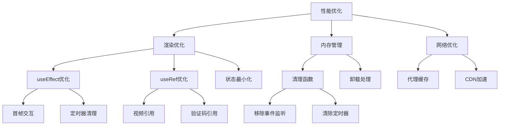

**图表来源**
- [Login.jsx:28-53](file://src/Login.jsx#L28-L53)
- [Login.jsx:106-123](file://src/Login.jsx#L106-L123)

## 故障排除指南

### 常见问题及解决方案

#### 登录验证码问题

| 问题类型 | 症状描述 | 解决方案 |
|---------|---------|---------|
| 验证码错误 | 输入6位验证码后显示错误状态 | 检查验证码输入格式，确保只输入数字 |
| 验证码超时 | 验证码过期无法使用 | 点击重新发送按钮获取新验证码 |
| 输入焦点问题 | 数字输入后无法自动跳转 | 检查键盘事件处理逻辑 |

#### 视频播放问题

| 问题类型 | 症状描述 | 解决方案 |
|---------|---------|---------|
| 自动播放失败 | 页面加载后视频不播放 | 等待用户交互后再尝试播放 |
| 移动端播放异常 | 在移动设备上无法播放 | 检查 `playsInline` 属性设置 |
| 音频问题 | 视频无声 | 确认 `muted` 属性正确设置 |

#### 用户界面问题

| 问题类型 | 症状描述 | 解决方案 |
|---------|---------|---------|
| 弹窗显示问题 | 登录弹窗无法正常显示 | 检查 `sheetOpen` 状态管理 |
| 输入验证问题 | 表单验证不生效 | 确认 `autoComplete` 属性设置 |
| 样式显示异常 | 登录界面样式错乱 | 检查 CSS 类名绑定逻辑 |

**章节来源**
- [Login.jsx:68-87](file://src/Login.jsx#L68-L87)
- [Login.jsx:164-173](file://src/Login.jsx#L164-L173)

## 结论

这个登录系统展现了现代前端开发的最佳实践，具有以下特点：

### 技术优势

1. **用户体验优秀**：沉浸式登录体验，流畅的动画过渡
2. **功能完整**：支持多种登录方式，包括普通账户、验证码登录、注册和企业账户
3. **性能优化**：合理的资源管理和交互优化
4. **可维护性强**：清晰的代码结构和模块化设计

### 改进建议

1. **安全性增强**：建议添加更严格的输入验证和安全防护
2. **国际化支持**：考虑添加多语言支持
3. **错误处理**：完善错误处理和用户反馈机制
4. **测试覆盖**：增加单元测试和集成测试

该系统为家装灵感应用提供了坚实的技术基础，能够满足现代移动应用的登录需求。