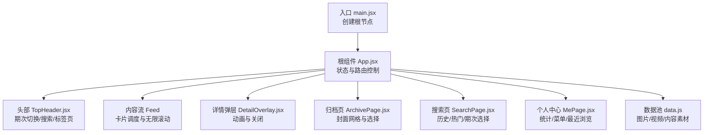
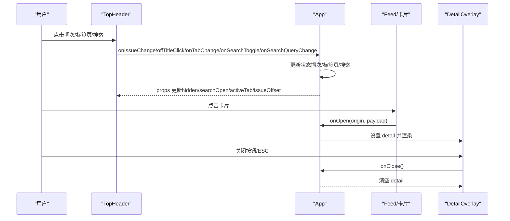
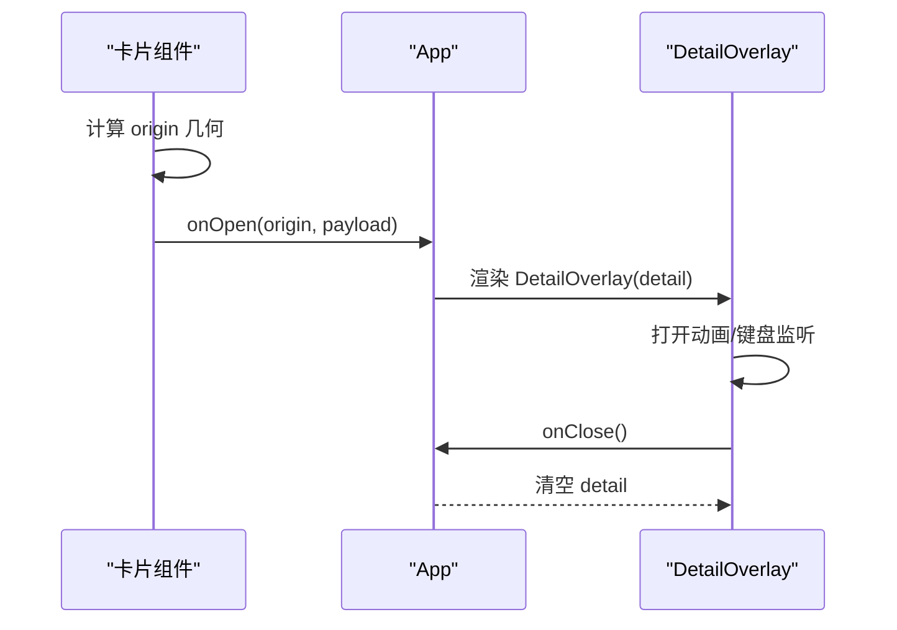
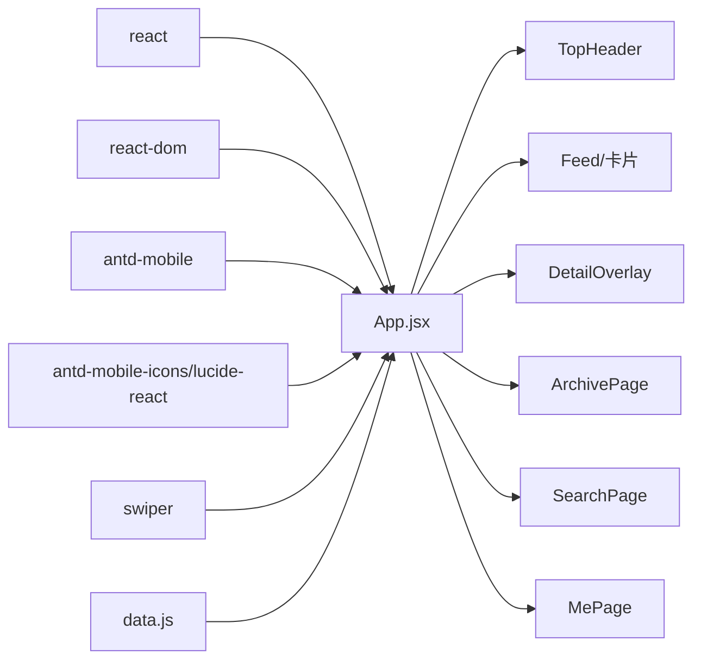

# 组件通信

<cite>
**本文引用的文件**
- [src/App.jsx](file://src/App.jsx)
- [src/main.jsx](file://src/main.jsx)
- [src/data.js](file://src/data.js)
- [package.json](file://package.json)
</cite>

## 目录
1. [简介](#简介)
2. [项目结构](#项目结构)
3. [核心组件](#核心组件)
4. [架构总览](#架构总览)
5. [详细组件分析](#详细组件分析)
6. [依赖关系分析](#依赖关系分析)
7. [性能考量](#性能考量)
8. [故障排查指南](#故障排查指南)
9. [结论](#结论)
10. [附录](#附录)

## 简介
本技术文档围绕 NewSquare 的组件通信机制进行系统性梳理，重点解释父子组件之间的 props 传递模式、回调函数的使用与事件冒泡处理、组件解耦设计（回调定义、事件处理器传递、状态提升策略）、最佳实践（避免过度耦合、保持单向数据流、错误边界处理），并通过具体代码路径示例帮助读者快速定位实现位置。

## 项目结构
- 入口文件负责挂载根组件 App。
- App.jsx 是应用的核心，包含头部导航、内容流、详情弹层、归档页、搜索页、个人中心等模块。
- data.js 提供静态数据池，用于卡片内容与封面资源。
- package.json 描述了运行时依赖，包括 React、Ant Design Mobile、Swiper 等。

图表来源
- [src/main.jsx:7-11](file://src/main.jsx#L7-L11)
- [src/App.jsx:976-1111](file://src/App.jsx#L976-L1111)
- [src/data.js:1-175](file://src/data.js#L1-L175)

章节来源
- [src/main.jsx:1-12](file://src/main.jsx#L1-L12)
- [src/App.jsx:976-1111](file://src/App.jsx#L976-L1111)
- [src/data.js:1-175](file://src/data.js#L1-L175)

## 核心组件
- 根组件 App：集中管理视图状态（feed/archive）、期次偏移、活跃标签页、内容批次、搜索状态、详情弹层、滚动隐藏头部等。通过 props 向子组件传递状态与回调，实现自上而下的数据流与自下而上的事件回传。
- TopHeader：接收期次、标签页、搜索状态与回调，内部维护期次轮播与搜索输入框，向上派发期次变更、标签页切换、搜索开关与查询词变更。
- ArchivePage：接收当前期次与回调，支持点击封面网格项选择期次并关闭归档页。
- SearchPage：接收查询词与回调，支持点击搜索历史、热门标签与热门期次，向上派发选择结果。
- DetailOverlay：接收详情规格与关闭回调，负责打开/关闭动画与键盘事件处理。
- 卡片组件（VideoCard/MagazineCard/StoryCard/SpaceCard/ListCard/GalleryCard）：接收索引与 onOpen 回调，点击后收集目标元素几何信息并向上派发详情规格。
- 数据池 data.js：提供图片、视频、封面与各类内容素材，供卡片组件消费。

章节来源
- [src/App.jsx:67-205](file://src/App.jsx#L67-L205)
- [src/App.jsx:208-285](file://src/App.jsx#L208-L285)
- [src/App.jsx:757-858](file://src/App.jsx#L757-L858)
- [src/App.jsx:590-736](file://src/App.jsx#L590-L736)
- [src/App.jsx:288-367](file://src/App.jsx#L288-L367)
- [src/App.jsx:369-403](file://src/App.jsx#L369-L403)
- [src/App.jsx:406-463](file://src/App.jsx#L406-L463)
- [src/App.jsx:466-489](file://src/App.jsx#L466-L489)
- [src/App.jsx:492-525](file://src/App.jsx#L492-L525)
- [src/App.jsx:528-579](file://src/App.jsx#L528-L579)
- [src/data.js:1-175](file://src/data.js#L1-L175)

## 架构总览
NewSquare 采用自上而下的单向数据流：
- App 作为状态中心，通过 props 将状态与回调传递给子组件。
- 子组件通过回调向上游回传用户交互事件（如期次变更、标签页切换、搜索操作、详情打开）。
- 顶层根据回调更新状态，驱动 UI 重新渲染，形成清晰的“数据驱动视图”的通信闭环。

图表来源
- [src/App.jsx:67-205](file://src/App.jsx#L67-L205)
- [src/App.jsx:976-1111](file://src/App.jsx#L976-L1111)
- [src/App.jsx:590-736](file://src/App.jsx#L590-L736)

## 详细组件分析

### 父子组件 Props 传递模式
- App 向子组件传递状态与回调，典型参数包括：
  - 期次偏移与标签页：用于同步头部轮播与标题显示。
  - 搜索状态：控制搜索面板显隐与输入框焦点。
  - 回调函数：onIssueChange、onTitleClick、onTabChange、onSearchToggle、onSearchQueryChange、onPick、onPickIssue、onOpen、onClose。
- 子组件通过 props 使用这些数据，内部通过事件处理函数（onClick/onSlideChange/onSubmit 等）向上派发事件，实现解耦。

章节来源
- [src/App.jsx:67-205](file://src/App.jsx#L67-L205)
- [src/App.jsx:208-285](file://src/App.jsx#L208-L285)
- [src/App.jsx:757-858](file://src/App.jsx#L757-L858)
- [src/App.jsx:590-736](file://src/App.jsx#L590-L736)

### 回调函数的使用与事件冒泡处理
- 事件冒泡控制：在卡片组件中，点击事件通过回调传递，同时在按钮级事件中调用阻止冒泡，确保父级卡片不会重复触发。
- 详情打开流程：卡片组件计算点击元素的几何信息 origin，结合 payload（标题、副标题、封面、品牌、描述、CTA 等）通过 onOpen 回调传递给 App，App 保存到 detail 状态并渲染 DetailOverlay。
- 详情关闭流程：DetailOverlay 内部处理关闭逻辑（动画、键盘事件、过渡结束回调），完成后通过 onClose 回调通知 App 清空 detail。

图表来源
- [src/App.jsx:288-367](file://src/App.jsx#L288-L367)
- [src/App.jsx:590-736](file://src/App.jsx#L590-L736)
- [src/App.jsx:989-991](file://src/App.jsx#L989-L991)

章节来源
- [src/App.jsx:288-367](file://src/App.jsx#L288-L367)
- [src/App.jsx:590-736](file://src/App.jsx#L590-L736)
- [src/App.jsx:989-991](file://src/App.jsx#L989-L991)

### 组件解耦设计与状态提升策略
- 状态提升：App 作为状态中心，集中管理 view、issueOffset、activeTab、items、hasMore、hidden、searchOpen、searchQuery、detail 等，避免子组件各自持有全局状态。
- 解耦策略：
  - 通过 props 传递状态与回调，子组件仅负责 UI 表现与事件收集。
  - 通过 onOpen/onClose 等回调抽象跨组件行为，避免直接依赖 DOM 或全局变量。
  - 通过数据池 data.js 提供统一素材来源，降低组件对具体资源的耦合。
- 状态提升带来的好处：便于测试、便于追踪数据流向、便于扩展新功能（如新增标签页、新增卡片类型）。

章节来源
- [src/App.jsx:976-1111](file://src/App.jsx#L976-L1111)
- [src/data.js:1-175](file://src/data.js#L1-L175)

### 事件处理器传递与单向数据流
- 事件链路：
  - 用户在 TopHeader/ArchivePage/SearchPage/MePage 中产生交互。
  - 子组件通过回调向上游 App 派发事件。
  - App 更新状态，props 下发给子组件，驱动 UI 变化。
- 单向数据流保障：所有状态变更均来自顶层 App，子组件只能通过回调请求变更，无法直接修改顶层状态，从而避免数据竞态与副作用扩散。

章节来源
- [src/App.jsx:67-205](file://src/App.jsx#L67-L205)
- [src/App.jsx:208-285](file://src/App.jsx#L208-L285)
- [src/App.jsx:757-858](file://src/App.jsx#L757-L858)
- [src/App.jsx:976-1111](file://src/App.jsx#L976-L1111)

### 错误边界与异常处理
- 视频播放失败处理：VideoCard 中监听 video 的 onError，将 failed 状态置为 true，避免后续尝试播放。
- 过渡动画兼容：DetailOverlay 在关闭时监听 transitionend，若未触发则设置超时兜底，保证 UI 一致性。
- 搜索面板焦点：TopHeader 在展开搜索时延时聚焦输入框，提升可用性。

章节来源
- [src/App.jsx:292-347](file://src/App.jsx#L292-L347)
- [src/App.jsx:642-650](file://src/App.jsx#L642-L650)
- [src/App.jsx:84-90](file://src/App.jsx#L84-L90)

### 代码示例路径（不展示具体代码）
- 顶部头部与期次轮播回调
  - [TopHeader 参数与事件派发:67-205](file://src/App.jsx#L67-L205)
- 归档页封面网格与期次选择
  - [ArchivePage 参数与 onPick/onClose:208-285](file://src/App.jsx#L208-L285)
- 搜索页与热门期次选择
  - [SearchPage 参数与 onPick/onPickIssue:757-858](file://src/App.jsx#L757-L858)
- 详情弹层打开/关闭与动画
  - [DetailOverlay 动画与关闭回调:590-736](file://src/App.jsx#L590-L736)
- 卡片组件点击打开详情
  - [VideoCard/MagazineCard/StoryCard/SpaceCard/GalleryCard onOpen:288-367](file://src/App.jsx#L288-L367)
  - [VideoCard/MagazineCard/StoryCard/SpaceCard/GalleryCard onOpen:369-403](file://src/App.jsx#L369-L403)
  - [VideoCard/MagazineCard/StoryCard/SpaceCard/GalleryCard onOpen:406-463](file://src/App.jsx#L406-L463)
  - [VideoCard/MagazineCard/StoryCard/SpaceCard/GalleryCard onOpen:466-489](file://src/App.jsx#L466-L489)
  - [VideoCard/MagazineCard/StoryCard/SpaceCard/GalleryCard onOpen:528-579](file://src/App.jsx#L528-L579)
- 根组件状态与回调
  - [App 状态与回调定义:976-1111](file://src/App.jsx#L976-L1111)

## 依赖关系分析
- 运行时依赖：React、react-dom、antd-mobile、antd-mobile-icons、lucide-react、swiper、react-intersection-observer。
- 组件间依赖：App 作为根，向下分发 props；各子组件之间无直接依赖，通过 App 间接协作。
- 数据依赖：data.js 为卡片组件提供素材，避免组件内硬编码资源。

图表来源
- [package.json:11-19](file://package.json#L11-L19)
- [src/App.jsx:976-1111](file://src/App.jsx#L976-L1111)
- [src/data.js:1-175](file://src/data.js#L1-L175)

章节来源
- [package.json:11-19](file://package.json#L11-L19)
- [src/App.jsx:976-1111](file://src/App.jsx#L976-L1111)
- [src/data.js:1-175](file://src/data.js#L1-L175)

## 性能考量
- 无限滚动：使用 InfiniteScroll 控制加载更多，分批渲染卡片，避免一次性渲染大量节点。
- 交叉观察器：VideoCard 使用 IntersectionObserver 控制视频自动播放与暂停，减少不必要的媒体资源消耗。
- 动画与滚动：DetailOverlay 使用 requestAnimationFrame 优化动画帧，避免阻塞主线程。
- 状态更新节流：滚动隐藏头部使用 requestAnimationFrame 防抖，减少频繁重排。

章节来源
- [src/App.jsx:1037-1041](file://src/App.jsx#L1037-L1041)
- [src/App.jsx:313-322](file://src/App.jsx#L313-L322)
- [src/App.jsx:993-1008](file://src/App.jsx#L993-L1008)
- [src/App.jsx:596-622](file://src/App.jsx#L596-L622)

## 故障排查指南
- 视频无法播放或黑屏
  - 检查 onError 处理是否触发，确认 failed 状态变化。
  - 章节来源
    - [src/App.jsx:346](file://src/App.jsx#L346)
- 详情弹层关闭后仍可见
  - 检查 transitionend 监听与兜底超时逻辑。
  - 章节来源
    - [src/App.jsx:642-650](file://src/App.jsx#L642-L650)
- 搜索面板无法聚焦
  - 检查展开时的延时聚焦逻辑与 tabIndex。
  - 章节来源
    - [src/App.jsx:84-90](file://src/App.jsx#L84-L90)
- 期次轮播不同步
  - 检查 useEffect 中的 swiper 同步逻辑与 toIndex 映射。
  - 章节来源
    - [src/App.jsx:77-82](file://src/App.jsx#L77-L82)
    - [src/App.jsx:54-57](file://src/App.jsx#L54-L57)

## 结论
NewSquare 的组件通信遵循“自上而下单向数据流”的设计原则，通过 props 传递状态与回调，配合回调驱动的状态提升，实现了清晰的父子组件解耦。事件冒泡控制与错误处理（视频失败、过渡动画兜底、搜索焦点）进一步提升了用户体验与稳定性。建议在扩展新功能时继续保持该模式，避免引入多处状态源，确保数据流可追踪、可维护。

## 附录
- 术语说明
  - 单向数据流：数据变更仅来自顶层组件，子组件通过回调请求变更。
  - 状态提升：将共享状态提升至最近公共祖先，通过 props 分发给子组件。
  - 回调抽象：将跨组件行为封装为回调，降低耦合度。
- 最佳实践清单
  - 优先使用 props 传递状态，避免在子组件中直接访问全局状态。
  - 将 UI 与业务逻辑分离，通过回调抽象业务行为。
  - 对关键交互（如动画、媒体播放）添加兜底与降级处理。
  - 使用节流/防抖优化高频事件（滚动、窗口尺寸变化）。