# 详情页系统

<cite>
**本文档引用的文件**
- [src/App.jsx](file://src/App.jsx)
- [src/main.jsx](file://src/main.jsx)
- [src/data.js](file://src/data.js)
- [src/index.css](file://src/index.css)
- [index.html](file://index.html)
- [package.json](file://package.json)
</cite>

## 目录
1. [简介](#简介)
2. [项目结构](#项目结构)
3. [核心组件](#核心组件)
4. [架构概览](#架构概览)
5. [详细组件分析](#详细组件分析)
6. [依赖分析](#依赖分析)
7. [性能考虑](#性能考虑)
8. [故障排除指南](#故障排除指南)
9. [结论](#结论)

## 简介

NewSquare 是一个专注于家装灵感的内容平台，其详情页系统实现了从内容卡片到全屏详情页的流畅过渡效果。该系统通过精心设计的动画过渡、响应式布局和优化的交互体验，为用户提供了沉浸式的阅读体验。

系统的核心特色包括：
- **全屏展示模式**：从任意内容卡片到详情页的无缝过渡
- **动画过渡效果**：基于 CSS 动画和 JavaScript 的混合动画系统
- **交互逻辑实现**：精确的状态管理和事件处理机制
- **响应式设计**：适配各种移动设备的屏幕尺寸

## 项目结构

NewSquare 项目采用现代化的 React + Vite 技术栈构建，整体结构清晰且模块化：

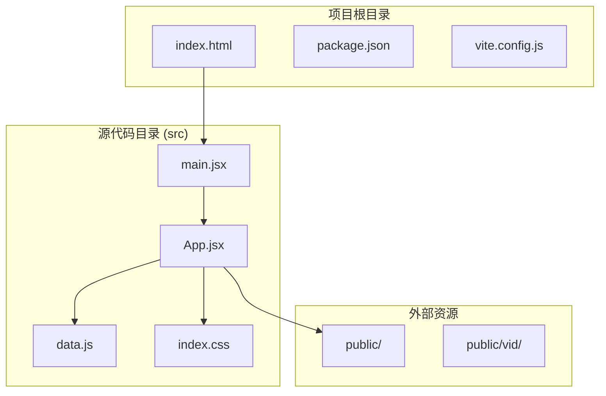

**图表来源**
- [index.html:1-16](file://index.html#L1-L16)
- [src/main.jsx:1-12](file://src/main.jsx#L1-L12)
- [src/App.jsx:1-50](file://src/App.jsx#L1-L50)

**章节来源**
- [index.html:1-16](file://index.html#L1-L16)
- [package.json:1-25](file://package.json#L1-L25)

## 核心组件

详情页系统由多个精心设计的组件构成，每个组件都有特定的功能和职责：

### 主要组件架构

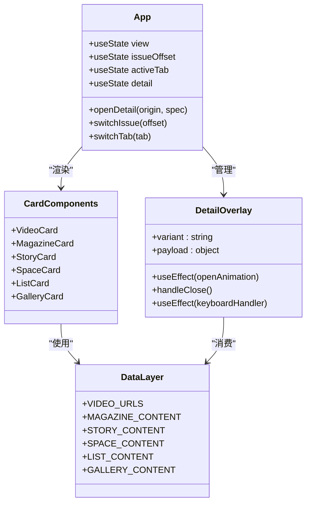

**图表来源**
- [src/App.jsx:929-1060](file://src/App.jsx#L929-L1060)
- [src/App.jsx:590-736](file://src/App.jsx#L590-L736)
- [src/data.js:1-175](file://src/data.js#L1-L175)

### 组件层次结构

系统采用分层架构设计，确保各组件职责清晰：

1. **应用层**：负责全局状态管理和组件协调
2. **详情层**：处理详情页的展示和动画效果
3. **卡片层**：提供不同类型的内容卡片组件
4. **数据层**：管理静态内容和媒体资源

**章节来源**
- [src/App.jsx:929-1060](file://src/App.jsx#L929-L1060)
- [src/data.js:1-175](file://src/data.js#L1-L175)

## 架构概览

NewSquare 详情页系统采用了现代化的前端架构模式，结合了 React 的函数组件、Hooks 状态管理和高性能的动画系统。

### 整体架构设计

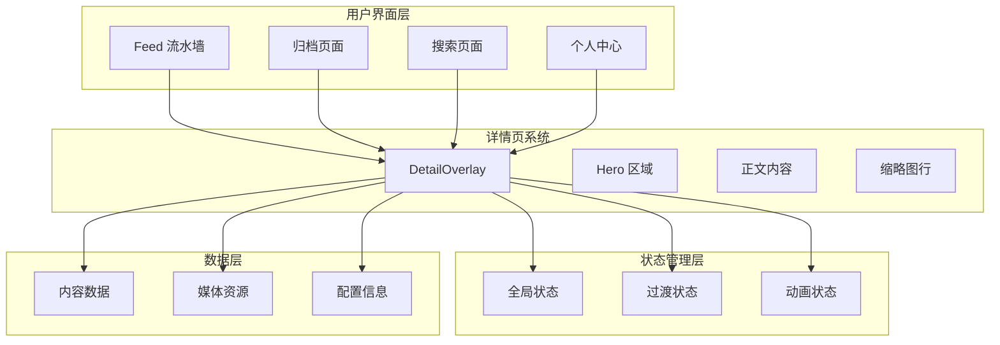

**图表来源**
- [src/App.jsx:929-1060](file://src/App.jsx#L929-L1060)
- [src/App.jsx:590-736](file://src/App.jsx#L590-L736)

### 数据流架构

系统采用单向数据流设计，确保状态变更的可预测性和可追踪性：

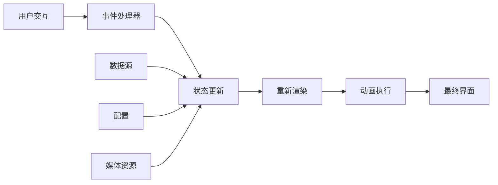

**图表来源**
- [src/App.jsx:942-944](file://src/App.jsx#L942-L944)
- [src/App.jsx:1054-1056](file://src/App.jsx#L1054-L1056)

## 详细组件分析

### 详情页 Overlay 组件

详情页 Overlay 是整个系统的核心组件，负责实现从内容卡片到全屏详情页的动画过渡效果。

#### 组件设计原理

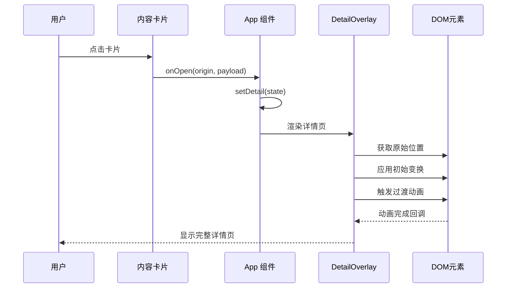

**图表来源**
- [src/App.jsx:942-944](file://src/App.jsx#L942-L944)
- [src/App.jsx:590-736](file://src/App.jsx#L590-L736)

#### 动画实现机制

详情页的动画效果通过精确计算原始元素的位置和尺寸，然后应用 CSS 过渡来实现：

1. **初始状态计算**：获取点击卡片的边界矩形信息
2. **变换矩阵应用**：计算缩放比例和平移距离
3. **过渡动画执行**：使用 CSS transition 实现平滑过渡
4. **圆角动画**：同时处理边框圆角的变化

#### 关闭流程处理

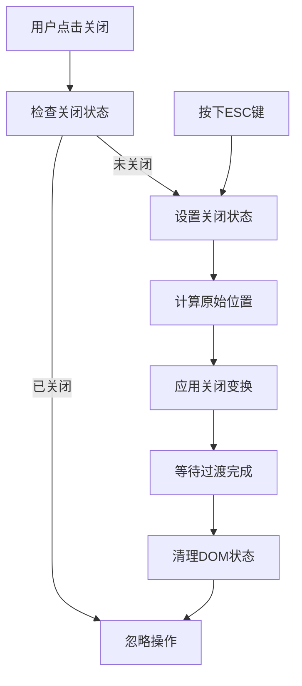

**图表来源**
- [src/App.jsx:624-650](file://src/App.jsx#L624-L650)

**章节来源**
- [src/App.jsx:590-736](file://src/App.jsx#L590-L736)

### 内容卡片组件

系统提供了多种类型的内容卡片，每种卡片都有独特的视觉设计和交互行为。

#### 卡片类型架构

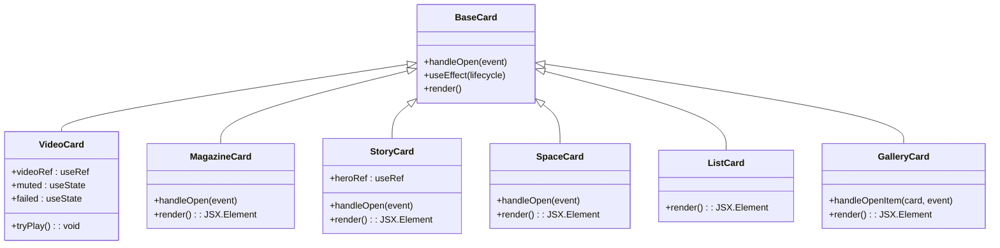

**图表来源**
- [src/App.jsx:288-403](file://src/App.jsx#L288-L403)
- [src/App.jsx:406-463](file://src/App.jsx#L406-L463)
- [src/App.jsx:466-489](file://src/App.jsx#L466-L489)
- [src/App.jsx:492-525](file://src/App.jsx#L492-L525)
- [src/App.jsx:528-579](file://src/App.jsx#L528-L579)

#### 视频卡片实现

视频卡片是最复杂的组件之一，需要处理视频播放、静音控制和错误处理：

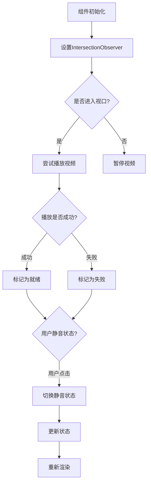

**图表来源**
- [src/App.jsx:307-322](file://src/App.jsx#L307-L322)
- [src/App.jsx:288-367](file://src/App.jsx#L288-L367)

**章节来源**
- [src/App.jsx:288-579](file://src/App.jsx#L288-L579)

### 数据管理系统

系统使用集中化的数据管理方式，将所有内容数据组织在一个单一的数据文件中：

#### 数据结构设计

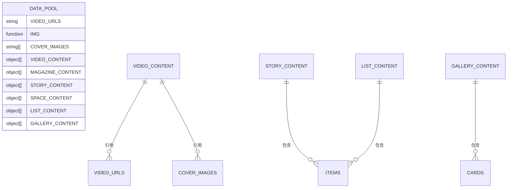

**图表来源**
- [src/data.js:1-175](file://src/data.js#L1-L175)

#### 内容组织策略

系统采用模块化的内容组织方式，每种内容类型都有专门的数据结构：

1. **视频内容**：包含视频URL、海报图和品牌信息
2. **杂志内容**：包含封面图片和标签信息
3. **故事内容**：包含封面图和产品列表
4. **空间内容**：包含空间图片和文案
5. **列表内容**：包含商品或设计师信息
6. **画廊内容**：包含多个案例卡片

**章节来源**
- [src/data.js:1-175](file://src/data.js#L1-L175)

## 依赖分析

NewSquare 详情页系统使用了现代化的前端技术栈，每个依赖都有明确的作用和价值。

### 核心依赖架构

```mermaid
graph TB
subgraph "运行时依赖"
REACT[react ^18.3.1]
REACTDOM[react-dom ^18.3.1]
ANTD_MOBILE[antd-mobile ^5.38.1]
SWIPER[swiper ^11.1.14]
ICONS[antd-mobile-icons ^0.3.0]
LUCIDE[lucide-react ^1.14.0]
OBSERVER[react-intersection-observer ^9.13.1]
end
subgraph "开发依赖"
VITE[@vitejs/plugin-react ^4.3.3]
VITE_DEV[vite ^5.4.10]
end
subgraph "应用层"
APP[App.jsx]
COMPONENTS[组件库]
STYLES[样式系统]
end
REACT --> APP
REACTDOM --> APP
ANTD_MOBILE --> COMPONENTS
SWIPER --> COMPONENTS
ICONS --> COMPONENTS
LUCIDE --> COMPONENTS
OBSERVER --> COMPONENTS
VITE --> APP
VITE_DEV --> APP
```

**图表来源**
- [package.json:11-23](file://package.json#L11-L23)

### 依赖使用分析

#### React 生态系统
- **React 18.3.1**：提供函数组件和 Hooks 支持
- **React DOM**：负责虚拟 DOM 渲染到真实 DOM

#### UI 组件库
- **Ant Design Mobile**：提供移动端友好的 UI 组件
- **Swiper**：实现高性能的轮播和滑动效果
- **Lucide React**：提供简洁的图标系统

#### 开发工具链
- **Vite**：提供快速的开发服务器和构建工具
- **React Plugin**：支持 React 语法糖和热重载

**章节来源**
- [package.json:11-23](file://package.json#L11-L23)

## 性能考虑

NewSquare 详情页系统在设计时充分考虑了性能优化，采用了多种策略来确保流畅的用户体验。

### 性能优化策略

#### 1. 动画性能优化

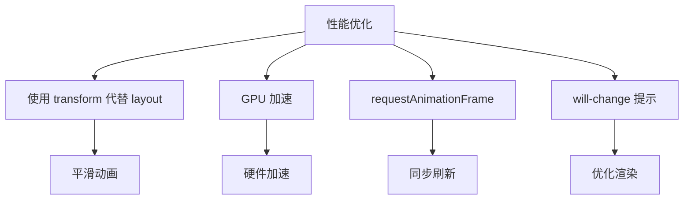

系统在动画实现中采用了多项性能优化技术：

1. **transform 优先**：使用 transform 和 opacity 属性而非改变布局属性
2. **GPU 加速**：利用硬件加速提升动画性能
3. **RAF 同步**：使用 requestAnimationFrame 确保动画与屏幕刷新同步
4. **will-change 提示**：提前告知浏览器元素将要发生变化

#### 2. 内存管理优化

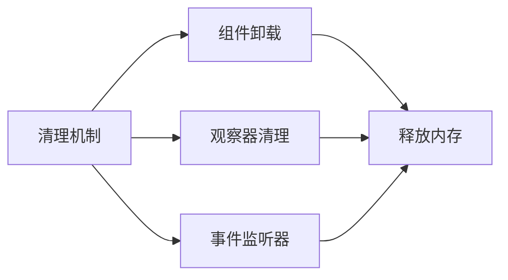

系统实现了完善的内存管理机制：

1. **组件卸载清理**：确保组件销毁时释放所有资源
2. **观察器清理**：及时断开 IntersectionObserver 连接
3. **事件监听器管理**：避免内存泄漏

#### 3. 渲染性能优化

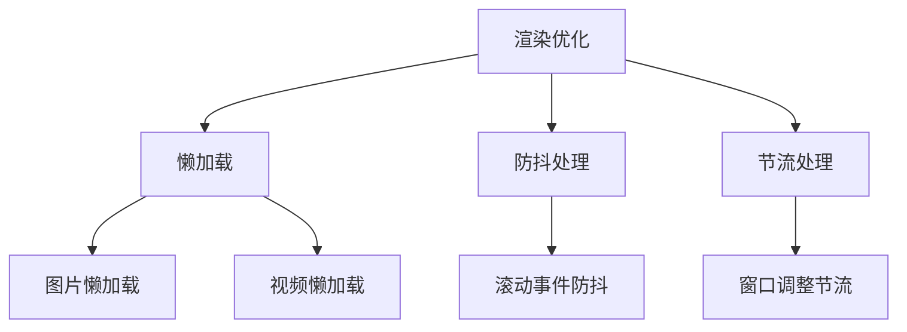

**章节来源**
- [src/App.jsx:609-615](file://src/App.jsx#L609-L615)
- [src/App.jsx:313-322](file://src/App.jsx#L313-L322)

### 用户体验设计原则

#### 1. 响应式设计

系统采用移动优先的设计理念，确保在各种设备上都有优秀的用户体验：

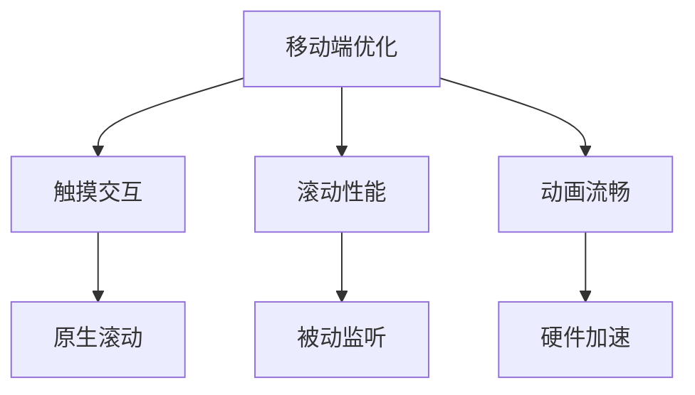

#### 2. 可访问性设计

系统遵循可访问性最佳实践：

1. **键盘导航**：支持 ESC 键关闭详情页
2. **语义化标签**：使用适当的 HTML 语义
3. **屏幕阅读器支持**：提供适当的 ARIA 属性

#### 3. 性能监控

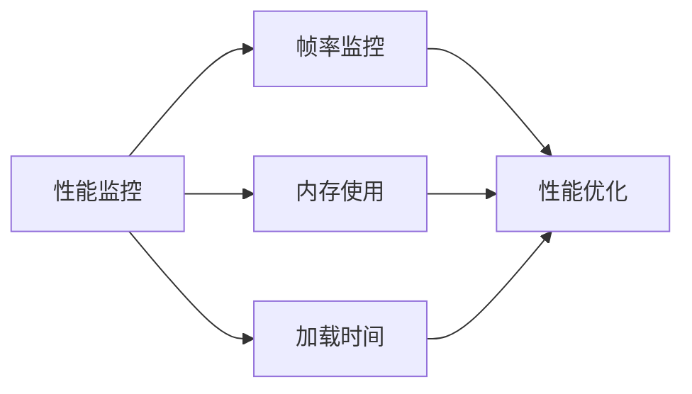

## 故障排除指南

### 常见问题及解决方案

#### 1. 动画不流畅问题

**问题症状**：
- 动画出现卡顿或跳帧
- 过渡效果不连贯

**可能原因**：
- 使用了昂贵的 CSS 属性
- 缺少 GPU 加速提示
- 频繁的布局计算

**解决方案**：
1. 确保使用 transform 和 opacity 属性
2. 添加 will-change 提示
3. 避免在动画期间修改布局相关的 CSS 属性

#### 2. 视频播放问题

**问题症状**：
- 视频无法自动播放
- 移动端视频无法播放

**可能原因**：
- 浏览器自动播放策略限制
- 视频资源加载失败
- 交集观察器未正确配置

**解决方案**：
1. 确保 IntersectionObserver 正确配置阈值
2. 处理视频加载错误情况
3. 提供静音播放选项

#### 3. 内存泄漏问题

**问题症状**：
- 页面长时间使用后内存持续增长
- 组件卸载后仍占用内存

**可能原因**：
- 事件监听器未正确清理
- 观察器连接未断开
- 定时器未清除

**解决方案**：
1. 在组件卸载时清理所有监听器
2. 确保断开所有观察器连接
3. 清除所有定时器和订阅

**章节来源**
- [src/App.jsx:642-650](file://src/App.jsx#L642-L650)
- [src/App.jsx:313-322](file://src/App.jsx#L313-L322)

### 调试技巧

#### 1. 动画调试

使用浏览器开发者工具的 Performance 面板监控动画性能：
- 查看帧率变化
- 分析渲染时间
- 识别性能瓶颈

#### 2. 内存调试

使用 Memory 面板监控内存使用：
- 捕获堆快照
- 分析对象引用
- 识别内存泄漏

#### 3. 网络调试

监控媒体资源加载：
- 查看视频和图片加载状态
- 分析网络请求性能
- 优化资源加载策略

## 结论

NewSquare 详情页系统展现了现代前端开发的最佳实践，通过精心设计的架构和优化的实现，为用户提供了流畅、美观的阅读体验。

### 系统优势

1. **优秀的用户体验**：流畅的动画过渡和直观的交互设计
2. **高性能实现**：采用多项性能优化技术确保流畅运行
3. **可维护性**：清晰的代码结构和模块化设计
4. **可扩展性**：灵活的组件架构支持功能扩展

### 技术亮点

- **动画系统**：基于 CSS 和 JavaScript 的混合动画实现
- **响应式设计**：适配各种设备和屏幕尺寸
- **性能优化**：多维度的性能优化策略
- **可访问性**：遵循无障碍设计标准

### 改进建议

1. **进一步优化**：可以考虑使用 Web Animations API 提供更精细的控制
2. **测试覆盖**：增加自动化测试确保代码质量
3. **性能监控**：集成性能监控工具实时跟踪应用表现
4. **代码分割**：实现按需加载减少初始包体积

NewSquare 详情页系统为移动内容平台的开发提供了优秀的参考范例，其设计理念和技术实现值得其他项目借鉴学习。