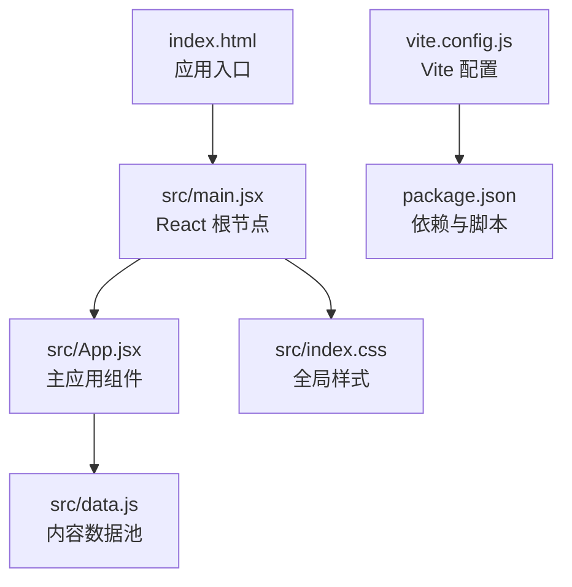
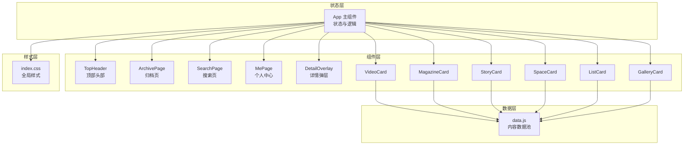
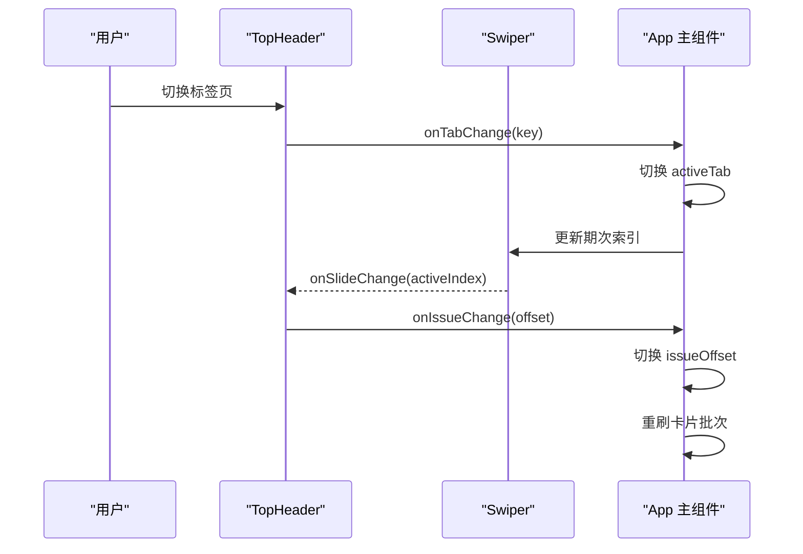
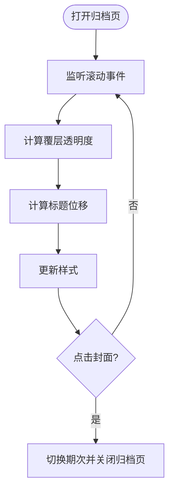
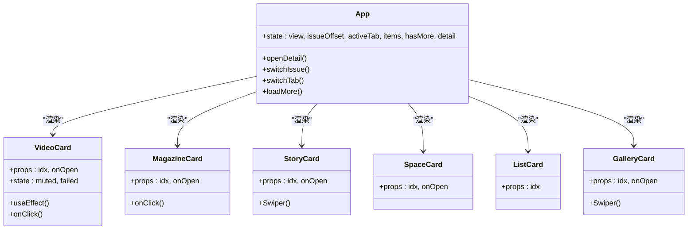
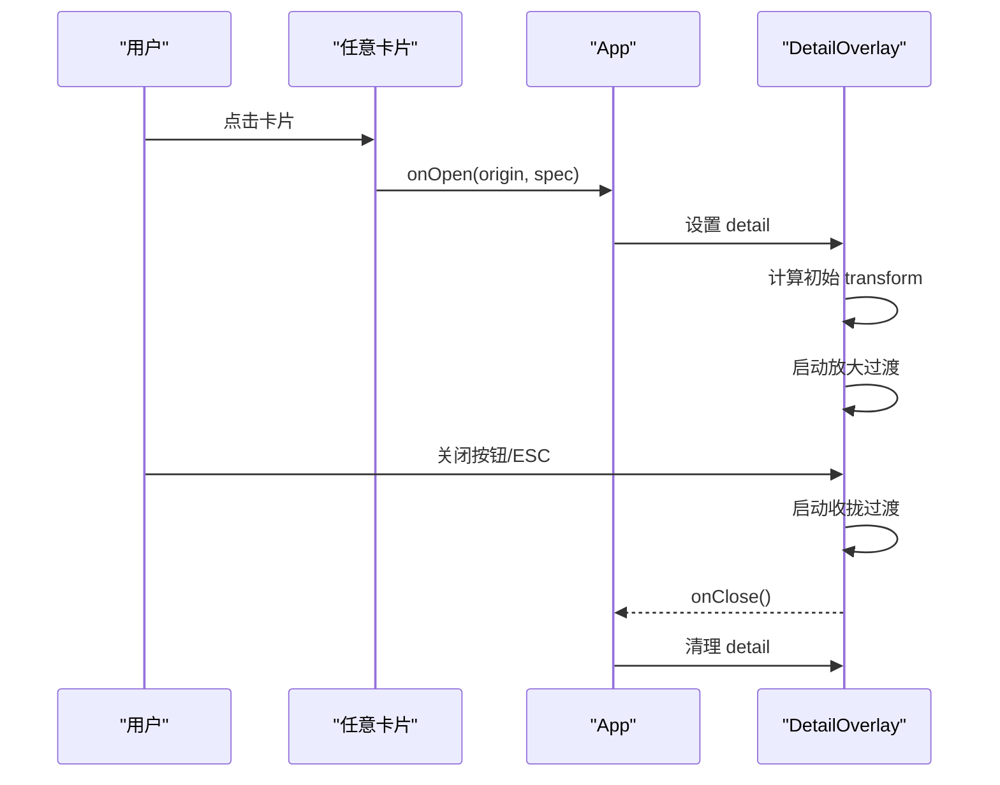
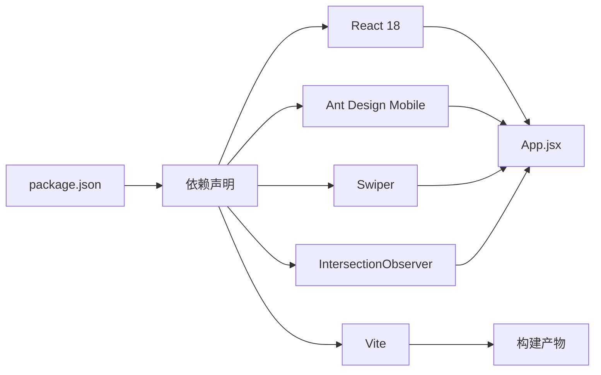

# 项目概述

<cite>
**本文引用的文件**
- [package.json](file://package.json)
- [vite.config.js](file://vite.config.js)
- [index.html](file://index.html)
- [src/main.jsx](file://src/main.jsx)
- [src/App.jsx](file://src/App.jsx)
- [src/data.js](file://src/data.js)
- [src/index.css](file://src/index.css)
</cite>

## 目录
1. [简介](#简介)
2. [项目结构](#项目结构)
3. [核心组件](#核心组件)
4. [架构总览](#架构总览)
5. [详细组件分析](#详细组件分析)
6. [依赖关系分析](#依赖关系分析)
7. [性能考量](#性能考量)
8. [故障排查指南](#故障排查指南)
9. [结论](#结论)
10. [附录](#附录)

## 简介
NewSquare 是一个移动端家装灵感应用，旨在为用户提供沉浸式的视觉内容消费体验。项目通过精心设计的 6 种可复用内容卡片系统，结合流畅的交互与动画，让用户在浏览过程中获得“被内容包裹”的沉浸感。应用围绕“当期/推荐/我”三大视图构建，支持期次切换、无限滚动加载、搜索与个人中心等功能，整体设计强调“视觉优先、交互顺滑”。

## 项目结构
项目采用极简的前端工程组织方式：
- 根目录包含构建配置、入口 HTML、包管理与依赖声明
- 源码集中在 src 目录，包含应用入口、主组件、数据池与全局样式
- 使用 Vite 作为构建工具，React 18 作为运行时，Ant Design Mobile 作为移动端 UI 基础组件库

图表来源
- [index.html:1-16](file://index.html#L1-L16)
- [src/main.jsx:1-12](file://src/main.jsx#L1-L12)
- [src/App.jsx:1-1060](file://src/App.jsx#L1-L1060)
- [src/data.js:1-175](file://src/data.js#L1-L175)
- [src/index.css:1-1601](file://src/index.css#L1-L1601)
- [vite.config.js:1-11](file://vite.config.js#L1-L11)
- [package.json:1-25](file://package.json#L1-L25)

章节来源
- [index.html:1-16](file://index.html#L1-L16)
- [src/main.jsx:1-12](file://src/main.jsx#L1-L12)
- [src/App.jsx:1-1060](file://src/App.jsx#L1-L1060)
- [src/data.js:1-175](file://src/data.js#L1-L175)
- [src/index.css:1-1601](file://src/index.css#L1-L1601)
- [vite.config.js:1-11](file://vite.config.js#L1-L11)
- [package.json:1-25](file://package.json#L1-L25)

## 核心组件
- 主应用组件：负责状态管理、视图切换、期次与标签页逻辑、无限滚动与详情弹层
- 6 种内容卡片组件：视频卡、杂志封面卡、单品故事卡、空间封面卡、榜单/设计师卡、横向滚动案例卡
- 顶部头部：支持期次轮播、搜索展开、标签页切换
- 归档页：沉浸式封面网格浏览
- 搜索页：搜索历史与热搜榜
- 个人中心页：用户信息、统计、最近浏览与菜单
- 详情弹层：卡片点击放大至全屏的过渡动画

章节来源
- [src/App.jsx:67-205](file://src/App.jsx#L67-L205)
- [src/App.jsx:208-285](file://src/App.jsx#L208-L285)
- [src/App.jsx:288-579](file://src/App.jsx#L288-L579)
- [src/App.jsx:581-736](file://src/App.jsx#L581-L736)
- [src/App.jsx:742-811](file://src/App.jsx#L742-L811)
- [src/App.jsx:813-909](file://src/App.jsx#L813-L909)
- [src/App.jsx:929-1059](file://src/App.jsx#L929-L1059)

## 架构总览
应用采用“组件驱动 + 数据池”的架构模式：
- 组件层：以函数式组件为主，通过 props 传递数据与回调，实现卡片系统的可复用性
- 状态层：集中于主组件，管理视图、期次、标签页、搜索状态、详情弹层与无限滚动
- 数据层：通过 data.js 提供统一的数据池，包含视频、图片、期次元数据、榜单与案例等
- 样式层：全局 CSS 定义统一的排版、颜色与交互反馈，确保视觉一致性
- 构建层：Vite 提供快速开发与生产构建，React 18 提供并发特性与严格模式

图表来源
- [src/App.jsx:67-205](file://src/App.jsx#L67-L205)
- [src/App.jsx:208-285](file://src/App.jsx#L208-L285)
- [src/App.jsx:288-579](file://src/App.jsx#L288-L579)
- [src/App.jsx:581-736](file://src/App.jsx#L581-L736)
- [src/App.jsx:742-811](file://src/App.jsx#L742-L811)
- [src/App.jsx:813-909](file://src/App.jsx#L813-L909)
- [src/App.jsx:929-1059](file://src/App.jsx#L929-L1059)
- [src/data.js:1-175](file://src/data.js#L1-L175)
- [src/index.css:1-1601](file://src/index.css#L1-L1601)

## 详细组件分析

### 顶部头部与期次轮播
- 支持“当期/推荐/我”三个标签页，头部根据状态动态展示期次轮播或替代标题
- 期次轴从 -29 到 0，Today 在末位；推荐期次为固定精选集合
- 通过 Swiper 实现期次轮播，支持长按快速切换与拖拽跟随
- 搜索态下隐藏期次行，仅保留搜索栏

图表来源
- [src/App.jsx:67-205](file://src/App.jsx#L67-L205)
- [src/App.jsx:963-988](file://src/App.jsx#L963-L988)

章节来源
- [src/App.jsx:67-205](file://src/App.jsx#L67-L205)
- [src/App.jsx:963-988](file://src/App.jsx#L963-L988)

### 归档页（沉浸式封面网格）
- 采用网格布局展示封面，支持沉浸式滚动与顶部渐变覆层
- 滚动时控制覆层透明度与标题位移，营造“封面入画”的沉浸感
- 支持点击封面切换期次并返回首页

图表来源
- [src/App.jsx:208-285](file://src/App.jsx#L208-L285)
- [src/index.css:395-575](file://src/index.css#L395-L575)

章节来源
- [src/App.jsx:208-285](file://src/App.jsx#L208-L285)
- [src/index.css:395-575](file://src/index.css#L395-L575)

### 6 种可复用内容卡片系统
- 视频卡：自动播放、交互动画、静音控制、海报兜底
- 杂志封面卡：封面图、徽标、品牌条
- 单品故事卡：封面 + 横向滚动商品列表
- 空间封面卡：空间照片 + 渐变遮罩 + 文字层
- 榜单/设计师卡：列表式展示，支持产品与设计师两类
- 横向滚动案例卡：案例卡片集合，支持 CSS 模式与抓取手势

图表来源
- [src/App.jsx:288-579](file://src/App.jsx#L288-L579)
- [src/App.jsx:929-1059](file://src/App.jsx#L929-L1059)

章节来源
- [src/App.jsx:288-579](file://src/App.jsx#L288-L579)
- [src/App.jsx:929-1059](file://src/App.jsx#L929-L1059)

### 详情弹层（卡片放大至全屏）
- 通过从原始卡片到全屏的几何变换与圆角过渡，实现自然的“放大”动画
- 支持 Esc 键关闭与滚动到顶部的兼容处理
- 根据 variant 渲染不同内容布局（单图/故事）

图表来源
- [src/App.jsx:581-736](file://src/App.jsx#L581-L736)
- [src/App.jsx:942-1056](file://src/App.jsx#L942-L1056)

章节来源
- [src/App.jsx:581-736](file://src/App.jsx#L581-L736)
- [src/App.jsx:942-1056](file://src/App.jsx#L942-L1056)

### 搜索页与个人中心
- 搜索页：展示搜索历史与热搜榜，支持点击关键词
- 个人中心：用户信息、统计数据、最近浏览与菜单项

章节来源
- [src/App.jsx:742-811](file://src/App.jsx#L742-L811)
- [src/App.jsx:813-909](file://src/App.jsx#L813-L909)

## 依赖关系分析
- 运行时依赖
  - React 18：提供函数式组件、并发特性与严格模式
  - Ant Design Mobile：提供移动端基础 UI 组件与全局样式
  - Swiper：用于期次轮播、商品列表与案例卡片的横向滚动
  - react-intersection-observer：用于视频自动播放的可见性监听
- 开发依赖
  - Vite：快速开发与生产构建
  - @vitejs/plugin-react：React 插件

图表来源
- [package.json:11-23](file://package.json#L11-L23)
- [src/App.jsx:1-1060](file://src/App.jsx#L1-L1060)
- [vite.config.js:1-11](file://vite.config.js#L1-L11)

章节来源
- [package.json:11-23](file://package.json#L11-L23)
- [vite.config.js:1-11](file://vite.config.js#L1-L11)

## 性能考量
- 无限滚动与分批渲染：通过 makeBatch 与 InfiniteScroll 控制渲染数量，避免一次性渲染过多卡片
- 交互动画与过渡：使用 requestAnimationFrame 与 CSS 过渡，减少主线程压力
- 视频自动播放：基于 IntersectionObserver，仅在可见时尝试播放，降低资源占用
- 样式优化：统一字体与排版 Token，减少重复计算；使用 backdrop-filter 与 mask-image 实现视觉效果

章节来源
- [src/App.jsx:916-926](file://src/App.jsx#L916-L926)
- [src/App.jsx:990-994](file://src/App.jsx#L990-L994)
- [src/App.jsx:313-322](file://src/App.jsx#L313-L322)
- [src/index.css:24-87](file://src/index.css#L24-L87)

## 故障排查指南
- 视频无法自动播放
  - 检查浏览器策略与移动端自动播放限制
  - 确认 IntersectionObserver 是否正确触发
- 期次轮播异常
  - 检查 Swiper 初始化参数与 activeIndex 同步
  - 确认 onSlideChange 回调是否正确更新 issueOffset
- 详情弹层关闭不完整
  - 检查 transitionend 事件与兼容处理
  - 确认关闭时滚动到顶部的逻辑
- 样式错乱
  - 检查全局 CSS 与组件内样式优先级
  - 确认安全区域与滚动行为设置

章节来源
- [src/App.jsx:313-322](file://src/App.jsx#L313-L322)
- [src/App.jsx:173-177](file://src/App.jsx#L173-L177)
- [src/App.jsx:642-650](file://src/App.jsx#L642-L650)
- [src/index.css:1-18](file://src/index.css#L1-L18)

## 结论
NewSquare 通过 React 18 与 Vite 的现代化组合，构建了一个以“沉浸式视觉内容消费”为核心的产品原型。6 种可复用卡片系统与精心设计的交互动画，共同营造了“被内容包裹”的体验。项目在组件化、数据池与样式统一方面具备良好可扩展性，适合进一步演进为完整的家装灵感平台。

## 附录
- 技术选型说明
  - React 18：提供并发特性与严格模式，提升开发体验与运行时稳定性
  - Vite：快速热更新与生产构建，适配移动端开发与预览
  - Ant Design Mobile：移动端 UI 基础，提供一致的交互与视觉规范
  - Swiper：成熟的移动端轮播与滚动解决方案
  - IntersectionObserver：轻量的可见性监听，优化媒体资源加载

章节来源
- [package.json:11-23](file://package.json#L11-L23)
- [vite.config.js:1-11](file://vite.config.js#L1-L11)
- [src/App.jsx:1-1060](file://src/App.jsx#L1-L1060)